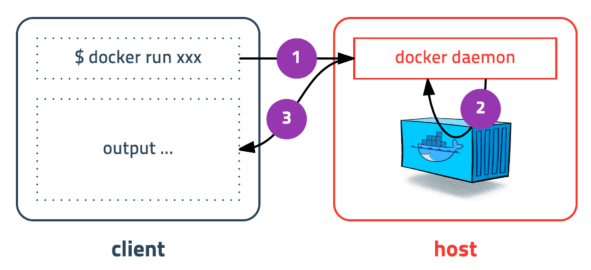

> 본 내용은 Inflearn에서 subicura님의 '초보를 위한 도커 안내서' 강의를 보고 정리하여 기록한 파일입니다.


Client-Server 구조
---



- Docker 명령어를 치면 마치 Server에서 바로 실행하는 것 같지만   
  나는 Client이고 Local host에 Docker daemon이 작동 중이다.

- host에 설치된 Docker daemon이 명령어를 처리한 후 그 결과를 Client 화면에 출력

- 즉, Docker CLI는 Docker host에 명령을 전달하고 결과를 받아서 출력

run
===

#### - 컨테이너 실행

```docker
docker run [OPTIONS] IMAGE[:TAG|@DIGEST] [COMMAND] [ARG...]
```

|**OPTIONS**|**기능**|
|:---:|:---:|
|-d|detached mode (백그라운드 모드)|
|-p|호스트와 컨테이너의 포트를 연결|
|-v|호스트와 컨테이너의 디렉토리를 연결|
|-e|컨테이너 내에서 사용할 환경변수 설정|
|--name|컨테이너 이름 설정|
|--rm|프로세스 종료시 컨테이너 자동 제거|
|-it|-i와 -t를 동시에 사용, 터미널 입력을 위한 옵션|
|--network|네트워크 연결|

