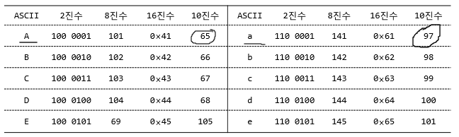
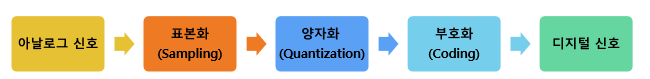
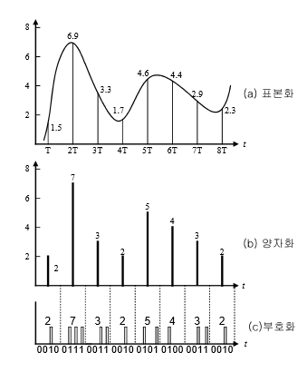
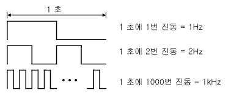
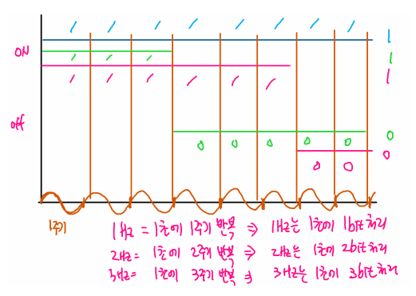

Digital And Analog
===
> 본 내용은 한국정보교육원 클라우드과정 수업 내용을 정리하였음.

디지털과 아날로그 신호란?
---

##### 1. 아날로그 신호(Analog Signal)란?
> 연속적인 값을 갖는 신호

##### 2. 디지털 신호(Digital Signal)란?
* 두 가지의 신호로만 표현이 되는 신호
    * ex) 모스 부호, 전기 On/Off 등
    * **0 -> 1 ON, 1 -> 0 OFF**

디지털 정보의 표현단위
---
   
* 최소 단위 : **bit** (1byte = 8bit)   

* **계산 TIP**
  * 2진수 -> **8진수** : 뒤에서 3bit씩 묶어서 계산 
    ex) 1 000 001  -->  101

  * 2진수 -> **16진수** : 뒤에서 4bit씩 묶어서 계산
    ex)  100 0001  -->  0x 41

   
* 8bit = 1 byte

디지털 시스템의 장점
---
> 디지털 시스템은 ***'가산기'*** 라는 회로를 이용함.

* 음성, 영상 등 다양한 형태의 신호를 통합적으로 취급
* 디지털 신호는 다양한 저장매체에 쉽게 저장할 수 있고 이용이 간편
* 수치적으로 처리하므로 내외부의 잡음에 강함
* 하드웨어와 소프트웨어의 결합으로 다양한 처리 방식을 구현할 수 있음
* 시분할, 다중화 등으로 동시에 여러 신호를 처리할 수 있음

디지털 시스템의 단점
---

* 아날로그 시스템에 비해 정보의 손실이나 왜곡 발생 (Sampling, Quantization)
* A/D, D/A 변환을 하면서 여러 과정을 거치기 때문에 시스템이 복잡하고 신호처리에 지연 시간이 발생.
> **A/D** : 아날로그 -> 디지털, **D/A** : 디지털 -> 아날로그
* 양자화 오차로 인해 오차가 누적되면서 시스템이 Overflow를 일으켜 작동이 중지될 수 있음

아날로그 디지털 변환 과정
---

* Sampling
  * 연속 신호를 이산 신호로 감소시키는 과정
  * Sample은 시간 미 공간의 한 점의 값이나 값들의 집합

* Quantization
  * 펄스 진폭의 크기를 디지털 양으로 변환 -> 이 과정에서 불가피한 잡음(오차)이 발생
  * 신호레벨의 수를 늘릴 경우 데이터의 양이 많아짐

* Encoding
  * 양자화한 값을 2진 디지털 부호로 변환

* 주기 (Period)
  * 주기적인 파형이 1회 반복하는데 걸리는 시간

  * 주파수와 주기는 서로 반비례

* 주파수는 시간 단위를 구분하기 위해 사용함. 디지털 신호는 **1주기에 1bit**를 처리함.
* Hz는 1초에 몇 주기를 반복하는지를 나타냄 = **1초에 몇 bit를 처리?**

