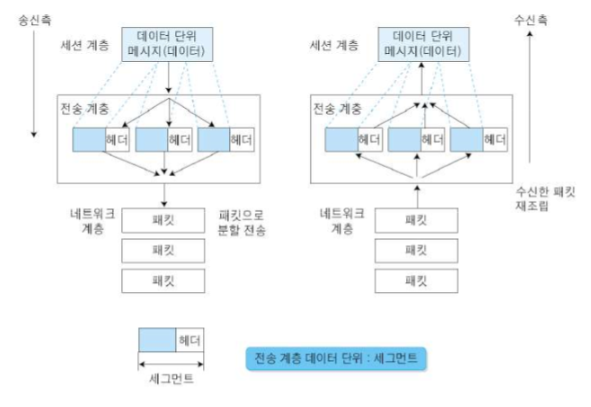
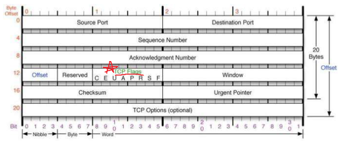
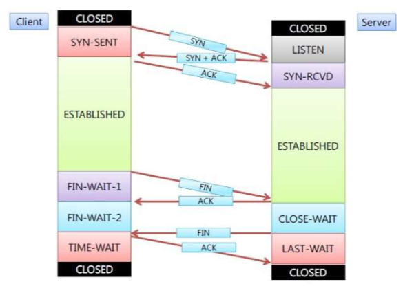
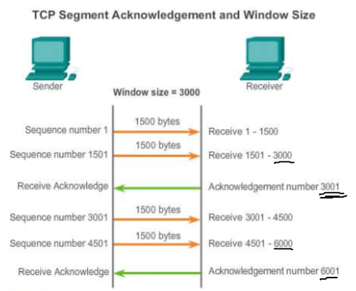
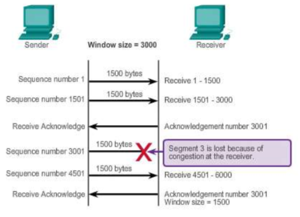
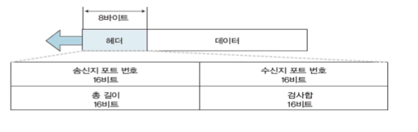
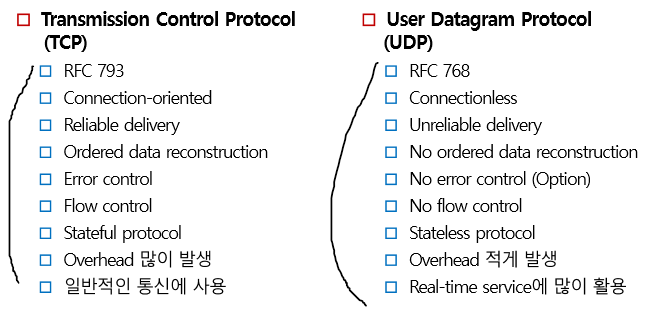

TCP/IP 4 Layer
===

TCP
---

> TCP port끼리 byte의 스트림을 전송하는 연결형 데이터 전달 서비스 제공
> 연결 지향형 protocol. 데이터 송수신 전 연결 통로를 만들고 데이터 전송하는 protocol

#### TCP 주요기능
1. 서비스 지점 주소 지정
    * 전송층 Header는 서비스 지점 주소(port번호)를 포함
2. 분할 및 재조립
    * 송신 시 데이터를 segment 단위로 분할 후 목적지에서 다시 재조립하여 메시지 형성
3. 연결제어
    * 비연결지향 : 각 segment를 독립된 packet으로 나누어 전송 (UDP)
    * 연결지향 : packet을 전달하기 전 먼저 목적지의 전송층과 연결 설정 (TCP)
4. 흐름제어
    * 종단간 흐름제어
5. 오류제어
    * 재전송을 통한 오류 정정

TCP Header 구조
---

* **Port 주소** (16bit) : 0 ~ 65,535
* **Offset** : TCP Header 크기 지정
* **Source port address** (16bit) : 데이터를 생성한 주소의 port번호
* **Destination port address** (16bit) : 목적지 Application이 수행하는 process가 사용하는 port 번호
* **Sequence number** 필드 (32bit) **source**
  * 가상 회선을 통해 전송되는 모든 데이터는 고유 일련 번호가 부여됨.
  * 네트워크가 불안정하여 packet을 분실, 지연 등 segment 순서가 어긋나게 도착할 수 있기 때문에 sequence number를 이용하여 데이터를 올바른 순서로 재배열
* **Acknowledgement number** 필드 (32bit) **destination**
  * 다음 segment를 수신할 준비가 되었다고 알림. 
  * 성공적으로 수신한 마지막 byte의 순서 번호 +1
* **Header Length** 필드 (4bit) (offset)
  * Header의 길이를 32bit 단위로 나타냄. 최소 필드 값은 5 (5 * 32 = 160bit, 20byte)
  * 최대 값 15 (15 * 32 = 480bit, 60byte)
* **Reserved 필드** (6bit) : 예약된 필드
* **TCP Flags**
  * C,E는 흐름제어, 나머지는 연결제어(오류제어)
  * CWR : 혼잡 윈도우 크기 감소
  * ECN : 혼잡 알림
  * 6개의 서로 다른 제어 bit 또는 flag를 나타냄. TCP flags 8bit 중 처음 C, E를 제외
  * 동시에 여러 개의 bit가 1로 설정될 수 있음
  * **SYN** - **S** : 연결요청 플래그
    * TCP에서 session을 성립할 때 가장 먼저 보내는 packet. sequence number를 임의로 설정하여 session 연결하는 데 사용되며 초기에 sequence number를 보냄.
  * **ACK** - **ACK** : 응답
    * 상대방으로부터 packet을 받았다는 것을 송신 측에 알려주는 packet. 
    * 수신 측이 보낸 sequence number에 TCP 계층에서 데이터 양(길이)를 더한 것과 같은 ACK를 보냄
  * RST - R : connection reset
    * 재설정하는 과정. 양방향에서 동시에 일어나는 중단 작업이다 (비정상적인 세션 연결 끊기)
    * 이 packet을 보내는 곳이 현재 접속하고 있는 곳과 즉시 연결을 끊고자 할 때 사용함.
  * PSH - P : 밀어 넣기
    * telnet과 같은 상호작용이 중요한 protocol의 경우 빠른 응답이 중요한데, 이 때 받은 데이터를 즉시 목적지인 Application 계층으로 전송하도록 하는 Flag이다.
    * buffer가 채워지기를 기다리지 않고 데이터를 전달
  * URG - U : 긴급 데이터
    * 긴급하게 전송해야 하는 데이터가 있을 경우
  * FIN - F : 연결 종료 요청
    * Session 연결을 종료시킬 때 사용하며 더 이상 전송할 데이터가 없음을 나타냄
* **Window size 필드** (16bit) : 송신 시스템의 가용 수신 buffer의 크기. byte 단위 사용
  * 최대크기는 2^16byte = 65,536 byte = 64KB
* **Checksum 필드** (16bit) : TCP segment의 내용이 유효한지 검증, 손상 여부 검사 등

  * TCP session 연결 시 ---> 3-Way HandShake
  * TCP session 연결 종료 시 --->  4-Way HandShake

TCP Flow Control (흐름제어)
---

#### 흐름제어 (Flow Control)
* 송신측이 수신측의 처리속도보다 더 빨리 데이터를 보내지 못하도록 제어해줌.
* 수신측에서 송신측으로부터 발송하는 데이터의 양, 속도를 제한 (송신측 억제)
* Feedback mechanism이 필요

#### 흐름제어 방식 구분
* **Stop and Wait**
  * 한번에 1개씩 수신 확인을 하며 Frame을 전송하는 방식

* **Rated-based** 
  * 데이터 송신률에 대한 임계값 관리에 의한 방식

* **Windows based** => Sliding Windows
  * 여러 개의 Frame을 동시에 보내는 방식
  * Credit Windows 방식, Paging Windows 방식

1. Data Link Layer에서 흐름제어
   * Data Link의 송수신 양단 간에 송신율 및 수신율의 균형을 맞춤

2. Network Layer에서 흐름제어
   * 명시적인 흐름제어 기능은 없음
   * Transport Layer에서 흐름제어 기능은 제공
   * 송수신 buffer

3. Transport Layer에서 흐름제어
   * Transport Layer 종단-종단 간에 흐름제어 기능

##### Sliding Window 방식 (Continuous ARQ = Go Back n ARQ)
* 검출 후 재전송 방식(ARQ)의 일종
* 일정한 Window 크기 이내에서 한번에 여러 packet을 보내고 한 번의 ACK 수신 확인을 하며 Window 크기를 변경시키며 흐름제어(혼잡제어)를 하는 기법

* TCP에선 수신 측에서 설정한 Window 크기만큼 송신 측에서 ACK없이 segment를 전송할 수 있게 하여 데이터 흐름을 동적으로 조절하는 제어 기법.
* Window의 크기만큼 수신 쪽의 확인(ACK)를 받지 않아도 보내는 것이 가능하므로 Stop-and-Wait 기법보다 훨씬 효율적인 네트워크 사용이 가능하다.

###### TCP Window Size
* TCP/IP 모든 호스트는 각각 2개의 window를 가짐(송신용, 수신용)
* 호스트는 데이터를 보내기 전 'TCP 3-way handshaking' 을 통하여 수신 호스트의 window size를 조절한다. 즉 상대방이 받을 수 있는 크기에 맞춰 전송을 한다.
* 즉, TCP received Window Size는 수신 측으로부터 **확인(ACK)없이** 전송할 수 있는** 데이터의 개수**

#### <TCP 정리>
##### TCP
> 연결 지향형 프로토콜

: TCP를 사용하는 상위 계층의 Protocol은 서로 데이터를 교환하기 전의 **가상 회선**을 만든다.
* 가상회선은 3-Way Handshake 방식을 이용
* Reliable (신뢰성) 통신 : 수신받은 통신에 대해 확인을 했다는 **Ack** 전송
* 가상회선을 만드는 3-Way Handshake를 송수신 각각의 입장에서 바라보면 **SYN -> ACK** 의 형태이다.
  TCP는 SYN을 받으면 Socket buffer memory (received)를 생성하고 데이터를 보낼 때 (transmit, send Tx)을 생성
* 3-Way Handshake가 완료된 후 상태를 **established** -> 정상적인 데이터의 송수신이 가능
* 실제 전송이 시작되면 흐름 및 오류 제어를 위해 Sliding windows 기법, Slow start, Congestion sliding windows 기법 등을 사용
* 전송이 완료되면 4-way Handshake를 통해 가상회선 연결을 종료하고 Socket buffer memory도 같이 삭제를 한 후 **closed** 상태로 전환

> **Stateful** : 서비스를 제공하는 서버에 특정 상태를 저장해서 보관. 서버의 상태가 계속 유지되어야 해당 사용자의 정보를 유지
> **Stateless** : 서비스를 제공하는 서버에 상태를 저장하지 않는 것. 서버의 상태가 유지되어야 할 필요 없음

UDP
---
> User Datagram Protocol
* best-effort 비연결형 전달 Protocol
* TCP와 달리 흐름제어, Fragmentation 및 전송 보장 등 기능을 수행하지 않음.
* TCP Header에 비해 통신 과부하가 적음
  * UDP Header 8byte < TCP Header 20byte
* 대표적인 Application (응용)계층 Protocol
  * DNS (Domain Name System)
  * DHCP (Dynamic Host Configuration Protocol)
  * SNMP 등

#### TCP, UDP 특성 비교

