Switching_and_Routing
===

OSI 계층으로 이해
---

##### Application Layer (L7)
> 웹브라우저(http, https), filezilla(ftp)

* Source : Local
* Destination : http://www.naver.com

##### Transport Layer (L4)
> Port주소

- Source : Local (사용하지 않는 임의의 Port 부여)
- Destination : 사용자 설정 or default **port 80** (http)

##### Network Layer (L3)

- Destination : www.naver.com       --->  IP 아님
- DNS Query (hosts --> DNS Cache --> 지정된 DNS Server에 Query)
- www.naver.com --> IP주소 1.1.1.1 로 받음
- Destination IP 1.1.1.1 --> Routing Table을 lookup (Source 지정, 일종의 출구)
- Source IP : 2.2.2.2

##### Data Link Layer (L2)
> Destination IP를 보고 ARP Table lookup

* IP주소 <-> MAC주소 mapping
* 255.255.255.255 <-> ff:ff:ff:ff:ff:ff
* Multicast IP는 01:00:5e:0 + IP (뒤에서 23bit)
* Unicast IP는 NIC에 부여된 MAC주소를 사용
* Unicast IP는 어떤 MAC주소가 어떤 IP와 mapping 되어 있는지 모르기 떄문에 **ARP (Address Resolution Protocol)** 실행
  * Source : 지정된 출구의 MAC주소
  * Destination : ARP Table에 도착지 MAC주소

> Interface에 IP가 입력되면 Routing Table에 IP주소와 Subnet_mask를 계싼하여 해당 Interface가 소속된 네트워크가 Routing Table에 등록됨

> Gateway IP주소가 입력되면 모든 Ip를 뜻하는 0.0.0.0/0이 Routing Table에 등록되고 0.0.0.0/0 IP는 Gateway MAC주소로 가도록 경로 설정

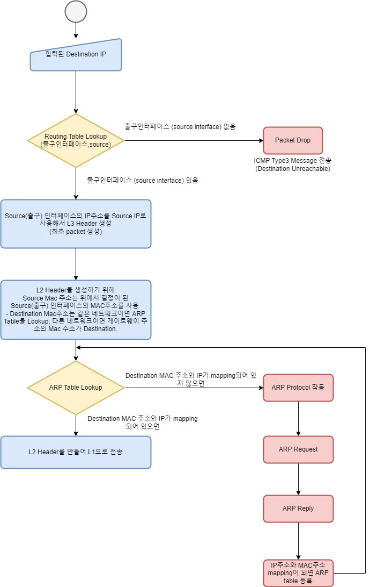

> L2, L3의 통신 흐름 도식


ARP
---

#### ARP_Header 구조

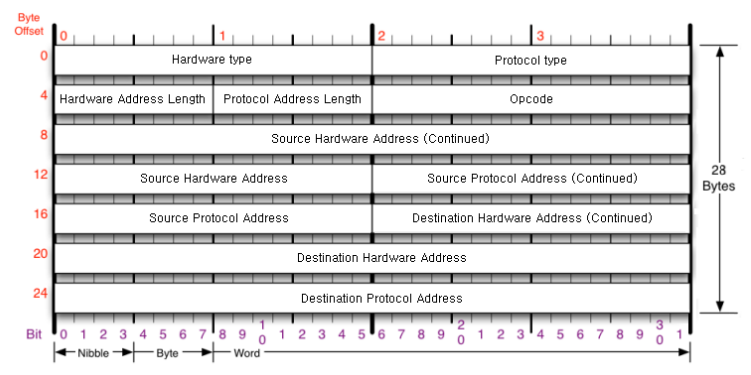

* Hardware type : L2 네트워크 유형 (ehternet 0x0001)
* Protocol type : L3 네트워크 유형 (IPv4 0x0806, IPv6 0x86D) ---> ethernet header의 ether type과 동일
* Hardware Address Length : L2주소 길이 6byte(48bit)인 6으로 setting
* Protocol Address Length : L3주소 길이 IPv4는 4byte(32bit), IPv6는 16byte(128bit)
* Opcode : Operation Code. ARP Requerst(1)? Reply(2)? 등을 표기
* Source Hardware Address : 출발지 MAC주소
* Source Protocol Address : 출발지 IP주소
* Destination Hardware Address : 도착지 MAC주소
* Destination Protocol Address : 도착지 IP주소


#### ARP 종류

* **ARP** : IP ---> MAC 찾기
* **RARP** : IP주소 찾기 (DB 필요)
* **Proxy-ARP** : ARP 대행. Static Routing에 필요
* **GARP** : IP설정하면 GARP가 자동 생성되어 IP 충돌 확인


Routing Table Lookup 우선 순위
---
> 최우선 순위는 Longest Match Rule

만약 아래와 같은 Routing Table이 있다면
```
0.0.0.0/0              게이트웨이          A출구인터페이스      Metric
192.168.255.0/24        연결됨            B출구인터페이스      Metric
10.0.0.8                연결됨            C출구인터페이스      Metric
```
---> Routing Table을 Lookup ---> IP 뿐만 아니라 Subnet_mask까지 비교

ex) 위 Routing Table을 보면
* 0.0.0.0/0 주소가 A 출구로 나갈 수 있음
* 192.168.255.0/24 주소는 B 출구로 나갈 수 있음
* 10.0.0.8/8 주소는 C 출구로 나갈 수 있음
  * IP Header에 적힌 **Source IP와 Destination IP는 오직 1개** ---> 우선 192.168.255.1/32 인식 (Subnet_mask 최댓값)
    그 다음 Subnet_mask를 하나씩 줄이며 비교
    ```
    192.168.255.0/31
    192.168.255.0/30
    192.168.255.0/29
    ...
    192.168.255.0/24    --->  B 출구인터페이스
    ```
  
  * 그리고
    ```
    1.1.1.1/32
    1.1.1.0/31
    1.1.1.0/24
    ...
    1.1.0.0/16
    ...
    1.0.0.0/8
    ...
    0.0.0.0/0   --->  A 출구인터페이스
    ```
- **Longest Match Rule**
  
  - Subnet_mask 값에 2진수 **1**이 가장 많은 주소를 높은 우선 순위로 둔다.
  - Subnet_mask 값에 2진수 1이 많으면 prefix 값이 커짐  --->  이는 **네트워크가 더 작게 분할되어 있는 상태** 


L2, L3 네트워킹 흐름
---

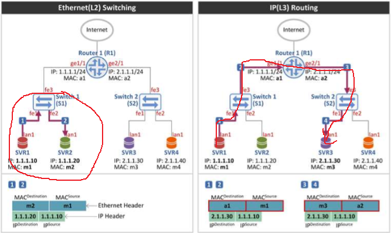

> SVR1 --> SVR2 로 packet 구성

##### 사전 설정
* Ethernet Header
  * Destination MAC = SVR2의 MAC주소 m2
  * Source MAC = SVR1의 MAC주소 m1
* IP Header
  * Destination IP = SVR2의 IP주소 1.1.1.20
  * Source IP = SVR1의 IP주소 1.1.1.10


#### Ethernet(L2) Switching

1. SVR1 sends ARP Request
   
   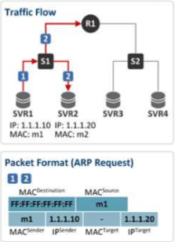

   > Broadcast 신호를 보냄

2. SVR2 responds with ARP Reply
   
   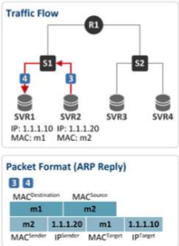

3. SVR1 sends IP Packet to SVR2
   
   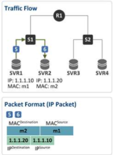


#### IP(L3) Routing

1. SVR1 sends ARP Request
   
   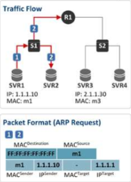

   > Broadcast 신호 전송

2. R1 responds with ARP Reply
   
   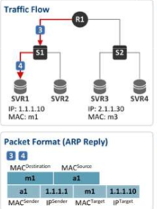

3. SVR1 sends IP Packet to R1
   
   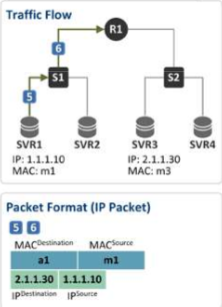

4. R1 sends ARP Request
   
   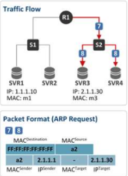

  > Broadcast 신호 전송

5. SVR3 responds with ARP Reply
   
   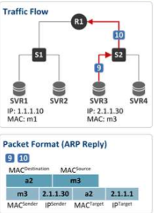

6. R1 sends IP Packet to SVR3
   
   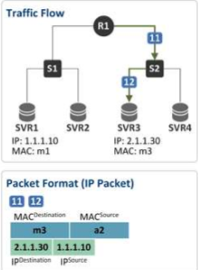

  