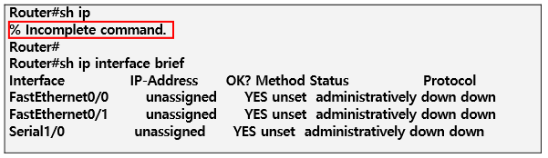
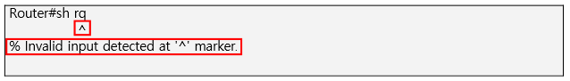

Router
===

> 논리적 or 물리적으로 분리된 네트워크 사이를 지나는 packet에 경로를 지정하여 다른 네트워크로 packet을 보내주는 역할

> 서로 다른 Network 간 traffic을 Forwarding (**서로 다른 네트워크 간 통신**)

Router 기능
---
1. **Routing** (Path Determination)
   * Routing Algorithm에 따라 destination까지의 최적의 경로를 정한 Routing Table 생성
   * Best Path
2. **Forwarding** (Switching)
   * 입력포트 (Ingress Interface)로 들어오는 packet의 Destination address를 분석하고 Routing table을 lookup하여 지정된 출력포트 (Egress Interface)로 내보냄 (없을 경우 Drop)

Router Interface (모듈형)
---

* **Network Module Slot** : NM 모듈 설치 Interface
* **WIC Card Slot** : 주로 WAN Interface 모듈 설치 Interface
  * WAN 연결 시 사용하던 Serial port가 있는 NIC (Network Interface Card)
  * Serial port는 기본적으로 1:1(point-to-point) 연결에 사용
  * Clock 동기화 --> 실제 속도
  * clock rate 72000 -> 72000Hz -> 72KHz -> 72kbps
* **Ethernet Interface** : LAN 장비와 연결되는 Interface
* **Console Port** : 장비 제어, PC의 serial port와 연결하여 Router 설정 및 정보 확인
* **Aux Port** : 원격지에서 Router 제어, 잘 사용하지 않는 추세

Router 구성
---

* CISCO 장비는 환경설정시 보조기억장치에 저장되지 않고 **RAM**에 저장 (**running-config**, active config)
* RAM에 저장된 환경설정 파일을 **nvram**에 저장되고 nvram에 저장된 config 파일 이름이 **startup-config**
* **active config file** : running-config, startup-config (NVRAM)
* **buffer, cache** : 속도 차이가 발생하는 두 장치의 병목현상을 해결하기 위한 일종의 임시 저장 공간
  * cache는 random access
  * buffer는 순서대로 처리

#### Router 구성 평면 (Plane)

* **Control Plane**
  : Process가 작동하능 영역(CPU 작동), traffic 전송
* **Data Plane**
  : 빠른 Forwarding을 위해 Control Plane으로부터의 Data Table 정보를 바탕으로 traffic 제어
* **Management Plane**
  : Console, 가상터미널, tftp, ftp 연결과 같은 장비를 제어하기 위한 프로그램이 내장되어 있는 영역
  * Telnet, SSH, SNMP, RMON 등 장비 관리

Router 요소 및 부팅 과정
---

* **CPU** : Router 제어, 연산
* **DRAM** : Routing Table 저장, 각 port에 필요한 buffer 제공
* **Flash memory** : CISCO IOS 저장소
* **NVRAM** : 설정 파일이 저장, Router가 reboot되어도 초기화되지 않음
* **ROM** : OS를 구동하기 위한 코드와 장애 복구에 사용하는 Mini OS가 저장

#### 0x2102 mode booting 과정 (Router 기본 모드)
1. 전원 테스트(POST)
2. Bootstrap Booting
3. IOS 찾기
4. OS를 RAM으로 loading
5. NVRAM lookup ---> startup-config가 저장되어 있음
6. NVRAM에 저장된 설정내용이 있다면, RAM의 running-config로 Loading
7. NVRAM에 저장된 설정내용이 없다면, Setup mode 실시

#### 0x2142 부팅 과정 (password 복구 모드, 안전모드)
> rommon mode
1. 전원 테스트(POST)
2. Bootstrap Booting
3. IOS 찾기
4. OS를 RAM으로 loading

Packet Forward Methods
---

1. Process switching
   * 모든 packet을 Process가 처리하는 방식, CPU 많은 부하가 걸림

2. Fast switching
   * 유입되는 첫번째 packet을 Process가 처리한 후 결과를 cache에 저장
   * 두번째 packet부터 Data plane에서 Hardware로 처리

3. CEF (Cisco Express Forwarding)
   * Routing table을 TCAM 영역의 FIB(Forwarding Information Base)에 등록하여 첫번째 packet부터 Hardware로 처리
   * Topology switching

Best Path 결정 기준
---

* **Longest Match** : Subnet의 길이가 가장 긴 네트워크를 우선
* **Administrative Distance** : Routing Protocol 우선 순위
* **Routing Protocol Algorithm**
  * **RIB** (Routing information Base) Table : Control Plane 영역에서 Process가 Best-path를 계산해서 만든 table. ---> Routing table
    * \# show ip route
    * Router RAM에 보관
  * **FIB** (Forwarding Information Base) Table : Data Plane 영역에서 packet을 Hardware적으로 forwarding하기 위한 table. CEF 기술과 같은 Topology switching을 적용하면 생성
    * \# show ip cef
    * Router TCAM에 보관
  * **Routing Table 등록 정보**
    * **Link Local address** : Interface에 설정된 IP address 정보가 32bit subnet으로 저장
      * Router의 IP가 다른 곳으로 forwarding시키지 않기 위해 생성
    * **Directly Connect routes** : 직접 연결된 interface의 네트워크 정보 저장
    * **Static routes** : 관리자에 의해 수동 설정된 네트워크 경로 저장
    * **Dynamic routing protocol routes** : EIGRP, OSPF와 같은 Routing Protocol을 구동하여 다른 Router로부터 학습된 네트워크 경로 저장

CISCO Router mode
---

* **RXBOOT mode**
  * Router password를 모르거나 Router의 image file에 문제가 있을 경우 복구용
  * **Rommon mode**

* **Setup mode**
  * Router에 구성파일이 없는 경우 booting하면서 자동으로 들어가는 mode
  * 초기 Setup mode를 통과할 땐 Ctrl + c 
  * Router CLI 초기화면 [yes/no] 선택창

* **User mode**
  * Console 접속 후 처음 보이는 mode
  * test 혹은 현재 상태만 확인 가능
  * 매우 제한적인 환경

* **Privileged mode**
  * Router 관리자 모드. 모든 명령 가능. Router 구성을 보거나 변경 가능

* **Configuration mode**
  * Router 구성파일을 변경
  * 전역 환경설정(global configuration) mode

##### <CLI 명령어>
* **RHEL prompt**
  **[root@503 ~]#     --->    [로그인 계정@호스트이름 경로]#**
  * Linux에서 #은 root 로그인한 경우 (관리자, super user)
  * $는 root 이외의 다른 계정으로 로그인한 경우
  * 경로에서 ~ 는 해당 계정의 home Directory
  URL : schema://계정:password@호스트이름 or IP:port주소/경로

* **Windows prompt**
  C:\Users\keduit>    : 현재 작업하는 경로

* **CISCO 장비의 prompt**
  **Router>**  : User mode
  **Router#**  : privilege mode
  **Router(config)#**  : Global configuration mode
  **Router(config-sub_name)#**  : Sub configuration mode

##### <CLI 명령어 구조>
> prompt, 명령어_인수(argument)_options

* \# cd adbd
  : abcd Directory로 이동, 변경
* Linux에서 options 사용 시 '**-**' or '**--**' 사용
  * 1개 문자로 되어있는 경우
    all ---> **-a**
    list ---> **-l**
  * 여러 options이 존재하는 경우
    ls -l -a -F  =  **ls -laF**  (순서는 상관 없음)
  * 단어 형태 그대로
    **--all, --help**

* CISCO 장비는 options이 없으며 전부 argument

#### Router mode 전환

1. Booting ---> User mode
   **Router>**

2. User mode ---> Privileged mode
   **Router#**
   명령어 : **enable(en)**

3. Privileged mode ---> Global Configuration mode
   **Router(config)#**
   명령어 : **configuration terminal (conf t)**

4. Global Configuration mode ---> Privileged mode
   명령어 : **exit** 또는 **Ctrl+Z (= Ctrl+C)**
   Ctrl+Z(= Ctrl+C)는 한번에 privileged mode로 변경 (exit 명령어는 단계별)

5. Privileged mode ---> User mode
   명령어 : **disable**

6. User mode 나가기
   명령어 : **exit**

Router 상태 확인 (Privileged mode)
---
(중요)

* **\#show version**
  * H/W configuration, IOS version, bootstrap version, IOS filename, configuration register 등 정보 제공
* **\#show process cpu**
  * 가동 중인 process 정보
* **\#show protocols**
  * Level 3 protocol 정보
* **\#show interface**
  * Interface 정보
* **\#show running-config**
  * RAM에 위치한 configuration file 정보
* **\#show memory**
  * Memory 이용에 대한 통계
* **\#show clock**
  * Router 시간
* **\#show user**
  * terminal line에 대한 정보
* **\#show stacks**
  * stack 이용현황
* **\#show buffers**
  * buffer 이용현황
* **\#show flash**
  * flash 내용
* **\#show startup-config**
  * NVRAM에 위치한 configuration file 정보
  * \#show running-config 출력 결과와 내용이 다를 수 있음
  * running-config는 ROM에 저장
* **\#show ip interface brief**
  * IP interface의 상태와 설정 정보 간략히 

Router 유용한 단축키
---

* 명령어 어느 정도 입력한 후 **Tab** 을 누르면 Full-name으로 자동 완성
* 명령어를 어느 정도까지 입력 후 **Enter** 누르면 명령어 성립
* **?** 를 입력하면 명령어 설명 출력, 해당 글자로 시작하는 명령어 list 출력
* Ctrl를 이용한 옵션
  * **Ctrl + A** : 키보드 커서 맨 앞으로 이동
  * **Ctrl + E** : 키보드 커서 맨 뒤로 이동
  * **Ctrl + D** : 키보드 커서 뒷 부부분부터 한 칸씩 삭제
  * **Ctrl + X** or W : 키보드 커서 앞 부분 전체 삭제
  * Ctrl + R : 명령어 라인 정리 (**logging synchronous** 명령어 입력이 더 편함)
  * Ctrl + Z : privileged mode로 나가기
  * Ctrl + C : 명령어 취소
  * Ctrl + Shift + 6 : 작동 중인 process 중단
  * Ctrl + Pause/Break : 장비 booting 중 ### 표시가 나타날 때 단축키 입력 시 rommon mode 진입

> **int ?** 를 입력하여 int 뒤에 올 명령어 List 출력

* **History**
  * \#show history : 사용했던 명령어 기본 10개까지 출력
  * \#terminal history size 30 : 기억할 명령어 수 30개 (최대 256개)
  * Ctrl+P 또는 위 방향키 : 가장 최근 사용한 명령어부터
  * Ctrl+N 또는 아래 방향키 : 가장 먼저 사용한 명령어부터

* **Ctrl + Shift + 6** : 잘못된 명령어 실행했을 때 명령어 강제 취소

Router error messages
---

* 축약하기엔 명령어가 애매한 경우

* 명령어 실행이 불완전한 경우

* 명령어가 오타인 경우

