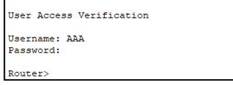

CISCO 초기 설정
===

Router 기본 설정
---

* **Router 이름 설정**
```
Router(config)# hostname [Router_name]
```

* **Router 시간 설정**
```
Router# clock set *hh:mm:ss day month year*
(month표기 ---> jan, feb ...)
```

* **Router Banner 설정**
```
Router(config)# banner motd #[banner_내용]#
```
  * motd 
  * login 
  * incoming 
  * exec 

* **Router 설정 저장**
```
Router# copy running-conifg startup-config
= Router# write  (wr)
```
  * 설정한 내용은 임시기억장치 RAM에 저장. RAM은 전원 OFF 시 데이터가 지워지므로 데이터를 NVRAM에 저장하는 명령어

* **Router 설정 확인**
  > privilege mode에서 실행가능한 명령어 (ping, clock set 등)를 configure mode에서 명령어 앞에 **do**를 붙이면 명령어 실행 가능
```
Router# show running-config (sh run)
Router(config)# do show running-config (do sh run)
```

Router banner
---

* **exec** : login 후 userexec mode로 전환되기 전에 표시되는 banner
* **login** : login 전 보여주는 banner
* **motd** : 접속하면 모두에게 보여지는 banner
* **incoming** : 가상터미널 접속 시 보여지는 banner

##### motd -> login -> exec

: banner 내용을 # 대신 다른 특수문자를 사용할 수 있음 *(대신, banner의 시작과 끝이 같은 특수문자. @. $ 등)*
```
Router(config)# banner motd $### Authorized user only! ###$
```

Privilege mode, Configuration mode 명령어
---

1. Privilege mode (#)
   * 하드웨어 구성 관련 명령
   * 테스트 명령
   * 정보 확인 명령
   * 재부팅

2. Configuration mode
   * 위 구성 명령을 제외한 모든 환경설정 
   * Sub configuration mode는 하나가 아닌 여러 process가 있는 환경설정을 하는 경우
     * ex) Interface의 경우 1개가 아닌 여러 개의 Interface를 가짐. 따라서 각각의 Interface가 독립적이기 때문에 Sub configuration mode가 존재
     * ex) banner 설정의 경우 장비에 사용되는 모든 사용자에게 보여지는 것이기 때문에 하나의 설정만 존재 ---> Sub configuration mode 없음


Router password 설정
---

#### User mode --> Privileged mode 변경 시 암호 설정
```
Router(config)# enable password [password입력]  (암호 평문 저장)
Router(config)# enable secret [password입력]    (암호 암호화 저장)
```
* **#show run**으로 확인
* 평문보단 암호화로 저장된 password를 우선
* 평문 암호를 암호화하는 명령어
  ```
  Router(config)# service password-encryption  (CISCO type7로 변경)
  ```

#### Console 접속 시 암호 설정
```
Router(config)# line console 0 (line con 0)
Router(config-line)# password [password입력]
Router(config-line)# login
```
* line : 환경설정을 위한 interface 이름

#### Aux 접속 시 암호 설정
```
Router(config)# line aux 0
Router(config-line)# password [password입력]
Router(config-line)# login
```

#### Terminal 접속 시 암호 설정
```
Router(config)# line vty 0 4 (5개 터미널 session 설정)   --->  interface ID가 0~4
Router(config-line)# password [password입력]
Router(config-line)# login
```

* 각각의 Terminal 별로 password를 설정하려면
```
Router(config)# line vty 0  (0번 session 암호 설정)
Router(config-line)# password (password입력)
Router(config-line)# login
Router(config)# line vty 1  (1번 session 암호 설정)
Router(config-line)# password [password입력]
Router(config-line)# login
```
  * 실제 업무에선 이러한 설정을 잘 하진 않음


Router Privilege Level (권한 설정)
---

> 사용자 계정과 암호를 사용하여 관리자를 특정하고 권한 관리가 가능

#### CISCO 권한 그룹

* 계정을 생성하면 Windows의 경우 users라는 default group으로 적용
* Linux는 계정을 생성하면 계정 이름과 동일한 그룹 생성
* Linux는 계정을 원하는 그룹에 넣어야만 해당 그룹의 정책 적용
* CISCO의 권한 그룹은 **0 ~ 15** num을 이용하여 권한 지정
  * **0** : 로그인하지 않은 상태
  * **1** : 로그인 후 user mode
  * **15** : privilege mode에서 권한 설정이 되지 않은 경우 default 권한
  * **2 ~ 14** : 관리자가 특정 권한을 부여해서 사용할 수 있는 권한. 관리자기 권한을 부여하지 않으면 user mode처럼 작동
  * Privilege Level 15 미만인 계정은 명령어 enable(en)을 입력해야 level 15
  * 사용자 계정에 Privilege level을 지정하지 않으면 Level 1(user mode)이 default로 설정
  * 명령어가 정상적으로 실행되지 않으면 **# show privilege** 명령어로 사용자 계정의 Privilege level 확인 (권한 여부)


* 관리자별로 ID를 주기 위해선 **username [ID] password [password]**
  ```
  Router(config)# username [ID] password [password입력]     <--- 로컬 계정 생성
  Router(config-line)# local login      <--- 로컬 계정 로그인
  ```

  

##### 권한확인 show privilege
```
Router> show privilege    --->    #결과: Current privilege level is 1
Router# show privilege    --->    #결과: Current privilege level is 15
```
  > 즉, User mode는 Level 1, Privilege mode는 Level 15


##### 관리자별로 ID를 부여할 때 아래와 같이 권한을 부여
```
Router(config)# username [ID] privilege [level number] password [password 입력]
```
  * 해당 ID에 level number로 권한 부여

##### 권한 Level별로 사용 가능한 명령어를 지정해야 할 경우
```
Router(config)# privilege exec level [number] [해당 권한이 사용할 명령어]
Router(config)# privilege exec level 5 show ip route    --->    #Level 5 권한을 갖는 사용자에게 Routing Table 확인 권한 부여
```
  * 만약 Level 5에 show 관련 권한을 모두 부여했을 경우 하위 권한은 사용하지 못함


##### 문제
- router 이름: kedu503
- 시간 설정: 오후 1시 59분 10초 4월 10일 2023년
- banner : 접속하는 모든 사람에게 #### motd banner ####
		      로그인을 시도하는 사람에게 @@@@ authorized person only! @@@@
- enable암호를 1234로 암호화 저장
- console 접속 시 password만 물어보도록 설정 9611
- 가상터미널 접속 시 사용자이름 AAA, password 4321 => level 15로 접속
          BBB, password  9876 => level 1로 접속

##### 풀이
```
conf t
!
hostname kedu503
!
do clock set 13:59:10 APR 10 2023
!
banner motd @ #### motd banner #### @
banner login # @@@@ authorized person only! @@@@ #
!
enable secret 1234
!
line con 0
password 9611
login
!
line vty 0 4
local login
!
username AAA privilege 15 password 4321
username BBB password 9876
```


