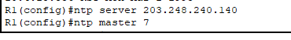

CISCO_설정(2)
===

Terminal 환경 설정 및 Line 설정
---

##### Terminal 환경 설정 (관리자 mode)

```
# terminal length [0~512]       --->  show 명령어 입력했을 때 more이 나오는 Line 수

# terminal length 0             --->  more 표시 X

# terminal history size [0~256] --->  이전 명령어(history) 기억
```

##### Line 설정
```
(config)# line [con 0 / vty 0 4 / aux 0]
(config-line)# exec-timeout [m] [s]         --->  IDLE 시간 후 자동 Logout

(config-line)# logging synchronous          --->  자동 줄 바꿈

(config-line)# privilege level 15           --->  진입 시 바로 관리자 mode

(config-line)# password [암호]
(config-line)# login
```

* 사용자 계정과 암호 사용
  ```
  (config-line)# login local            --->  장비에 있는 사용자 계정과 암호를 사용하여 로그인
  (config)# username [사용자 이름] privilege [권한 Level] password [암호]
  ```


가상 터미널 설정
---

```
(config)# line vty 0 4
(config-line)# exec-timeout [m] [s]         --->  IDLE 시간 후 자동 Logout

(config-line)# logging synchronous          --->  자동 줄 바꿈

(config-line)# privilege level 15           --->  진입 시 바로 관리자 mode

(config-line)# password [암호]
(config-line)# login

(config-line)# login local            --->  장비에 있는 사용자 계정과 암호를 사용하여 로그인
(config)# username [사용자 이름] privilege [권한 Level] password [암호]
```

* IOS v15 이후 version부터
  ```
  (config-line)# transport input none       --->  default 
  ```
  이므로
  ```
  (config-line)# transport input [Protocol 이름]    ---> 해당 protocol 사용 가능
  ```

##### 가상 터미널 SSH 설정

* 사용자 이름과 암호 설정
  ```
  (config)# username [사용자 이름] privilege [권한 Level] password [암호]
  ```

* 장비의 host 이름 설정
  ```
  (config)# hostname [이름]         --->  hostname을 지정하지 않으면 키 생성 X
  ```

* 도메인 이름 설정
  ```
  (config)# ip domain-name [도메인 이름]
  ```

* 비밀키와 공개키 생성 (host 이름.도메인 이름)
  ```
  (config)# crypto key generate rsa
  ```

- SSH Protocol의 환경설정
  ```
  (config)# ip ssh version [1,2]
  (config)# ip ssh time-out [초]
  (config)# ip ssh authentication-retries [횟수]
  ```
  SSH v2 이상 사용하도록 권장
  SSH2는 키 생성 시 암호화 bit를 768bit 생성해야 함 ---> 1024bit 이상 생성

- SSH 설정 확인
  ```
  # show ssh            --->  Protocol 존재 유무
  # show ip ssh         --->  현재 가동 중인 SSH protocol
  # show crypto key mypubkey rsa    --->  rsa 키 값
  ```

- SSH 접속 Line 설정
  ```
  (config)# line vty 0 4
  (config-line)# exec-timeout [분] [초]
  (config-line)# logging synchronous
  (config-line)# login local
  ```

DNS 설정 및 시간 설정
---

#### DNS 설정

* hosts 파일에 IP와 Domain Name을 등록해서 DNS lookup을 하기 전에 hosts 파일을 lookup하여 domain name을 사용할 수 있듯이
  CISCO 장비 또한 아래와 같이 hosts 파일에 등록할 수 있음
  ```
  (config)# ip host [Domain Name] [Domain Name과 mapping할 IP주소]
  ```

* DNS Client 설정
  ```
  (config)# ip name-server [DNS Server 주소]
  (config)# ip domain-lookup                --->  DNS 작동(enable)
  (config)# no ip domain-lookup             --->  DNS 작동(disable)
  ```
* DNS 확인
  ```
  # show hosts

  아래 4가지 확인
  - IP domain-name으로 설정한 Domain Name
  - DNS lookup 여부
  - DNS Server 주소
  - hosts mapping
  ```

#### 시간 설정

```
# clock set 시:분:초 일 월 연도
```

##### NTP (Network Time Protocol)
> Network를 통해 장비의 시간 동기화 서비스

* NTP에서 사용하는 Port는 123/udp, 323/udp
* stratum 번호 : 1 ~ 15 (default 7)
  
  

* Log 발생 시 시간 표시
  ```
  (config)# service timestamps log datetime localtime year
  ```

* NTP Client 설정 (NTP server를 통한 시간 동기화)
  ```
  (config)# ntp server [server IP 또는 Domain Name]
  (config)# clock timezone KST 9
  ```

* 장비를 NTP Server로 만들기 (NTP Server 설정)
  ```
  (config)# ntp master [stratum 번호]
  ```

* Software 시간을 Hardware 시간으로 변경 update
  ```
  (config)# ntp update-calendar
  ```

* NTP 확인
    ```
    # show clock
    # show ntp status
    # show ntp association
    ```