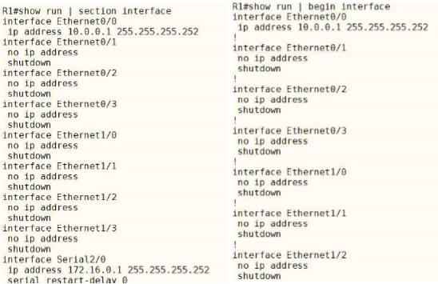
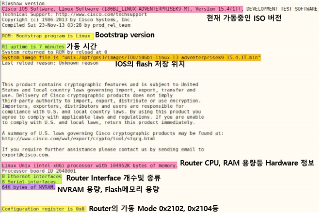
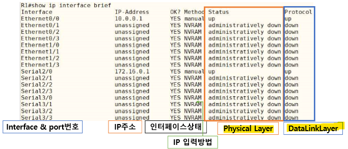
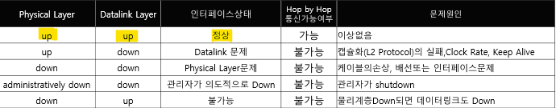
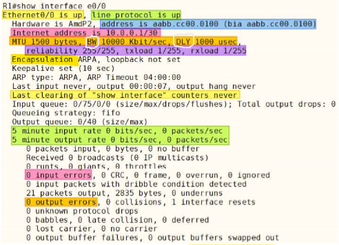
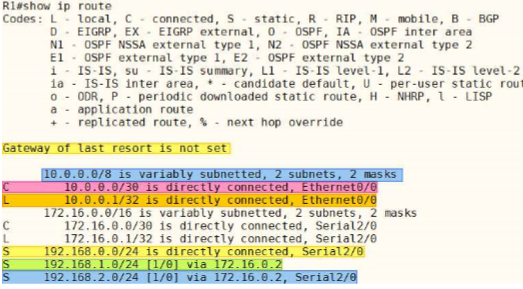
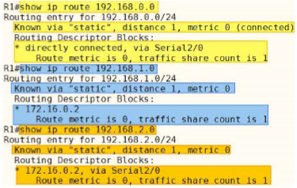
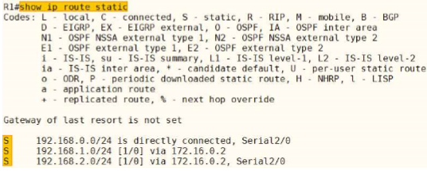
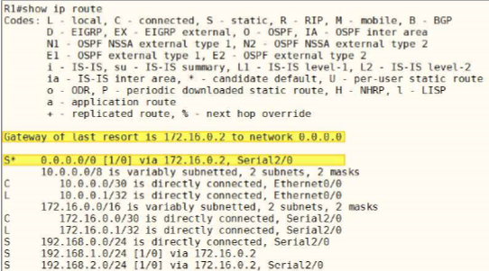
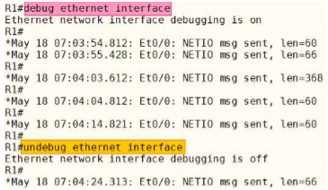

상태정보 확인 명령어
===

\# show
---



* show 명령에서 옵션 모두 사용 가능
  ```
  (Router)# show mac-address-table | include [MAC주소]
  (Router)# show mac-address-table | exclude [MAC주소]
  
  위 두 명령어 많이 사용
  ```


#### \# show version




#### \# show ip interface brief






#### \# show interface [Interface 이름]

> 해당 Interface 상세 정보 확인



* **Bandwidth(BW)**와 **Delay(DLY)**의 경우 Routing Protocol이 참조하기 위한 Cost 값. 실제 port 설정 값이 아님    --->  즉, Routing Protocol의 우선 순위를 결정할 때 사용하는 값
* Interface 종류 및 상태
* Data Link Layer 상태
* MAC주소
* IP주소
* MTU(최대전송단위)
* BW(대역폭)
* DLY(지연시간)
* reliability(회선 신뢰도)
* Interface 사용률
  * txload : Transmit(보내기)
  * rxload : Receive(받기)
* Interface 통계 초기화 시간
* 5 Minute(5분간 회선 사용률)
* Input error
* Output error
* Keepalive : Interface의 up 상태를 확인하는 신호를 주기적으로 보내는 시간


#### \# show ip route




* Routing Table은 IP의 수가 작은 것부터 표시
* C(connected) : 직접 연결된 Network
* L(local) : 해당 Interface의 IP주소. 다른 곳으로 Routing 하지 않고 해당 Interface에서 packet이 처리될 수 있도록 추가
* R(Rip), D(EIGRP) : Routing Protocol 종류



* show ip route [네트워크 주소] --->  Routing Table에 대한 상세 AD값과 Metric 표시
* Static의 경우 아래와 같이 표기되지만 실제로 모두 AD 1, Metric 0
  ```
  S   192.168.0.0/24 is directly connected, Serial 2/0
  S   192.168.1.0 [1/0] via 172.16.0.2
  S   192.168.2.0 [1/0] via 172.16.0.2, Serial 2/0
  ```


##### Static


> static Routing만 확인

##### Gateway of last resort



* **Default Network**가 선언되면 Gateway of last resort 설정됨 (일종의 마지막 수단)
  ```
  S*    0.0.0.0/0 [1/0] via 172.16.0.2, Serial2/0

  = (config)# ip route 0.0.0.0 0.0.0.0 s2/0 172.16.0.2
  ```

* Routing Table을 Longest Match Rule에 의해 lookup 진행 후 없으면** default network**로 packet을 forwarding

* Stub network에 유용하며 Interface만 선언하는 경우도 많다고 한다.
  ```
  (config)# ip route 0.0.0.0 0.0.0.0 fa0/0
  ```


##### [AD/Metric]

```
20.20.20.0 [120/1] via 192.168.12.2, 00:00:25, Ethernet0/0
```
에서 [120/1]

* **AD**는 서로 다른 Routing Protocol의 우선 순위 값 (장비 제조사 결정)
* **Metric**은 같은 Routing Protocol의 우선 순위 값 (Routing Protocol의 Algorithm에 의해 결정)
* 만약 AD와 Metric이 같으면 ---> Load Balancing
* **Routing Table Lookup 우선 순위**
  1. Longest Match Rule
  2. AD
  3. Metric
  4. AD=Metric  --->  Load Balancing


```
D        2.2.2.0 [90/332800] via 192.168.13.3, 00:00:01, Ethernet0/0
```
* D : EIGRP Routing Protocol
* 2.2.2.0/prefix  : 네트워크 주소/서브넷 마스크
* [90/332800] : AD/Metric
* 192.168.13.3  : Next-hop IP
* 00:00:01  : 해당 네트워크 주소를 Routing table에 등록한 후 시간
* Ethernet0/0 : 출구 Interface 이름


Debugging
---

* debug 명령어는 Router, Switch의 동작과 관련된 모든 상세 내용을 알 수 있고 문제 발생 시 Trouble Shooting에 도움
* 실제 장비에 Debugging ---> 자원 소모율이 높아져 장비가 down 혹은 통신에 문제가 발생할 가능성이 있음
* *\# debug ?* ---> Protocol이나 상태를 선택

  

* *\# debug all*  --->  실제 Service가 구동 중인 장비에 사용하지 말 것
* *\# undebug all*  --->  debug 종료

