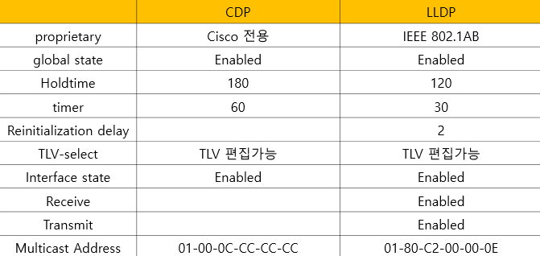

CDP(Cisco Discovery Protocol), LLDP(Link Layer Discovery Protocol)
===

CDP (Cisco Discovery Protocol)
---

> CISCO 장비와 직접 연결되어 있는 CISCO 장비만을 찾아내는 Protocol

- CDP는 Data Link Layer에서 동작하는 Protocol이다 (독립적으로 동작)
- CDP는 Multicast(01-00-0C-CC-CC-CC)를 이용하여 CISCO 장비를 찾는다.
- CDP에 의해 알 수 있는 정보
  - 장비 이름
  - IP주소
  - 접속 Port
  - 접속 장비의 기능
  - 접속 장비의 Hardware 사양 등
- 이웃한 장비의 정보만 확인 가능  **(L2 통신 = hop by hop 통신)**


#### CDP 정보 확인

##### 현재 장비 CDP 정보


##### 이웃한 장비의 CDP 정보


* Device ID : 장비 이름
* Local Intrfce : 장비 접속port (나의 장비 기준)
* Holdtime : 0이 되면 table에서 삭제. Holdtime 동안 정보 유지
* Capability : 장비 기능
* Platform : 장비 사양
* Port ID : 상대 접속port


#### 이웃한 장비의 CDP 자세한 정보

> 아래와 같은 명령어로 자세한 정보를 얻을 수 있음
```
(Router)# show cdp neighbors detail
```


- R1에선 SW1의 CDP 정보만 확인 가능 (hop-by-hop)


#### CDP traffic 확인
```
R1# show cdp traffic
```


#### CDP 기능 끄기 및 초기화

* CDP 기능은 CISCO 장비에서 default값 = enable
* 그러나 보안 문제 및 네트워크 내 traffic 유발할 수 있으므로 다음과 같이 CDP 기능을 끄고 사용하는 경우도 많다
  * CDP disable
    ```
    Router(config)# no cdp run    ---> 전역설정 : 해당 장비 모든 Interface의 CDP 기능을 끈다

    Router(config-if)# no cdp enable    --->  해당 Interface만 CDP 기능을 끈다
    ```
  
  * CDP Table 초기화
    ```
    Router# clear cdp table
    ```


LLDP (Link Layer Discovery Protocol)
---

- LLDP는 CDP(CISCO 전용)와 비슷하지만 IEEE 802.1ab 표준화   --->  모든 장비에서 사용 가능
- Broadcasting 간격 : 30초
- 120초 동안 관련 정보를 받지 못하면 해당 링크 정보는 삭제
- Multicast address : 01-80-C2-00-00-0E
- Ethertype : 88CC
- MAC Bridge (즉, Switch)에서는 LLDP frame을 다른 Port로 forwarding 하는 것을 막는다.

#### LLDP 설정

- LLDP enable / disable
  ```
  (config)# lldp run
  (config)# no lldp run
  ```

- Interface에서 enable / disable
  ```
  (config-if)# lldp transmit
  (config-if)# lldp receive
  ```

  

- LLDP 정보 확인
  ```
  # show lldp
  # show lldp neighbors [detail]
  ```

- LLDP 시간 변경
  ```
  (config)# lldp holdtime [seconds]
  (config)# reinit [seconds]
  (config)# lldp timers [seconds]
  ```

#### Linux Server LLDP 활성화

> **lldpad 활용**
> manual page : https://linux.die.net/man/8/lldptool

1. **설치**
   1. RHEL 계열
    ```
    # yum install lldpad -y
    또는
    # dnf install lldpad -u
    ```
   2. Debian 계열(Ubuntu)
    ```
    # apt update && apt install lldpad -y
    ```

2. **lldpad 실행**
   ```
   # service start lldpad
   ```

3. **LLDP rx, tx 설정 및 보낼 정보 설정** (hostname과 port정보)
   1. rx, tx 허용
   ```
   # lldptool set-lldp-i [Interface 이름] adminStatus=rxtx
   ```

   2. hostname 전송
   ```
   # lldptool -T -i [Interface 이름] -V sysName enableTx=yes
   ```

   3. Port 정보 전송
   ```
   lldptool -T -i [Interface 이름] -V portDesc enableTx=yes
   ```

4. **LLDP rx 확인** (연결된 이웃 장비에 LLDP 활성화 상태이어야 한다)
```
# lldptool -i [Interface 이름] -t -n
```

5. **LLDP 해제**
```
# lldptool set-lldp-i [Interface 이름] adminStatus=disabled
```

**또는 LLDP 서비스 중지**
```
# systemctl stop lldpad
```


CDP vs LLDP 비교
---



- TLV : 보낼 데이터 (**T**ype, **L**ength, **V**alue)

