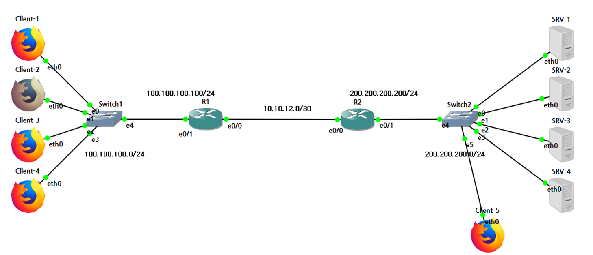
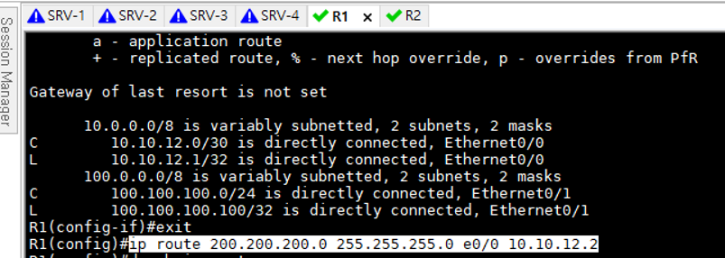
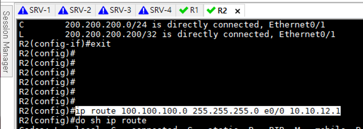
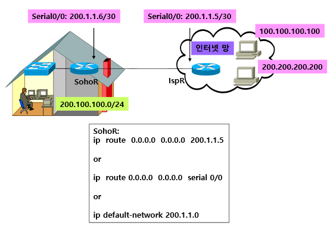
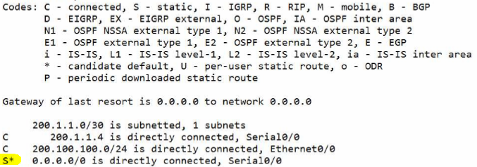

Static Routing (1)
===

Routing Table
---

* 경로 정보를 수시로 업데이트
* RAM에 기록 ---> Power off 시 정보가 사라짐
* Routing Table 확인
  ```
  Router# show ip route
  ```
* MAC주소를 L2 Header로 만들어 전송
  * 각 계층은 Destination address가 자신의 주소이면 **Decapsulation**. 아니면 Drop
  * 상위 계층은 하위 계층이 없으면 더 이상 **Encapsulation** 할 수 없음
  * L2 Switch는 자신의 MAC주소가 아니더라도 Switch 내부로 가져와 MAC address를 비교한다.
  * L3 장비는 L3주소가 자신의 주소가 아니더라도 Routing Table을 lookup하여 주소 비교


Static Routing
---

> 관리자가 직접 Router에 경로를 직접 입력하여 Routing table을 작성하는 Routing 방식

> 아무래도 Static Routing은 관리자가 직접 IP를 입력하다 보니 경로 변경 시 대응이 느리다

##### Static Routing Protocol 명령

```
Router(config)# ip route [목적지 Network 주소] [Subnet_mask] [출구 Interface ID] [Next-hop IP]
```

Routing Table 등록
---

1. 해당 경로로 packet이 전송되어야 함
2. Routing protocol 중 **connected** 제약
   * 서로 다른 네트워크를 입력. 즉, 같은 네트워크나 해당 네트워크의 subnetting 된 네트워크가 포함되면 안됀다. ---> **Overlap**
   * shutdown 상태이면 Routing table에 등록되지 않음 ---> 네트워크 주소, Broadcast 주소를 입력하지 못함 (만약 입력하면 bad mask 오류)
3. Static Routing 제약
   * (config)# ip route [네트워크주소] [서브넷마스크] [출구 Interface] [next-hop IP]
   * Static Routing은 네트워크 주소만 인식. 즉, 실제 dev에 적용된 IP주소를 입력하면 #Inconsistent address and mask 오류 발생
   * 출구 Interface가 shutdown 상태이면 Routing table에 등록되지 않음
   * Static Routing 명령으로 입력하면 덮어쓰기 형식이 아니다.


##### Static Routing 예시




> R1 Static routing 설정


> R2 Static routing 설정


Default Route
---

> 목적지 네트워크 주소가 Routing table에 등록되지 않아 경로를 찾지 못했을 때 **모든 통신이 이곳으로 보내라고** 정해놓은 일종의 길

* 외부 인터넷과 연결된 Router 혹은 Stub network Router가 주로 사용
  > **Stub network**: 오직 하나의 경로를 통해 외부망과 연결된 네트워크

* Static Routing은 특정 목적지를 가기 위해 구성하지만, Default Routing은 특정 목적지를 지정하지 않고 모든 목적지로 Routing 경로로 사용 (모든 목적지가 default)
* Default route 구성
  ```
  Router(config)# ip route 0.0.0.0 0.0.0.0 [next-hop 주소 혹은 출구Interface]
  
  0.0.0.0 0.0.0.0     --->  Default network
  ```

* Defaullt network를 이용한 Default Routing
  ```
  Router(config)# ip default-network [네트워크 주소]
  ```
* ip default-network 뒤에 입력할 [네트워크 주소]는 항상 Class 준수
* RIP 네트워크의 경우
  * RIP에서 Default network를 구성하는 경우 [네트워크 주소]는 반드시 RIP로 정의된 네트워크로 설정되어 있어야 한다.



* SohoR 구성
  ```
  Router> enable
  Router# configuration terminal   (conf t)
  Router(config)# hostname SohoR
  SohoR(config)# interface ethernet0/0
  SohoR(config-if)# ip address 200.100.100.1 255.255.25..0
  SohoR(config-if)# no shutdown
  SohoR(config-if)#exit

  SohoR(config)# interface serial0/0
  SohoR(config-if)# ip address 200.1.1.6 255.255.255.252
  SohoR(config-if)# no shutdown
  SohoR(config-if)# exit
  
  SohoR(config)# ip route 0.0.0.0 0.0.0.0 serial0/0
  SohoR(config)# exit
  
  
  SohoR# ping 100.100.100.100     ---> 정상 통신
  ```

  ```
  SohoR# show ip route
  ```

  


