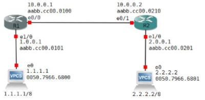
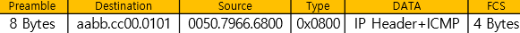
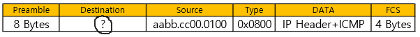
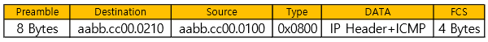
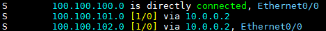

Static_Routing (2)
===

Routing
---
> MAC주소를 L2 Header로 encapsulation 후 전송

* 각 계층은 Destination address가 자신의 주소이면 Decapsulation 진행. 아니면 Drop
* 상위 계층은 하위 계층이 없으면 더 이상 Encapsulation을 진행할 수 없음
* L2 Switch는 자신의 MAC주소가 아니더라도 Switch 내부로 가져와 MAC address를 비교한다.
  L3 장비는 IP가 자신의 주소가 아니더라도 우선 Routing table을 lookup하여 비교
* **Routing은 next-hop이 존재하는 방향의 Interface로 traffic을 보내는 것**

Static Routing 방법
---

#### 1. 출구 Interface만 입력하여 사용 (connected)
```
(config)# ip route [네트워크IP] [Subnet_mask] [출구 Interface]
```
* 출구 Interface만 입력한 경우 Routing 시점에 Destination MAC address가 없어서 목표 Host의 IP로 ARP를 보낸 후 해당 ARP를 받은 next-hop의 IP가 응답(ACK)   --->    **Proxy-ARP** (Default)
* 그러나 보안 상 혹은 다른 이유로 인해 Proxy-ARP는 Off하고 출구 Interface만 입력한 경우 ---> Routing X

#### ----------------------------------------------------------------------------------------------------------------



```
R1(config)# ip route 2.0.0.0 255.0.0.0 e0/0
R2(config)# ip route 1.0.0.0 255.0.0.0 e0/1
```
```
PC(1.1.1.1/8) ping 2.2.2.2 
```
---> ping을 보내면 아래와 같은 frame header를 생성



- 만약 Destination R1의 e1/0으로 packet을 forwarding하면 **--->** e1/0에서 frame header를 Decapsulation **--->** IP header의 Destination IP를 보고 Routing table을 lookup.

- **R1 --> R2의 경우**
  - R1의 Routing table을 lookup 후 outgoing Interface e0/0으로 forwarding
  ```
  R1# show ip route

  S   2.0.0.0/8 is directly connected. Ethernet 0/0
  ```
  - R1 e0/0에서 frame header를 생성할 수 없음 ---> PC 2.2.2.2의 MAC address를 모르기 때문이다
  
    

  - R1은 **ARP packet을 만들어 e0/0 Interface로 ARP Request packet을 전송**
  - R2 e0/1으로 R1이 보낸 ARP Request packet을 받음
  - R2 e0/1 Interface는 PC 2.2.2.2에 대한 ARP Request를 받았기 때문에 e0/1 Interface의 IP인 10.0.0.2 정보는 Drop 해야 함
  - 하지만, R2는 자신의 Routing table에 2.2.2.2로 forwarding 할 수 있는 address가 있어서 R2는 e0/1의 MAC address를 R1에게 알려줌 **(proxy-ARP)**
  - R1은 ARP Reply를 통해 학습한 MAC address를 ARP table에 cache    
    2.2.2.2으로 가는 packet에 대해 R2 e0/1의 MAC address를 Destination address로 사용
  
    

- 만약 R2 e0/1 Interface에서 Proxy-ARP 기능을 사용하지 않을 경우   
  R1이 보낸 ARP Request packet을 R2가 받았을 때 ARP Request에 응답하지 않고 Drop (R2 e0/1의 Ip주소가 10.0.0.2 이기 때문이다)
  - 따라서, R1은 Destination MAC address가 없기 때문에 2.2.2.2로 packet을 forwarding 하지 못하고 통신 불가
  - R2 int e0/1의 Proxy-ARP 해제
    ```
    R2(config)# interface e0/1
    R2(config-if)# no ip proxy-arp    --->  Proxy-ARP 기능 해제
    
    R1# clear arp       --->  기존 ARP table 삭제
    ```


#### 2. next-hop IP만 입력하여 사용
```
(config)# ip route [네트워크IP] [Subnet_mask] [next-hop IP]
```
- Destination MAC address는 next-hop IP로 사용되기 때문에 Proxy-ARP 문제는 해결되지만 next-hop IP로 나가는 출구 Interface를 모르기 때문에 *next-hop IP에 대한* Routing Table lookup을 한다.
- 원래 Source 장비에서 Destination IP에 관한 Routing Table lookup만 진행하지만 이웃 장비 next-hop IP의 Routing Table lookup을 한번 더 진행    --->  packet 전송 속도가 느려질 수 있음   --> Routing table lookup을 2번 진행 **(Recursive Lookup)**
- 현재는 Recursive Lookup 문제 해결   --->  next-hop IP만 입력 가능 (CISCO의 **CEF** Switching 기능)

  ```
  # show ip cef     --->  IP/prefix와 next-hop의 출구 Interface를 확인
  # show adjacency detail   --->  미리 만든 L2 Header를 확인
  
  (config)# ip cef    --->  CEF 기능 ON
  (config)# no ip cef   --->  CEF 기능 OFF, fast switching
  ```

- **Process switching** : CPU가 packet 또는 frame 전달을 전부 확인하는 방식
  (모든 packet을 Routing table로 lookup, 모든 frame을 MAC address table로 lookup)
- **Fast switching** : 첫번째 packet 또는 첫번째 frame만 확인하고 나머지 뒤따라오는 packet, frame은 첫 전송때 만들어 놓은 cache를 이용하여 바로 전달하는 방식
  (첫번째 packet을 Routing table로 lookup 후 다음 packet은 만들어진 cache를 이용)
- **CEF** (CISCO Express Forwarding) **Switching** : Control Plane, Data Plane으로 나누었음
  (모든 packet, frame은 미리 만들어진 cache를 이용)

#### ----------------------------------------------------------------------------------------------------------------


```
R1(config)# ip route 2.0.0.0 255.0.0.0 10.0.0.2

R1# show ip route
```
```
S     2.0.0.0/8 [1/0] via 10.0.0.2
```

- Outgoing Interface의 정보가 없어 R1은 packet을 어디로 forwarding 해야 하는지를 모름
- 즉, Source MAC address를 모르기 때문에 한번 더 Routing table lookup **(Recursive lookup)**   
  10.0.0.2로 forwarding 하는 경로를 탐색하기 위해 Routing table을 한번 더 lookup
  ```
  R1# show ip route

  C   10.0.0.0/30 is directly connected, Ethernet 0/0
  ```
  - 10.0.0.2로 가려면 Ethernet 0/0으로 보내면 된다는 것을 알게 되어 Ethernet 0/0의 MAC address를 이용하여 frame 생성
  - 현재는 **CEF Switching** 기능에 의해 Recursive lookup 문제는 해결


#### 3. 출구 Interface와 next-hop IP 둘 다 입력 (권장!)
```
(config)# ip route [네트워크IP] [Subnet_mask] [출구 Interface] [next-hop IP] [Distance]
```



- 위부터
  - 출구 Interface만 입력 (connected)
  - next-hop IP만 입력
  - 둘 다 입력
- [1/0] : 1은 **AD**, 0은 **Metric**

#### ----------------------------------------------------------------------------------------------------------------


- Proxy-ARP와 Recursive Lookup 문제로 인해 CISCO에선 아래와 같이 next-hop IP와 출구 Interface 모두 사용하는 것을 권장
```
R1(config)# ip route 2.0.0.0 255.0.0.0 e0/0 10.0.0.2
```
```
R1# show ip route

S     2.0.0.0/8 [1/0] via 10.0.0.2, Ethernet 0/0
```


Routing Table lookup 우선 순위
---

##### 1. Longest Match Rule
##### 2. AD (Administrative Distance)
- 서로 다른 Routing Protocol의 우선 순위 (작을수록 높은 우선순위)
- 장비 제조업체마다 다를 수 있음
  - **AD 0** (최솟값) : connected
  - **AD 1**  : Static Routing
  - **AD 255** (최댓값) : Drop

##### 3. Metric
: 같은 Routing Protocol의 우선 순위 (작을수록 높은 우선순위)

##### 4.    1=2=3 경우 Load Balancing (부하 분산)


### * Floating Static Route
> Static routing 명령어에서 맨 뒤 Distance 값을 조정

> 이중화 회선 구성에서 평소에는 하나의 회선을 주 회선으로 사용하다가 장애 발생 시 자동으로 backup 회선으로 traffic이 전달될 수 있도록 설정하는 Routing 방식