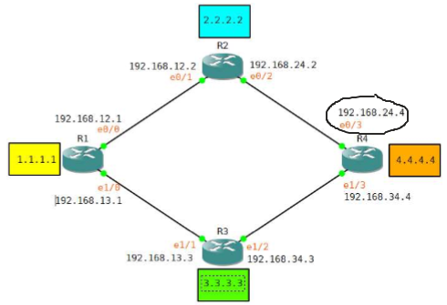
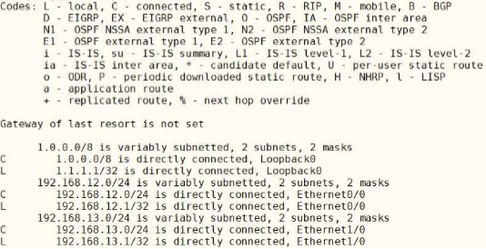
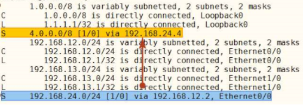
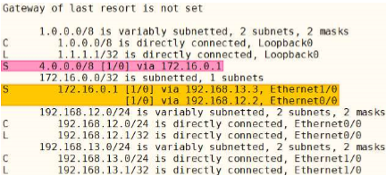
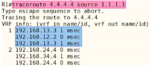

Next Hop
===

- Routing에서 가장 중요한 정보
  - 각 Router의 Routing table
  - Routing table에서 가장 중요한 정보는 **Next-hop** --->  방향성 결정
- Next-hop이 결정되지 않을 경우 해당 Routing 정보는 유효하지 않음   --->  Routing table에서 삭제
- Next-hop이 결정되지 않는 경우들
  - Interface의 Physical Layer down
  - Interface의 Datalink Layer down
  - 즉, Interface의 Link 실패     --->  해당 Router에 next-hop에 대한 정보가 없음

- Router가 특정 Routing 정보를 Routing table에서 삭제하는 동작의 원리는 해당 네트워크 정보의 down 유무를 확인하는 것이 아니라 **해당 네트워크에 대한 next-hop의 도달 가능 유무**를 확인
- Next-hop을 Local Router를 기준으로 **바로 연결된** 상대 Router의 Interface IP를 입력   
  하지만, 상황에 따라 Local Router로부터 목적지에 도달하기 위한 다음 경유지를 사용할 수도 있음

#### ----------------------------------------------------------------------------------------------------------------



- R1->R2 통신 : R1의 next-hop은 R2의 e0/1 Interface
- R1->R4 통신 : R1의 next-hop은 R2의 e0/1 혹은 R3의 e1/1 Interface

- R1-->R4에서 R1의 next-hop을 경우에 따라서 R2가 아닌 R4의 Interface를 지정할 수 있음
  ```
  R1(config)# ip route 4.0.0.0 255.0.0.0 e0/0 192.168.24.4      --->  R1의 출구 Interface
  ```

- 만약 Local Router와 **인접한 곳이 아닌** Router의 Interface를 next-hop으로 지정하면 (여러 hop을 지남)
  ```
  R1(config)# ip route 4.0.0.0 255.0.0.0 192.168.24.4
  R1# show ip route
  ```
  

  - 4.0.0.0/8 네트워크가 Routing table에서 보이지 않음
  - R1의 Routing table에 192.168.24.4로 향하는 경로 정보가 없음
  - 반드시 인접한 장비의 Interface를 next-hop Ip로 입력하여 Routing
- R1에서 Static Routing을 추가하면 Routing table에 4.0.0.0/8 네트워크 등록
  ```
  R1(config)# ip route 192.168.24.0 255.255.255.0 192.168.12.2 e0/0     --->  192.168.24.0 경로 추가
  
  R1# show ip route
  ```
  

- 네트워크에 등록되지 않은 **가상 IP**를 활용하여 Next-hop 지정 가능 (부하분산)
  - 172.16.0.1/32 라는 **가상IP**
  ```
  R1(config)# ip route 172.16.0.1 255.255.255.255 e0/0 192.168.12.2
  R1(config)# ip route 172.16.0.1 255.255.255.255 e1/0 192.168.13.3
  R1(config)# ip route 4.0.0.0 255.0.0.0 172.16.0.1         --->  가상IP를 next-hop IP로 사용
  ```

  

  ```
  R1# traceroute 4.4.4.4 source 1.1.1.1
  ```

     
  **---> 부하분산**