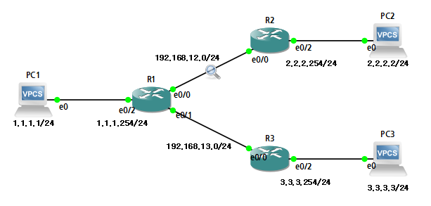
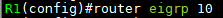
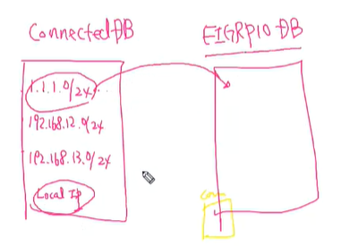
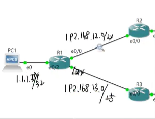
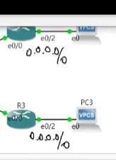
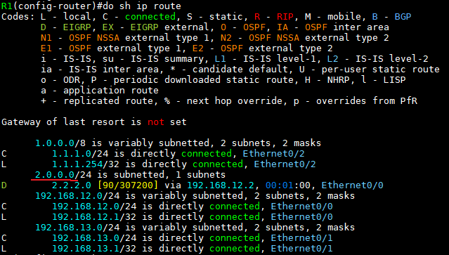
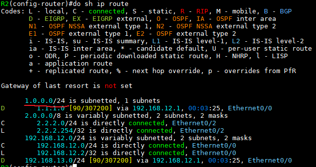
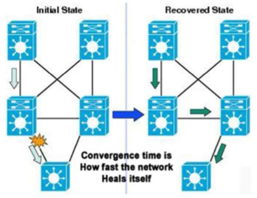
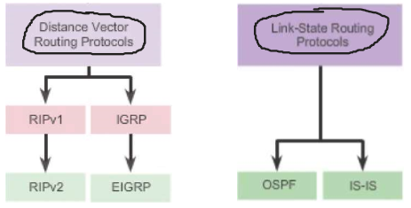
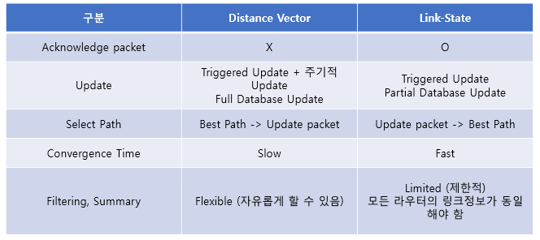

Dynamic Routing Protocol
===

Static Routing 특징
---

#### Static Routing 장점
- Network 정보를 Router끼리 Update를 하지 않기 때문에 보안 강화 및 회선의 사용량을 줄일 수 있음
- Best-path를 결정하는 알고리즘이 없기 때문에 CPU 등 장비의 Resource 사용량을 줄일 수 있음
- 관리자에 의해 수동으로 설정되기 때문에 관리자가 직접 경로를 재설정하거나 Troubleshooting 용이


#### Static Routing 단점
- Router와 Network 수가 늘어남에 따라 설정 및 관리에 시간이 많이 소요
- 대규모 Network의 경우 관리자의 실수에 의한 장애가 발생하기 쉬움
- 네트워크 장애 및 변화 발생 시 대응이 느림


#### Static Routing을 사용하는 경우
- Small network
- 특정 Network만 사용하여 통신을 할 경우
- 장비의 Resource가 부족한 Stub장비에게 Default gateway를 설정하는 경우
- 단일 경로로 구성된 Stub network에 대한 Route 설정하는 경우
- Primary route Link에 대한 Backup route Link를 생성하는 경우


Dynamic Routing Protocol 이란?
---

- Router 스스로 최적의 경로를 찾아서 Routing table을 생성
- 네트워크 상황에 자동 대응
- 단점 : 장비 Resource를 많이 사용
- RIP, IGRP, EIGRP, OSPF, BGP 모두 Dynamic Routing Protocol
- 경로가 많을 경우


Dynamic Routing Protocol 특징
---

### - Data Structures   
- Dynamic Routing Protocol은 학습된 정보를 저장하기 위한 DB를 가짐 (Routing 정보를 가진 DB)
- Dynamic Routing 뿐만 아니라 모든 Routing(connected, static, dynamic) Protocol은 각각의 DB를 생성


### - Routing Protocol message
- Dynamic Routing Protocol은 Network 정보를 상호 간에 전달하기 위하여 여러 Type의 message가 있다
- DB를 가진 Router끼리 DB교환을 위한 여러 type의 packet을 가지고 DB교환 진행

### - Algorithm
- Dynamic Routing Protocol은 Best-path를 결정하기 위한 알고리즘이 존재
- Dynamic Routing Protocol마다 서로 다른 알고리즘을 가지고 있으며 이러한 알고리즘을 통해 Loop가 발생하지 않는 best-path를 찾기 위한 진행 절차 (이때 DB 내용을 lookup)


### - Cold Start
- 각 장비는 Dynamic Routing Protocol를 통해 통신하고자 하는 Interface에 Dynamic Routing Protocol enable로 설정하면 해당 Interface의 Network 정보가 DB로 들어옴
- 즉, enable 상태의 Interface를 통해 Routing Protocol Message가 전송됨
- 이떄, Dynamic Routing 설정 시 network라는 명령을 사용   
  network 명령은 해당 네트워크를 교환하라는 의미가 아니라 **해당 네트워크에 포함된 IP주소를 가진 Interface에 Routing protocol을 enable(활성화)** 하라는 의미

  ```
  network 0.0.0.0/0     
  
  --->  해당 Router의 IP가 입력되고 활성화된 모든 Interface에 Dynamic Routing을 enable하라는 의미 (실무에선 test용도)
  ```


### - Network Discovery & Exchanging the Routing information
- Router 간에Dynamic Routing Protocol DB를 교환하여 상호 간에 어떤 Network 정보를 가지고 있는지 Discovery


### - Choosing the Best-Path
- 자신의 DB에서 동일한 Network에 대하여 Best-Path를 결정
  

### - Maintaining
- Network 정보가 변경되면 상호 간에 Update를 통해 관리


### @ Cold Start 예시)



   
> 위 topology에서 모든 Router(R1, R2, R3)에 EIGRP 설정
>
> 그러나 Router 사이에 Message 교환이 이뤄지지 않음

   
> Interface를 Dynamic Routing enable를 해야 Routing Protocol Message를 교환

[network 명령]   
   
> R1 3개의 Interface의 서브넷 마스크는 /24
  ```
  network [IP] [와일드카드 마스크]
  --->  입력한 IP가 설정되어 있는 Interface를 활성화
  ```

   
> R2, R3에는 IP가 입력되고 활성화된 모든 Interface에 Dynamic Routing **enable**


   
> R1의 Routing table 확인
>
> R2-PC2 네트워크와 연결되었지만 R3-PC3 네트워크와 Routing X
>
> 왜 R3와 Routing 안되었나? 
>
> R3 e0/0 IP는 192.168.3.3/24 인데 
> 위 R1의 network 명령 설정에서
  ```
  network 192.168.13.0 0.0.0.127  (= 192.168.13.0/25)   <--- R3 e0/0 IP가 해당 네트워크에 속하지 않기 때문에
  ```

   
> R2의 Routing table 확인
>
> R1의 network 입력 설정을 다시 보면
  ```
  network 192.168.12.0 0.0.0.255 (= 192.168.12.0/24)    <--- R2 e0/0 IP는 192.168.12.2/24 이므로 해당 네트워크에 포함
  ```

> 해당 네트워크가 포함된 IP의 Interface를 활성화 ---> 1.0.0.0/24에 포함된 Interface 활성화(Classful 형태로 저장됨)


* Routing table에 best-path만 등록
* Classful Routing Protocol
  * Update packet 정보에 Network mask 정보를 전달할 수 없음
  * VLSM, CIDR 지원하지 못함
  * Major network가 다른 경우 Classful network 정보로 Update
  * **RIP, IGRP**
* Classless Routing Protocol
  * Update packet 정보에 Network mask 정보를 전달 가능
  * VLSM과 CIDR를 지원
  * **RIPv2, EIGRP, OSPF, IS-IS, BGP**
  * IPv6 Routing protocol은 모두 Classless Routing Protocol


 IGP Convergence Time (수렴시간)
 ---

- Router 간에 서로 변경된 정보를 주고받아 변경된 정보를 Routing table에 등록하기까지 걸리는 시간
- 어떤 Interface가 down 되면 이 정보가 모든 Router에 퍼지고 우회 경로를 찾아 Routing table을 Update 하거나 없을 경우 해당 경로를 Routing table에서 삭제하는데 소요되는 시간




Distance Vector와 Link State Routing
---

### Distance vector
> 최적 경로 산출

- Network에 대한 정보를 거리와 방향으로 알려줌(광고)
- 직접 연결되어 있는 Router(=Neighbor)와 DB를 공유하기 위해 자신의 모든 DB를 Update하는 **Full Update**를 수행   
  반대는 **Partial update**
- Broadcast IP 255.255.255.255로 Update. Network 정보가 변경되지 않더라도 주기적으로 Routing 정보를 Update

- Router는 자신과 이웃한 Router가 전달해준 네트워크 정보만 알 수 있음   
  (전체 Network topololgy를 불완전하게 가지고 있음)
- RIPv2와 EIGRP는 불필요한 Resource 사용을 막기 위해 **Multicast**로 Update하도록 변경   
  Router의 System Resource를 적게 소모
- **EIGRP**는 주기적인 Update와 Full Update를 차단하기 위하여 Update packet에 대한 ACK packet을 사용


### Link State Routing

- 모든 Router가 자신의 Link 정보를 DB화 ---> 정보 교환   
  ---> 모든 Router가 똑같은 Link 정보를 가짐
- 각 Router가 자신의 이웃뿐만 아니라 멀리 떨어진 Router의 정보까지 가지고 있어 전체 네트워크 Topology를 가짐
- Link 정보 DB를 이용하여 SPF(Shortest Path First : 최단 경로 우선) Algorithm에 의해 **최적의 경로**를 결정하고 Routing table에 등록 ---> Loop 발생 X
- CUP, Memory 등 Router의 System Resource를 많이 사용
- 이웃한 Router(Neighbor)와 DB의 정상적인 동기화를 하지 않았을 경우 Loop 발생할 수 있음
- Update packet에 대한 ACK packet이 존재하기 때문에 주기적인 Update와 Full update가 필요하지 않고 문제가 발생했을 경우에만 **(Partial) Update**
- Multicast, Unicast를 통해 Update






##### Routing의 근본적인 목적은 네트워크를 분할하여 Broadcast 범위를 축소