RIP (Routing Information Protocol)
===

> 현재 실무에선 거의 사용하지 않음
>
> Windows server에서 지원하는 Routing Protocol
>
> 대표적인 Distance Vector Routing Protocol

- OSPF는 Link State Routing Protocol이지만 서로 다른 Area 간에 Distance Vector처럼 작동
- BGP는 Path Vector이지만 기본적으로 Distance Vector (모든 Routing의 기본 알고리즘)


### 1. RIP 특징
- Bellman-Ford Algorithm
  
- Distance Vector Routing Protocol (거리벡터)
- **Metric**: 알고리즘마다 best-path를 계산하기 위한 값
  - **hop 수** : 목적지를 가며 Router를 지나온 횟수. 작을수록 우선 순위가 높아짐 *(RIP는 회선의 속도를 계산하지 않고 거쳐가는 hop의 수만 계산)*
- Router table 전체를 DB로 활용 (RIP를 활성화하고 RIP로 학습한 네트워크에 대해서만)
  - Routing Loop가 발생할 수 있기 때문에 **Max hop을 15hop**으로 제한
- Routing update 주기: 30초 ---> **Routing table 전체**를 보냄(update)
- auto-summary(자동 축약) 지원
- 실제로 520/udp port로 전달


### 2. RIP v1, v2 차이
1. RIP v1은 Classful만 지원 (서브넷마스크 정보는 등록되지 않음)   
   Routing update packet을 255.255.255.255 Destination IP로 전달

2. RIP v2는 Classful과 Classless 둘 다 지원   
   Routing update packet을 224.0.0.9 Destination IP로 전달   
   ---> 즉, Interface에 RIP를 활성화하면 224.0.0.9 Multicast IP가 생성됨


### 3. RIP 설정 명령어

```
(config)# router rip
(config-router)# version [1 / 2]                                    ---> default ver 1
(config-router)# no auto-summary                                    ---> ver 2에서만 적용
(config-router)# network [활성화 Interface의 IP가 포함된 네트워크IP]  ---> running-config에 저장될 때 Classful 형태로 저장

(config-router)# passive-interface [Interface ID]                   ---> 해당 Interface로 RIP 광고하지 않음, Update를 받기만 하고 보내진 않음
(config-router)# passive-interface default                          ---> 모든 Interface의 RIP filtering
(config-router)# no passive-interface [Interface ID]                ---> 해제
(config-router)# neighbor [Unicast로 전송할 IP]                      ---> Unicast로 전송
```

- **passive-interface**는 Routing protocol이 활성화된 Interface 중에 Routing 정보를 보낼 필요가 없는 Interface에 filtering을 적용시켜 전송을 막는다. (마치 L2 Switch의 bpdufilter와 비슷)
  
- Static Routing은 내가 모르는 네트워크를 직접 명령어로 입력하여 적용   
  Dynamic Routing은 내가 가지고 있는 네트워크를 활성화 ---> Interface에 IP를 입력하고 no shutdown
- Dynamic Routing은 이웃한 장비와 정보 교환을 하고 이웃한 장비로부터 받은 정보를 전달하는 형태   
  ---> Topology의 네트워크를 학습하는 형태   

  따라서 TTL을 1 또는 2로 설정해서 Update 범위를 축소하고 불필요한 정보가 다른 Router로 가지 않도록 제한


### RIP 연습

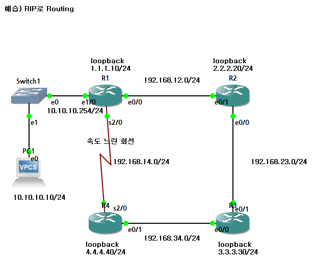

> 만약 R1 e0/0에 passive-interface를 설정하면 R1의 Routing table에선 R2 네트워크가 확인되지만
> R2의 Routing table에선 R1 네트워크가 보이지 않는다

1. IP 설정

  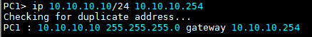

  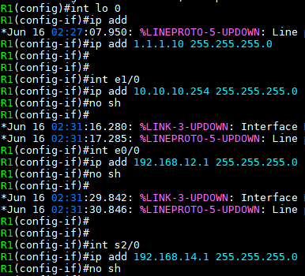

  

  

  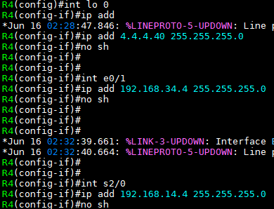


2. R1~R4 interface에 RIP 설정
   
  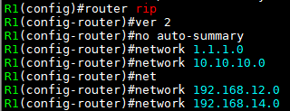
  > network 192.168.12.1
  > network 1.1.1.10 으로도 입력 가능

  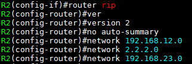

  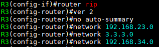

  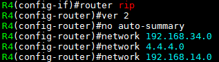


3. Routing table 확인
   
  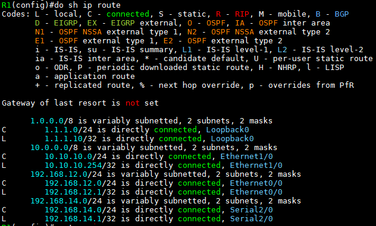

  > RIP 설정 전 R1의 Routing table


  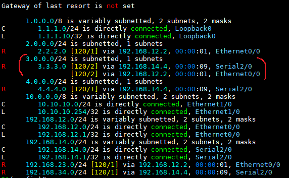

  > RIP 설정 후 R1 Routing table
  
  > R1->R3 : Load balancing 발생 (R1-R2-R3 or R1-R4-R3)


4. PC ping 확인\

  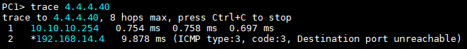

  > PC1에서 R4의 loopback 0 IP로 ping

  - 회선의 속도를 고려하면 R1->R2->R3 경로가 best-path이지만

  - RIP는 오직 hop수 만을 고려하기 때문에 거쳐가는 hop수가 제일 적은 R1->R4 경로를 이용 (속도는 느림)