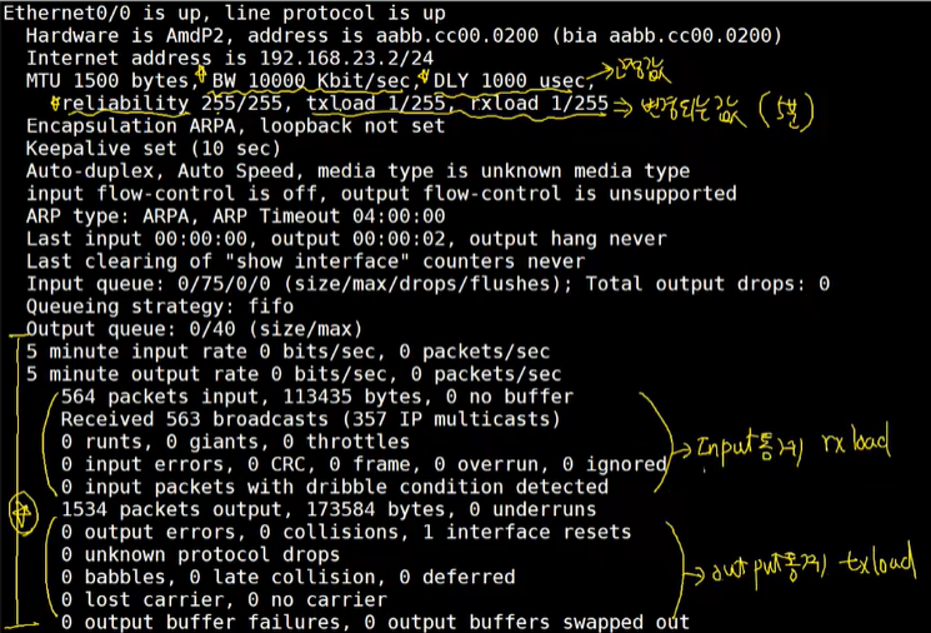
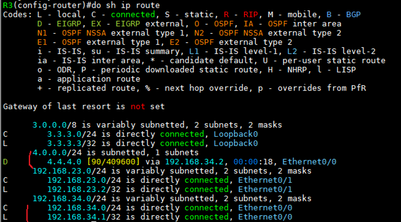
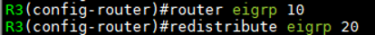
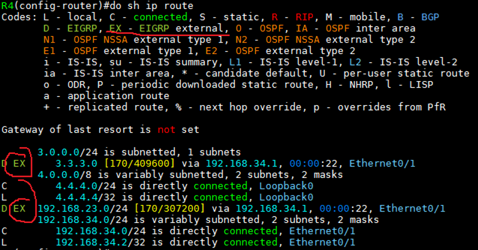
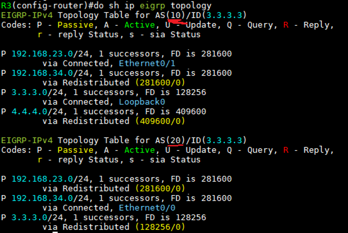
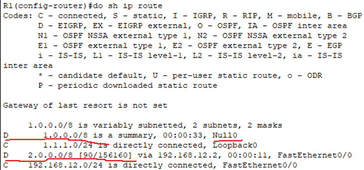
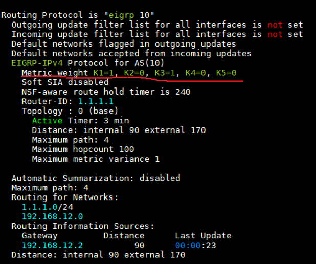
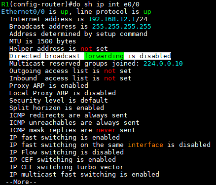

EIGRP (Enhanced Interior Gateway Routing Protocol)
===

> IGRP라는 Protocol의 기능을 향상시킨 Routing protocol

- IGRP는 Distance-vector Routing protocol이지만 OSPF의 Link-State Routing protocol의 속성을 추가한 Routing protocol   
  ---> Distance-vector Routing protocol + Link-State Routing protocol(neighbor) 의 속성을 모두 가진 Protocol (분류는 Distance-vector Routing protocol로 분류)

- CISCO 전용 Protocol ---> 다른 vendor 사용 불가 ---> 현재 표준 Protocol
- Hybrid Protocol (Advance Routing protocol)
- EIGRP는 Classful, Classless Routing protocol 모두 지원
- EIGRP는 auto-summary 및 no auto-summary를 지원하고 IOSv12에선 auto-summary가 default로 설정되어 있고 IOSv15에선 no auto-summary가 Default

**Distance vector Routing protocol**은 이웃한 장비가 알려준 best-path를 그대로 적용시키지만   
**Link-state Routing protocol**은 이웃한 장비는 Link 정보와 네트워크 정보만을 이웃 장비에 알려주고 Link 정보가 다 모인 후 해당 장비가 알고리즘에 기반하여 계산 후 best-path를 선출


EIGRP 특징
---

### 1. PDM (Protocol Dependent Mode) 지원

- IP 이외 IPX, Apple Talk와 같은 다른 L3 네트워크 Protocol의 정보 또한 교환 가능

### 2. AS (Autonomous System)
> AS로 Update 범위를 제한

- BGP의 AS는 인터넷에서 사용되는 주소로 인터넷 연결 시 반드시 필요
  
- EIGRP의 AS는 Update 범위를 제한하기 위한 주소로 아무 주소를 사용해도 무방
  - EIGRP는 AS number가 틀리면 정보 교환을 하지 않음    
  ---> EIGRP는 정보 교환을 위해 neighbor 관계를 맺는데 A**S number가 틀리면 neighbor 관계가 맺어지지 않음**
  - AS number를 이용해 계층적 구조 topology를 만들 수 있음
  - 하나의 Router에서 여러 EIGRP process를 실행할 수 있음

### 3. 여러 Update용 packet을 구분해서 필요한 정보만 update
> Link-state Routing Protocol의 특징

- Hello packet : neighbor 관계를 맺기 위한 packet (neighbor 유지관리, neighbor 장비 존재 확인용)
- Update packet : Topology table (EIGRP의 Routing DB)을 전달. 네트워크 망에 변화가 생겼을 경우에만 보냄
- Query packet : 특정 목적지 네트워크의 best-path에 장애가 발생했을 경우 우회 경로가 있는지 물어봄 (RIP의 Route poisoning과 비슷)
- Reply packet : Query packet을 받은 Router에서 보내는 응답 메시지 (RIP의 Poison reverse 와 비슷)
- Ack packet : EIGRP는 IP 기반으로 동작 ---> 신뢰성 없음 ---> neighbor로 보낸 Update / Query / Reply packet이 정상 수신되었는지를 확인하는 packet (신뢰성 및 재전송 목적)
  - 만약 Update / Query / Reply packet을 보낸 후 Ack packet이 오지 않는다면 일정 시간이 지난 후 재전송 (최대 16회, 그 이후부턴 neighbor 관계를 끊음)


### 4. EIGRP DUAL Algorithm (Diffusing Update Algorithm)
- **FD** (Feasible Distance) : Routing table에 등록된 Metric
- **AD** (Advertised Distance) : 상대(송신측) Router가 알려준 Metric
- **S** (Successor) : best-path 상에 있는 Router
- **FS** (Feasible Successor) : Loop가 없다고 확인된 back-path 상의 Router


### 5. EIGRP는 IP protocol 88번, RIP의 IP protocol은 17번 (520/udp)   

> 참고로 OSPF는 IP protocol 89번)

- **AD** : Internal 90, External 170 (재분배에 의해 학습된 경우)


### 6. EIGRP는 Metric 계산 시 BW, DLY, LOAD, REL를 모두 고려하여 계산
> 참고로 OSPF는 BW(Bandwidth)만 계산에 이용

- BW(Bandwidth): 대역폭
- DLY(Delay): Interface가 In/Out 시 바로 정보를 전달하지 못하기 때문에 약간의 지연시간을 두어 보내는 시간.   
  속도가 빠를수록 지연시간은 짧음

- LOAD: 회선 부하량
- REL(Reliability): 회선 신뢰도


> BW, DLY는 고정값, reliability, load는 변경될 수 있음
```
# show int e0/0
```


EIGRP 명령어
---

```
(config)# router eigrp [AS No]
(config-router)# network [Classful 네트워크]                 
(config-router)# network [Classless 네트워크] [와일드카드 마스크]

# (running-config에 입력한 네트워크 형태 그대로 저장됨)

(config-router)# network [Classless 네트워크] [서브넷 마스크]   --->  권장 X
(config-router)# no auto-summary
```


> R3와 neighbor 관계 성립 (AS No를 20으로 설정)




> R3 Routing table을 보면 R4 e0/0 IP가 등록된 것을 확인


- 하나의 Router에서 각 Interface에 AS Number를 다르게 부여하면 해당 네트워크만 독립적으로 연결 (AS Number가 같은 쪽으로만 네트워크 정보를 보냄)
  
     
  > AS No 20의 네트워크 주소 DB를 AS No 10으로 가져오는 것(재분배)

  
  > redistribute(재분배)의 경우 EX type으로 주소가 Routing table에 저장됨


EGIRP neighbor 관계
---
> EIGRP는 neighbor 관계각 성립되어야 정보 교환

- neighbor 관계를 맺기 위해서 AS Number가 같아야 한다
- 또한 Router 1대에 여러 AS가 작동하고 있다면 각 AS마다 DB(topology table)를 가지고 있으며 redistribute(재분배) 명령이 없다면 독립적인 DB를 유지

   
```
# show ip eigrp topology
```
> AS Number는 각각 독립적으로 작용 (네트워크 정보가 서로 다를 수 있음)


EIGRP auto-summary
---
> auto-summary enable 상태가 default

**auto-summary** : Classful 방식의 Routing protocol에서 네트워크 정보를 광고하는 방식. Subnetting을 진행한 네트워크들이 이전의 주 네트워크로 자동으로 합쳐짐



> R1 int lo 0 : 1.1.1.0/24
> R2 int lo 0 : 2.2.2.0/24

- network 1.1.1.0/24 로 선언하였지만 R1의 Routing table을 보면 EIGRP(D) 1.0.0.0/8로 축약되어 경로 지정 ---> 이는 EIGRP DB에서 IP 범위를 보고 A class로 저장

- 비활성화 명령어
  ```
  (config-router)# no auto-summary
  ```


EIGRP metric 계산
---

EIGRP는 다른 Routing table과는 다르게 BW, DLY, LOAD, Reliability, MTU 등 네트워크 경로에 영향을 미치는 5가지 요소를 모두 Metric 계산에 사용
- 이때 관리자가 어떤 요소를 중점에 두고 best-path를 찾을 지를 결정하는 값을 **K상수** 라고 함

- Metric weight(가중치) K1=1, K2=0, K3=1, K4=0, K5=0 (Default)



```
# show ip protocol
```

- K1 : BW(대역폭)에 주어진 가중치 값    
  K2 : LOAD(부하)에 주어진 가중치 값   
  K3 : DELAY(지연시간)에 주어진 가중치 값   
  K4 : REL(회선신뢰도/회선장애)에 주어진 가중치 값   
  K5 : MTU에 주어진 가중치 값   

- 계산식   
     
  

- 만약 LOAD를 우선적으로 best-path를 결정지을려면 K2값을 조정

- BW = 10,000 Mbps/(찾아가는 네트워크 경로의 가장 작은 대역폭)   
  DLY = (찾아가는 네트워크 경로까지의 모든 delay값들의 합) / 10


EIGRP neighbor 맺는 조건
---

1. 이웃한 장비(이웃한 장비와 연결되는 Interface)와 같은 AS Number를 가져야 한다   
(AS Number가 다르면 다른 Routing protocol이 작동하는 것으로 판단 ---> 서로 다른 Routing protocol끼리 재분배 없이 DB교환을 하지 않음)

2. 동일한 K상수를 가지고 있어야 한다 (Metric 계산하는 K상수가 다르면 Metric 계산 방식이 달라져 Routing Loop가 발생할 수 있음)   
K상수는 각 AS에 부여되지만 Interface 별로 부여되지 않기 때문에 동일한 AS 내의 모든 Router는 K상수가 동일해야 함

3. 인증을 하는 경우 같은 인증 값   

***---> 1, 2, 3 은 무조건 동일한 값을 가져야 한다***

4. 이웃한 Router의 Interface은 서로 같은 서브넷 마스크 값을 가져야 한다
5. Router-ID를 지정한 경우 서로 다른 Router-ID 값을 가져야 함
6. neighbor 명령을 통해 Unicast 전송으로 변경한 경우 모든 이웃 Router 또한 Unicast로 변경해야 한다
7. EIGRP의 ACK packet이 최대 16회까지 신호가 오지 않으면 neighbor 해제


