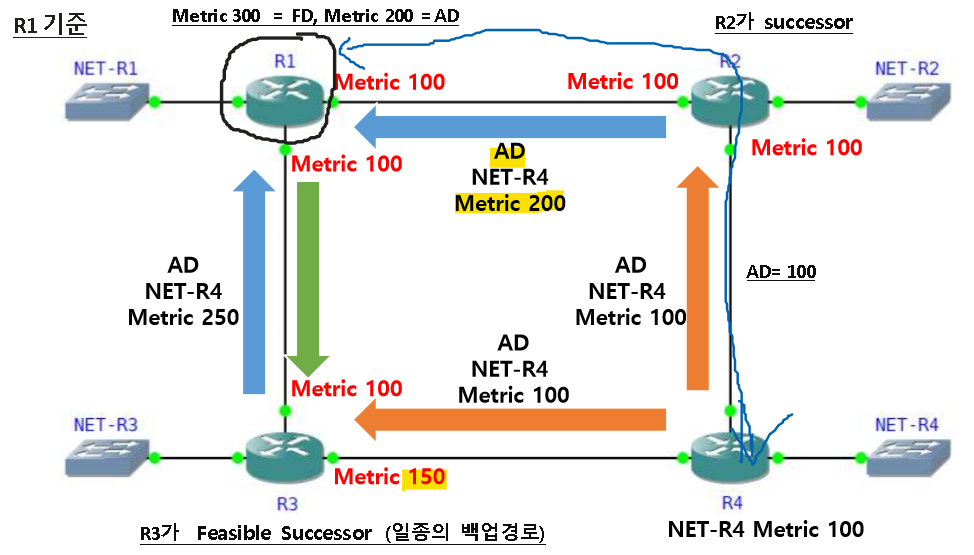
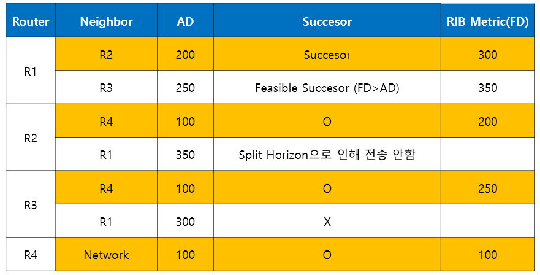
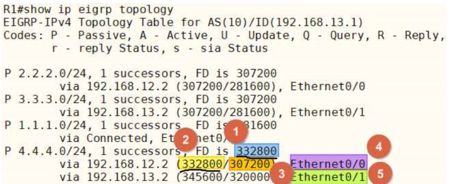

EIGRP DUAL (Diffusing Update Algorithm)
===

- **AD (Advertised Distance)**
  - 광고(advertised)되는 metric 값으로 Local Router의 metric이 아니라 Routing 정보를 전달하는 neighbor가 갖는 metric

  - 즉, neighbor Router부터 목적지까지의 metric

- **FD (Feasible Distance)**
  - 실제 적용 가능한(Feasible) metric
  - Local Router와 neighbor 사이의 metric과 AD를 합한 값의 metric

  - 즉, Local Router로부터 목적지까지의 전체 경로의 metric으로 Routing table에 등록된 metric

- **Successor**
  - Best-path 정보를 전달하는 neighbor

- **Feasible successor**

  - Backup 경로를 제공하는 neighbor
  - Feasible successor는 현재의 Successor가 유효하지 않는 경우에 실현 가능한(Feasible) Successor
  - Feasible successor는 항상 존재하지 않고 다음 조건을 만족해야 함

    - Feasible successor의 AD는 Successor의 FD보다 작아야 한다

    - 위 조건을 만족 시 Routing Loop가 발생하지 않아 Successor에 문제 발생하면 Query packet 없이 Feasible successor를 Routing table에 등록






- R1 Router에서 R4의 network 방향은 Successor 방향인 R2로 packet을 전송
- 만약 R1과 R2 사이에 문제가 발생할 경우 R1이 Query를 보내지 않고 Feasible successor인 R3가 바로 Routing table에 등록


\# show ip eigrp topology를 하면
---


   

```
# show ip eigrp topology
```
- 1 : Best-path의 metric FD (Routing table에 등록)
- 2 : Local Router의 metric
- 3 : neighbor로부터 수신한 AD (즉, 이웃한 Router가 알려준 metric)
- 4 : Successor의 경로인 best-path 정보 (best-path에 있는 이웃 Router = Successor)
- 5 : Backup 경로인 Feasible successor의 경로 정보

- **P** (Passive State)
  - network가 안정적인 상태, 네트워크에 변화 X
- **A** (Active State)
  - network가 사용 가능하지 않은 상태로 topology table에 정보는 있지만 Routing table에 등록 안 됨
  - Active state는 Query를 보내고 응답을 기다리고 있는 상태
  - 모든 Query에 대한 응답을 받아야 해제
  - Query를 받지 못해 SIA (Stuck In Active) 상태에 빠지는 경우가 발생
- **U** (Update)
  - 네트워크 정보가 Update 되고 있는 상태이거나 자신의 Update packet에 대한 수신 확인(Ack) 대기
- **Q** (Query)
  - Active state와 마찬가지로 네트워크 정보에 대한 문의 과정에 있는 상태
  - Request packet이 발생한 상태이거나 Request packet에 대한 수신 확인을 기다림
  - 모든 Query에 대한 응답을 받아야 해제됨
- **R** (Reply)
  - 네트워크 정보에 대한 응답이 이뤄지는 상태를 의미하거나 자신이 보낸 Ack packet에 수신확인 대기