EIGRP DUAL (Diffusing Update Algorithm)
===

- **AD (Advertised Distance)**
  - 광고(advertised)되는 metric 값으로 Local Router의 metric이 아니라 Routing 정보를 전달하는 neighbor가 갖는 metric

  - 즉, neighbor Router부터 목적지까지의 metric

- **FD (Feasible Distance)**
  - 실제 적용 가능한(Feasible) metric
  - Local Router와 neighbor 사이의 metric과 AD를 합한 값의 metric

  - 즉, Local Router로부터 목적지까지의 전체 경로의 metric으로 Routing table에 등록된 metric

- **Successor**
  - Best-path 정보를 전달하는 neighbor

- **Feasible successor**

  - Backup 경로를 제공하는 neighbor
  - Feasible successor는 현재의 Successor가 유효하지 않는 경우에 실현 가능한(Feasible) Successor
  - Feasible successor는 항상 존재하지 않고 다음 조건을 만족해야 함

    - Feasible successor의 AD는 Successor의 FD보다 작아야 한다

    - 위 조건을 만족 시 Routing Loop가 발생하지 않아 Successor에 문제 발생하면 Query packet 없이 Feasible successor를 Routing table에 등록


- R1 Router에서 R4의 network 방향은 Successor 방향인 R2로 packet을 전송
- 만약 R1과 R2 사이에 문제가 발생할 경우 R1이 Query를 보내지 않고 Feasible successor인 R3가 바로 Routing table에 등록

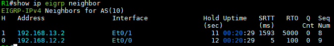
> 위 topology를 따르면   
> (R1 Routing table)

- Address : next-hop neighbor IP
- Interface : 자신의 Interface
- Hold(sec) : 5초 15초
- Uptime : neighbor 유지 시간
- SRTT, RTO, Q : Ack를 기다리는 시간을 계산
- AS(10) : AS number (같은 AS끼리 neighbor를 맺음)

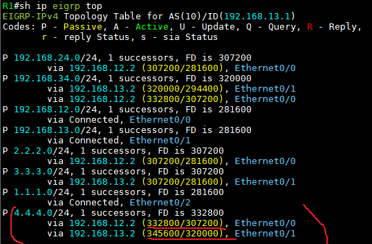

- 여기서 R1->R4 경로를 보면 (4.4.4.0/24)   
  R1 metric 값을 비교해보면 e0/0, 즉 R2가 Successor, e0/1와 인접한 R3가 Feasible successor

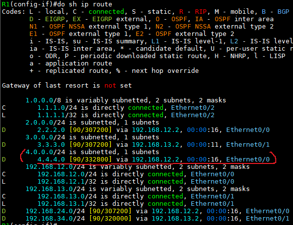

- R1의 Routing table에서 R1->R4 경로를 보면   
  Successor인 R2를 통한 경로만 표시되어 있음을 확인


\# show ip eigrp topology를 하면
---


   

```
# show ip eigrp topology
```
- 1 : Best-path의 metric FD (Routing table에 등록)
- 2 : Local Router의 metric
- 3 : neighbor로부터 수신한 AD (즉, 이웃한 Router가 알려준 metric)
- 4 : Successor의 경로인 best-path 정보 (best-path에 있는 이웃 Router = Successor)
- 5 : Backup 경로인 Feasible successor의 경로 정보

- **P** (Passive State)
  - network가 안정적인 상태, 네트워크에 변화 X
- **A** (Active State)
  - network가 사용 가능하지 않은 상태로 topology table에 정보는 있지만 Routing table에 등록 안 됨
  - Active state는 Query를 보내고 응답을 기다리고 있는 상태
  - 모든 Query에 대한 응답을 받아야 해제
  - Query를 받지 못해 SIA (Stuck In Active) 상태에 빠지는 경우가 발생
- **U** (Update)
  - 네트워크 정보가 Update 되고 있는 상태이거나 자신의 Update packet에 대한 수신 확인(Ack) 대기
- **Q** (Query)
  - Active state와 마찬가지로 네트워크 정보에 대한 문의 과정에 있는 상태
  - Request packet이 발생한 상태이거나 Request packet에 대한 수신 확인을 기다림
  - 모든 Query에 대한 응답을 받아야 해제됨
- **R** (Reply)
  - 네트워크 정보에 대한 응답이 이뤄지는 상태를 의미하거나 자신이 보낸 Ack packet에 수신확인 대기


Unequal cost load balancing (비동등 코스트 부하 분산)
---
- Routing protocol은 AD와 Metric이 같으면 부하분산이 일어난다.
- EIGRP는 **Metric이 다르더라도 부하분산이 가능한데** 이를 Unequal cost load balancing 이라고 한다.
- *해당 경로에 Feasible successor가 있어야 한다*.


```
# show ip eigrp topology all-links

topology table에 등록되지 않은 모든 정보 확인
```

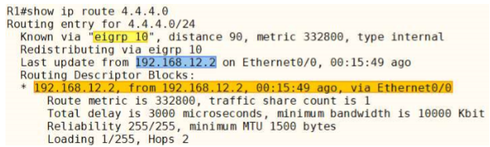

- **현재 FD 값이 가장 best인 정보만 Routing table에 등록되어 있음**
- Unequal cost load balancing을 하기 위해선 feasible successor의 경로를 Routing table에 등록해야 함
- Feasible successor를 등록하기 위해선 FD 값을 Feasible successor가 가지는 metric 값보다 크게 하기 위해 variance 값을 이용 (실제 Routing table에 등록되는 값이 아닌 비교를 위한 값)

```
R1(config)# router eigrp 10

R1(config-router)# variance 2

# R1의 FD값
P  4.4.4.0/24 1 successors, FD is 332800 via 192.168.12.2 (332800/307200), Ethernet0/0
# variance으로 FD값 변경   332800 x 2 = 665600

# R3 경로의 metric 값
P  4.4.4.0/24, 1 successors, FD is 332800 via 192.168.13.2 (345600/320000), Ethernet0/1
# R1의 variance로 변경된 값 665600 --> 345600
```

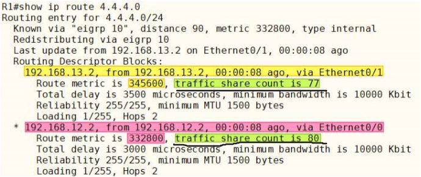

- R1 Routing table을 보면 R1에서 R2, R3 쪽으로 unequal cost load balancing을 함
- traffic share count는 77:80의 비율로 Load balancing
- Unequal cost load balancing은 Loop 방지를 위해 **Feasible successor가 존재해야만 작동**


EIGRP redistribute
---

- EIGRP 재분배 명령어
  ```
  (config-router)# redistribute protocol [process-id] [AS-number] metric [metric-value] tag [tag-value]
  ```

- Static 재분배
  ```
  (config-router)# redistribute static
  ```

- RIP 재분배
  ```
  (config-router)# redistribute rip metric 10000 100 255 1 1500

  # 대역폭 10Mbps(10,000kbps), Delay 100ms, REL 255, LOAD 1, MTU 1500
  # 위 값은 임의의 값을 사용해도 되나 Routing 정책이 있다면 정책에 지정된 값을 사용
  # 없을 경우 RIP와 연결된 실제 Interface의 BW, DELAY 값을 사용하면 된다
  ```

- EIGRP 재분배
  ```
  (config-router)# redistribute eigrp 100 metric 10000 100 255 1 1500
  ```

- OSPF 재분배
  ```
  (config-router)# redistribute ospf 10 metric 10000 100 255 1 1500
  ```

- 재분배할 모든 Routing protocol에 동일한 Metric 일괄 적용
  ```
  (config-router)# default-metric 10000 100 255 1 1500
  # redistribute 명령어에 metric 값을 일일이 지정하지 않아도 됨
  ```


(예제)
---


1. **RIP Router의 IP 설정**   

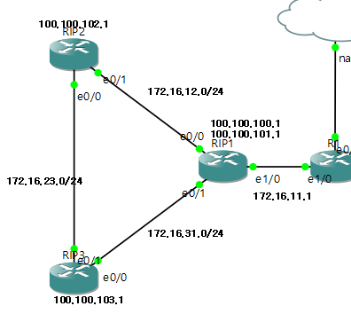

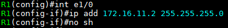

2. **RIP 설정**   
  
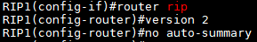   
  > RIP 1, 2, 3에 동일하게 설정

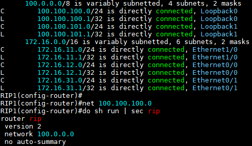

- RIP1 Routing table
- network 100.100.100.0 으로 선언하였지만 running-config엔 Classful 주소 형태인 100.0.0.0으로 저장 (lo 0, lo 1 IP를 포함)

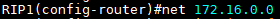

- 이러한 특성 때문에 e1/0, e0/0, e0/1 IP를 포함하는 Classful 주소 network 172.160.0.0 으로 입력 (축약)


3. **RIP passive-interface 설정**

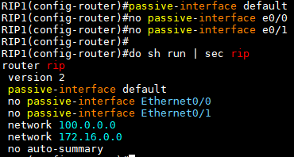
- RIP1 e1/0에만 passive-interface 설정 (RIP 신호를 보내는 것을 막기)

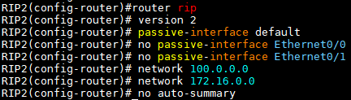
- RIP2 설정
- RIP3도 똑같이 설정

4. **Ping 확인**

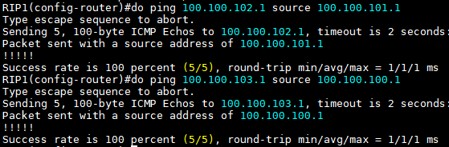

- RIP1 --> RIP2
- RIP1 --> RIP3 ping 확인


5. **외부 인터넷 연결 설정**

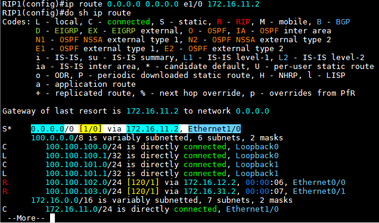
- 외부 인터넷 연결을 위한 default route

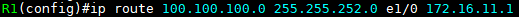
- R1 loopback interface 0, 1 의 Static Routing 설정
- 100.100.100.0/22 = 100.100.100~103.0/24 (축약)


- RIP2, RIP3엔 default routing이 걸려있지 않기 때문에   
  RIP1에서 **default routing을 RIP로 재분배**


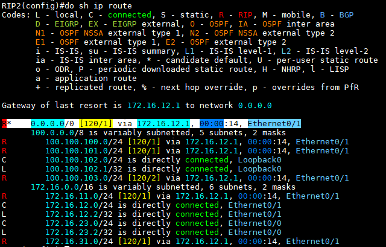

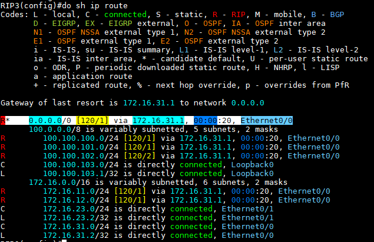

- RIP2, RIP3에서 default route 확인
- 만약 RIP2가 shutdown되면 RIP3를 RIP 알고리즘에 의해 RIP1으로 통신


6. **EIGRP Router IP 설정**

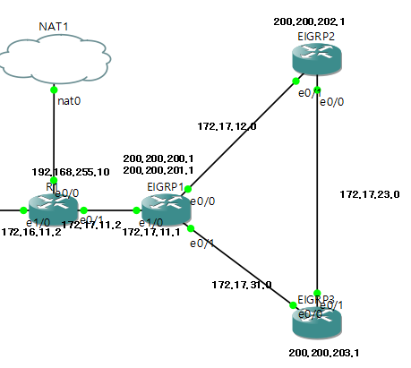

7. **EIGRP 설정**

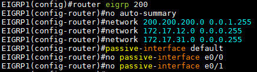   
- EIGRP1에서 eigrp 설정   

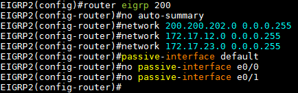   
- EIGRP2에서 eigrp 설정   

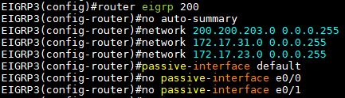   
- EIGRP3에서 eigrp 설정   


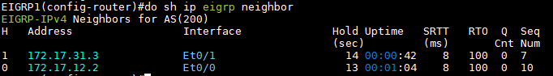
- EIGRP1 neighbor 확인

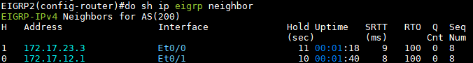
- EIGRP2 neighbor 확인

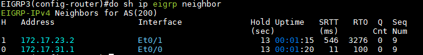
- EIGRP3 neighbor 확인


8. **외부 인터넷 설정**

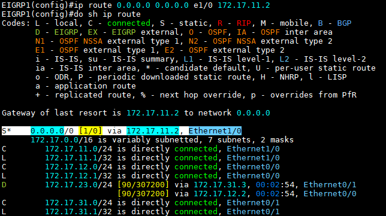   
- EIGRP1에서 default routing 설정(Static)

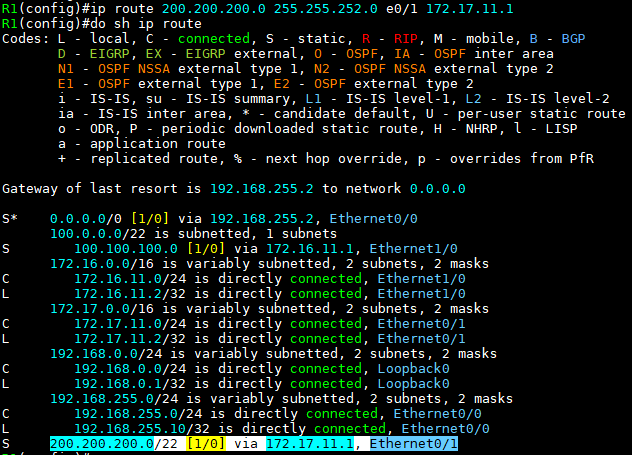   
- R1에서 EIGRP1, EIGRP2, EIGRP3의 loopback interface로 default routing(Static) 설정
- 200.200.200.0/22 = 200.200.200~203.0/24
  ```
  S*    0.0.0.0/0 [1/0] via 192.168.255.2, Ethernet0/0 에서

  # 192.168.255.2는 NAT1 gateway
  ```

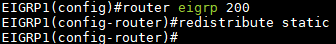
- Static 설정되어 있는 EIGRP1의 default route를 EIGRP로 재분배

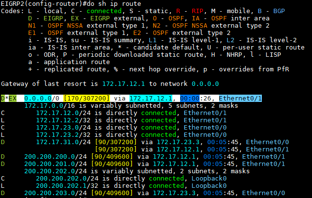
- EIGRP2 Routing table
- 재분배로 인한 default route 확인

9. **Ping 확인**

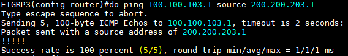
- EIGRP3 --> RIP3 ping 확인


10. **다른 방법으로 재분배**

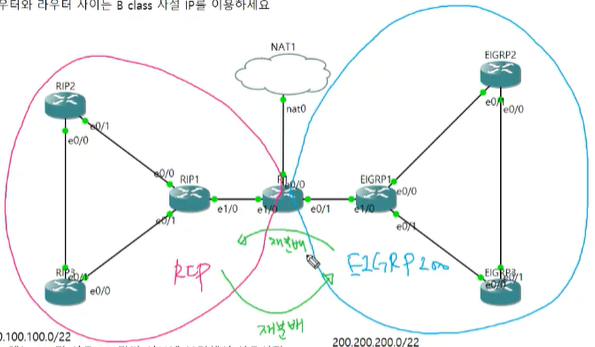
- R1에서의 Static route 방법이 아닌 R1에서 바로 재분배
- R1에서 RIP, EIGRP 두 Routing Protocol 작동


11. **R1에서 RIP, EIGRP 설정**

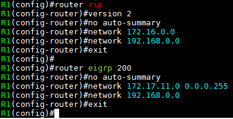

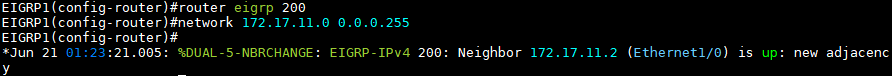
- EIGRP1에서 network 선언

12. **R1 Routing table**

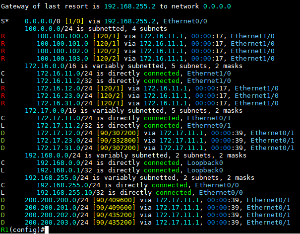
- R : RIP
- D : EIGRP

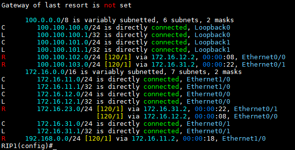
- 그런데 RIP1 Routing table을 보면 EIGRP Router 쪽의 route 정보가 없음 ---> RIP<->EIGRP 재분배 필요

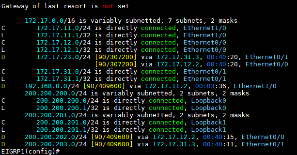
- 마찬가지로 EIGRP1의 Routing table을 보면 RIP Router쪽의 route 정보가 없음

---> 그러나 재분배를 하면 각 Dynamic Routing protocol의 **Metric 계산 방식이 다름** **---> 관리자가 임의의 Metric 값을 지정**


13. **재분배(redistribute)**

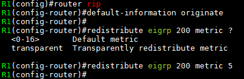
- R1에서 RIP --> EIGRP 재분배 

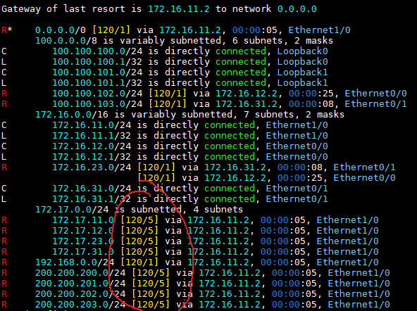
- RIP1 Routing table
- 설정한 metric 값으로 route 정보 확인

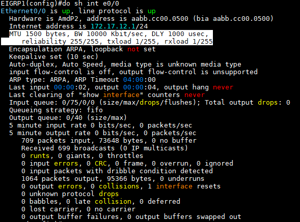
- EGIRP1의 int e0/0 정보를 보고 아래 재분배 설정할 때 metric 값으로 입력

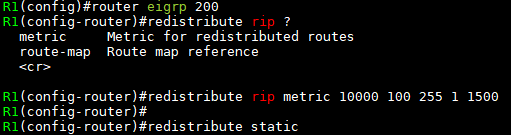
- R1에서 EIGRP --> RIP 재분배
- BW, DLY, Reliability, LOAD, MTU
- EIGRP에서 재분배를 할 때 DLY * 10 ---> DLY = 100

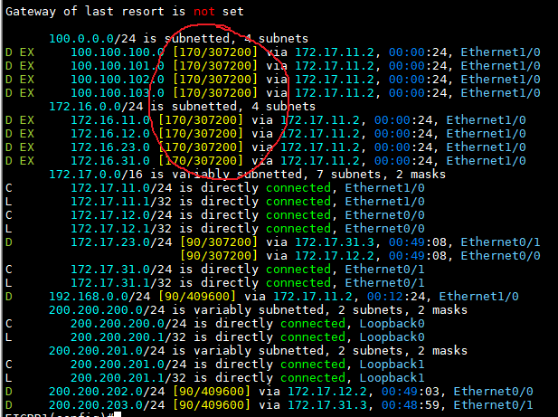
- EIGRP Routing table
- 설정한 metric 값 확인

14. **Ping 확인**

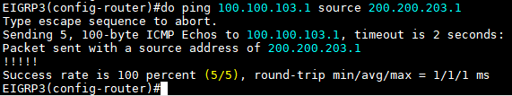
- EIGRP3 --> RIP3 ping 정상 확인


15. **NAT 설정**

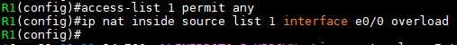

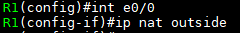

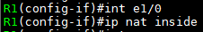

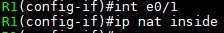

- R1 NAT 설정

```
# show ip nat translations               ---> NAT table 확인
```