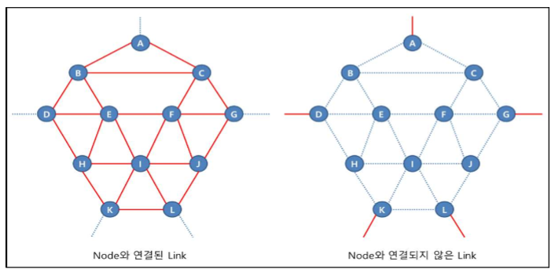
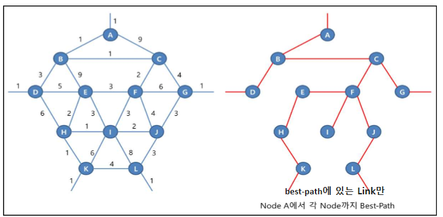
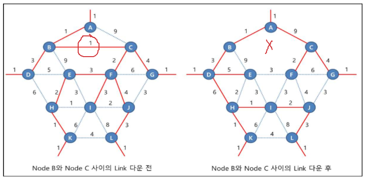

OSPF, Link-state, Area
===

OSPF 특징
---

### 빠른 수렴 (Fast convergence)

- Link-state Protocol의 가장 큰 장점
- Routing Update 정보 (LSA: Link State ADvertisement)를 Local DB(LSDB)에 복사한 후 바로 다른 neighbor로 전달

- 대규모 네트워크에서도 변화를 빨리 감지하고 Routing 정보에 대해 빠르게 변화에 적용
- 많은 LSA 전달이 가능하여 규모가 큰 네트워크에서도 정보 손실 없이 Routing 정보 전달

### 계층적 영역 구조 (Area)
- area 단위로 Routing 정보의 관리
- OSPF의 영역은 **backbone 역할을 수행하는 Area 0**와 일반 area로 구성되는 계층적 구조

- 계층적 구조는 모든 Routing 정보 교환이 **backbone** 중심으로 이루어짐
- Link-State Protocol의 단점인 자원 사용량을 보완하기 위해 네트워크를 area 단위로 나눠 작은 네트워크 단위로 관리
- 모든 area가 동시에 상호 간에 Routing 정보를 주고 받을 경우 복잡한 구조를 띈다.   
  이를 간편하게 수행하기 위해 backbone area가 모든 area의 정보를 수집하여 분배하는 방식으로 동작

### 완전한 VLSM과 Classless Routing 지원
- OSPF Update packet에 Subnet_mask를 표현하는 필드가 있다
- 따라서, 완전한 형태의 Classless 지원

- RIP는 VLSM만 지원, EIGRP와 OSPF는 CIDR과 VLSM을 지원

### 완전한 Topology 정보
> 같은 area일 때만

- OSPF Router는 자신의 Local Link 정보를 상호 교환 시 다른 Router들의 Link 정보를 LSDB에 저장하여 관리

- DB는 네트워크 topology를 표현하는 정보이고 DB를 가진다는 것은 네트워크의 완전한 topology 정보를 가진다는 것이다.

- 이러한 이유 때문에 Link 장애 등으로 인한 Topology 변화에 빠른 대처를 할 수 있는 Fault Tolerant 강화

- 그러나 단점은 자원 소모가 심하고 같은 area에선 IP 축약을 지원하지 않음

### Routing Loop가 없음 (Loop Free)
> 같은 area일 때만

- Distance-vector Protocol은 Routing update를 전적으로 Routing table에 의존하기 때문에  Routing Loop가 발생할 수 있다

- OSPF는 다른 Router로부터 Link 정보를 수신하고 이를 통해 DB를 구축한 후 독자적으로 생성한 Routing table을 생성하여 사용하기 때문에 Routing Loop가 발생하지 않음

### 인증 지원
- OSPF는 Routing Update를 할 때 사용되는 인증을 지원

- 비밀번호 설정으로 neighbor 관계를 맺는 것을 제한

### 외부 Routing 정보의 route tag 지원
- 관리해야 하는 네트워크 정보의 수가 많아지면 관리자가 개별 네트워크마다 일일이 정책을 적용하지 않고 tag를 이용하여 일괄적으로 Routing 정책을 적용할 수 있음

Node, Link, Network
---

### Node
- 출발지와 목적지 사이에 있는 장비

- 즉, Node란 출발지와 목적지 사이에 데이터가 거쳐가는 지점
- packet이 목적지까지 전달될 때 best-path 상에 있는 Router나 L3 Switch가 해당 packet의 Node

### Link
- L1과 L2 (물리적)
- Node가 가지고 있는 Line
- Node와 Node 사이를 연결

- Link는 Node와 연결된 Link와 어떤 Node와도 연결되지 않은 Link로 구분

### Network
- IP를 입력한 Link ---> L3(논리적)
- Node가 가지고 있는 Information

- Node를 연결하기 위한 네트워크 ---> down ---> Link도 함께 변경
- Node를 연결하지 않은 네트워크 ---> down ---> Link 변경 없이 Network만 변경

### 즉, Link-state Routing Protocol은 Link가 변경되면 알고리즘을 작동시켜 새로운 Link 경로를 찾는 Protocol
- Network가 down되면 Link의 변경은 일어나지 않기 때문에 해당 Network만 삭제
- Link-state Routing Protocol은 **Best-path 상에 있는 Link 정보에 문제가 발생했을 때만 알고리즘을 작동**   
  Best-path가 아닌 Link는 네트워크 정보로 등록

  - OSPF는 Link와 Network를 구분하지 않아 어떤 Link 정보든 down되면 Link로 인식하여 각 장비들이 Routing protocol 알고리즘을 작동하는 문제가 발생 ---> **Area 단위로 구분**

#### [OSPFv2와 IS-IS 차이점]
- OSPFv2 Routing protocol은 **Link와 Network를 구분하지 못함**

- 반면 IS-IS는 Link와 Network를 구분함
- Link와 Network를 구분하는 것은 Link-state Routing protocol의 장점
- OSPFv2는 이 장점을 활용하지 못해 많은 memory와 CPU를 사용
- OSPFv3에서는 Link와 Network를 구분함

- A node를 기준으로 임의의 metric 값을 주고 SPF 계산
- SPF (Shortest Path First) : 경로의 metric 값을 계산하여 가장 빠른 최단 경로를 찾는다

- Best-path 경로 상에 있는 B와 C node 사이의 Link가 down 되었다면 Best-path를 재계산 (Full SPF Computation, Complete SPF Computation)   
  이러한 이유로 장비의 자원을 많이 소모

- 이때 단순히 몇 개의 Node만 변경되는 것이 아니라 Node B와 C 아래에 있는 모든 Node에 영향을 미침

- Node F와 G 사이의 Link처럼 Basic Topology 상에 있지 않은 node와 연결되지 않은 Link 정보가 변경되는 경우 어떠한 node에 대해서도 Best-path에 영향을 주지 않음   
  그런 경우, Basic topology(best-path 상에 있는 Link들) 는 변경되지 않지만 해당 Link가 가지고 있던 Network 정보는 변경됨

- 이럴 경우 전체 Topology를 다시 그리지 않고 변경된 Network 정보에 대해서만 Best-path를 계산 ---> **Incremental SPF**

- Network 정보만 변경되었을 경우 SPF 알고리즘을 수행하지 않고 다른 장비가 변경된 Network 정보를 가지고 있는지 검색만 수행 ---> **Partial SPF**