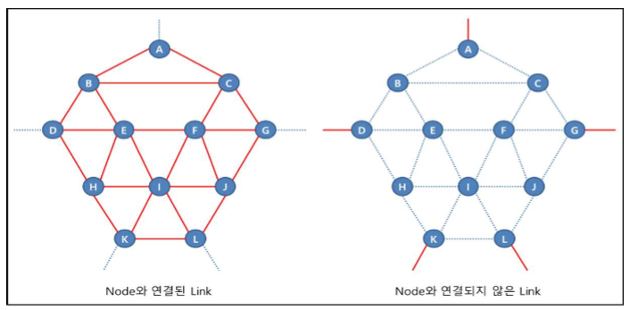
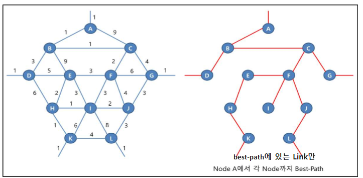
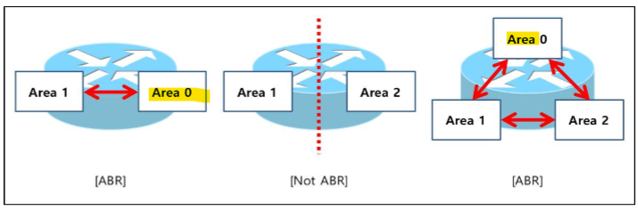

OSPF, Link-state, Area
===

OSPF 특징
---

### 빠른 수렴 (Fast convergence)

- Link-state Protocol의 가장 큰 장점
- Routing Update 정보 (LSA: Link State ADvertisement)를 Local DB(LSDB)에 복사한 후 바로 다른 neighbor로 전달

- 대규모 네트워크에서도 변화를 빨리 감지하고 Routing 정보에 대해 빠르게 변화에 적용
- 많은 LSA 전달이 가능하여 규모가 큰 네트워크에서도 정보 손실 없이 Routing 정보 전달

### 계층적 영역 구조 (Area)
- area 단위로 Routing 정보의 관리
- OSPF의 영역은 **backbone 역할을 수행하는 Area 0**와 일반 area로 구성되는 계층적 구조

- 계층적 구조는 모든 Routing 정보 교환이 **backbone** 중심으로 이루어짐
- Link-State Protocol의 단점인 자원 사용량을 보완하기 위해 네트워크를 area 단위로 나눠 작은 네트워크 단위로 관리
- 모든 area가 동시에 상호 간에 Routing 정보를 주고 받을 경우 복잡한 구조를 띈다.   
  이를 간편하게 수행하기 위해 backbone area가 모든 area의 정보를 수집하여 분배하는 방식으로 동작

### 완전한 VLSM과 Classless Routing 지원
- OSPF Update packet에 Subnet_mask를 표현하는 필드가 있다
- 따라서, 완전한 형태의 Classless 지원

- RIP는 VLSM만 지원, EIGRP와 OSPF는 CIDR과 VLSM을 지원

### 완전한 Topology 정보
> 같은 area일 때만

- OSPF Router는 자신의 Local Link 정보를 상호 교환 시 다른 Router들의 Link 정보를 LSDB에 저장하여 관리

- DB는 네트워크 topology를 표현하는 정보이고 DB를 가진다는 것은 네트워크의 완전한 topology 정보를 가진다는 것이다.

- 이러한 이유 때문에 Link 장애 등으로 인한 Topology 변화에 빠른 대처를 할 수 있는 Fault Tolerant 강화

- 그러나 단점은 자원 소모가 심하고 같은 area에선 IP 축약을 지원하지 않음

### Routing Loop가 없음 (Loop Free)
> 같은 area일 때만

- Distance-vector Protocol은 Routing update를 전적으로 Routing table에 의존하기 때문에  Routing Loop가 발생할 수 있다

- OSPF는 다른 Router로부터 Link 정보를 수신하고 이를 통해 DB를 구축한 후 독자적으로 생성한 Routing table을 생성하여 사용하기 때문에 Routing Loop가 발생하지 않음

### 인증 지원
- OSPF는 Routing Update를 할 때 사용되는 인증을 지원

- 비밀번호 설정으로 neighbor 관계를 맺는 것을 제한

### 외부 Routing 정보의 route tag 지원
- 관리해야 하는 네트워크 정보의 수가 많아지면 관리자가 개별 네트워크마다 일일이 정책을 적용하지 않고 tag를 이용하여 일괄적으로 Routing 정책을 적용할 수 있음

Node, Link, Network
---

### Node
- 출발지와 목적지 사이에 있는 장비

- 즉, Node란 출발지와 목적지 사이에 데이터가 거쳐가는 지점
- packet이 목적지까지 전달될 때 best-path 상에 있는 Router나 L3 Switch가 해당 packet의 Node

### Link
- L1과 L2 (물리적)
- Node가 가지고 있는 Line
- Node와 Node 사이를 연결

- Link는 Node와 연결된 Link와 어떤 Node와도 연결되지 않은 Link로 구분

### Network
- IP를 입력한 Link ---> L3(논리적)
- Node가 가지고 있는 Information

- Node를 연결하기 위한 네트워크 ---> down ---> Link도 함께 변경
- Node를 연결하지 않은 네트워크 ---> down ---> Link 변경 없이 Network만 변경

### 즉, Link-state Routing Protocol은 Link가 변경되면 알고리즘을 작동시켜 새로운 Link 경로를 찾는 Protocol
- Network가 down되면 Link의 변경은 일어나지 않기 때문에 해당 Network만 삭제
- Link-state Routing Protocol은 **Best-path 상에 있는 Link 정보에 문제가 발생했을 때만 알고리즘을 작동**   
  Best-path가 아닌 Link는 네트워크 정보로 등록

  - OSPF는 Link와 Network를 구분하지 않아 어떤 Link 정보든 down되면 Link로 인식하여 각 장비들이 Routing protocol 알고리즘을 작동하는 문제가 발생 ---> **Area 단위로 구분**

#### [OSPFv2와 IS-IS 차이점]
- OSPFv2 Routing protocol은 **Link와 Network를 구분하지 못함**

- 반면 IS-IS는 Link와 Network를 구분함
- Link와 Network를 구분하는 것은 Link-state Routing protocol의 장점
- OSPFv2는 이 장점을 활용하지 못해 많은 memory와 CPU를 사용
- OSPFv3에서는 Link와 Network를 구분함

### \<Link\>

- A node를 기준으로 임의의 metric 값을 주고 SPF 계산
- SPF (Shortest Path First) : 경로의 metric 값을 계산하여 가장 빠른 최단 경로를 찾는다

- Best-path 경로 상에 있는 B와 C node 사이의 Link가 down 되었다면 Best-path를 재계산 (Full SPF Computation, Complete SPF Computation)   
  이러한 이유로 장비의 자원을 많이 소모

- 이때 단순히 몇 개의 Node만 변경되는 것이 아니라 Node B와 C 아래에 있는 모든 Node에 영향을 미침

- Node F와 G 사이의 Link처럼 Basic Topology 상에 있지 않은 node와 연결되지 않은 Link 정보가 변경되는 경우 어떠한 node에 대해서도 Best-path에 영향을 주지 않음   
  그런 경우, Basic topology(best-path 상에 있는 Link들) 는 변경되지 않지만 해당 Link가 가지고 있던 Network 정보는 변경됨

- 이럴 경우 전체 Topology를 다시 그리지 않고 변경된 Network 정보에 대해서만 Best-path를 계산 ---> **Incremental SPF**

- Network 정보만 변경되었을 경우 SPF 알고리즘을 수행하지 않고 다른 장비가 변경된 Network 정보를 가지고 있는지 검색만 수행 ---> **Partial SPF**

| **Link 종류** | **설명** |   
| --- | --- |   
| Best-path 상에 있는 Link | 'Basic Topology'를 구성하는 Link로 Link 정보가 변경되었을 경우,   전체 topology를 새롭게 구성하고 **Complete SPF Computation**을 수행 |   
| Best-path 상에 없는 Link | Topology를 새롭게 구성하지 않고, 변경된 네트워크 정보에 대한 **Incremental SPF**를 수행   (SPF 알고리즘은 default로 동작하지 않으며 수동으로 enable 해야 한다) |   
| Network 정보 변경 | Topology를 새롭게 구성하지 않고 변경된 Network 정보에 대한 **Partial SPF**를 수행 |

- OSPF는 상위 표와 같이 Link와 Network를 구분하지 않기 때문에 어떠한 Link 정보가 변경되더라도 **Complete SPF Computation**이 수행됨

- 즉, Topology에 아무런 영향을 주지 않는 특정 장비의 Loopback Interface가 down되거나 생성되더라도 전체 Topology를 새롭게 그리고 모든 네트워크에 대해서 Best-path를 계산해 다른 Routing protocol보다 많은 memory와 CPU 사용함에 문제 발생 
- 위와 같은 문제를 해결하기 위해 **area 단위로 Update**

### \<Network\>

- A Topology : Link와 Network를 구분하지 않은 topology

- B Topology : Link와 Network를 구분한 topology
  - Link-state Routing protocol 방식

- Link-State Routing protocol은 Update 내용을 **Link 정보와 Network 정보로 구분**

- R1, R2, R3의 Update 내용을 간단히 정리하면 아래표와 같음 (실제로 정보가 더 있음)

|**장비**|**Link update 정보**|**Network update 정보**|
|:---:|---|---|
|R1|R2와 metric 5로 연결되어 있음|1.1.1.1/32를 metric 1로 가지고 있음   10.10.12.0/24를 metric 5로 가지고 있음|
|R2|R1과 metric 5로 연결되어 있음   R3와 metric 5로 연결되어 있음|2.2.2.2/32를 metric 1로 가지고 있음   10.10.12.0/24를 metric 5로 가지고 있음   10.10.23.0/24를 metric 5로 가지고 있음|
|R3|R2와 metric 5로 연결되어 있음|3.3.3.3/32를 metric 1로 가지고 있음   10.10.23.0/24를 metric 5로 가지고 있음|

- 각자 가지고 있는 Link 정보와 Network 정보를 전체 망으로 Update하면 R1, R2, R3는 각각의 장비가 보낸 Update 정보를 DB에 저장 후 **Link 정보를 기반으로 Topology를 그림**

OSPF Database 동기화(교환) 명칭 (Link 정보 DB)
---

- **LS** : Link state

- **LSA** : Link State Advertisement (Link 상태 상세 정보)
  - Routing 경로가 Link 정보를 교환해서 사용 ---> OSPF의 Routing 계산 시 최소 단위

- **DBD** : DataBase Description (간략하게 나온 Link 상태 정보)
  1. neighbor를 맺으면 LSA를 무조건 보내주는 것이 아닌 자신이 가진 LSA 정보를 간략하게 정리해서 이웃 Router에게 전달
  2. DBD를 받은 Router는 정리된 DB 정보에서 자신에게 없는 LSA 정보를 확인 후 해당 LSA 정보를 상세하게 보내달라고 다시 요청
  3. 요청을 받은 Router는 해당 LSA(상세 정보)를 보냄

- **LSR** : Link State Request (Link 상태의 상세 정보를 요청)
- **LSU** : Link State Update

OSPF Area의 필요성
---

- OSPF Routing protocol은 Basic Topology를 구성하지 않는 Link에 변화가 발생해도 모든 장비가 **Complete SPF Computation**을 수행

- OSPF 문제점
  1. 각각의 Router가 가지고 있는 모든 Link 정보를 OSPF DB에 저장하기 때문에 네트워크 망이 커질수록 OSPF DB 크기가 증가하여 모든 장비의 메모리 사용량 증가
  2. 어떠한 Link 정보가 변경되더라도 Complete SPF Computation을 수행하기 때문에 Link의 수가 많아지면 Link 정보의 변경 횟수가 많아져서 모든 장비의 CPU 사용량 증가
  3. OSPF는 모든 장비의 DB를 동기화해야 하기 때문에 네트워크 정보를 **Filtering 하거나 Summary 할 수 없음**.   
   그래서 Link 정보의 변화가 발생할 때마다 Update 정보를 전체 네트워크로 전달해야 하는데, Update packet에 의해 전체 네트워크 회선의 자원을 사용하게 됨

Area
---

- Area는 하나의 OSPF 네트워크 망을 여러 개의 작은 영역으로 구분하여 OSPF DB를 동기화하는 장비들의 범위를 나눔

- Area를 구분함으로써 OSPF Routing protocol이 SPF 알고리즘 수행에 따른 CPU 사용량을 낮출 수 있으며   
  DB에서 다른 Area의 Link 정보를 삭제하여 메모리 사용량을 줄일 수 있음

- Area 간에 DB를 교환하면서 동기화를 할 필요가 없기 때문에 네트워크 Filtering, Summary가 가능 (Update 양을 줄일 수도 있음)

### Link-State Routing protocol의 문제점
- 하나의 Site 내에서 Link-State Routing protocol은 SPF 알고리즘을 통해 Best-path를 선출하면 되는데,   
  여러 Site에서 네트워크를 하나로 연결할 때는 어떻게 Best-path를 선출?

     
  > Loop 발생할 수 있음

- 문제 해결을 위해 Area 간에 Topology를 구성한 후 Best-path를 선출하는 장비를 별도로 두어 구성

- Area 간에 Best-path를 선출하는 장비를 **'Backbone 장비'**, Backbone 장비 간에 연결된 망을 **'Backbone'**

- OSPF Routing protocol은 **Backbone** (Inter Area), **non-Backbone** (Intra Area) 영역
- 서로 다른 Area끼리가 아닌 **Area 내부에서 SPF 알고리즘을 수행하는 기능**만으로 네트워크 전체에 대해 Best-path를 선출 ---> Backbone area는 **area 0** 을 뜻함, 나머지는 non-Backbone area

Area의 종류
---

|구분|설명|
|:---:|---|
|Backbone Area|* **Area 0이 Backbone Area로 동작**하며 non-Backbone Area 간에 네트워크 정보를 전달   * Non-Backbone Area끼리 통신하기 위해선 **반드시 Backbone Area를 통해서** packet을 전달 ---> 'Transit Area' 라고도 함   * 단일 Link-State Routing protocol은 **단 하나의 Backbone area**만을 갖는다.|
|non-Backbone Area|* Area 0을 제외한 다른 Area를 전부 non-Backbone area라고 하며 반드시 Area 0에 연결되어 있어야 한다.   * Backbone Area와 연결된 ABR을 통해서만 다른 Area와 DB를 교환할 수 있음|

|구분|설명|
|:---:|---|
|Stub Area|* OSPF 정보(Internal)만 가질 수 있으며, 어떠한 경우에도 다른 Routing protocol에서 OSPF DB로 유입된 정보(External)는 가질 수 없음   *대신 **Area 0을 통해 default-route를 받을 수 있음**|
|NSSA(Not-So-Stubby Area)|* Area 0을 통해서 OSPF 정보만 받을 수 있음   * Area 내에서 다른 Routing protocol이 함께 작동되고 있는 경우, 해당 Routing protocol 정보를 **OSPF DB로 가지고 와서 다른 area 0으로 전달할 수 있음**|
|Totally Stub Area(Not Standard)|* 다른 Area 정보(Inter Area)와 다른 Routing protocol에서 OSPF DB로 유입된 정보(External)를 모두 가질 수 없다   * 대신 Area 0을 통해 Default-route를 받을 수 있음|

Area 특징 (Distance vector 특징)
---

- OSPF는 Area 내에서만 Link-State Routing Protocol로 작동
  - Area 간에 SPF 알고리즘을 작동시키기 위한 DB가 존재하지 않음
  - Area 내에서는 Link-State Routing protocol이지만 다른 Area와는 Distance-Vector로 작동

- OSPF는 Link-State Routing protocol이기 때문에 아래와 같은 제약이 있음
  - Area 간에 Routing Loop를 차단하기 위해 Area 간에 Hub and Spoke 구조를 구성
  - Area 0 (Backbone area)만이 다른 Area 정보를 다른 Area의 DB로 전달할 수 있음
  - Intra Area 정보가 Inter Area(외부) 정보보다 우선

- OSPF의 Distance Vector 특징으로 Area 간에 제약 규칙을 정리
  - **규칙 1** : ABR은 Area 0과 반드시 연결되어 있어야 하고, Area 0이 연결되어 있는 경우만 Area 간 DB를 교환
  - **규칙 2** : Area 내부 네트워크 정보와 다른 Area에서 Update된 네트워크 정보가 동일한 경우 Area 내부 네트워크 정보를 우선
  - **규칙 3** : 다른 Area에서 Update된 정보는 Area 0 DB만 다른 Area DB로 전달

### 규칙 1

   
> Hub and Spoke

   
> area 0과 연결되었을 때 Area 간에 DB 교환

   
> 하나의 OSPF이 작동하는 곳에선 2개의 Area 0을 가질 수 없음

### 규칙 2

- 규칙 1로 인해 만약 ABR이 down되거나 문제가 발생하면 다른 Area와 통신을 할 수 없는 문제가 발생한다

- ABR을 **이중화**로 구성하게 되는데 여기서 새로운 문제가 발생한다
- ABR을 통해서 Update를 보낸 정보가 다른 ABR을 통해서 내부로 다시 들어오는 경우가 발생할 수 있다
- 다른 Area에서 넘어온 정보와 Area 내부 네트워크 정보가 동일한 경우 **내부 Area 정보를 우선**하도록 한다
- 즉, Area 내부 네트워크 정보가 외부에서 다시 Area 내부로 유입된다 하더라도 문제 발생하지 않음.   
  이렇게 하기 위해선 각 네트워크 정보에 대해서 내부 Area 정보인지, 다른 Area에서 Update된 정보인지 구분할 필요가 있다
- 위와 같은 이유로 Type을 만들고 이 Type의 이름을 **LSA**(Link State Advertisement) type 라고 한다

### 규칙 3

- Area 0 : A 네트워크는 처음 들어온 정보로 Area 1에서 Update된 다른 area 네트워크 정보이다.   
          Area 3를 통해 다시 되돌아 온 Update 정보도 마찬가지로 다른 Area 네트워크 정보이다.   
          이런 경우 규칙 1과 규칙 2만을 가지고 Routing Loop를 막을 수 없음

- Area 1의 A 네트워크 정보를 Area 0은 Area 3으로 전달할 수 있지만, Area 3 DB에 다른 Area 정보도 존재하기 때문에 Area 0 DB로는 전달하지 못하게 한다 (즉, 오로지 다른 Area로 전달만 한다)

실제 적용 연습
---

- 서로 다른 Area를 연결해도 DB 교환을 하지 않는다.

> 위 Topology를 예로 들면

(R1 OSPF 설정)   

> area 1 으로 설정

   
> R2 OSPF area 1로 설정한 후 neighbor 관계 확인

