Router Filtering, SPF, packet header
===

Routing Filtering
---

- Routing에서 특정 경로를 독립적으로 사용

- 또한 불필요한 Routing 정보를 차단하여 Routing 정보의 Update 크기를 줄이기 위한 목적
- Routing filtering은 Distance-vector Routing protocol을 자유롭게 사용할 수 있으나 Link-State Routing protocol은 ABR에서만 사용 가능
- **Filtering 정책** : 네트워크 적용 범위는 Access-list 혹은 prefix-list를 사용   
  정책 적용 시 distribute-list 혹은 route-map 사용

### 1. Standard access-list   
```
(config)# access-list [ACL No 1~99, 1300~1999] [permit / deny] [출발지 IP] [와일드카드 마스크]
```

- Access-list를 작성하면 기본적으로 모두 deny를 하는 정책이 제일 마지막에 존재

- 여러 정책을 하나의 ACL Number로 만들어서 적용
- 대부분 ACL 정책을 적용할 때 ACL Number를 사용하며 ACL number는 덮어쓰기 형태로 설정한다


#### 예시   

(Topology)   
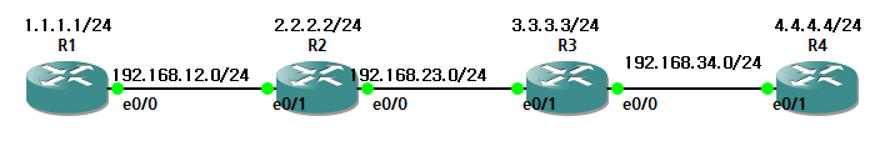

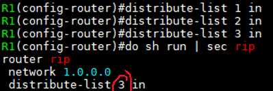

(여러 정책을 하나의 ACL Number로 지정 후 정책 적용)   
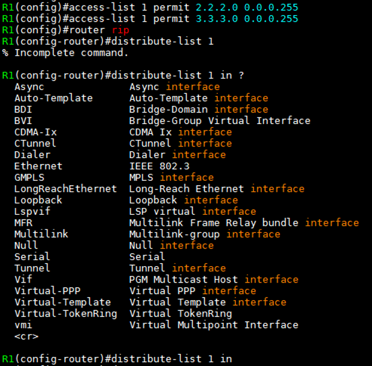

(R1 Routing table)   
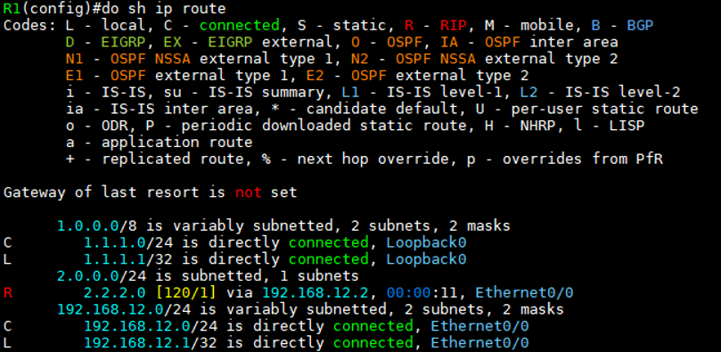
> 정책 설정한 IP를 제외한 나머지 IP는 deny 상태   


(R2 정책 설정)   
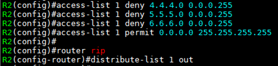

> R2에서 정책을 ACL 1로 만든 후 Filtering 설정


(R1 Routing table)   
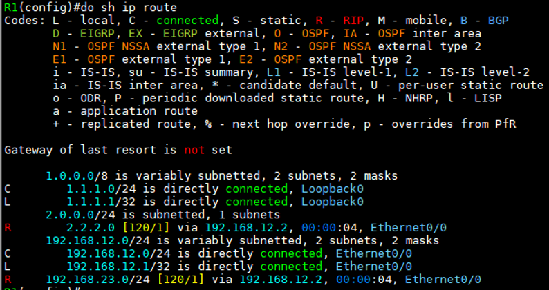   

> 정책에 해당하지 않는 1.1.1.0, 2.2.2.0 네트워크 IP만 확인

(R2)   
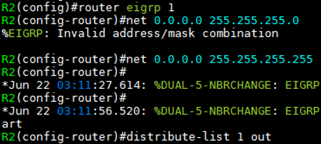
> ACL 1은 위에서 설정한 정책 그대로 유지   
>
> R2에 filtering 적용


(R1 Routing table)   
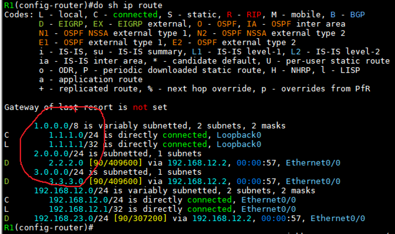   
> R2에 적용한 정책에 따라 들어온 route 정보 적용

### 2. router [Protocol]에서 ACL로 작성된 정책 적용   

```
(config-router)# distribute-list [ACL No] [in / out] [Routing protocol] [Interface ID]
```

- Routing protocol과 Interface ID를 입력하지 않으면 해당 Router의 모든 Interface 적용

### 3. OSPF의 distrubute-list 는

- OSPF의 distribute-list (Inbound Router Filter)는 해당 네트워크 정보를 Routing table에 등록하지 않는다는 뜻이므로 in 으로만 사용하는 것이 좋다

- 만약 R1-R2-R3 OSPF topology에서 R2에 R1 네트워크 주소 대상의 Inbound Route Filter를 설정했다면 R2 routing table에선 해당 주소가 표시되지 않음

그러나 R3 routing table에선 해당 네트워크 주소가 등록되어 있다 ---> Filtering이 적용되지 않음   

**즉, OSPF filter는 해당 네트워크 정보를 Routing table에 등록시키지 않는다는 뜻**

- OSPF의 Route Filter는 area 0이 포함된 ABR에서 area 명령을 통해 Filtering   
  ```
  (config-router)# area [Filtering 대상의 네트워크가 포함된 area No] range [네트워크 IP] [Subnet_mask] not advertise
  ```

SPF Algorithm
---

**Shortest Path First**

- **Cost** 값을 기준으로 출발지에서 도착지까지 **가장 작은 값**을 가진 경로를 우선 선택하는 알고리즘 


(Topology)   
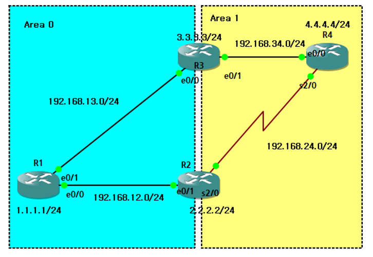

(R1 OSPF 설정)   
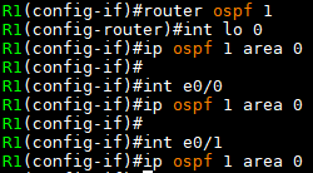

(R2 OSPF 설정)   
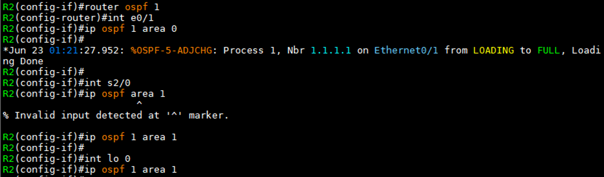

(R3 OSPF 설정)   
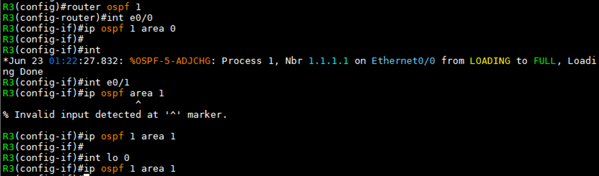

(R4 OSPF 설정)   
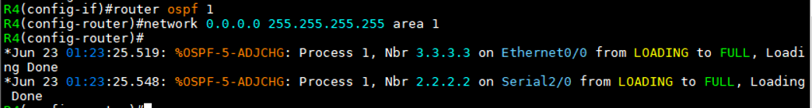

(각 회선 Cost 표시. BW에 의해)   
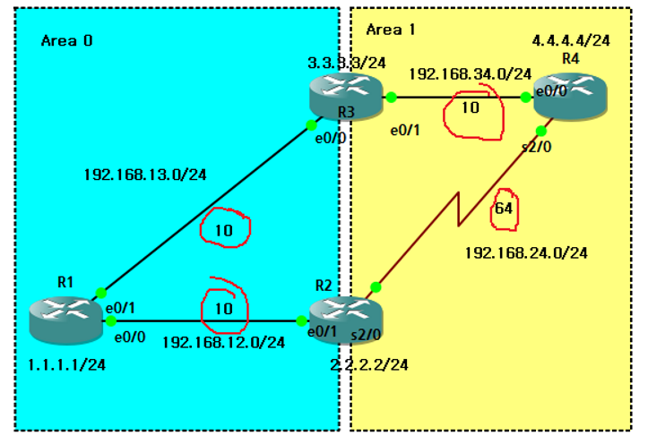

(R4 int s2/0)   
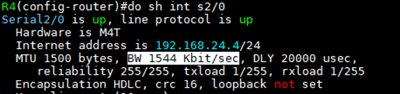

> R2--R4 회선은 BW 값에 의해 좀 더 높은 Cost 64

(R4 Routing table)   
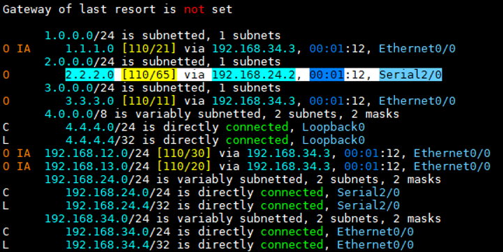

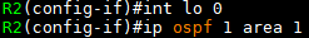
> 회선 Cost가 높아도 같은 area 정보를 높은 우선 순위로 두기 때문에 R2 loopback IP는 R4 s2/0 interface로 통신

(R2 area 변경)   
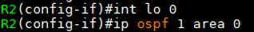
> R2의 Loopback 0을 area 1에서 0으로 변경

(R4 Routing table)   
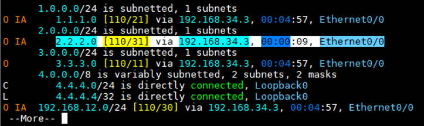

> R4 --> R2 Route 정보가 바뀜
> 
> 같은 area가 아니므로 Cost 값이 더 낮은 경로로 Route 등록


OSPF packet header
---

### Header 구조

|L2 Header|L3 Header|**OSPF Header**|OSPF Data|FCS|
|:---:|:---:|:---:|:---:|:---:|

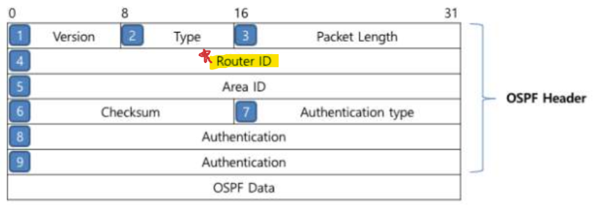


#### 1. Version
- OSPFv2, OSPFv3

#### 2. Type   

|Type 번호|Packet Type|
|:---:|:---:|
|1|Hello|
|2|DBD(Database Description)|
|3|LSR(Link-State Request)|
|4|LSU(Link-State Update)|
|5|LSAck(Link-State Acknowledgement)|


#### 3. Packet Length
- OSPF Header를 포함한 전체 OSPF Packet의 길이를 Bytes 단위로 표시

#### 4. Router ID
- OSPF packet을 보낸 Router의 Router-ID를 표시하는 영역
- **Router-ID**는 OSPF Routing protocol이 Best-path를 선출하기 위해 SPF Algorithm을 수행 시 Router의 이름으로 사용
- 32 bits의 IPv4 주소 형식 사용 (0.0.0.0 ~ 255.255.255.255)

#### 5. Area ID
- Packet을 전송하는 Interface가 어떤 area에 속하는 지에 대한 정보를 표시하는 영역
- Router-ID와 같이 32 bits 형식 (0.0.0.0 ~ 255.255.255.255)
- Area 0.0.0.0 (또는 Area 0)이 Backbone area

#### 6. Checksum
- Authentication 영역을 제외한 OSPF packet을 16-bit로 Checksum 한 값을 표시하는 영역
  > checksum : 중복 검사의 한 형태로 메시지 구성 요소를 추가해 결과값을 저장함으로써 동작. 만약 checksum이 맞아 떨어지지 않는다면 메시지가 손상되었다고 결론 내릴 수 있음
- 16-bit 단위로 OSPF packet이 나눠지지 않을 경우, 16-bit 단위로 계산될 수 있도록 뒷 부분을 0으로 padding하여 계산
- MD5로 인증하는 경우 Checksum을 수행하지 않음

#### 7. Authentication Type

|Type 번호|설명|
|:---:|:---:|
|0|No Authentication|
|1|Simple Password Authentication|
|2|MD5 Crypt Authentication|
|Others|Reserved IANA (현재 사용하지 않음)|

#### 8-9. Authentication
- Authentication을 시작하기 위한 추가 정보가 표시되는 영역으로 각 Authentication Type에 따라 내용은 아래와 같음

|Auth Type|사용 영역|설명|
|:---:|:---:|---|
|0|Authentication|Authentication 64 bit 영역을 모두 '0'으로 Padding|
|1|Authentication|Authentication 영역에 Password를 표시하며 Password는 64 bit를 초과할 수 없음|
|2|Auth Crypt Key ID|Authentication의 처음 8 bit로 MD5 Password의 Key ID를 표시하며 1 ~ 255 사이의 값을 가짐|
||Auth Crypt Data Length|MD5 Hash 값의 길이를 byte 단위로 표시하며, 현재는 128 bit MD5 기술을 사용하여 항상 '16'의 값을 갖음|
||Auth Crypt Sequence Number|Reply 공격을 차단하기 위한 Sequence Number가 표시되는 영역으로 4 byte 값으로 되어 있음|
||Auth Crypt Data|Key 값을 16 bytes로 만들어서 OSPF packet에 추가한 후, 128 bit MD5 Hash 기술을 이용하여 Hash된 값을 표시|

