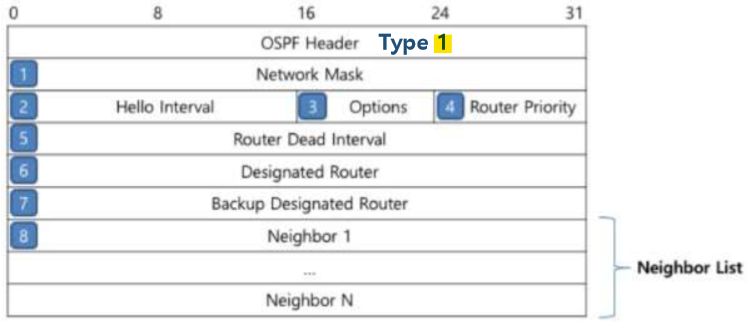
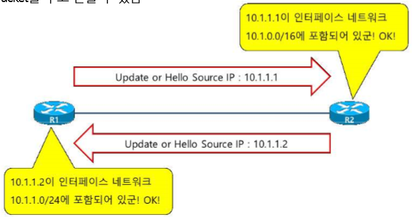
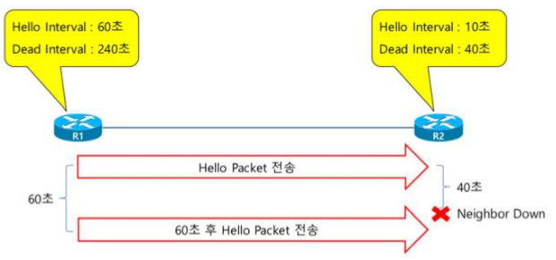
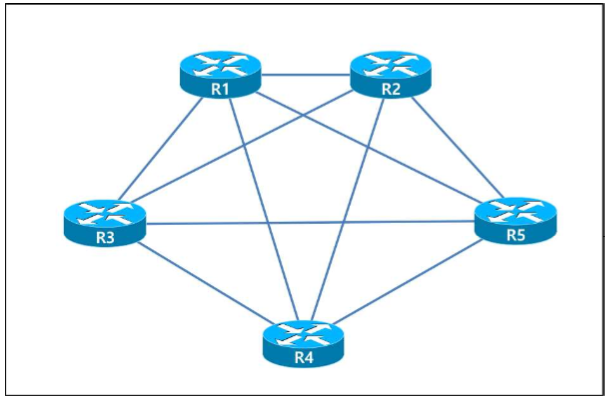
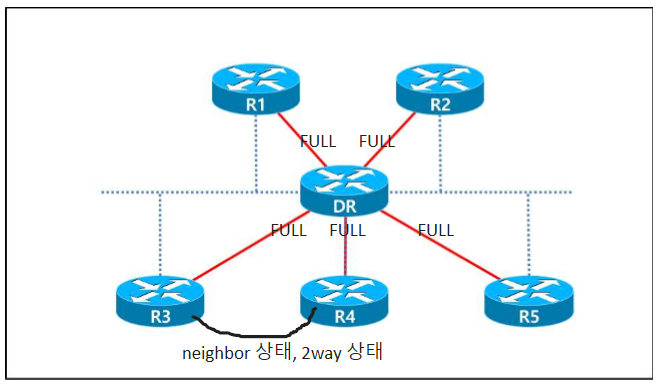
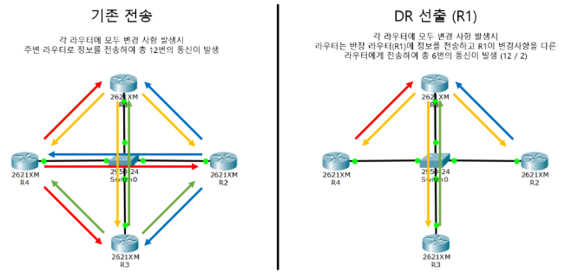
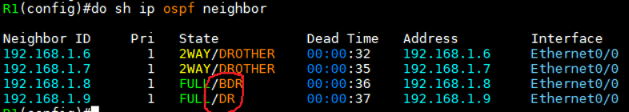
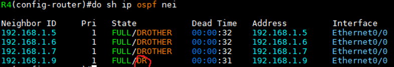
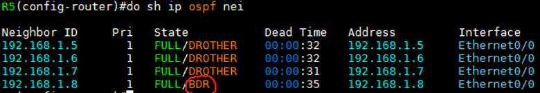

OSPF Packet
===

OSPF_Hello packet
---

- OSPF Routing protocol이 작동되는 Interface로 **Hello packet**을 주기적으로 전달하여 neighbor를 자동으로 선출하고,    
  Holdtime 동안 neighbor로부터 Hello packet을 받지 못한 경우 neighbor가 Down 상태로 되었다는 것을 자동으로 감지

### 1. Network mask
- 다른 Routing protocol은 상대방 neighbor의 Interface Subnet 정보를 알 수 없음

- RIP, EIGRP는 두 대의 장비 간에 Subnet 정보가 달라도 다른 조건 등이 맞으면 neighbor 관계가 성립되고 Update를 하는 데에 아무런 문제가 없음   
- 조건 : 상대방의 IP address가 Interface network에 포함
- OSPF도 point-to-point 환경에선 위의 조건만 만족하면 문제가 발생하지 않음
- Multi-Access 환경에선 상호 간에 **Subnet 정보가 반드시 일치하여야** neighbor 관계가 수립되어 Update packet을 주고 받을 수 있음

- 또한 MTU size도 확인하여 값이 서로 틀리면 neighbor 관계를 맺을 수 없음 **(DBD)**

### 2. Hello Interval, 5. Router Dead Interval

- OSPF Routing protocol이 Hello packet을 몇 초마다 한 번씩 주기적으로 전달할 것인지,    
  그리고 얼마나 Hello packet을 받지 못하면 neighbor가 down 상태가 되었다는 것을 인식할 것인지에 대한 시간 정보를 Hello packet을 통하여 전달하고 비교

- 이 정보가 반드시 동일해야 Neighbor 관계 수립
- 두 대의 장비 중 한 대의 Hello Interval이 다른 장비의 Dead Interval보다 크면 neighbor가 아무런 문제 없이 동작하고 있음에도 불구하고   
  Dead Interval 동안 Hello packet을 받지 못해서 Neighbor가 down 되었다고 인지

### 3. Options

|Option|설명|
|:---:|---|
|DN|MPLS L3 VPN에서 Routing Loop를 차단하기 위해 사용하며, MP-BGP에서 OSPF Routing protocol로 redistribute된 네트워크에 대하여 DN bit가 설정된다.   그리고, DN bit가 설정된 네트워크 정보는 MP-BGP로 redistribute가 되지 않도록 함으로써 MP-BGP로부터 넘어온 정보가 다시 MP-BGP로 넘어가지 않도록 하여 Routing Loop를 차단한다.|
|O|MPLS TE에서 사용되는 LSA Type 9, 10, 11을 Opaque LSA라고 하는데, Opaque LSA 기능을 가지고 있다는 의미로 사용된다.   DBD packet을 전달하면서 O bit를 사용하는데 O bit가 설정된 DBD는 Opaque LSA 기능이 존재하는 장비 간에만 교환된다.|
|DC|해당 Interface가 Demand Circuit 이라는 것을 의미한다.   Point-to-Point 환경이나 Point-to-Multipoint 환경에서 Interface를 Demand Circuit으로 설정하면 주기적으로 Hello packet을 전달하지 않고, 30분마다 한 번씩 전달되는 LSA refresh를 전달하지 않는다.   그리고, 해당 Interface를 통해 받은 LSA는 DNA(Do Not Aging) bit가 설정되어 Aging Time이 동작하지 않는다.|
|L|Hello packet과 DBD packet에서만 사용되며, LLS(Link-Local-Signaling) 정보가 데이터에 포함되어 있는지 여부를 알려주기 위해 사용된다.   존재하는 OSPF packet에 추가적인 확장 영역을 사용할 수 있도록 하여 OSPF Nonstop Forwarding (NSF) 기능 등 새로운 기술을 사용할 수 있도록 한다.|
|N/P|N bit - Hello packet에서만 사용되며 해당 Area가 NSSA(Not-So-Stub-Area)라는 것을 의미하며 해당 bit 정보가 동일해야 Neighbor가 될 수 있다.   P bit - LSA Type 7 NSSA-External-LSA Header에만 사용되며, NSSA ABR에게 해당 정보가 Type 7이나 Type 5로 변경하나는 것을 알려주기 위해 사용된다.|
|MC|MOSPF(Multicast OSPF)가 동작하는 장비라는 의미로 사용하기 위해 만들어졌으나, CISCO는 MOSPF를 지원하지 않기 떄문에 해당 bit를 사용하지 않는다.   타 제조사의 장비에 MOSPF가 동작하는 경우 CISCO 장비에서 '%OSPF-4-BADLSATYPE error message'가 나타날 수 있는데,   'ignore lsa mospf' 명령어를 통해 해결 가능|
|E|LSA Type 5(External LSA)를 전달하고 받을 수 있는 기능이 있는 지 여부를 표시할 때 사용되며,   Area를 Stub area로 구성하게 되면 E bit가 0으로 설정되어 External LSA 전달 기능이 없음을 neighbor에게 알려주어 External LSA가 전달되는 것을 차단한다.   해당 bit 정보가 동일해야 neighbor가 될 수 있다.|
|MT|과거에는 T bit로 사용되었으나 현재는 OSPF가 Multi-Topology 기능이 있는 지를 neighbor에게 알려주기 위해 사용된다.|

### 4. Router Priority, 6. Designated Router(DR), 7. Backup Designated Router(BDR)
> 중요한 개념 !!!

- Routing protocol은 SPF 알고리즘을 통해서 Best-path를 선출하게 되는데 SPF 알고리즘은 Tree 기반으로 최단거리를 계산하는 알고리즘

- Multi-Access 구조에선 Tree 구조를 만들기 쉽지 않음
- R1, R2, R3, R4, R5가 Multi-Access로 구성되어 있는 경우, 각 Router는 물리적으로는 Switch나 Hub를 이용해서 연결되어 있기 때문에 Hub & Spoke로 보일 수 있지만,   
  논리적으로 그림을 그리면 아래처럼 모든 Router가 직접 연결되어 있는 Full-Mesh 구조

> Tree 구조를 표현하기엔 너무 복잡한 구조가 되어 버림

##### 이 문제를 해결하기 위해 OSPF는 DR (Designated Router)를 선출 

- 선출된 Multi-Access 네트워크의 중심에 위치하고 DR을 중심으로 Hub & Spoke 구조로 연결

- **BDR**(Backup Designated Router) : DR down되면 DR 역할을 수행할 수 있음
- 참고로 IS-IS는 DR을 선출하지만 BDR은 선출하지 않음

- 자신의 Priority 값을 neighbor에게 전달하여야 하는데, Hello packet의 Router Priorty 필드를 이용하여 전달 
- 이미 DR/BDR을 선출하였다면 Hello packet을 이용하여 어떤 장비가 DR/BDR 인지 새로운 neighbor에게 **Designated Router 필드**, **Backup Designated Router 필드**를 통하여 전달

### [DR/BDR]

   
> 그림 출처 https://itaeheon.tistory.com/43

#### 1. DR (Designated Router)\
- DR은 변경 정보를 자신에게 모두 모아 각 Router로 전송해 주는 역할

- 다른 Router는 변경 정보를 일일이 다른 Router에게 보낼 필요 없이 DR로만 전송   
  ---> 따라서 모든 정보를 DR만 가짐
- DR에서 과부하 등의 문제가 발생할 수 있어서 최신형 Router를 사용하는 것이 좋다
  - 실제 DR의 Routing table을 보면 CPU 사용률이 거의 100%라서 Cooling system 또한 필수적이다. (대신 traffic이 감소하여 통신이 빨라짐)

#### 2. BDR (Backup Designated Router)
- DR에 문제가 발생했을 때 사용하는 Backup 역할의 Router
- DR의 Routing table 정보를 BDR이 교환하여 가지고 있음

#### 3. DR/BDR 사용 조건
- Broadcast 환경 즉, FastEthernet / Ethernet cable로 연결되어 있을 때
- OSPF Dynamic Protocol을 사용할 때
- Router 2개 이상 존재할 때

#### 4. DR/BDR을 정하는 기준
- OSPF Priority 값이 높은 것
  - 즉, **Hello packet에서 Router Priority 필드의 값이 DR/BDR의 선출 기준**
- Router-ID 값이 높은 것
-  1등 : DR, 2등 : BDR

#### 5. Non-preempt protocol
- DR/BDR은 한번 선출되면 바뀌지 않는다 (비선점)

#### 6. 실제로 확인(예시)

(R4 BDR)   

(R5 DR)   

