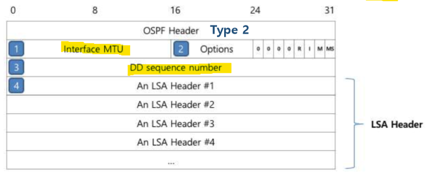
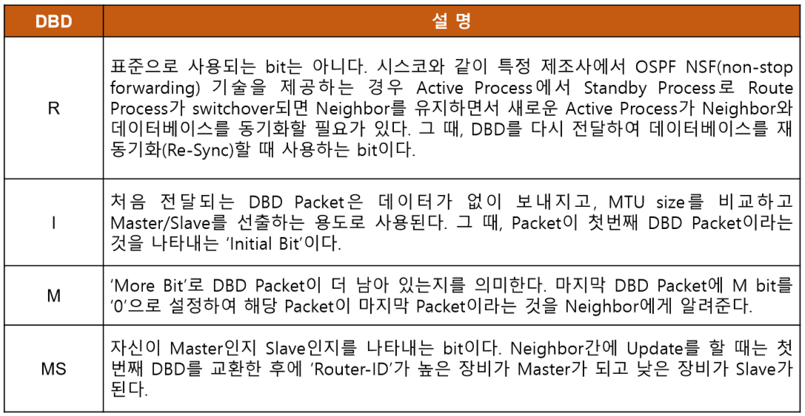
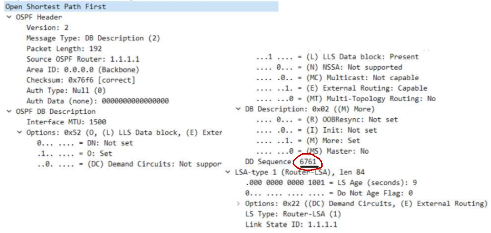
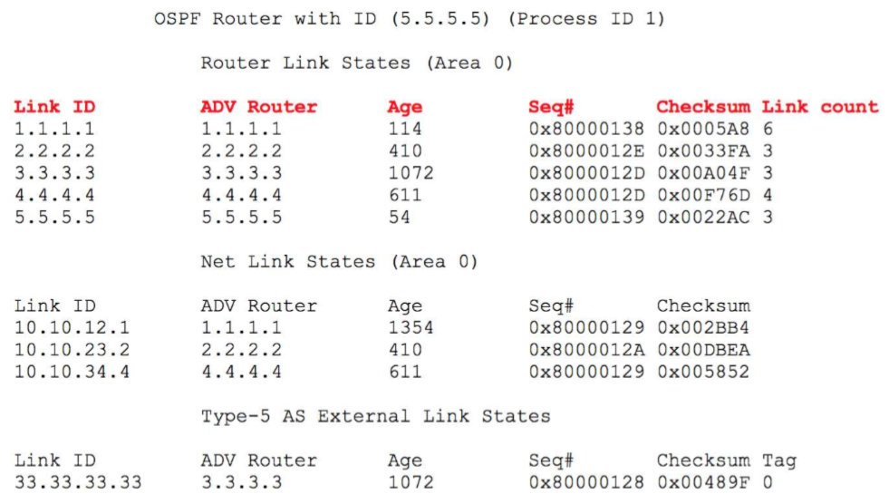
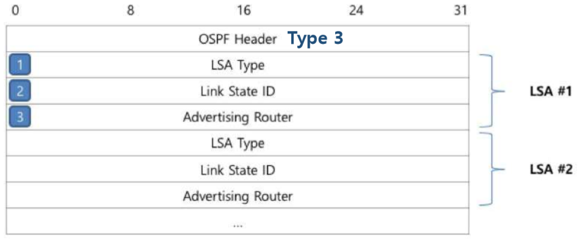
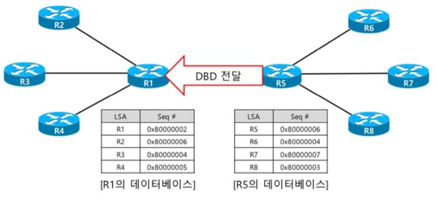
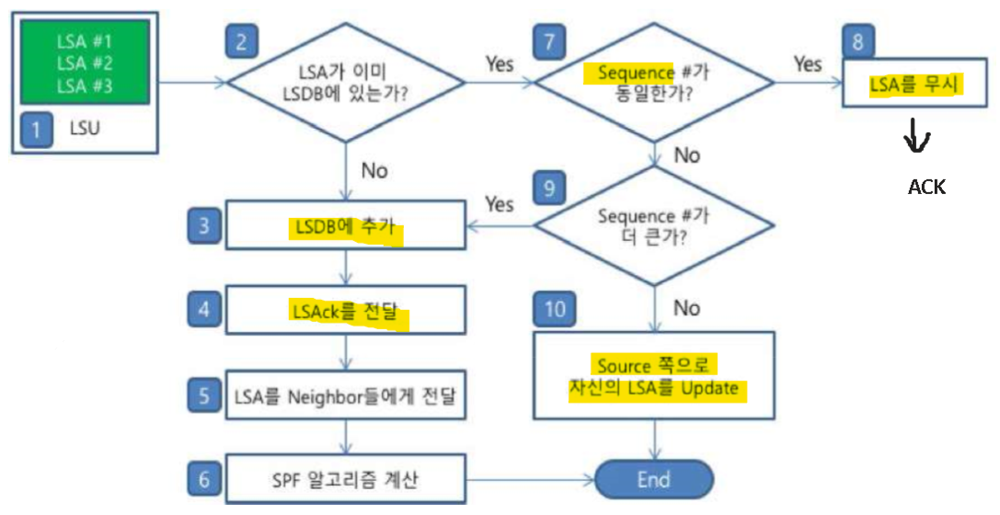

OSPF Packet
===

OSPF_Hello packet
---

- OSPF Routing protocol이 작동되는 Interface로 **Hello packet**을 주기적으로 전달하여 neighbor를 자동으로 선출하고,    
  Holdtime 동안 neighbor로부터 Hello packet을 받지 못한 경우 neighbor가 Down 상태로 되었다는 것을 자동으로 감지


### 1. Network mask
- 다른 Routing protocol은 상대방 neighbor의 Interface Subnet 정보를 알 수 없음

- RIP, EIGRP는 두 대의 장비 간에 Subnet 정보가 달라도 다른 조건 등이 맞으면 neighbor 관계가 성립되고 Update를 하는 데에 아무런 문제가 없음   
- 조건 : 상대방의 IP address가 Interface network에 포함
- OSPF도 point-to-point 환경에선 위의 조건만 만족하면 문제가 발생하지 않음
- Multi-Access 환경에선 상호 간에 **Subnet 정보가 반드시 일치하여야** neighbor 관계가 수립되어 Update packet을 주고 받을 수 있음

- 또한 MTU size도 확인하여 값이 서로 틀리면 neighbor 관계를 맺을 수 없음 **(DBD)**


### 2. Hello Interval, 5. Router Dead Interval

- OSPF Routing protocol이 Hello packet을 몇 초마다 한 번씩 주기적으로 전달할 것인지,    
  그리고 얼마나 Hello packet을 받지 못하면 neighbor가 down 상태가 되었다는 것을 인식할 것인지에 대한 시간 정보를 Hello packet을 통하여 전달하고 비교

- 이 정보가 반드시 동일해야 Neighbor 관계 수립
- 두 대의 장비 중 한 대의 Hello Interval이 다른 장비의 Dead Interval보다 크면 neighbor가 아무런 문제 없이 동작하고 있음에도 불구하고   
  Dead Interval 동안 Hello packet을 받지 못해서 Neighbor가 down 되었다고 인지


### 3. Options

|Option|설명|
|:---:|---|
|DN|MPLS L3 VPN에서 Routing Loop를 차단하기 위해 사용하며, MP-BGP에서 OSPF Routing protocol로 redistribute된 네트워크에 대하여 DN bit가 설정된다. <br> 그리고, DN bit가 설정된 네트워크 정보는 MP-BGP로 redistribute가 되지 않도록 함으로써 MP-BGP로부터 넘어온 정보가 다시 MP-BGP로 넘어가지 않도록 하여 Routing Loop를 차단한다.|
|O|MPLS TE에서 사용되는 LSA Type 9, 10, 11을 Opaque LSA라고 하는데, Opaque LSA 기능을 가지고 있다는 의미로 사용된다. <br> DBD packet을 전달하면서 O bit를 사용하는데 O bit가 설정된 DBD는 Opaque LSA 기능이 존재하는 장비 간에만 교환된다.|
|DC|해당 Interface가 Demand Circuit 이라는 것을 의미한다. <br> Point-to-Point 환경이나 Point-to-Multipoint 환경에서 Interface를 Demand Circuit으로 설정하면 주기적으로 Hello packet을 전달하지 않고, 30분마다 한 번씩 전달되는 LSA refresh를 전달하지 않는다. <br> 그리고, 해당 Interface를 통해 받은 LSA는 DNA(Do Not Aging) bit가 설정되어 Aging Time이 동작하지 않는다.|
|L|Hello packet과 DBD packet에서만 사용되며, LLS(Link-Local-Signaling) 정보가 데이터에 포함되어 있는지 여부를 알려주기 위해 사용된다. <br> 존재하는 OSPF packet에 추가적인 확장 영역을 사용할 수 있도록 하여 OSPF Nonstop Forwarding (NSF) 기능 등 새로운 기술을 사용할 수 있도록 한다.|
|N/P|N bit - Hello packet에서만 사용되며 해당 Area가 NSSA(Not-So-Stub-Area)라는 것을 의미하며 해당 bit 정보가 동일해야 Neighbor가 될 수 있다. <br> P bit - LSA Type 7 NSSA-External-LSA Header에만 사용되며, NSSA ABR에게 해당 정보가 Type 7이나 Type 5로 변경하나는 것을 알려주기 위해 사용된다.|
|MC|MOSPF(Multicast OSPF)가 동작하는 장비라는 의미로 사용하기 위해 만들어졌으나, CISCO는 MOSPF를 지원하지 않기 떄문에 해당 bit를 사용하지 않는다. <br> 타 제조사의 장비에 MOSPF가 동작하는 경우 CISCO 장비에서 '%OSPF-4-BADLSATYPE error message'가 나타날 수 있는데, <br> 'ignore lsa mospf' 명령어를 통해 해결 가능|
|E|LSA Type 5(External LSA)를 전달하고 받을 수 있는 기능이 있는 지 여부를 표시할 때 사용되며, <br> Area를 Stub area로 구성하게 되면 E bit가 0으로 설정되어 External LSA 전달 기능이 없음을 neighbor에게 알려주어 External LSA가 전달되는 것을 차단한다. <br> 해당 bit 정보가 동일해야 neighbor가 될 수 있다.|
|MT|과거에는 T bit로 사용되었으나 현재는 OSPF가 Multi-Topology 기능이 있는 지를 neighbor에게 알려주기 위해 사용된다.|


### 4. Router Priority, 6. Designated Router(DR), 7. Backup Designated Router(BDR)
> 중요한 개념 !!!

- Routing protocol은 SPF 알고리즘을 통해서 Best-path를 선출하게 되는데 SPF 알고리즘은 Tree 기반으로 최단거리를 계산하는 알고리즘

- Multi-Access 구조에선 Tree 구조를 만들기 쉽지 않음
- R1, R2, R3, R4, R5가 Multi-Access로 구성되어 있는 경우, 각 Router는 물리적으로는 Switch나 Hub를 이용해서 연결되어 있기 때문에 Hub & Spoke로 보일 수 있지만,   
  논리적으로 그림을 그리면 아래처럼 모든 Router가 직접 연결되어 있는 Full-Mesh 구조


> Tree 구조를 표현하기엔 너무 복잡한 구조가 되어 버림

##### 이 문제를 해결하기 위해 OSPF는 DR (Designated Router)를 선출 

- 선출된 Multi-Access 네트워크의 중심에 위치하고 DR을 중심으로 Hub & Spoke 구조로 연결

- **BDR**(Backup Designated Router) : DR down되면 DR 역할을 수행할 수 있음
- 참고로 IS-IS는 DR을 선출하지만 BDR은 선출하지 않음


- 자신의 Priority 값을 neighbor에게 전달하여야 하는데, Hello packet의 Router Priorty 필드를 이용하여 전달 
- 이미 DR/BDR을 선출하였다면 Hello packet을 이용하여 어떤 장비가 DR/BDR 인지 새로운 neighbor에게 **Designated Router 필드**, **Backup Designated Router 필드**를 통하여 전달


### [DR/BDR]

   
> 그림 출처 https://itaeheon.tistory.com/43

#### 1. DR (Designated Router)\
- DR은 변경 정보를 자신에게 모두 모아 각 Router로 전송해 주는 역할

- 다른 Router는 변경 정보를 일일이 다른 Router에게 보낼 필요 없이 DR로만 전송   
  ---> 따라서 모든 정보를 DR만 가짐
- DR에서 과부하 등의 문제가 발생할 수 있어서 최신형 Router를 사용하는 것이 좋다
  - 실제 DR의 Routing table을 보면 CPU 사용률이 거의 100%라서 Cooling system 또한 필수적이다. (대신 traffic이 감소하여 통신이 빨라짐)

#### 2. BDR (Backup Designated Router)
- DR에 문제가 발생했을 때 사용하는 Backup 역할의 Router
- DR의 Routing table 정보를 BDR이 교환하여 가지고 있음

#### 3. DR/BDR 사용 조건
- Broadcast 환경 즉, FastEthernet / Ethernet cable로 연결되어 있을 때
- OSPF Dynamic Protocol을 사용할 때
- Router 2개 이상 존재할 때

#### 4. DR/BDR을 정하는 기준
- OSPF Priority 값이 높은 것
  - 즉, **Hello packet에서 Router Priority 필드의 값이 DR/BDR의 선출 기준**
- Router-ID 값이 높은 것
-  1등 : DR, 2등 : BDR

#### 5. Non-preempt protocol
- DR/BDR은 한번 선출되면 바뀌지 않는다 (비선점)

#### 6. 실제로 확인(예시)


(R4 BDR)   


(R5 DR)   


OSPF_DBD packet
---

- OSPF Routing protocol은 neighbor 관계를 맺은 후 DB 동기화를 위해 Router들은 가지고 있는 DB 요약 정보를 neighbor와 상호 간에 교환
- neighbor의 DB 요약 정보를 자신의 DB와 비교하여 neighbor가 더 새로운 정보를 가지고 있거나 자신에게 없는 정보를 가지고 있으면 neighbor에게 요청하여 DB를 동기화

- 이때, DB의 요약 정보를 전달하는 packet을 **DBD(Database Description) packet** 이라고 함



### 1. Interface MTU

> **MTU** : Maximum Transfer Unit, packet을 자르는 기준

-  OSPF와 EIGRP routing protocol은 L4 Header를 사용하지 않기 때문에 데이터의 양이 많은 경우 Fragmentation 이루어 질 수 있음

- OSPF는 이 문제를 해결하기 위해서 DBD를 통하여 MTU size를 확인하고 Fragmentation이 되지 않도록 데이터를 L4에서 Segmentation을 하듯이 나누어서 L3에 선송
- MTU size는 반드시 서로 동일해야 함
- 장비 간 MTU를 일치시킬 수 없는 상황이면 Interface에 'ip ospf mtu-ignore' 명령어를 사용하여 MTU size를 확인하지 않을 수 있지만 데이터의 크기가 크면 Fragmentation이 발생할 수 있음
- 한 쪽만 'ip ospf mtu-ignore'가 설정되어 있는 경우 다음 조건을 만족해야 한다
  - 설정한 장비의 MTU size =< 'IP OSPF MTU-IGNORE'를 설정하지 않은 장비의 MTU size
  - 'Virtual-Link'에서는 MTU size를 비교하지 않음


### 2. Options & DB Description




### 3. DD sequence number

- DBD packet의 용량이 많은 경우 DBD를 여러 개 보내야 함
- DBD packet에 대해서는 응답 packet을 보내지 않음. 그래서 중간에 packet이 유실되었을 경우 neighbor가 잘 받았는지 확인할 수 없으므로 DBD packet을 정확히 받았는지 확인할 때 사용 




### 4. LSA Header
> 간략정보

|필드|설명|
|:---:|---|
|LSA Age|현재 LSA가 최초로 만들어진 후 시간이 얼마나 지났는지를 나타냄 <br> LSA는 Maximum Aging Time이 3600초로 되어 있어 LSA Age가 3600이 지나면 사라짐 (CCNP : default 3600초지나면 재요청)|
|DNA flag|Virtual-Link로 Update를 받은 LSA나 'ip ospf flood-reduction' 등의 명령어를 사용하여 demand circuit로 만든 Interface를 통해 Update 받은 LSA는 LSA Age가 증가하지 않는데, 이때 해당 LSA 정보에 DNS(Do Not Age) bit를 설정해서 전달|
|Options|Hello packet의 Options 필드가 LSA에도 동일하게 존재한다. 그 정보를 전달하는 필드|
|**LSA Type**|LSA의 종류는 Type 1 - Router LSA, Type 2 - Network LSA, Type 3 - Summary LSA|
|**LSA ID**|LSA ID를 전달하는 필드|
|**Advertising Router**|해당 LSA를 어느 장비가 Area 또는 OSPF DB로 가지고 왔는지 해당 장비의 Router-ID를 표시하여 전달|
|**Sequence Number**|LSA는 Link의 정보가 변경될 때마다 Sequence Number를 1씩 증가시켜 Update 정보를 전달한다. <br> 그리고, 가장 최신 LSA가 각각의 Router의 DB에 저장하게 된다. <br> 그때, Sequence Number를 비교하기 위하여 사용|
|Checksum|LSA 데이터에 오류가 있는지 확인하기 위하여 사용하는 정보|
|Length|LSA 데이터의 길이를 나타내는 정보|


### DBD 정보 확인

```
# show ip ospf database
```




OSPF_LSR packet
---
**Request**

- OSPF는 DBD 정보를 교환한 후 neighbor의 DBD 정보에 자신의 DB에 없는 LSA 정보 혹은 자신의 정보보다 더 최신 정보가 있으면 neighbor에게 해당 LSA를 보내달라고 요청





- 이 상태에서 R1과 R5가 서로 neighbor 관계를 맺는 과정에서 자신이 가지고 있는 LSA 요약 정보인 DBD를 상호 간에 전달하면 R1과 R5는 자신이 가지고 있지 않은 LSA를 상대방이 가지고 있다는 것을 알게 된다.   
  그래서 LSR (Link-State Request) packet을 통해서 해당 LSA를 보내달라고 요청


OSPF_LSU packet & LSAck packet
---

(LSU packet과 LSAck packet의 동작 순서도)   



#### 1. LSU packet
- **LSU packet은 neighbor가 LSR packet을 통해서 LSA를 전달하는 packet**

#### 2. LSU의 LSA와 LSDB 비교
- neighbor에게 LSU pakcet을 받으면 LSU packet 안에 들어있는 LSA가 이미 자신의 LSDB에 존재하는지 여부를 확인한다.
- 만일 LSDB에 이미 존재한다면 7번 과정으로 넘어가서 Sequence #를 비교하여 무엇이 더 최신 정보인지를 확인

- 만약 LSDB에 존재하지 않는다면 3번 과정으로 넘어가서 LSDB에 해당 LSA를 추가하게 된다.
- 이때, OSPF는 'MinLSArrival'이 Default 1초로 설정되어 있어서 동일한 LSA를 1초 안에 다시 받게 되면 무시

#### 3. LSDB에 추가
- LSDB에 새로운 LSA를 추가하지만, 다른 neighbor와 DB를 동기화를 하지 않았기 때문에 SPF 알고리즘을 계산하지 않음

#### 4. LSAck 전달
- LSU packet을 보낸 neighbor에게 LSAck(Link-State Acknowledgement) packet을 전달하여 LSU packet을 잘 받았음을 알려준다.   
  LSAck packet은 DBD packet가 packet type만 다르고 데이터는 동일한 정보를 담고 있어서 어떠한 LSA를 받았는지를 상호 간에 확인

- \# show ip ospf 로 확인 (Minimum LSA arrival 부분이 LSAck 도착 시간)
- LSU packet을 전달했는데 LSAck packet을 받지 못하면 16번 재전송하고, 16번 LSAck packet을 받지 못하면 neighbor 관계를 끊음


#### 5. LSA를 다른 neighbor에게 전달

- SPF 알고리즘은 모든 장비의 DB가 동기화되어야 하기 때문에 SPF 알고리즘 계산 전에 다른 neighbor와 DB를 동기화하는 작업을 우선적으로 수행


#### 6. SPF Algorithm 계산

- 다른 neighbor와 DB를 동기화시키기 전에 계산을 해야 하기 때문에, 'OSPF trottle timer'를 통해 Default로 Update packet을 받은 시간으로부터 5초 후 계산


#### 7. Sequence Number 동일 여부 비교

- LSA는 Link가 변경될 때마다 Sequence Number가 1씩 증가
- LSU packet이 있는 LSA가 자신의 DB에 있는 LSA와 Sequence Number가 동일하면 같은 LSA이므로 LSA를 무시하게 되고   
  동일하지 않으면 어느 LSA가 최신 정보인지를 비교


#### 8. LSA 무시
- 동일한 LSA 정보를 받으면 당연히 무시

- 그런데, LSU packet을 받았는데 LSAck packet을 보내지 않는다면 neighbor는 LSU packet을 16번 재전송 후에 neighbor를 끊을 것이다.
- 그래서, DB에 넣지 않고 무시하지만 neighbor에게 LSAck packet은 보내주게 됨


#### 9. Sequence Number 비교
- 자신의 DB에 있는 LSA와 LSU packet에 있는 LSA 중 어느 것이 최신 정보인지를 확인하는 부분

- LSA와 LSU packet에 있는 LSA의 Sequence number가 더 크면, 최신 정보이므로 *3번 과정* 으로 가서 LSDB에 추가
- 자신의 정보가 이미 최신 정보이면 10번 과정으로 가서 자신이 가지고 있는 정보로 DB를 동기화


#### 10. Source 쪽으로 자신의 LSA를 Update
- neighbor가 자신이 가지고 있는 정보보다 오래된 LSA를 가지고 있으므로 자신의 LSA를 LSU packet에 넣어서 neighbor에게 전달

