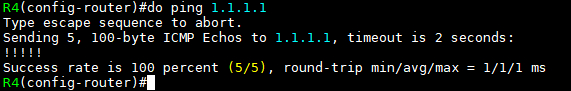

OSPF LSA Type
===


LSA Type이 존재하는 이유
---

> Full SPF vs Partial SPF를 선택하기 위함

- **같은 or 다른 Area인지를 확인**
- Regular Area 혹은 Special Area (관리자가 직접 입력)에 따라 LSA를 받을 지에 대한 여부 등을 관리하기 위함


LSA Type
---


### Type 1
- **같은 Area에서 전달되는 링크 정보**

- ABR에서 area 0과 area n 사이로 전달됨 (양방향 전달)

### Type 2
- **Multi-access 환경(DR/BDR 생성)에서 DR이 Multi-access 네트워크 정보를 알려줌**


### Type 3
- **ABR(Area 0과 non-backbone area를 가지고 있는 Router)을 통해 들어온 다른 Area의 링크 정보** (Routing code : **O IA**)

- ARB에서 area 0이 다른 area로 정보를 전달할 수 있음 (area 0 단방향 전달)

  

### Type 5
- **ASBR (OSPF와 다른 Routing protocol가 작동 및 재분배 하는 Router)이 생성한 다른 Routing protocol의 정보**

- **서로 다른 Routing protocol이 재분배 되었을 경우 생성되는 LSA** (Routing code : **O E2, E1**)
- ASBR에서 만들어지며 ABR에선 area 0과 area n 사이로 전달됨 (양방향 전달)

### Type 4
- ASBR을 특정하기 위해 ABR이 생성하는 정보


### Type 7
- Type 5와 동일한 내용을 담고 있지만 Type 번호만 다름 ---> Stub area를 선언하면 ASBR이 생성되지 못하기 때문이다.

- **Stub로 선언한 Area가 다른 Routing protocol을 재분배하려면 NSSA라는 Area로 선언해야 한다.**   
  NSSA (Not-So-Stubby Area) : OSPF를 제외한 다른 Routing protocol까지 포함하여 Stub가 아닌 형태를 만들 때 사용하는 Area의 한 종류

- **실무에선 totally nssa area로 많이 선언**


   
- Router Link States : **Type 1**
- Net Link States : **Type 2**
- Summary Net Link States : **Type 3**
- Summary ASB Link States : **Type 4 (ASBR)**
- External Link States : **Type 5**


Special Area
---
> 관리자가 area 수동 선언

   
> Topology
>
> R4는 EIGRP를 재분배(OSPF) ---> **R4는 ASBR**

### Stub area
- **Type 3는 허용하지만 Type 4와 Type 5를 차단**

- Stub area를 선언하면 해당 area의 Router는 자동으로 default route 생성

   
> R3 area 2를 stub area로 선언

   
> R4와의 neighbor 관계가 끊어짐
>
> R4의 area 2도 stub area로 선언해야 neighbor 관계가 다시 맺어진다.


   
> Stub area로 선언하면 default route 자동 생성 (**O*IA**)


### Totally Stub area
- **Type 3, Type 4, Type 5 전부 차단**

- stub area에 선언된 default route로 Routing 가능

   
> R3 area 2를 totally stub area로 선언
- 다른 area와 SPF 알고리즘이 작동하지 않음

   
> R4 Routing table

- R3의 왼쪽 방향의 Router들의 Route 정보가 넘어오지 않음



- 그러나 R1으로 ping 확인 (위에서 이미 R3와 R4의 area 2를 stub area로 만들어서 **default route 정보**가 생성되었기 때문이다)


### NSSA
- Stub area의 일종이며 Type 3, Type 4, Type 5를 차단 ---> **Type 7만 전달 가능**

- 즉, **Area 내부에 위치한 ASBR이 외부 네트워크 정보를 Type 7 LSA로 광고하는 Area**

- nssa area에 있는 Router가 ASBR 역할을 하면 **Type 5를 Type 7으로 생성하여 전달** (양방향 전달)
- Stub와 같지만 default route가 생성되지 않음
- default route가 생성되려면 ABR에서 아래 명령어를 입력   
  ```
  # area [area-ID] nssa default-information-originate
  ```


> R3와 R4의 area 2에 nssa 선언


   
> R1의 Routing table

- R5의 Route 정보가 넘어옴 (**O E2**) ---> **Type 5 LSA**

   
> R3 area 2에 default route 생성


> R4 Routing table

- default route 생성 (**O*N2**)


> R3 area 2에서 totally nssa area 선언

- **Type 3를 차단하여 totally nssa area로 만들어짐 (Type 3, Type 4, Type 5 차단)**


   
> R3 Routing table

- **O N2 ---> Type 7으로 넘어온 Route 정보**


OSPF의 Process-ID와 Area의 차이
---

- OSPF의 Process-ID는 OSPF가 작돌하는 Router에서 Process를 구분하는 번호
- 즉, OSPF가 작동하는 Router에 Process-ID가 다른 다수의 OSPF Process가 작동한다면 해당 Router는 *각각을 서로 다른 Routing protocol로 인식*

- 서로 다른 Router 간 Process-ID가 다른 것은 OSPF의 packet에서 Process-ID로 구분하는 값 혹은 기준이 없기 때문에 **Area만 일치하면 packet 교환을 한다.**
  - OSPF의 Process-ID는 다른 Router와 neighbor를 맺을 때 전혀 관련 없음
  - OSPF 다른 Router와 neighbor를 맺을 때 이웃한 장비의 링크의 area ID가 동일해야 neighbor 관계 형성   
    (neighbor 조건 충족)

  - **하나의 Router에서 Process-ID가 다른 것은 서로 다른 Routing protocol로 인식**

