OSPF Virtual Link
===

- OSPF는 영역 추가 등의 네트워크 확장에 유연하지 못함
  - 모든 Routing 정보가 Backbone area을 중심으로 동작하므로 **모든 영역이 Backbone area에 연결되어야 함**
  - Backbone area인 Area 0에 물리적인 Link 없이 연결할 때 **Virtual Link**를 사용
  - Virtual Link 연결은 특정 상황에서 한시적으로 사용 (지속 사용 X)

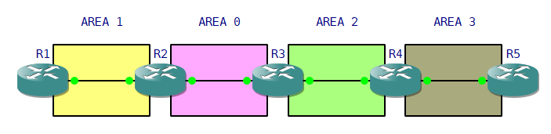

> Topology

- Area 2와 Area 3에 위치한 R4는 Area 0이 전달하는 Backbone DB를 갖고 있지 않기 때문에 ABR이 아니고 Area 3은 DB를 전달할 수 없음
- 만약 R4가 R3로부터 Area 0의 DB를 받아 전체 DB를 구축한다면 Area 2는 **Virtual Link**를 제공해주어야 하고 이렇게 Virtual Link를 제공해주는 영역을 **Transmit Area(전달 영역)**라고 함
- Virtual Link는 Backbone area가 물리적으로 분리되어 있는 구간에서도 필요

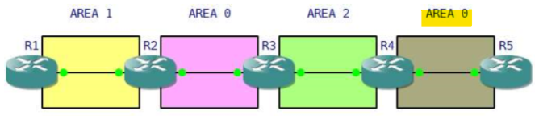

### Virtual Link (가상 링크) 설정

```
(config)# router ospf [Process-ID]
(config-router)# area [Area-ID] virtual-link [Router-ID]

### 이때 area는 Virtual Link가 통과하는 transmit area
### Router-ID는 Virtual Link 종단 Router의 Router-ID
```

### 확인 명령어

```
# show ip ospf database

# show ip ospf virtual-links

# show ip ospf neighbor         ---> Interface 변화를 확인
```


### 예시
맨 위 Topology를 기준으로 다시 보자면   
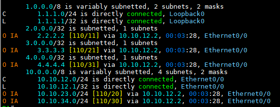

> R1의 Routing table   

- R5 Route 정보가 들어오지 않음

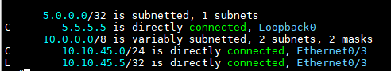   
> R5 Routing table

- R5 또한 다른 Router 정보가 들어오지 않음


**area 2를 tranmit area로 적용**   
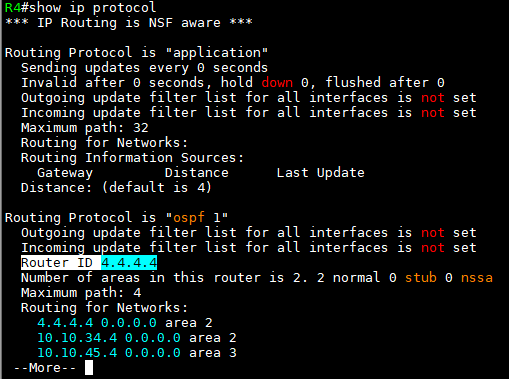   
> R4 area 2의 Router-ID를 확인


**R3 area 2를 Transmit area로 선언**   
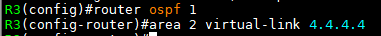   
> R4의 area 2 Router-ID를 사용

R3 area 2의 Router-ID를 확인   
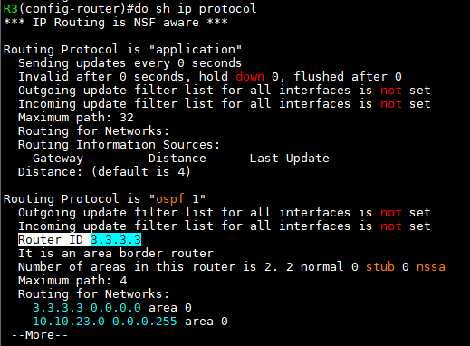   

**R4 area 2에서 Transmit area를 선언**   
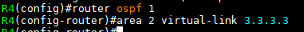   

Virtual Link 확인   
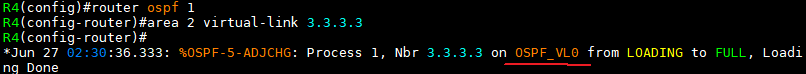   
> OSPF_VL0 : Virtual Interface 생성


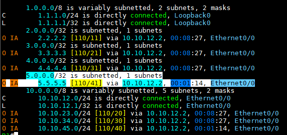   
> R1 Routing table

- R5 Route 정보가 들어오는 것을 확인

R3 neighbor 확인   
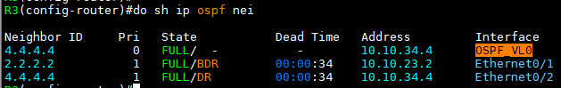   
- Virtual Interface 확인 (OSPF_VL0)


OSPF Redistribute (재분배)
===

### OSPF Reference Bandwidth (기준 대역폭)
- OSPF가 SPF 계산 시 사용하는 **Cost**
- SPF 알고리즘을 통하여 Best-path를 선출하는 순서
  1. 각 장비는 SPF 알고리즘의 Root Node로 자신을 선택
  2. Link-State DB의 Link 정보를 기반으로 Network Topology를 구성
  3. SPF 알고리즘을 통하여 각 Node 및 Network에 대하여 Best-path를 선출하여 Routing table에 등록

- 위 SPF 알고리즘의 Best-path를 선출 시 사용하는 값을 **Cost** 라고 함
- \# show ip ospf       --->  "Reference Bandwidth unit is 100mbps" 부분에서 확인
- OSPF의 Default 값은 100Mbps
  - Fast ethernet 100Mbps 경우 : Reference bandwidth / 100Mbps = 1
  - ethernet 10Mbps 경우 : Reference bandwidth / 100Mbps = 10
  - Serial T1 1.544Mpbs의 속도일 경우 : Reference bandwidth / 1.544Mbps = 100 Mbps / 1.544Mbps = 64

- Default Reference가 **100Mbps**이기 때문에 1G 혹은 10G의 경우 Cost가 모두 1이 되며 Reference bandwidth의 변경이 필요
  - 같은 area 내의 모든 Router에 변경
  ```
  (config-router)# auto-cost reference-bandwidth 1000       --->    1Gbps로 변경
  ```

### OSPF 재분배 명령어
- 각 Routing protocol마다 Metric 계산 방식이 다르기 때문에 Metric 값을 부여

```
(config-route)# redistribute [protocol] metric [metric 값] metric-type [type 값] route-map [map-tag] subnets
```

- RIP와 EIGRP 재분배 시 주의 사항
  - RIP와 EIGRP는 ***Classful*** Routing protocol로 Subnet 정보가 들어오지 않아 Major Network의 정보만 재분배 될 수 있음
  - 위 문제를 막기 위해 ***subnets*** 명령어를 입력해야 함


