OSPF Virtual Link
===

- OSPF는 영역 추가 등의 네트워크 확장에 유연하지 못함
  - 모든 Routing 정보가 Backbone area을 중심으로 동작하므로 **모든 영역이 Backbone area에 연결되어야 함**
  - Backbone area인 Area 0에 물리적인 Link 없이 연결할 때 **Virtual Link**를 사용
  - Virtual Link 연결은 특정 상황에서 한시적으로 사용 (지속 사용 X)


> Topology

- Area 2와 Area 3에 위치한 R4는 Area 0이 전달하는 Backbone DB를 갖고 있지 않기 때문에 ABR이 아니고 Area 3은 DB를 전달할 수 없음
- 만약 R4가 R3로부터 Area 0의 DB를 받아 전체 DB를 구축한다면 Area 2는 **Virtual Link**를 제공해주어야 하고 이렇게 Virtual Link를 제공해주는 영역을 **Transmit Area(전달 영역)**라고 함
- Virtual Link는 Backbone area가 물리적으로 분리되어 있는 구간에서도 필요


### Virtual Link (가상 링크) 설정

```
(config)# router ospf [Process-ID]
(config-router)# area [Area-ID] virtual-link [Router-ID]

### 이때 area는 Virtual Link가 통과하는 transmit area
### Router-ID는 Virtual Link 종단 Router의 Router-ID
```

### 확인 명령어

```
# show ip ospf database

# show ip ospf virtual-links

# show ip ospf neighbor         ---> Interface 변화를 확인
```


### 예시
맨 위 Topology를 기준으로 다시 보자면   


> R1의 Routing table   

- R5 Route 정보가 들어오지 않음

   
> R5 Routing table

- R5 또한 다른 Router 정보가 들어오지 않음


**area 2를 tranmit area로 적용**   
   
> R4 area 2의 Router-ID를 확인


**R3 area 2를 Transmit area로 선언**   
   
> R4의 area 2 Router-ID를 사용

R3 area 2의 Router-ID를 확인   
   

**R4 area 2에서 Transmit area를 선언**   
   

Virtual Link 확인   
   
> OSPF_VL0 : Virtual Interface 생성


   
> R1 Routing table

- R5 Route 정보가 들어오는 것을 확인

R3 neighbor 확인   
   
- Virtual Interface 확인 (OSPF_VL0)


OSPF Redistribute (재분배)
===

### OSPF Reference Bandwidth (기준 대역폭)
- OSPF가 SPF 계산 시 사용하는 **Cost**
- SPF 알고리즘을 통하여 Best-path를 선출하는 순서
  1. 각 장비는 SPF 알고리즘의 Root Node로 자신을 선택
  2. Link-State DB의 Link 정보를 기반으로 Network Topology를 구성
  3. SPF 알고리즘을 통하여 각 Node 및 Network에 대하여 Best-path를 선출하여 Routing table에 등록

- 위 SPF 알고리즘의 Best-path를 선출 시 사용하는 값을 **Cost** 라고 함
- \# show ip ospf       --->  "Reference Bandwidth unit is 100mbps" 부분에서 확인
- OSPF의 Default 값은 100Mbps ---> 이때 Cost는?
  - Fast ethernet 100Mbps 경우 : Reference bandwidth / 100Mbps = 100Mbps / 100Mbps = 1
  - ethernet 10Mbps 경우 : Reference bandwidth / 100Mbps  = 100Mbps / 10Mbps = 10
  - Serial T1 1.544Mpbs의 속도일 경우 : Reference bandwidth / 1.544Mbps = 100 Mbps / 1.544Mbps = 64

- Default Reference가 **100Mbps**이기 때문에 1G 혹은 10G의 경우 Cost가 모두 1이 되며 Reference bandwidth의 변경이 필요
  - **같은 area 내의 모든 Router에 변경**
  ```
  (config-router)# auto-cost reference-bandwidth [Mbps 단위]

  (config-router)# auto-cost reference-bandwidth 1000       --->    1Gbps로 변경
  ```

### OSPF 재분배 명령어
- 각 Routing protocol마다 Metric 계산 방식이 다르기 때문에 Metric 값을 부여

```
(config-route)# redistribute [protocol] metric [metric 값] metric-type [type 값] route-map [map-tag] subnets
```

- RIP와 EIGRP 재분배 시 주의 사항
  - RIP와 EIGRP는 ***Classful*** Routing protocol로 Subnet 정보가 들어오지 않아 Major Network의 정보만 재분배 될 수 있음
  - 위 문제를 막기 위해 ***subnets*** 명령어를 입력해야 함


### 예시


**Cost 확인**   
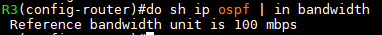
- BW default : 100 mbps

R2 Cost   
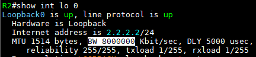
- R2 lo 0의 Cost는 1

R1 e0/0 Cost   
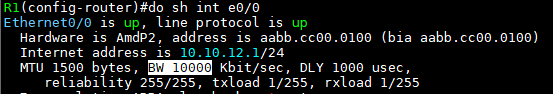
- R1 e0/0의 Cost는 10

Cost 계산    
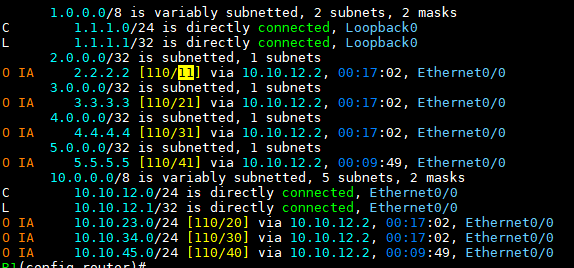
> R1 Routing table

- **Cost는 10 + 1 = 11**

bandwidth 변경   
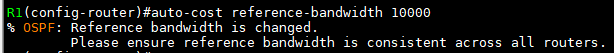   
- R1부터 R5까지 동일한 bandwidth 설정

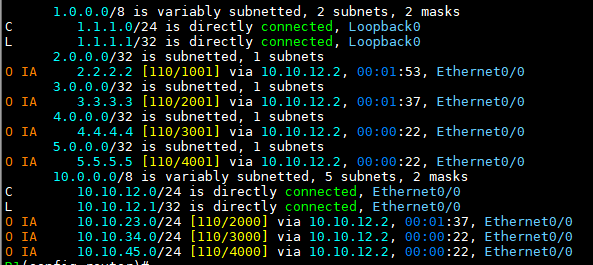   
> R1 Routing table

- Cost 값이 바뀜

- Interface 별로 Cost 변경 명령어
  ```
  (config-if)# ip ospf cost [1 ~ 65,535]
  ```


### 재분배 예시

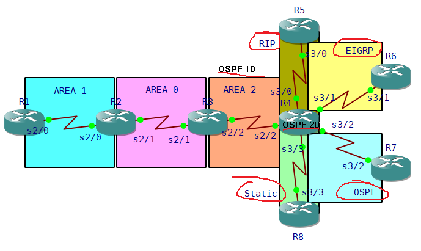

> R4에서 OSPF 1, OSPF 47, OSPF 46, RIP, Static Protocol 작동 중 (#show ip protocol)

**RIP 재분배**   
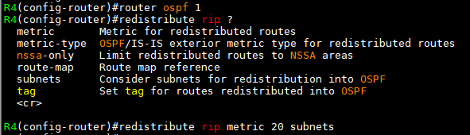

- OSPF에서 RIP 재분배
- metric 값, subnets 지정

**EIGRP 재분배**   
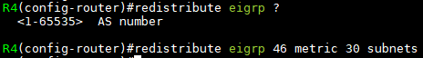
- OSPF에서 EIGRP 재분배
- metric, subnets 지정

OSPF 1에서 OSPF 47 재분배   
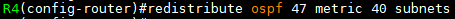
- metric 값과 subnets는 입력하지 않아도 된다. (같은 Routing protocol이기 때문이다)

**Static 재분배**   
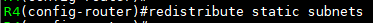

R1 Routing table   
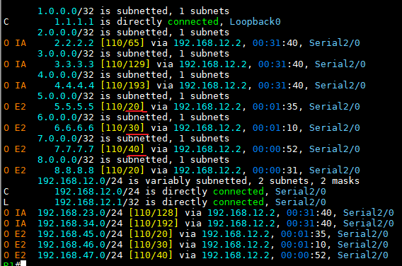   
> 재분배 확인

- metric 값은 임의로 입력한 값 그대로 확인
- 왜 경로에 따라 계산하지 않고 설정한 값 그대로의 metric 값이 나올까?

**OSPF의 E1, E2 또는 N1, N2**   
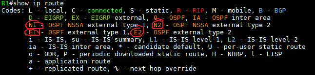

-  **2**는 ASBR의 metric 값을 알고 있기 때문에 경로를 거쳐오면서 metric 계산을 하지 않음    
  --->    Type E2, N2는 metric을 임의로 입력한 값으로 표시    
  ---> 부하 낮음(default)
-  **1**은 metric 값이 거쳐오는 경로에 따라 모두 계산   
  --->    Type E1, N1은 metric 값을 계속 계산하기 때문에 임의로 입력한 값과 다르다    --->    부하가 조금 높음    
  --->    **ASBR 이중화**의 경우 서로 다른 속도를 가진 Link 연결이 되었을 때 metric을 계산하기 위해 주로 사용

**O E1** 으로 Type 변경   
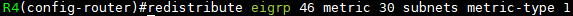
- R4에서 EIGRP 재분배 Route 경로에 Type 2에서 Type 1으로 변경 (E2 -> E1)

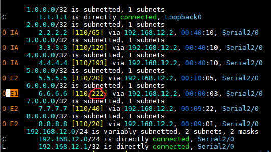   
> R1 Routing table

- 원래 Type E2 
- Type E1으로 바뀌면서 metric을 보면 임의로 설정한 값(30)이 아닌 경로를 계산한 값으로 나옴


Routing_재분배 정리
---

- 서로 다른 Routing protocol은 서로 각자의 Routing DB를 가지고 있으며 이 DB는 서로 호환되지 않음
- 이때, 다른 Routing protocol의 DB를 가져와 자신의 DB에 등록하는 것을 **재분배(redistribute)**이라고 함
- Routing 재분배는 보내는 것보단 가져오는 것에 가깝다고 생각한다.

#### 1. 재분배를 사용하는 경우
1. 서로 다른 Routing protocol을 사용하는 범위를 합칠 때
2. 장비에서 지원되는 Routing protocol이 서로 다른 Router를 사용했을 경우
3. Routing protocol을 변경하는 경우
4. 네트워크의 안정성을 위해 작은 범위로 분할 후 재분배를 통해 Routing
   - 같은 Routing protocol에서 자주 발생 (같은 Routing protocol을 Process 번호로 분리 운영)
5. Static으로 만든 Default route를 Routing protocol로 다른 Router에게 알려주는 경우


#### 2. 재분배 주의사항
1. 서로 다른 Routing protocol은 **Metric** 계산 방법이 서로 다름   
   따라서, 재분배 시 다른 Routing protocol의 DB를 가져올 때 Metric을 임의로 설정한다. 가능하면 해당 Interface에 Metric 값을 입력하는 것을 추천
2. 같은 Routing protocol은 Metric이 동일하기 때문에 Metric 변환이 필요 없음
3. connected와 Static은 Metric이 없기 때문에 Metric 값을 임의로 입력하지 않아도 됨


#### 3. 재분배 명령어
```
(config-router)# redistribute [Protocol] metric [metric 값]
```
- Routing protocol마다 계산하는 metric 형식이 다름


#### 4. 각 Routing protocol에서의 재분배

1. RIP

```
(config-router)# redistribute [Protocol] metric [hop 수]
(config-router)# default-metric [hop수]                             
### 재분배 명령에 metric을 입력하지 않아도 됨

(config-router)# default-information originate                
### default route이 존재할 때 default 재분배하는 명령어 (Routing table에 목적지 IP가 없는 경우에 default router에게 향하게 됨)
```

2. EIGRP

```
(config-router)# redistribute [Protocol] metric [BW] [DLY] [REL] [LOAD] [MTU]
(config-router)# default-metric [BW] [DLY] [REL] [LOAD] [MTU]
(config-router)# redistribute static
```
- EIGRP는 default-routing을 재분배하는 명령어가 없어 default-routing 재분배 시 Static으로 재분배
- 0.0.0.0/0만 재분배하고 싶은 경우 다른 네트워크 정보는 Filtering

3. OSPF

```
(config-router)# redistibute [Protocol] metric [Cost] subnets metric-type [1/2]
```
- metric type default 2는 Cost를 계산하지 않고 재분배 시 부여한 Cost를 사용
- metric type 1 은 재분배 시 부여한 Cost와 경로 Cost를 계산

```
(config-router)# default-metric [Cost]        ### 재분배 명령에 metric 없어도 됨

(config-router)# default-information originate    ### default routing이 존재할 때 default 재분배하는 명령어
```
