NAT (Network Address Translation)
===

> 네트워크 주소 변환 기술

> Routing 되지 않은 주소를 Routing 가능하게 만드는 기술 **(공인IP <--> 사설IP 변환)**

- L3에서 IP주소는 **host by host** 전달   
  Clinet <--> Server 사이의 SRC, DST IP주소는 변경 X
- Client <--> NAT <--> Server     --->  NAT에 의해 중간에서 주소가 변경될 수 있음   
  즉, NAT 기술은 통신 중에 IP주소를 변환 (L3)
- NAT 기술은 내부(출발지 주소, SRC IP)를 외부(도착지 주소, DST IP)에 숨겨서   
  내부-->외부 통신은 자유롭게 가능하지만   
  외부-->내부 통신은 차단하는 보안에 적용 (**외부에서 내부 주소 access 불가능**)


NAT 장단점
---

#### <NAT 장점>
1. 보안 설정 가능 (외부에서 내부로 자유로운 접근 불가)
    - 내부 네트워크를 알 수 없기 때문에 외부에서 Routing 불가능하여 경로를 알 수 없음
2. 주소 변환 기술로 사설IP를 공인IP로 변환하여 보낼 수 있기 때문에 IPv4 주소 부족 현상을 줄여줌
3. Routing이 되지 않는 IP를 Routing 가능하게 만듦


#### <NAT 단점>
1. 장치에 부하가 많이 걸림
2. NAT 내부에 Server가 있는 경우 Port forwarding 기술을 이용해서 Server 접근을 해야 한다
3. NAT 기술을 정확히! 구현해야 정상 작동


NAT 종류 및 설정
---

#### 1. Static NAT
> 외부 주소 1개 : 내부 주소 1개를 mapping

- Host의 내부 server를 연결시킬 때
- NAT 환경설정  : 외부 IP(Inside Global) 1개 - 내부 IP(Inside Local) 1개를 mapping
  ```
  (config)# ip nat inside source static [inside local IP] [inside global IP]
  ```
- NAT가 적용되는 Interface 지정
  ```
  (config-if)# ip nat inside      --->  Inside Local(내부) Interface
  (config-if)# ip nat outside     --->  Inside Global(외부) Interface
  ```

##### 예시)

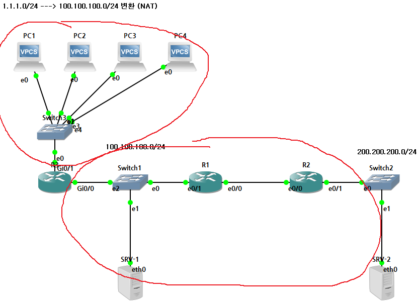

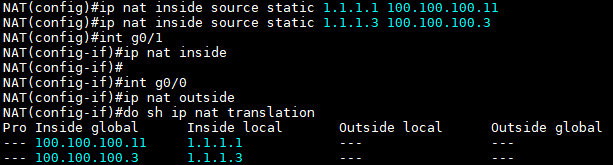

> R3 설정 (R3에서 주소 변환이 이루어진다고 가정)
> 
> 100.100.100.3 은 R3의 g0/0 IP
>
> R3의 g0/1은 내부(Inside Local), g0/0은 외부(Inside Global) 네트워크
>
> PC1과 PC3만 SRV-2로 통신 가능

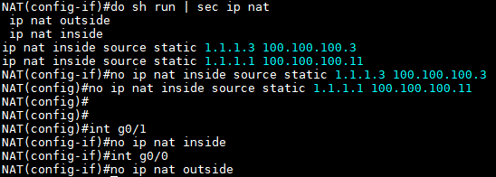
> 지정된 NAT 삭제


#### 2. Dynamic NAT
> 외부 주소 n개 : 내부 주소 m개를 mapping

- 외부 IP n개만큼만 내부 주소와 통신 가능
- 먼저 선점한 IP만 외부 통신이 가능 (단점)
- NAT table에서 해당 통신 내용이 없어지면 다른 IP가 통신 가능하다 (외부 IP 개수만큼만 동시 접속이 가능)
- 내부 네트워크(Inside Local) 정의
  ```
  (config)# access-list 1 permit [통신하려는 내부 네트워크 IP] [와일드카드 마스크]

  255.255.255.0(서브넷마스크)   --->    0.0.0.255(와일드카드마스크)
  255.255.254.0(서브넷마스크)   --->    0.0.1.255(와일드카드마스크)
  255.255.0.0(서브넷마스크)     --->    0.0.255.255(와일드카드마스크)

  (config)# access-list 1 permit any      --->    Inside Local의 모든 주소
  ```
- 외부 네트워크(Inside Local) 정의
  ```
  (config)# ip nat pool [pool 이름] [외부 시작IP] [외부 끝IP] netmask [외부 네트워크의 서브넷마스크]
  ```
- NAT 환경설정
  > 정의된 내부 네트워크와 외부 네트워크를 **mapping**
  ```
  (config)# ip nat inside source list [access-list 번호] pool [pool 이름]
  ```
- NAT가 적용되는 Interface 지정
  ```
  (config-if)# ip nat inside      --->    Inside Local(내부) Interface
  (config-if)# ip nat outside     --->    Inside Global(외부) Interface
  ```


> R3 설정
>
> access-list 번호는 1, pool 이름은 AAA로 지정하여 mapping
>
> Inside Global IP 2개만 사용 (100.100.100.4 100.100.100.5)
>
> 만약 PC1, PC2가 먼저 SRV-2로 ping을 보내면 나머지 PC3, PC4는 통신 불가능 (이미 PC1, PC2가 선점)


#### 3. NAT Overload (PAT : Port Address Translation)
> 현재 가장 많이 사용 (Dynamic NAT 문제점을 해결)
>
> 내부 IP의 **개수에 상관없이** 외부 IP와 mapping, 이떄 Port주소와 같이 mapping

- 외부 IP 1개 : 내부 IP x개 mapping
- L3(icmp, igmp), L4(TCP/UDP) protocol과 Port주소까지 NAT table에 기록하고 1개의 IP로도 내부 네트워크(Inside Local)를 모두 통신할 수 있는 방식
- Port주소를 NAT table에 lookup을 하기 때문에 PAT라고 불림
- Dynamic NAT 설정 맨 뒤에 overload 명령어 추가
- 내부 네트워크(Inside Local) 정의
  ```
  (config)# access-list 1 permit [통신할 내부 네트워크 IP] [와일드카드 마스크]

  (config)# access-list 1 permit any      --->    Inside Local의 모든 주소
  ```
- 외부 네트워크(Inside Global) 정의
  ```
  (config)# ip nat pool [pool 이름] [외부 시작IP] [외부 끝IP] netmask [외부 네트워크의 서브넷마스크]
  ```
- NAT 환경설정
  > 정의된 내부 네트워크와 외부 네트워크를 mapping
  ```
  (config)# ip nat inside source list [access-list 번호] pool [pool 이름] overload
  ```

- NAT가 적용되는 Interface 지정
  ```
  (config-if)# ip nat inside     --->    Inside Local(내부) Interface
  (config-if)# ip nat outside    --->    Inside Global(외부) Interface
  ```

#### 3-1. 실무에서 사용되는 nat overload 설정 (PAT설정)

- 내부 네트워크(Inside Local) 정의
  ```
  (config)# access-list 1 permit [통신할 내부 네트워크 IP] [와일드카드 마스크]
  ```
- 외부 네트워크(Inside Global) 정의
  > 외부와 연결된 Interface의 IP를 사용   
  > 
  > NAT 설정 시 Interface에 입력된 IP를 지정하는 명령어 사용
- NAT 환경설정
  > 정의된 내부 네트워크와 외부 네트워크는 Interface의 IP를 사용
  ```
  (config)# ip nat inside source list 1 interface [ip nat outside로 지정되는 Interface ID] overload
  ```
- NAT가 적용되는 Interface 지정
  ```
  (config-if)# ip nat inside      --->    Inside Local(내부) Interface
  (config-if)# ip nat outside     --->    Inside Global(외부) Interface
  ```

  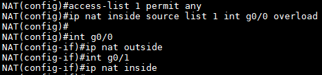
  > R3에 nat overload 설정
  >
  > 내부 네트워크 IP 개수에 상관없이 PC1-4가 SRV-2로 통신이 가능


#### 4. Port Forwarding
> PAT와 Static NAT를 홣용하여 Inside Local에 있는 장비를 외부에서 접근할 수 있도록 설정하는 방법

- Port forwarding   --->    NAT 적용된 상태에서 진행
- Static NAT를 확장하여 설정
  ```
  (config)# ip nat inside source static [Protocol] [내부IP] [내부Port] [외부IP] [외부Port]

  (config)# ip nat inside source static [Protocol] [내부IP] [내부Port] interface [ip nat outside로 지정된 Interface ID] [외부Port]
  ```

##### 예제)

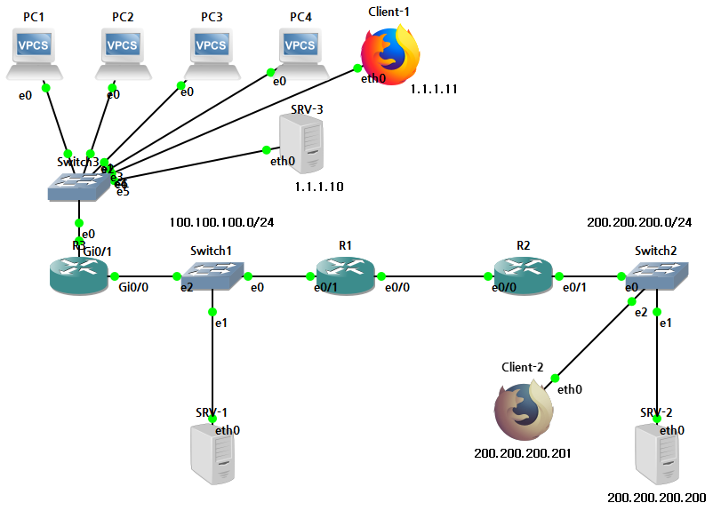

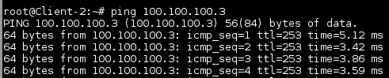
> Clinet-2에서 R3 g0/0까지만 통신 가능(Routing)

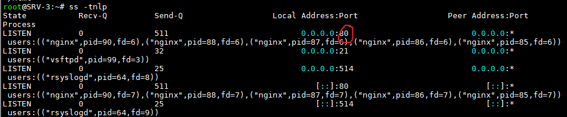
> SRV-3에서 80 port(TCP)가 열려있음

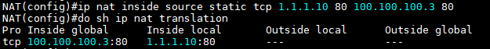
> R3에서 Port forwarding 설정
>
> Client-2에서 SRV-3로 Port통신

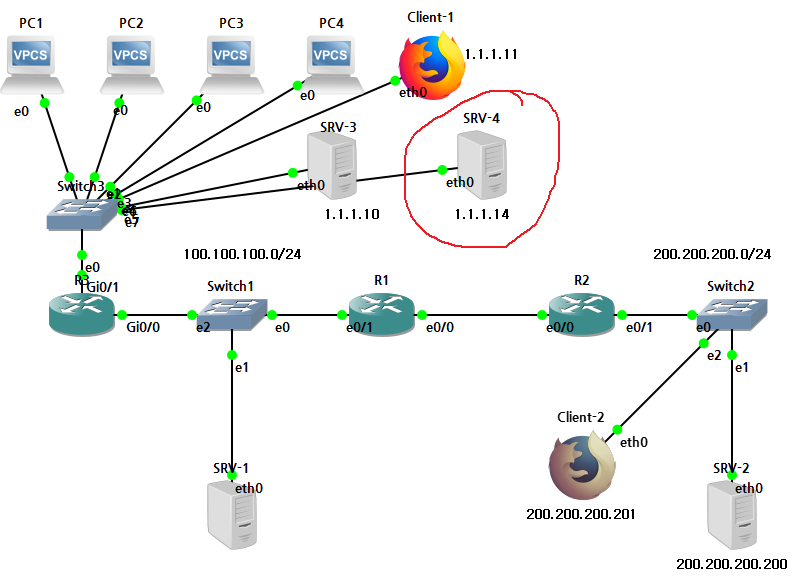
> SRV-4 추가

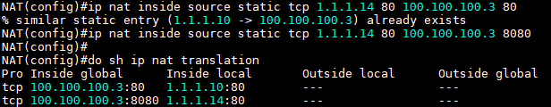
> 참고로 R3의 g0/0 IP = 100.100.100.3

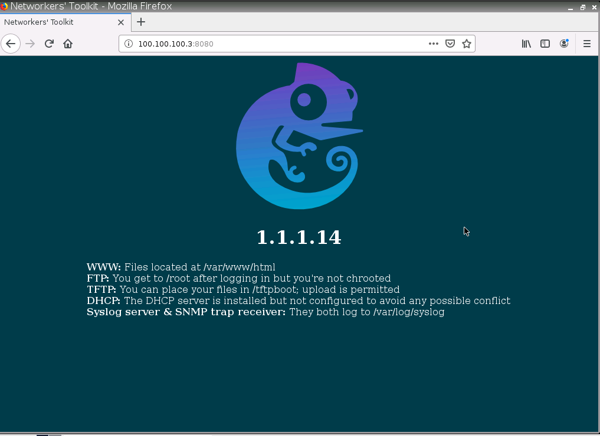
> Client-2에서 SRV-4로 접속 (웹서버)
>
> 그러나 이미 80 Port는 SRV-3 연결하는 데에 사용했기 때문에 임의로 8080 Port를 사용하였음


### 문제) ------------------------------------------------------------------------------------

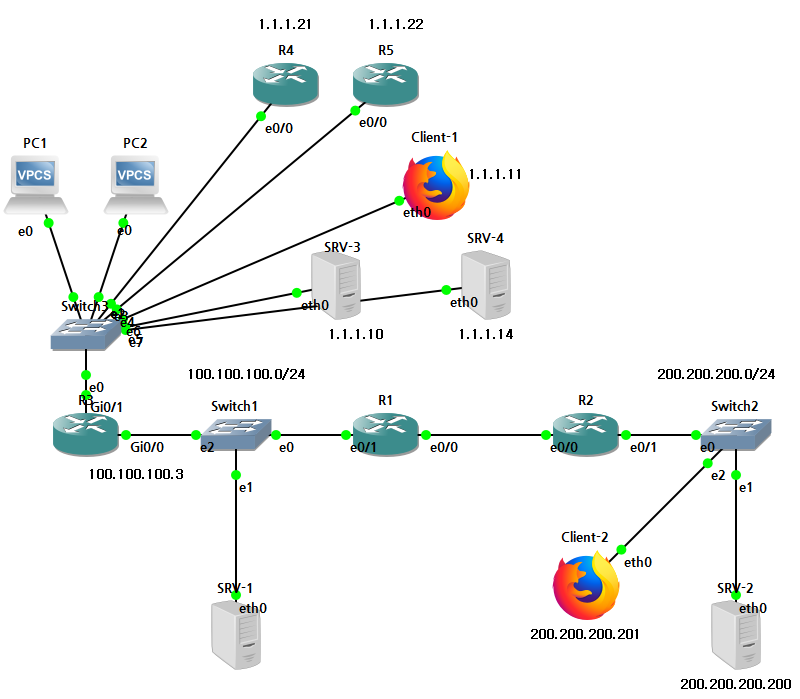
> R4, R5 추가

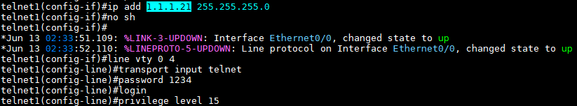
> R4, R5에 IP설정 및 Telnet 설정

##### 조건
모든 장비가 외부와 통신되도록 NAT설정   
R4(telnet1), R5(telnet2)는 외부에서 Telnet접속 가능하도록 설정   
참고 : Router에서 Port가 다른 경우 telnet 접속 방법 --->  telnet [IP] [Port주소]


<R3 NAT 설정>   
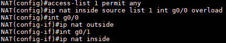   


<R4, R5에 default Routing>   
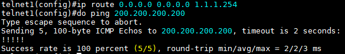
> SRV-2와 정상 통신
>
> default route

   


<R3에서 Port forwarding>   
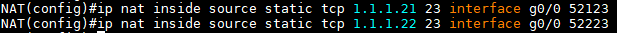   
> telnet은 TCP 사용
>
> telnet Port번호는 23
>
> 외부 Port는 임의로 지정


<R3 NAT table 확인>   
   


<telnet 확인>   
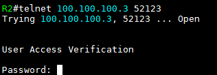   
> R2에서 R4 telnet 접속 확인 (R5 telnet도 가능)