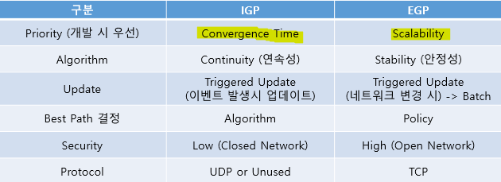
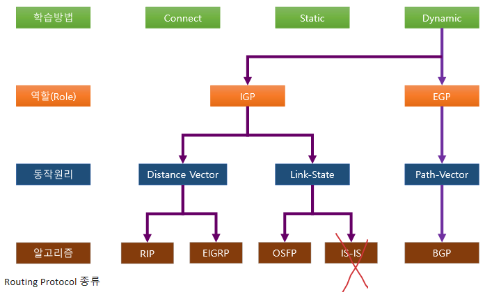
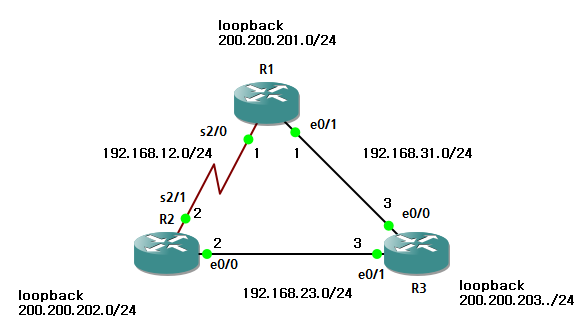
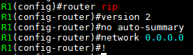
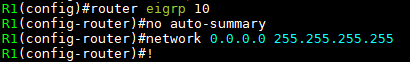
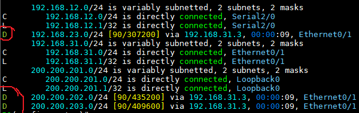
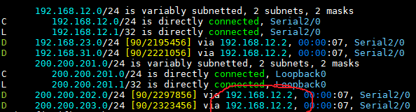
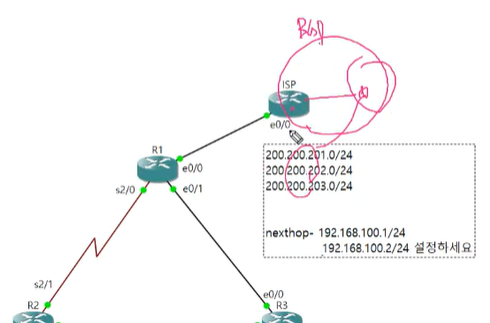

IGP & EGP
===

AS (Autonomous System)
---
> 하나의 관리자에 의해 운영되는 System(Network), 동일한 정책을 가진 집단

#### AS NO : 망 식별번호

- EGP (Exterior Gateway Protocol)에서 IP만을 가지고 특정 네트워크를 가진 집단 인식에 한계가 존재하여 특정 네트워크 집단만을 인식하려는 식별 번호
- 즉, AS NO를 이용하여 인터넷 상에서 독립적인 네트워크를 식별하고 외부 네트워크와의 경로 교환, 고유한 Routing 정책 구현이 가능
- 2byte(16bit) 주소체계 : 0 ~ 65535 --->  현재 AS NO는 4byte까지 확장한 주소체계
- ISP(인터넷서비스 제공자)로부터 IP를 받아서 사용하는 경우 ISP가 BGP를 구동하여 해당 IP를 Routing하기 때문에 AS NO를 발급 받아 BGP를 구동할 필요가 없음
- IP만 발급 받았을 때 AS NO와 BGP를 가동시켜야 인터넷 연결 가능 ---> 이떄 ISP 업체에 회선 대역폭등을 계약 후 연결
  - 현재 BGP는 인터넷에서 표준 Protocol

IGP와 EGP
---

#### IGP (Interior Gateway Protocol)
- 단일 AS 내에서 동작하는 Routing Protocol
- RIP, IGRP, EIGRP, OSPF 등

#### EGP (Exterior Gateway Protocol)
- 서로 다른 AS 간에 동작하는 Routing Protocol
- BGP

#### IGP vs EGP

#### Routing Protocol

예제 학습
---

   
> R1, R2의 Serial 회선은 속도가 느림

   
> R1, R2, R3에 똑같이 RIP설정 (IGP의 종류)

   
> R1의 Routing table 확인 (R표시는 RIP에 의해 생긴 경로)

##### ------------------------------------------------------------------------------------------------

   
> 이번엔 EIGRP 설정

   
> R1의 Routing table 확인 (D표시는 EIGRP에 의해 생긴 경로)
>
> 빠른 convergence time
> 
> 속도 표시

   
> 만약 R1의 e0/1을 shutdown하면 Routing 경로가 자동으로 바뀐다

   
> ISP에 의한 통신 topology
>
> ISP가 BGP를 이용하여 바깥으로 통신(광고)
> 이때 R1, R2, R3 네트워크의 **AS NO**를 이용

