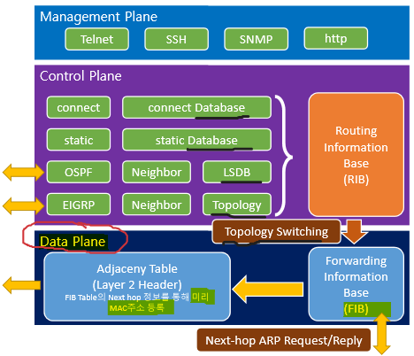
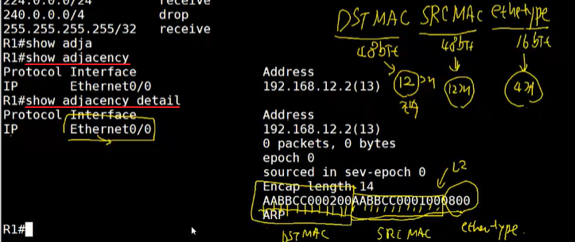
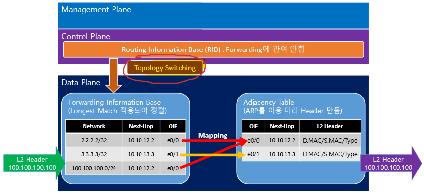
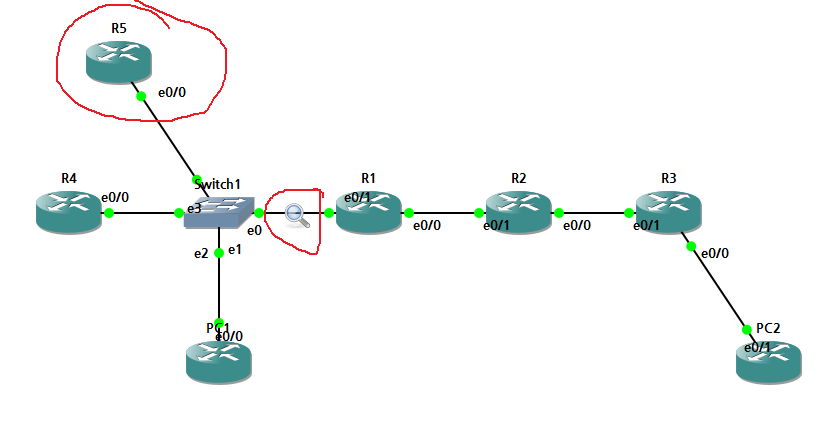
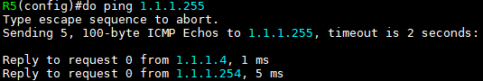
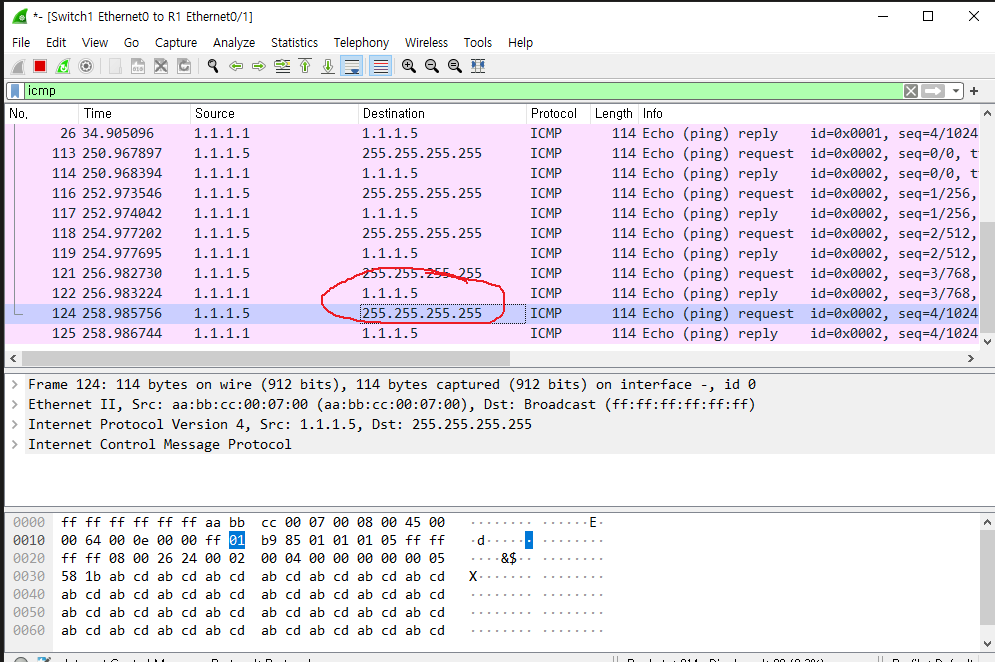
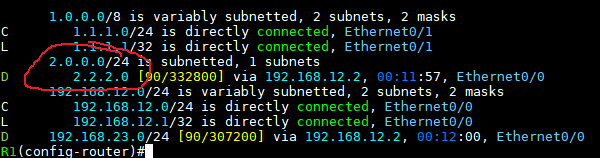
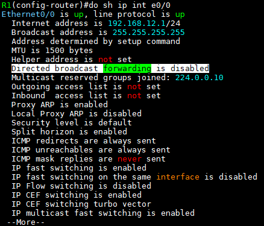

Unicast Routing Protocol
===

Router의 이해
---

1. Router는 서로 다른 네트워크와 연결
2. 1대의 Router Interface에는 같은 네트워크나 Subnet이 포함된 네트워크를 입력할 수 없음
   1. Connected Routing Protocol의 제약
   2. 같은 네트워크나 Subnet이 포함된 IP를 입력 시 **Overlap** Error message 발생
3. Router는 packet을 **Forwarding**(IP Header의 DST IP로)하기 위해 각 네트워크에 대한 Best path를 선출
4. 선출된 경로는 Routing table에 등록되고 packet의 Destination IP address 정보를 Routing table에서 lookup하여 Forwarding
5. Routing table 확인   
    ```
    # show ip route
    ```


Best-Path 선출 기준
---

#### 1. Longest Match

> Subnet 길이가 가장 긴 네트워크를 최우선 순위

- 서로 다른 Subnet 값을 가지고 있으면 Subnet 값이 가장 큰 네트워크를 Best-path의 최우선 순위로 등록 **(Packet forwarding 할 때 최우선 순위)**
- Subnet 값이 가장 크다는 것은 자세한 네트워크라는 의미

#### 2. Administrative Distance (AD)

- 서로 다른 Routing protocol의 우선 순위

#### 3. Routing protocol의 Algorithm

- 같은 Rouitng protocol에서 Algorithm에 의해 best-path를 선출
- **Metric** : 거리비용. 정해진 출발지에서 목적지까지 가는 임의의 거리 단위


##### Packet forwarding 우선 순위----------
Longest Match rule --> AD --> Metric

##### 장비의 Best-path selection 우선 순위----------
(Best-path를 찾는 순서)

Metric --> AD --> Longest Match rule


### [정리]

#### <Routing table 경로 등록 조건>
1. 같은 Routing protocol에서 우선 순위 확인 (Metric)
2. 다른 Routing protocol에서 우선 순위 확인 (AD)
3. 서브넷 길이가 다르면 모두 등록
4. 1=2=3이면 등록 후 Load Balancing

#### <Packet Forwarding (Routing table Lookup)>
1. 서브넷 길이가 가장 긴 것을 우선 순위 (Longest Match Rule)
2. 다른 Routing protocol의 우선 순위 확인 (AD)
3. 같은 Routing protocol의 우선 순위 확인 (Metric)


Router Plane (Router 평면)
---




- Management Plane
  - 장비 관리를 위한 접속 도구를 제공

- Control Plane
  - Process 즉, software가 작동되는 영역
  - ex) Interface를 no shutdown ---> connect process가 동작하면서 네트워크 정보를 update (CPU 관여)
  - Process switching --> Fast switching --> Optimal switching 으로 발전
  - RIB(Routing Information Base) Table 확인
    ```
    # show ip route
    # show ip route [network주소]
    ```
- Data Plane
  - 통신속도가 빨라지면서 CPU의 process 처리량에 한계가 옴.
  - 이러한 문제를 해결하기 위해 forwarding date를 전용으로 처리하는 영역. 하드웨어 칩
  - Topology switching (CISCO CEF)
  - FIB Table 확인
    ```
    # show ip cef
    ```
  - Adjacency Table 확인
    ```
    # show adjacency
    # show adjacency detail
    ```

    

  - Layer 2 Header는 Destination MAC address, Source MAC address, Ethertype을 미리 만들어 놓음


#### Topology switching 이해




IPv4, IPv6 Unicast Routing
---

> Routing은 IPv6용, IPv4용, Unicast Routing, Multicast Routing 각각 존재
>
> Routing의 근본적인 목적은 네트워크를 분할하여 Broadcast 범위를 축소시켜 사용 (Broadcast Routing은 존재하지 않음)


### 1. IPv4 Unicast Routing
> Router 기본 활성화, L3는 기본 비활성화

```
(config)# ip routing
(config)# no ip routing
# show ip route
```

### 2. IPv6 Unicast Routing
> 기본 비활성화

```
(config)# ipv6 unicast-routing
(config)# no ipv6 unicast-routing
# show ipv6 route
```

### 3. IPv4 Multicast Routing
> 기본 비활성화

```
(config)# ip multicast-routing
(config)# no ip multicast-routing
# show ip mroute
```

### 4. IPv6 Multicast Routing
> 기본 비활성화

```
(config)# ipv6 multicast-routing
(config)# no ipv6 multicast-routing
# show ipv6 mroute
```

### 5. Broadcast 종류

- network broadcast : 해당 네트워크의 마지막 주소


#### (1) connected network의 경우
- 해당 Interface가 Broadcast 주소인 것을 알 수 있기 때문에 255.255.255.255 로 통신 시도







> Switch1과 R1 사이의 packet 이동

- 1.1.1.255로 ping을 보냈지만 R1에서 255.255.255.255 주소로 바꿔서 인식

   

> R1의 Routing table

- 위 Routing table에서 해당 네트워크 범위 안에 IP만 Routing 가능하다는 뜻 ---> 실제 Destination 네트워크는 실제 네트워크 주소 범위가 다를 수 있다




> R1의 int e0/0

* 흰색 Line 표시 : 네트워크 broadcast 주소로 입력된 packet은 전달하지 않겠다 라는 뜻


#### (2) connected network가 아닌 경우
- Routing ---> packet이 계속 forwarding
- connected가 있는 Router에서 255.255.255.255로 변경되어 전달 (보안상 전달 기능은 disable)

```
(config-if)# ip directed-broadcast       ---> enable
(config-if)# no ip directed-broadcast    ---> disable
```

- 위와 같은 이유 때문에 network broadcast를 directed broadcast라고 부름
  - Limited broadcast    ---->  IPv4: 255.255.255.255, MAC: ff:ff:ff:ff:ff:ff


#### (3) connected Routing Protocol (Interface에 IP 입력)의 제약

1. 1대 Router에는 같은 네트워크 또는 서브넷마스크에 포함된 네트워크를 입력하지 못한다 (**overlap**)
2. Interface에 IP가 입력되었지만 비활성화 상태이면 Routing table에 등록되지 못한다. ---> 비활성화 Interface에는 같은 네트워크 입력 가능 (EEM을 이용해서 Interface를 활성화,비활성화를 하여 이중화 가능)
3. connected는 IP가 입력되어 있고 활성화 상태이면 connected DB에 네트워크 정보를 입력
  