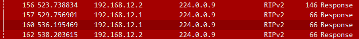
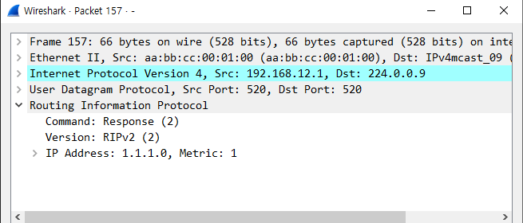
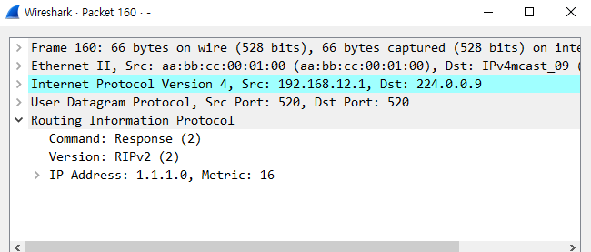
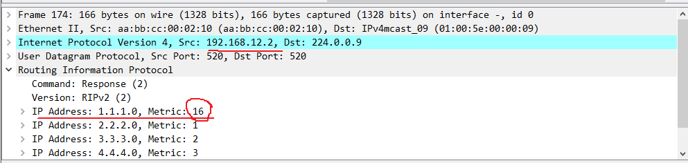
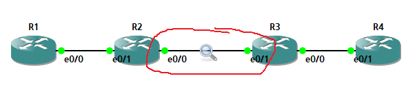
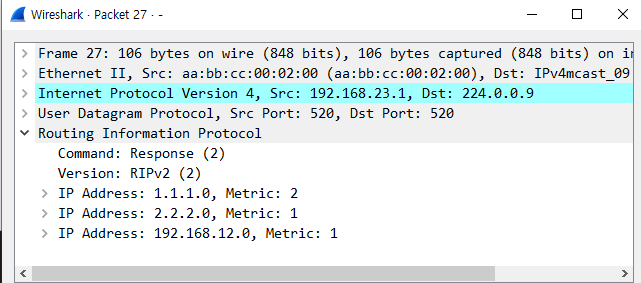
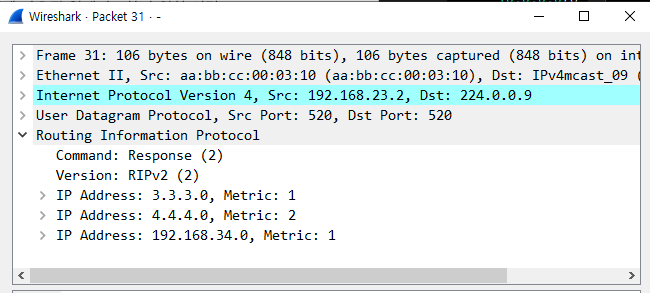
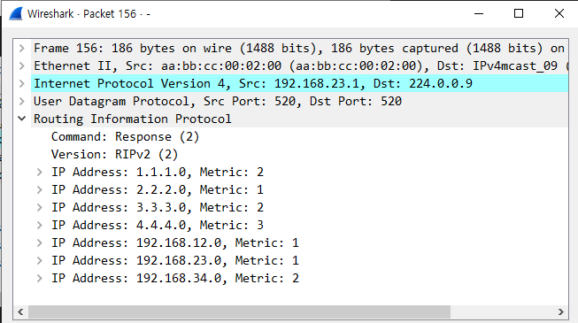
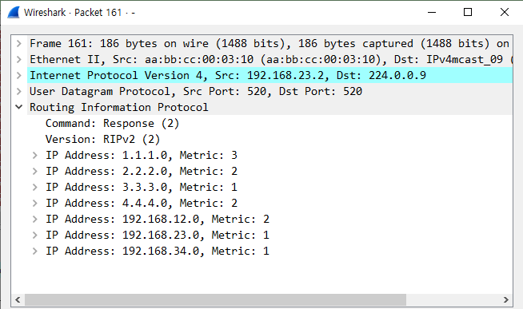
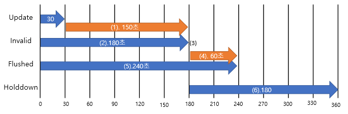

RIP Loop 방지
---

- Distance Vector(거리 벡터) Routing Protocol의 최대 단점 ---> **Routing Loop 발생**

- Routing Loop 방지법
  - **Max hop limit** (Count infinity)
  - **Route poisoning** (Triggered update)
  - **Poison Reverse**
  - **Split Horizon**
  - **Hold down timer**

Max hop limit (Count infinity)
---
> RIP에만 존재

- RIP의 Metric인 Hop count가 무한해지는 것을 방지
  
- RIP의 **Hop count를 15로 제한**
- Routing Loop가 발생 시 Routing update가 이뤄질 때마다 Hop count가 1씩 증가
- 위와 같은 현상을 방지하기 위해 15 Hop으로 제한
- RIP는 15 Hop 이상의 Routing 정보를 받아들이지 못함


Route poisoning (Triggered update)
---

- **RIP는 매 30초마다 주기적인 Routing database 전체를 이웃 Router에게 전달**하는 방식(Update)

- 네트워크가 변화되었을 때 각 RIP Router는 Routing 정보가 일치하지 않은 시간이 너무 길고 그로 인해 Routing Loop가 발생할 확률이 높음
  - 변화된 네트워크 정보를 받지 못하고 정보의 전달이 늦어짐에 따라 기존 Routing 정보를 즉각적으로 전달하여 수렴(Convergence)하지 못함으로 발생

- Triggered update는 전체 Routing 정보를 주기적으로 전달하는 것이 아니라 **네트워크 변화가 발생된 네트워크만 즉각적으로 Routing update**를 하는 것
- 특히, 네트워크의 down 시 해당 네트워크의 hop수를 **16 hop으로 바꿔서** Routing 정보를 즉각적으로 전달하고 이를 **Route poisoning**이라고 함


> 위 topology에서



> 192.168.12.1 은 R1의 Interface e0/0의 IP
> 
> R1 --> R2 경로에서 R1 lo 0 Interface를 shutdown 하였음
> 
> 30초마다 정보를 보내지만 네트워크에 변화를 감지하자마자 Routing table 전체를 또 보냄 (Update)

- R1 Interface lo 0 정상 작동 중일 때



> R1 --> R2 packet 이동을 관찰

- R1 Interface lo 0을 shutdown 했을 때



> Metric 값이 1에서 16으로 바뀜 ---> max값을 R2로 보냈다는 뜻




> R2에서 Reply를 보냄(ACK)
>
> R2-->R1
>
> R1에서 보낸 1.1.1.0 네트워크 주소를 다시 Reply (metric 16)
>
> 이는 아래 2가지 의미로 해석 가능   
>   - 우회경로 없음   
>   - Route poisoning의 ACK   

Poison Reverse
---

- Route poisoning 정보를 받은 Router는 다른 경로가 있는지 확인 후 없을 경우 해당 네트워크를 16 hop으로 바꿔서 보내 다른 경로가 없다는 것을 알려줌

- Poison Reverse를 받은 Router는 정보를 수신하지만 이 정보는 유효하지 않기 때문에 무시할 수 있음


Split Horizon
---

- **특정 Router가 전달한 Routing 정보를 수신한 후 다시 그 Router로 수신한 정보를 전달하지 않음**
- **Routing update 범위(Horizon)를 각 Interface 단위(neighbor 단위)로 분리(split)시킨다는 뜻**
- Split Horizon 활성화 여부 확인
  ```
  # show ip interface
  ```
- Split Horizon 비활성화
  ```
  (config-if)# no ip split-horizon
  ```

- point-to-point 방식으로 연결한 경우 split horizon으로 인해 Routing 정보가 update 안될 수 있기 때문에 필요에 따라 활성화 or 비활성화 해야 함
- ***Split Horizon은 모든 dynamic routing에 적용. Interface에 설정***



> 위 topology에서


> R2 e0/0와 R3 e0/1에 Split horizon이 설정되어 있는 경우
>
> R2 --> R3
>
> R2느 R3와 R4에서 받은 네트워크 주소를 다시 보내지 않는다



> R3 --> R2
>
> R3는 R1과 R2에서 받은 네트워크 주소를 다시 보내지 않는다

- 반대로 split horizon을 해제했을 경우
  

> R2 --> R3
> 
> R2는 R3, R4에서 들어온 네트워크 주소를 또 R3로 보낸다


> R3 --> R2
>
> R3는 R1, R2에서 들어온 네트워크 주소를 또 R2로 보낸다


Hold down timer
---

- Ring type의 topology의 경우 자신이 전달한 Routing 정보를 다시 수신하는 경우가 발생할 수 있음
- Hold down timer는 **CISCO Router**에서만 동작
- Hold down timer는 **특정 네트워크가 down 상태가 돼서 이에 대한 새로운 Routing 정보를 수신하더라도 이를 즉각적으로 Routing table에 반영하지 않고 일정 시간 동안 down 상태의 기존 정보를 유지**하게 하는 방법

- RIP는 매 30초마다 Routing 정보가 update되므로 네트워크 변화 정보가 모든 Router로 완전하게 전달되지 못하기 때문에 Loop가 발생할 수 있음
- 따라서 Hold down timer 동안 모든 Router로 Routing update가 전달되는 시간(convergence time)을 확보하기 위한 것
- **Hold down timer가 동작되는 시간동안 유효한 Routing 정보의 update도 보류되고 해당 네트워크의 정보는 down 상태로 유지**


RIP Timer
---

#### Update timer
- 전체 Routing table을 주기적으로 update하는 시간 주기
- Default **30초**
- Routing 정보를 수신하는 Router가 Routing update를 수신하면 Update timer는 **0으로 초기화**

#### Invalid timer
- **유효하지 않은 (update가 도착하지 않은) Routing 정보를 유지하는 시간**
- 주기적인 Routing update가 이뤄지지 않는 네트워크를 Invalid network로 등록하기 위한 timer
- Default **180초**
- Route poisoning을 수신한 Router는 즉각적으로 삭제하지만 Route poisoning을 수신하지 못하면 Invalid timer가 만료될 때까지 해당 네트워크의 down 사실을 인지하지 못함
- Invalid timer가 만료된 후 holddown timer가 작동


#### Flushed timer
- **Routing 정보를 삭제하는 시간**
- Invalid timer(180초)가 만료된 네트워크 정보를 바로 삭제하지 않고 60초간 유지되고 삭제됨 ---> 즉 default 240초


#### Holddown timer
- CISCO 장비에만 존재하는 timer
- 새로운 update 정보가 수신돼도 일정 시간 동안 Routing table에 반영하지 않는 시간
- default 180초




(1) 30초마다 이뤄지는 Routing update가 원활하지 못할 경우를 위한 여유시간

(2) 180초 동안 네트워크가 down 되었지만 인지하지 못함

(3) Invalid time 이후 유효하지 않는 네트워크로 등록

(4) 유효하지 않는 네트워크 정보를 다른 neighbor에게 Routing update를 하기 위한 시간

(5) 네트워크 정보가 down 되었더라도 유효하지 않는 네트워크 정보는 Routing table에 보관되고 Flushed timer 시간이 만료되면 Routing table에서 삭제

(6) 유효하지 않는 네트워크에 대한 새로운 경로 정보가 수신되더라도 해당 정보를 우선 차단