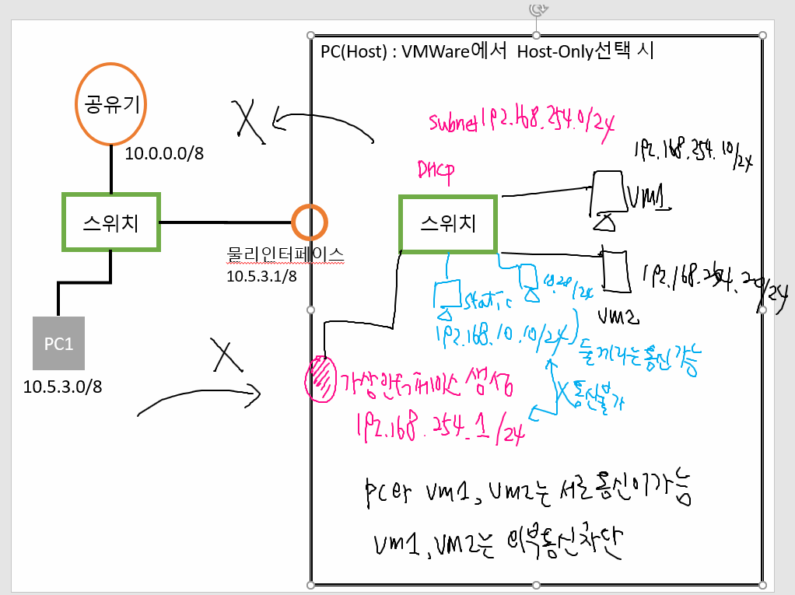
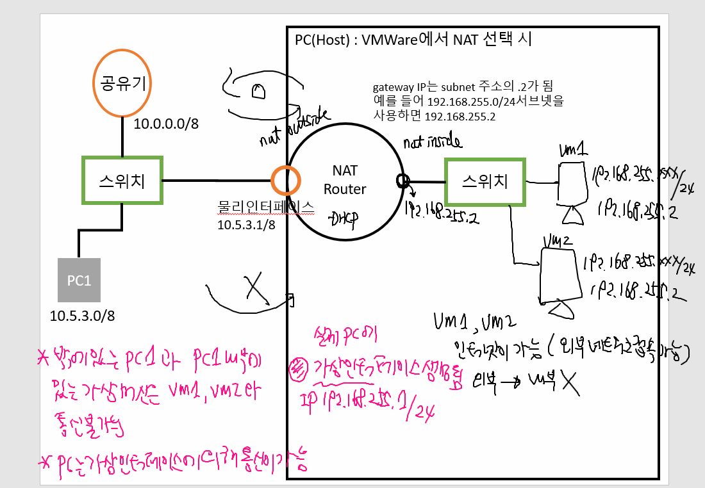
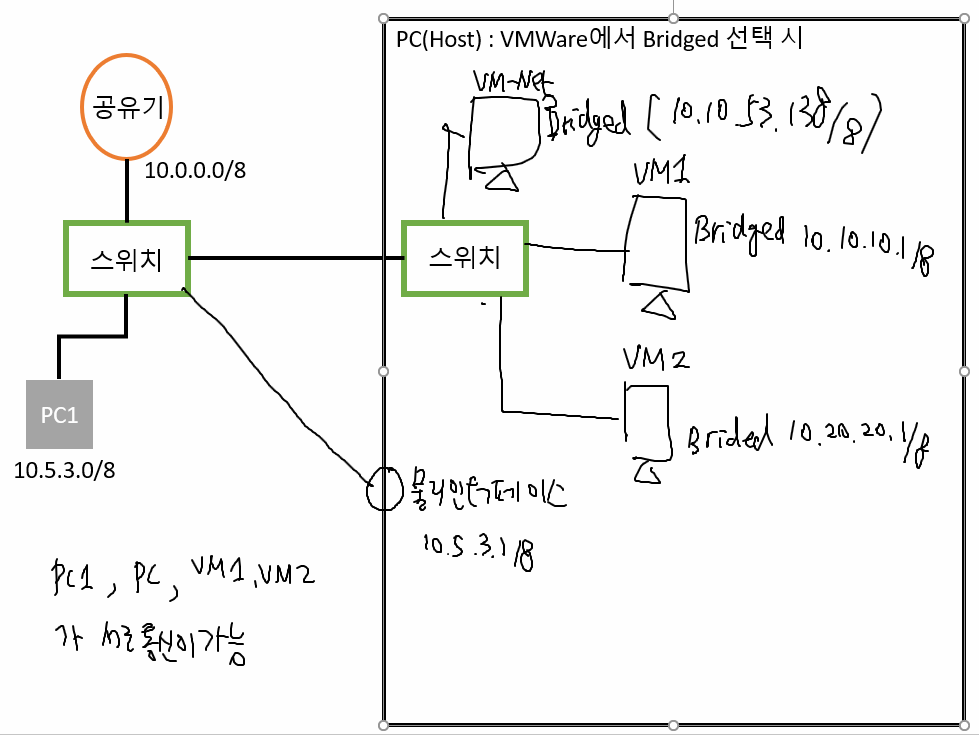
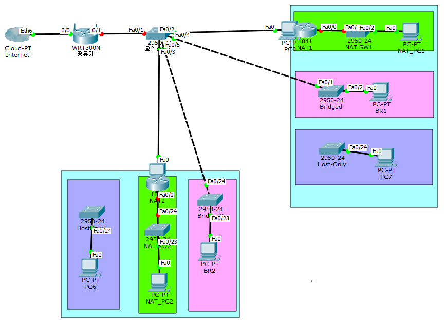

VM_Host-only, NAT, Bridged
===

Host-only (Vmnet1)
---

- 외부 네트워크와 연결 없이 Host-only 네트워크 mode를 사용하는 Vmware끼리만 통신이 가능하다.

- 즉, Vmware 끼리 네트워크 대역이 따로 구축되어 있다.   
  따라서 외부 네트워크, Host PC와는 통신이 안되고 서로 통신 가능

- PC(Host)와 VM1, VM2는 서로 통신이 가능하지만 VM1, VM2는 외부 통신 차단

NAT (Vmnet8)
---

- Vmware를 사용할 때 가장 많이 사용하는 네트워크 방식이 아닐까 싶다.

- NAT 방식을 사용하는 Vmware는 IP를 Host pc에게서 할당을 받는다. 그리고 Host PC는 공유기로부터 IP를 할당받는다.

- 외부에서 내부로의 통신을 차단

- NAT 설정에 의해 10.0.0.0/8 네트워크에서 192.168.255.0/24 네트워크로 변환

- PC1에선 PC(host) 내부에 있는 Virtual machine VM1, VM2와는 통신이 불가능하지만 PC(host)는 가상 Interface를 통해 통신 가능

Bridged (Vmnet0)
---

- NAT와 Bridged는 Vmware가 IP 할당을 어디서 받느냐의 차이로 나뉜다.

- NAT 방식을 사용하는 Vmware가 IP를 Host PC에게서 받았다면,   
  Bridged 방식을 사용하는 Vmware는 IP를 공유기로부터 직접 할당 받는다.

- 즉, 공유기가 Host PC와 Virtual machine에 같은 네트워크 대역의 IP를 각각 할당하기 떄문에 Host PC와 Virtual machine은 동일한 수준의 물리적 PC로 인식된다.

- Bridged 네트워크 방식
- 일종의 Switch 확장처럼 사용 가능 

- PC1, PC(Host), VM1, VM2 서로 통신 가능

