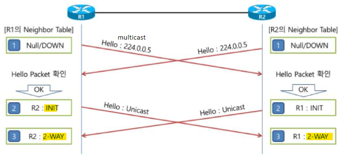
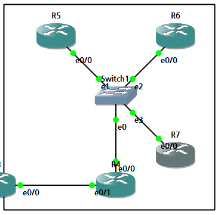
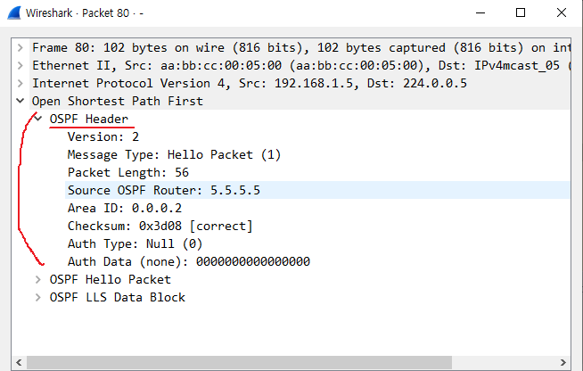
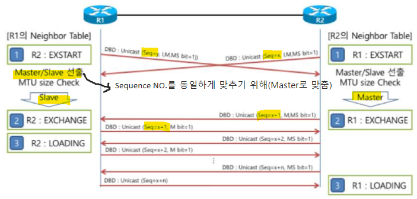
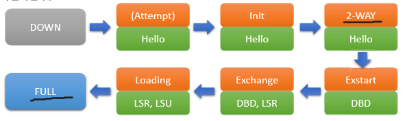
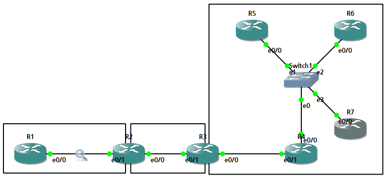
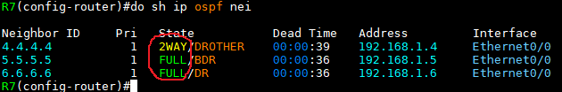
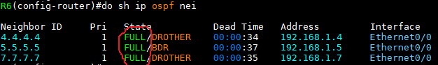
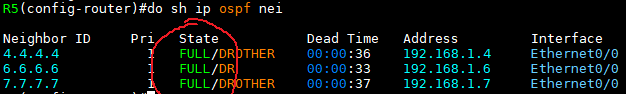

OSPF Mechanism
===

Neighbor 등록 - 2WAY State
---

### OSPF neighbor 등록
- RIP는 'Neighbor Table'을 만들지 않고 주기적으로 Update packet을 보내므로 공격자가 잘못된 네트워크 정보를 만들어 Update packet을 보낼 수 있어 보안에 취약하다. --->  **neighbor가 만들어진 이유**

- EIGRP, OSPF, BGP와 같은 Routing protocol은 **Neighbor로 인정한 장비로부터만 Update pacekt을 받는다.**   
  그러기 위해 neighbor로 인정한 장비 목록을 'Neighbor Table'에 등록하고   
  상대방 장비를 neighbor로 인정할 것인지에 대한 여부를 확인하기 위해 EIGRP, OSPF, IS-IS는 **Hello packet**을 이용하고 BGP는 'OPEN message'를 이용한다.

- EIGRP는 상대방이 보내온 Hello packet을 확인하여 자신이 neighbor로 인정하면 바로 neighbor 관계가 성립되지만, OSPF는 **상대방도 자신을 neighbor로 인정했는지 여부를 확인**해야만 neighbor 관계가 성립된다.
- 즉, **OSPF는 자신도 상대방을 neighbor로 인정하고, 상대방도 자신을 neighbor로 인정한 것을 확인해야 neighbor 관계가 맺어진다.**   
  이 상태를 **2-WAY** 상태라고 한다.

- OSPF neighbor는 DB를 동기화하는 'Adjacency Neighbor'와 DB를 동기화하지 않고 '2-WAY' 상태를 유지하는 'non-Adjacency Neighbor'가 있다.




#### 1. Null or Down 상태
- neighbor 관계를 형성하기 위한 초기 상태
- 아무런 정보도 수신되지 않은 상태

- down 상태의 OSPF Router는 OSPF 활성화된 Interface로 Hello packet을 보낸다.
- 이때 Hello packet엔 neighbor list를 표시하는 필드를 비어 있는 상태로 전달하고 해당 Hello packet을 통해 현재까지 검색된 neighbor가 없고 neighbor를 검색하기 위한 Hello pakcet으로 인식


#### 2. Attempt 상태 (Broadcast 네트워크엔 없음)

- OSPF neighbor를 검색하기 위한 시도를 하는 상태

- NBMA (Non Broadcast Multiple Access : x.25, Frame Relay, ATM) 네트워크에서만 존재

- OSPF는 Multicast를 이용해 전달하지만 NBMA 네트워크는 Broadcast나 Multicast 트래픽을 허용하지 않음
- 위와 같은 이유로 OSPF packet 교환을 Unicast로 통신을 해야 한다.   
  ```
  (config-router)# neighbor [neighbor Router Interface ID]
  ```
- Attempt 상태는 NBMA 네트워크에서 neighbor 명령어를 설정했을 때 나타나며 해당 Interface에 OSPF가 활성화되어 neighbor 관계를 시도(Attempt)한다는 것을 의미


#### 3. Init 상태
- **neighbor를 맺기 위한 조건**
- 상대 Router로부터 Hello packet을 수신한 상태

- 받은 Hello packet의 neighbor list가 비어 있다는 것을 인지하고 이를 통해 상대 Router가 아직 자신을 발견하지 못했다는 것을 알 수 있다.
- 양방향 통신(2-WAY)
- OSPF Adjacency 단계가 시작된 것으로 인접 관계 확립을 위해 초기화(Initiate)가 됐다는 것으로 해석
- 즉, OSPF Router가 전달한 Hello packet을 상대 Router가 받았다면 상대 Router로부터 수신되는 Hello packet 안에서 자신의 Router ID를 발견하고 양방향(2-WAY) 상태로 진행


##### Step 1. Hello packet의 OSPF Header 정보 확인
1. OSPF Version : Version 동일
2. Packet Type : 1 (Hello packet)
3. Router ID : 자신의 Router-ID와 달라야 한다. (같을 경우 Hello packet을 무시)
4. Area ID : Hello packet을 받은 Interface와 Area ID가 반드시 동일
5. Authentication : 자신의 인증 Type 및 인증 정보(password 등)와 반드시 동일

##### Step 2. Hello packet의 Data 정보 확인
1. Network Mask : OSPF Network Type이 Broadcast, NBMA인 경우 반드시 동일
2. Hello Interval, Dead Interval : Hello packete을 받은 Interface의 정보와 반드시 동일
3. Options : 'N bit'(NSSA 여부)와 'E bit'(Stub area 여부)는 자신의 정보와 반드시 동일   
   Area의 Stub와 NSSA 선언 시 동일한 Area에 있는 모든 Router에 선언해야 한다. (Area 0에선 선언하지 못함)
4. Neighbor List : 자신이 List에 존재하면 해당 Neighbor의 Dead Interval을 초기화
5. (Neighbor List에 자신이 없으면 Step 3을 수행)


##### Step 3. 자신의 Neighbor List에 등록
1. Hello packet을 확인한 결과, 상대방을 Neighbor로 인정하면 'Neighbor table'에 등록한다.
2. 자신만 neighbor로 인정한 상태이기 때문에 neighbor의 상태를 'INIT' 상태로 표기한다.
3. 'INIT' 상태로 등록된 Neighbor에게 Unicast로 Hello packet을 전달한다.


#### 4. 2-WAY 상태
- OSPF Router 간에 양방향 통신이 이뤄진 상태

- Neighbor List 필드에 자신의 Router ID가 존재하는 것을 보고 Hello packet을 수신하여 인지했다는 것을 알게 되고 양방향 통신이 확립되었다는 것으로 인식
- 즉, 양방향 상태 : OSPF neighbor 단계 마무리


OSPF Router-ID 지정 방법
---

1. \# router ospf [process-ID]에서 Router-ID 지정
   ```
   # router-id [IP형식]
   ```

2. Router에 입력된 IP 중 가장 큰 IP   
   이때, Loopback Interface에 입력된 IP가 우선

3. Router-ID가 지정되면 변경되지 않음   
   (OSPF의 non-preempt 특징)

4. Router-ID를 변경하려면 Router를 재시작 or OSPF process를 재시작
   ```
   # clear ip ospf process
   ```



(R5와 Switch1 사이의 packet 이동)   



DBD 교환
---

- 2-WAY 상태에서 Adjacency neighbor로 확인되면 DB의 동기화를 위하여 자신이 가지고 있는 DB 요약정보를 전달 (DBD packet)




#### 1. Exstart 상태
- neighbor 간에 Master/Slave 관계를 결정

- DB 동기화를 간단하게 하기 위해 DBD의 **packet sequence number**를 결정하는 과정
- DBD의 packet sequence number를 통해 DB 변경 유무를 확인하기 때문에 모든 OSPF Router는 동일한 packet sequence number를 가져야 하며 이 sequnce number를 일정하게 유지하기 위해서 Master/Slave를 결정
- Seqeunce number는 항상 Master에 의해 결정되고 Slave는 Master의 sequence number에 응답하는 형태로 동작
- **Router-ID가 가장 높은 Router가 Master로 결정**
- 첫번째 DBD packet을 전송 시 각 장비는 아래와 같이 작동한다.
  - 각 장비는 무작위로 Sequence number를 설정하여 전송한다. 그리고, 첫번째 DBD packet이기 때문에 'I bit'을 1로 설정하고, 'M bit'도 1로 설정
  - 아직 Master/Slave를 선출한 상태가 아니므로 자신이 Master라고 'MS bit'도 1로 설정하여 전달
  - 상호 간에 첫번째 DBD packet을 교환하고 나면 Router-ID를 비교하여 Master/Slave를 선출하게 되는데   
    Slave 장비는 Master에게 먼저 DBD packet을 전달할 수 없고, DBD packet을 전달할 때 'MS bit'를 0으로 설정하여 전달

#### 2. Exchange 상태
- neighbor 간에 Master/Slave를 선출하면 Exchange 상태로 변경

- 만일 MTU size에 문제가 있다면 EXSTART 상태에서 멈춤
- 이때부터 **LSA 교환**을 통해 본격적인 DB 구축
- neighbor를 맺은 Router들은 서로 DBD packet을 교환하여 자신이 구축한 DB 정보를 서로 교환하고   
  수신한 DBD packet을 살펴본 후 자신의 DB와 다른 점을 발견한다면 다음 단계인 Loading 단계를 진행하여 **LSU** packet을 통해 neighbor로부터 필요한 LSA를 요청
- 따라서, **Exchange 상태는 DB의 정보 교환을 하여 동기화를 시작하는 단계**

- **OSPF**는 packet으로 사용되는 LSAck packet을 Update packet에 대해서만 보내도록 만들어져 DBD packet에 대해서는 상대방이 잘 받았는지 여부를 확인할 수 없음 ---> **Sequence number를 사용**

- 만일, 중간에 packet이 유실된다면 다음과 같은 상황이 발생할 수 있다.
  - Case 1 : 다음 packet을 받지 못한다면, 자신이 보낸 DBD packet을 받지 못하였다고 판단하여 Retransmit Interval(default 5초) 후에 'Seq=201'을 재전송
  - Case 2 : 다음 packet을 받아야 하는데 이전에 받았던 DBD packet이 다시 들어오는 경우 상대방이 자신이 보낸 DBD packet을 받지 못하여 재전송하였다고 판단하여 바로 다시 재전송   

  ---> Ack 없음(LSU만 있음)   
  ---> **DBD 교환은 Sequence number로 확인**


#### 3. Loading 상태
- DBD packet 교환을 통해 각 DB의 다른 점을 인지한 후 **LSA 정보의 요청과 전달**이 이루어지는 단계

- neighbor가 전달해 준 Link-State 정보를 Local DB에 Load


#### 4. Full 상태
- DBD packet을 통해 상호 간에 DB를 비교하고 LSR, LSU를 통해 **동일한 DB가 구축 완료된 상태**
- 즉, neighbor 간에 DB가 완전하게(Full) 동기화 되어있는 상태
- 동일한 영역 내에 존재하는 모든 OSPF Router는 동일한 DB를 가진다는 뜻이다.





### 정리
- DBD는 Seq No를 이용하여 ACK 확인

- LSR은 LSU를 이용하여 ACK 확인
- LSU는 LSAck를 이용하여 ACK 확인   ---> 만약 ACK를 못받으면 Retransmit interval (ACK를 기다리는 시간) 동안 대기 후 해당 packet을 재전송 ---> 16회 동안 ACK를 받지 못한다면 neighbor 연결 해제





> R4와 R7은 neighbor만 유지 ---> 2-WAY 상태 (DR과 BDR과는 FULL 상태 유지)


   
> DR과 연결된 Router는 모두 FULL


   
> BDR도 마찬가지

