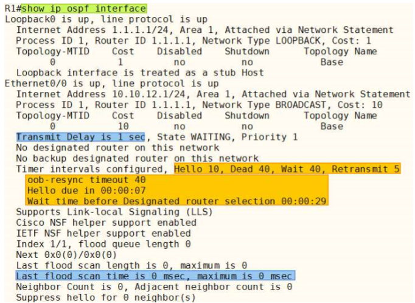

OSPF Timer (Interface Timer)
---

### Interface Timer
> 변경 권장하지 않음 (SPF 알고리즘 계산 Timer)
```
# show ip ospf int e0/1         ---> Timer 확인 명령어
```

- **Hello Interval** : neighbor에게 주기적으로 Hello packet을 전달하는 시간 주기

- **Dead Interval** : neighbor에게 Hello packet을 받지 못했을 때 neighbor 장치가 down 상태인 것을 인지하는 시간
- **Wait Interval** : 초기 DR 선출 시 기다리는 시간, Dead Interval과 동일
- Transit Delay : neighbor에게 packet을 보낸 후 해당 packet이 neighbor에게 도달하는데 걸리는 시간
- oob-resync timeout : neighbor가 NSF 기능을 가진 경우 RP(Routing Protocol) Switchover 후 Resync를 위해 기다리는 시간
  - NFS (Non Stop Forwarding) : Control Plane에 장애가 발생하더라도 Data Plane의 FIB 정보를 이용해 Forwarding을 계속하는 기술. HA(고 가용성)

- Hello due : 다음 Hello packet을 보내는데 남은 시간
- Wait time : DR 선출을 위해 남은 시간. DR 선출 후엔 표시되지 않음
- Scan time : 하나의 LSA를 Interface로 Flooding 하는데 사용된 시간

일반적으로 초기 Timer 설정 값을 변경하는 것을 권장하지 않음   
무중단 네트워크 서비스를 요구하는 고객의 경우 요구조건에 맞게 변경이 필요

- OSPF의 Interface timer는 **(config-if)#** Interface 설정모드에서 변경


#### Interface timer 확인 명령어
```
# show ip ospf interface [Interface No]
```



- **Transmit Delay is 1 sec**
  - neighbor에게 OSPF packet을 전달하는데 소요되는 시간
  ```
  (config-if)# ip ospf transmit-delay [1~65,535초]
  ```   

  ```
  # show ip ospf database           ---> neighbor의 age time이 설정한 값으로 증가

  ### (neighbor를 맺은 이후 neighbor를 맺을 때의 값보다 크면 neighbor를 재수립)
  ```

- **Timer intervals configured, Hello 10, Dead 40, Wait 40, Retransmit 5**
  - Network Type에 따라 Default 시간이 다름   
  
  ```
  (config-if)# ip ospf hello-interval [초]

  (config-if)# ip ospf dead-interval [초]
  ```
  - hello-interval만 적용했을 경우 dead-interval은 자동으로 hello-interval의 4배로 적용
  - dead-interval만 적용했을 경우 hello-interval은 자동 변경되지 않음

|Network Type|Hello Interval|Dead Interval|비교|
|:---:|:---:|:---:|:---:|
|Point-to-Point|10초|40초|표준|
|Broadcast|10초|40초|표준|
|Point-to-Multipoint|30초|120초|표준|

  - Wait Interval은 별도로 설정하는 값이 없음
    - 처음 DR을 선출할 때, 혹시나 DR이 될 수 있는 우선순위가 더 높은 장비가 존재할 수 있어서 DR 선출하기 전에 기다리는 시간
    - Dead Interval = Wait Interval
    - DR을 처음 선출하는 경우, Wait Interval동안 'Wait time before Designated router selection' 정보를 통해 Wait Interval이 얼마나 남았는지를 확인
    - DR 선출 후에는 해당 정보가 사라짐

  - **Retransmit Interval**은 LSU packet을 보내고 LSAck을 받지 못한 경우 재전송을 하기 위한 시간
  ```
  (config-if)# ip ospf retransmit-interval [1 ~ 65,535초]
  ```

  - oob-resync timeout은 NSF 기술을 적용했을 때,   
  neighbor에 Active Route Process에 문제 발생 시 Standby Route Process로 Switchover 되는 경우,   
  neighbor는 RP-bit를 설정한 Special Hello packet을 전달하고 이 Hello packet을 전달 받은 neighbor의 Route process가 제대로 동작하는 동안 neighbor 관계를 down하지 않고 기다리는 시간을 'oob-resync delay' 라고 함
  ```
  (config-if)# ip ospf resync-timeout [1 ~ 65,535초]

  ### Default 값은 oob-resync timeout = Dead Interval
  ### Dead Interval 보다 크게 설정하는 것을 권장
  ```

  - Last flood scan time is 0 msec, maximum is 0 msec
    - LSA를 전달하는데 소요된 시간과 최대 시간 (고속에서는 0 msec, 저속에서는 시간이 나타남)


OSPF Timer (SPF Timer)
---

> SPF 알고리즘을 계산하기 위한 Timer

```
(config-router)# timer ?
```

- LSA Arrival (lsa)
  - 동일 LSA 정보에 대해 무시하는 시간
  - Default 1초. neighbor에게 LSA를 받고 동일 LSA에 대한 Update 정보를 얼마나 무시할 것인가를 결정
  - 경로가 다중으로 구성된 경우 동일한 LSA를 여러 neighbor에게 받을 수 있기 때문에 설정

- LSA Pacing
  - Flood : LSA가 많은 경우 다음 LSA를 전달하는데 대기하는 시간
  - LSA-Group : 30분에 한 번씩 Flooding 되는 LSA를 한번에 전달하는 시간
  - Retransmission : 재전송하는 경우 다음 LSA를 전달하는데 대기하는 시간

- Throttle
  - LSA : Link 변경 시 LSA를 생성하기 위해 대기하는 시간
  - SPF : 다음 SPF 알고리즘을 수행하기 위해 대기하는 시간
  - 장비에 Link 정보가 너무 자주 변하는 경우 SPF 계산이 자주 이루어짐 ---> 이를 방지하기 위해 LSA를 전달하지 않고 기다리는 시간 (Default 5초)

```
# show ip ospf          ---> 시간 확인
```

- Cisco에선 위 값을 변경하는 것을 권장하지 않음. 빠른 Convergence time이 필요한 경우 낮게 설정


OSPF Network Type
---

- 물리적 구조 기준 Network type

|구분|설명|
|:---:|:---:|
|**Muti-access**|단일 Interface로 다중 장비와 Layer 2 통신이 가능한 구조|
|**Point-to-Point**|단일 Interface로 단일 장비와만 Layer 2 통신이 가능한 구조 <br> DR/BDR 선출하지 않음|
|Point-to-Multipoint|WAN 연결 시 주로 나오는 형태 (IP sec)|

- Layer 2 Protocol로 구분

|Layer 2 Protocol|Point-to-Point 지원|Multi-access 지원|
|:---:|:---:|:---:|
|PPP|O|X|
|HDLC|O|X|
|Ethernet|O|O|
|Token-ring|O|O|
|Frame-relay|O|O|
|X.25|O|O|
|ATM|O|O|
|MPLS|O|O|

- Point-to-Point protocol은 Layer 2 address를 가지고 있지 않다.   
  한 장비와 연결되어 있기 때문에 주소로 구분할 필요가 없기 때문이다.
  - 장비 간에 서로 1:1 직접 연결되어 있고, Layer 2 address가 없기 때문에 Unicast, Broadcast, Multicast 모두 전달

- Multi-access protocol은 하나의 Interface로 여러 장비와 연결될 수 있기 때문에, 어느 장비에게 traffic을 전달하려 하는 지에 대한 정보가 필요하다.   
  그래서 MAC address, DLCI 등과 같은 Layer 2 address가 반드시 필요

- Multi-access protocol은 Layer 2에만 존재하기 때문에 Layer 3 address와 Layer 2 address 간에 MAP이 존재해야만 traffic 전달 가능

- MAC address를 사용하는 Token-ring이나 Ethernet은 Multicast와 Broadcast 전달 가능
  - MAC address의 Multicast 48bit 중 앞 25bit는 01:00:5e (24bit) + 0 (1bit) + IP 주소 뒤 23bit  조합
  - MAC address의 Broadcast ff:ff:ff:ff:ff:ff

- Frame-relay, ATM, X.25와 같은 protocol은 Multicast Layer 3 address나 Broadcast Layer 3 address에 대한 Layer 2 address가 존재하지 않음


#### OSPF Network Type에 따른 default 설정 값 (Cisco 기준)

|Interface Type <br> (Network Type)|DR/BDR 선출|Hello Interval|Neighbor 명령 필요유무|Multi-Access 여부|
|:---:|:---:|:---:|:---:|:---:|
|Broadcast|**Yes**|10|No|Yes|
|Point-to-Point|**No**|10|No|No|
|NBMA|Yes|30|Yes|Yes|
|Point-to-Multipoint|No|30|Yes|Yes|
|Point-to-Multipoint Nonbroadcast|No|30|Yes|Yes|
|Loopback|No|-|-|No|

- Network Type 확인 명령어
```
# show ip ospf interface    
```

- Network type을 강제로 non-broadcast로 변경
```
(config-if)# ip ospf network non-broadcast    
```


