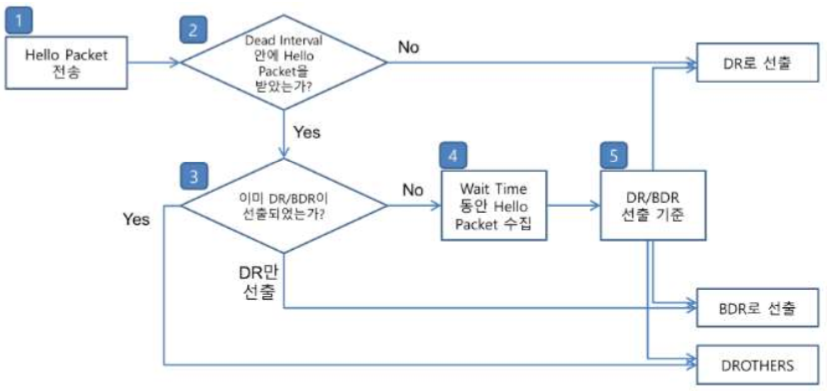
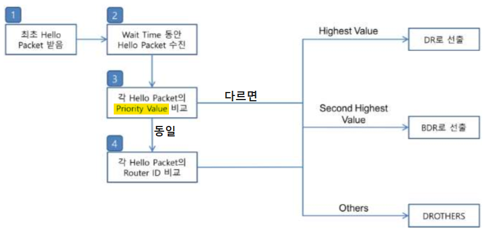

OSPF DR/BDR 선출
===

#### DR
- DR 중심으로 Tree 구조를 생성

- DR은 LSA Type 2 (Network LSA)를 통하여 Multi-Access의 Network 정보와 Multi-Access 망에 연결된 neighbor List를 전달하여 해당 장비들이 실제 Multi-Access에 연결된 것이 맞는지 확인 가능


#### BDR
- OSPF Routing protocol은 Multi-Access 망에서 DR을 생성   
  Network LSA를 전달하면, OSPF가 작동되는 모든 Router들은 Multi-Access 망의 Network 정보를 DR이 가지고 있는 것으로 Topology를 구성
- DR로 선출된 장비가 Down되어 잠시 DR의 존재가 사라지면, 해당 Network 정보를 읽게 됨
- 그리고, DR이 Multi-access에 연결된 Router List를 전달하게 되는데, 해당 정보가 사라져 어느 장비도 상호 간에 연결되어 있지 않는다는 Topology를 그리게 됨
- 이것을 막기 위해 DR 장비가 Down되었을 때, 바로 DR 역할을 수행할 BDR 장비를 정함
- BDR로 선출된 장비는 DR과 직접 연결되어 있어 DR이 Down 되었다는 것을 가장 먼저 인지한다.
- DR이 down 되자마자 BDR이 DR로 바뀌고 Network LSA를 전달하여 Network가 아직 존재한다는 것을 알려주고,   
  어떤 Router들이 연결되어 있는 지를 전달하여 문제없이 모든 Router들이 Topology를 제대로 다시 그릴 수 있도록 만듦

#### DR/BDR 특징

- Multi-Access 환경에서 OSPF는 DR/BDR 선출
  - DR (Designated Router)
    - Multi-access 망을 Tree 구조로 구성하기 위하여 가장 필요한 node
    - Multi-access 망에 연결된 모든 neighbor list와 Network 정보 전달 (LSA Type 2)
  - BDR (Backup Designated Router)
    - DR이 Down되었을 때 BDR이 바로 DR 기능 수행

- **Link Priority**가 가장 높은 장비가 DR, 두번째로 높은 장비가 BDR로 선출
  - Default 1
  ```
  (config-if)# ip ospf priority [0 ~ 255]       ---> Priority 값 지정
  ```

- Link Priority 값이 동일한 경우 **Router-ID**가 높은 순으로 DR/BDR 선출

- DR/BDR로 선출된 장비는 Multicast 224.0.0.6에 추가로 join
  - OSPF는 Multicast 224.0.0.5 사용

- DR/BDR은 non-preemptive (비선점)
  - DR이 down되어 BDR이 DR 기능을 수행하고 있는 상태에서 만약 원래의 DR 장비가 회복이 되어도 계속해서 BDR 장비가 DR 역할을 수행


### DR/BDR 선출 과정



##### Step 1. Hello packet 전송
- Interface에 OSPF가 설정되고, Interface를 'no shutdown' 명령어로 활성화 후
- OSPF는 Hello packet을 Interface로 전송

##### Step 2. Dead Interval 안에 Hello packet을 받았는가?
- Wait Interval 동안 기다림 (DR/BDR 선출 대기시간)

- 최초의 Hello packet을 전송한 후 Dead Interval 동안 타 장비의 Hello packet을 받지 못하면, Multi-access 네트워크에 자신 밖에 없다는 것으로 알고 Router는 스스로 DR이 되고, 이때 LSA Type 2를 생성하지 않음

##### Step 3. 이미 DR/BDR이 선출되었는가?
1. 다른 neighbor에게 Hello packet을 받은 경우
   - 해당 packet에 DR/BDR의 정보가 설정되어 있는지를 확인

2. 이미 DR/BDR이 선출되어 있는 경우
   - Router는 DROTHERS가 되어 DR/BDR과 Adjacency neighbor 관계를 수립하며 DBD 정보를 교환

3. DR은 선출되었지만, BDR은 선출되어 있지 않은 경우
   - 해당 Router는 바로 BDR로 선출되고 DR은 neighbor가 생성되자마자 LSA Type 2를 생성하여 Area 전체로 Flooding
   - DROTHERS끼리 BDR 선출


##### Step 4. Wait Time (Dead Interval과 동일) 동안 Hello packet 수집
- DR/BDR이 모두 선출되어 있지 않은 경우 또 다른 Router가 존재할 수 있기 때문에, Wait Time동안 기다리며 Hello packet을 수집

- Wait time은 별도로 설정하는 명령어가 없으며 Dead Interval을 수정하면 동일한 값으로 자동 변경
- Wait time동안 수집한 Hello packet 정보를 기반으로 **'DR/BDR 선출기준'**에 의해 각각의 Router가 DR/BDR을 선출


##### * 참고사항 : OSPF Multicast IP 224.0.0.5와 224.0.0.6
- 224.0.0.5는 OSPF Default Multicast
- 224.0.0.6은 DR/BDR 사이의 Multicast

- DR/BDR은 224.0.0.6으로 IGM Join이 되어 있으며 224.0.0.6은 DR과 BDR 사이의 Update packet을 전달할 때 사용
- 224.0.0.6에 대해서는 LSAck packet을 전달하지 않고 DR/BDR이 Update packet을 받으면 DR이 neighbor에게 Update packet을 전달하는 데 이 packet이 LSAck 역할도 수행
- 224.0.0.5 Update packet을 받은 장비들은 모두 LSAck packet을 전달하는데 최초로 224.0.0.6으로 Update packet을 전달한 장비는 자신이 보낸 정보가 다시 돌아온 것일 뿐이기 때문에 LSAck packet을 전달하지 않고 DR도 LSAck를 기다리지 않음



> L3 : 큰 값이 높은 Priority   
> L2 : 작은 값이 높은 Priority

