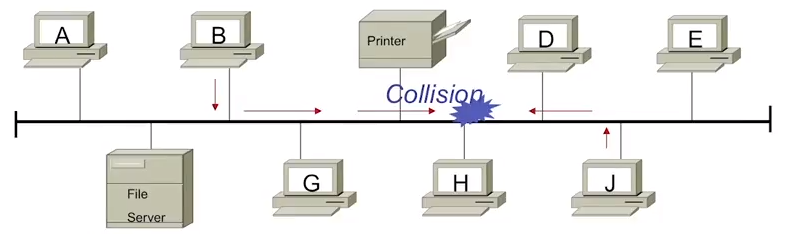
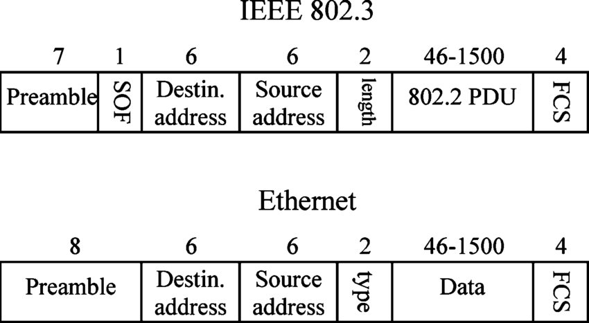
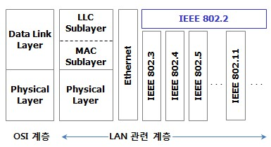
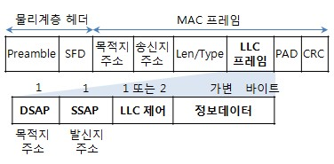
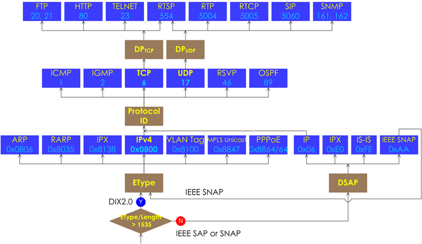

Ethernet의 이해
===

Ethernet 이란?
---

원칙적으로 하나의 인터넷 회선에 유/무선 통신장비 공유기, 허브 등을 통해 다수의 시스템이 랜선 및 통신포트에 연결되어 통신이 가능한 네트워크 구조

- Ethernet은 전세계 학교, 가정, 사무실에서 가장 많이 활용되는 네트워크 규격이다. OSI 7계층 중 물리 계층(Physical Layer)와 Data-Link Layer(MAC packet, Protocol 형식)에서 그 구성 형식이 정의된다.
- Ethernet 통신 방식중에 중요한 **CSMA / CD** (Carrier Sense Multiple Access / Collision Detection) 방식이 있다. 
  - 이 방식들은 여러 대의 시스템이 동시에 통신을 하게되면 문제가 발생할 수 있는데, 이 부분을 어떠한 방식으로 처리 하는지에 대한 기술을 말한다. 하나의 LAN 회선에서는 우리가 체감할 수 없는 아주 짧은 시간에 데이터 송/수신을 제어 및 처리를 하여 통신을 하게 된다.
  
  

  - 보낸 사람은 케이블의 신호와 이력을 확인하고, 다른 사람에게 신호가 흐르지 않고 있음을 확인 후 전송을 시작한다.
  - 전송 중에도 파형에 의해 다른 사람의 송신과 충돌하지 않는지를 감시하며, 만약 충돌하는 경우에는 일정량의 전송 후 중단하고 각 보낸 사람마다 일정 시간의 딜레이를 두고 전송을 재시작 한다.

Ethernet 규격
---

> 통신이 가능한 랜선의 데이터 전송 속도를 정의한 것

- 일반적으로 가장 많이 사용하는 3가지 종류에는 1000BASE-T / 100BASE-TX / 10BASE-T 규격을 가장 많이 사용한다.

- 속도가 빠른 순서 : **1000BASE-T > 100BASE-TX > 10BASE-T**
- 현재 국내에서는 기가 인터넷으로 보급되고 있어 기가바이트 1 Gbps (1000Mbps) 이더넷 통신이 가능한 1000BASE-T 규격의 랜선과 장비를 채택하고 있다.   
  보통 5M 픽셀 500만 화소 사진 1000장 정도를 대략 20초 이내에 전송할 수 있는 속도이다.

- 가장 중요한 랜선과 통신 장비에서 지원하는 포트가 다른 경우 속도의 차이다.

|규격|전송속도(최대)|호환성|
|:---:|:---:|---|
|**1000BASE-T**|1 Gbps|각각의 케이블 속도에 관계.   예를 들어 1000BASE-T LAN 포트에 10BAST-T를 지원하는 케이블을 연결한 경우, 속도는 10BASE-T (10Mbps)이고   100BASE-TX 케이블을 연결한 경우 100 Mbps 이하|
|**100BASE-TX**|100 Mbps|100BASE-T, 10BASE-T 케이블 연결 가능.   1000BASE-T는 100BASE-TX에서 100 Mbps 속도 이하   10BASE-T는 10 Mbps 속도 이하|
|**10BASE-T**|10 Mbps|1000BASE-T 및 100BASE-TX 대응 케이블 모두 연결 가능하지만 속도는 모두 10 Mbps 이하|

Ethernet 특징
---

- 연결 모드 : 비연결성(connectionless) 모드
  - 연결성은 회선을 유지시켜 독점적으로 사용 (TCP)

- 전송 단위 : Ethernet Frame
- 전송 속도 : 10 Mbps ~ Gigabit
  - 10M(ethernet), 100M(Fastethernet)
  - 1G(Gigabit ethernet) = 802.3z(광케이블), 802.3ab(TP케이블)
- 전송 방식 : 비동기식 직렬통신 (송수신 간에 정확한 동기 유지할 필요 없음)
- 부호화 방식 : Manchester Encoding 등
- 사용 매체(UTP, 광케이블) 및 속도에 따라 달라짐
- Simplicity, Low Cost
  - 매체접근 기능 구현.
  - 대부분 LAN 카드 인터페이스에 집중되고, 중앙집중식 케이블링 및 최소환된 제어 방식으로 단순성, 저비용이 가능

### Ethernet Frame
- 전체 프레임 길이 : 64 ~ 1518 byte (preamble, SFD 제외)
  - 64 = MAC header(14) + 최소 정보데이터(46) + FCS(4)
  - 1518 = MAC header(14) + 최대 정보데이터(1500) + FCS(4)

- 최대전송단위(**MTU**) : 1500 byte (Preamble, SFD, MAC header, FCS들을 제외한 **정보데이터**만!)
- 다양한 ethernet frame 형태가 존재
  - Ethernet 2 (DIX 2), IEEE 802.3, IEEE 802.3 SNAP, Novell 고유 Frame 등

### 주소 형식
- Ethernet 인터페이스 보드(LAN카드) 각각은 제조업자에 의해 **48bit** 고정되고 유일한 물리적 주소를 갖도록 만들어지며 이것은 보드마다 다르다
- 한편, 인터넷에서 사용되는 IP주소는 논리적인 주소로써 **32bit**로 표현

### 매체(Media) 접근 방식
- 초기, 공유매체 접근방식 : CSMA/CD (Half Duplex, 10M)
  - 매체 공유 : 모든 노드가 동일한 전송매체를 공유 (Shared Media) ---> Bus형태, 하나의 충돌영역
  - 과거 초기 10Mbps 및 일부 100 or 1000Mbps ethernet

- 현재, 전용매체 전이중방식 : CSMA/CD 사용 안함 (Full Duplex, 100M, 독립 port 사용)
  - 전용 포트 위주의 이더넷 스위치화 및 고속화 지향 (Switched Media)
  - 전용매체 방식의 스타형으로 발전   
  ---> Switch를 이용한 Star형 구조, port마다 충돌영역이 나눠짐 ---> **전용매체(media)**

Ethernet & IEEE 802.3
---

- L2 header의 MAC주소 다음에 오는 필드는 Ether type을 사용하면 **ethernet II** (dix 2.0)   
  Length를 쓰면 IEEE 802.3으로 인식하도록 설정

- Length 인식은 전체 프레임 길이가 1535 byte 이하(MTU default size = 1500 byte)의 값을 가짐
- ether type 인식은 전체 프레임 길이가 1535 byte를 초과   
---> 일반적인 TCP/IP 통신에는 **ethernet II**가 사용됨. Switch 간 정보 공유를 위해서 보내는 프레임 프로토콜은 **IEEE 802.3**을 주로 사용

### LLC (Logical Link Control)

> LLC 계층은 두 장비간 Link를 설정하고, 프레임을 송수신하는 방식과 상위 Layer Protocol의 종류를 알리는 역할

- **LLC ---> IEEE 802.2**
- **DSAP** : 목적지 SAP 주소, **SSAP** : 출발지 SAP 주소
  - **SAP** (Service Access Point) : 이더넷 프레임에 포함된 상위 계층의 프로토콜의 한 종류.   
  즉, 프레임에 의해 전송되는 상위 계층 프로토콜을 표시.   
  ex) IEEE 802.2에서 사용되는 SAP 번호는 ethernet II 프레임에서 사용하는 Type 필드와 역할이 같음.

IEEE (L1, L2 표준)
---

1. IEEE 802
> MAN, LAN 통신 관련

- IEEE 802.1 : 브릿지 및 망 관리에 대한 기술 제정
- IEEE 802.2 : LLC (Local Link Control)에 대한 기술 제정
- IEEE 802.3 : CSMA/CD에 대한 기술 제정
- IEEE 802.4 : Token Bus
- IEEE 802.5 : Token Ring
- IEEE 802.11 : Wireless LAN (무선랜)
- IEEE 802.14 : CATV LAN
- IEEE 802.15 : Wireless Private LAN ---> WPAN (Bluetooth, Zigbee)

2. 스위치의 여러 기술의 표준 지정

- 스위치는 L1 허브의 물리 포트마다 L2 브릿지를 장착한 것과 비슷 (IEEE 802.1)

3. ethernet과 IEEE 802.3

> ethernet은 DIX에서 만든 표준
> IEEE 802.3은 IEEE에서 만든 표준

- 실제 TCP/IP 통신에서는 ethernet II를 주로 사용.   
  Bridge 기술은 IEEE 802.1에 지정되어 있어서 ethernet II로는 보낼 수 없음.   
  따라서 IEEE 802.3을 이용하여 전송

- IEEE 802.3은 DIX 2.0(ethernet II)의 ether type이 Length를 나타내기 때문에 상위 프로토콜과 하위 프로토콜이 누구인지 알 수 없음 ---> LLC (IEEE 802.2)를 이용해 상위 프로토콜과 하위 프로토콜을 구분

4. 현재 통신에서는 IEEE 802.3과 ethernet II 둘 다 사용   
   프레임을 확인하여 IEEE 802.3 혹은 ethernet II으로 처리해야 하는지를 구분 

