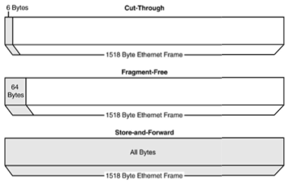
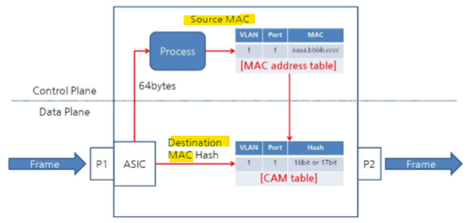

Switching
===

### Switch   
: 데이터통신 분야에서의 스위치란 입력 단자로부터 패킷 등을 받아서 적절한 출력 단자로 가급적 빨리 보내고자 하는 역할을 담당하는 장치

### Switching   
: 2개 이상의 전달경로에서 어느 방향으로 전달할 것인가를 선택

- 데이터 패킷 내 포함된 주소 정보에 따라 해당 입력을 해당 출력 포트에 빠르게 접속시키는 기능

### Routing vs Switching

- OSI Layer 관점에서 차이
  - Switching은 통상 2계층(Data-Link Layer)에서 동작
  - Routing은 3계층(Network Layer)에서 동작

- 기능 관점에서 차이
  - Routing : 주소를 이용하여 목적지까지 전달하는 방법을 체계적으로 결정하는 것이 가능
  - Switching : 데이터 패킷 내 포함된 주소 정보에ㅔ 따라 해당 패킷을 해당 출력포트에 빠르게 접속시키는 기능

- 대역폭 관점에서 차이
  - 기존의 Router나 Bridge는 대역폭을 모든 포트들이 공유하는 방식을 취하나, Switching 방식은 병렬로 각 포트마다 전용대역폭 채널을 할당하게 됨.

### Switching 분류

- Switching 기술(방식)에 의한 분류  --->  **Frame 전송 방법**
  - Store and Forward Switching
    - Switch가 유입된 모든 Frame에 대해서 CRC 값을 체크하여 에러여부를 확인하는 방식
  - Fragment-free Switching
    - Frame의 64bytes 정보만을 확인하여 Collisions 발생여부만 확인하는 방식
  - Cut-through Switching
    - 현재 대부분의 Switching 방식으로 **Destination MAC address만 확인하여 전송하는 방식**
  - Interim Cut-through Switching

  

- Swiching 구조에 의한 분류   --->  **스위치의 물리적 구간**
  - Cross Bar 구조
  - Shared Memory 구조
  - High-speed bus 구조

- Switching 대상에 의한 분류    --->  **어떤 데이터를 전송하는지**
  - 가변길이인 패킷 또는 프레임의 Switching
  - 고정길이인 ATM 셀의 Switching
  - MPLS의 message Switching

### MAC address table vs CAM table
- MAC address table
  - 유입된 Frame의 Destination MAC address를 통해 학습한 MAC address List

- CAM table (Content Addressable Memory table)
  - MAC address를 Hash된 상태로 저장해 빠른 Forwarding

Transparent Bridging
---

Switch의 5대 기능   
  - **Learning**
    - 스위치 포트로 수신한 프레임의 출발지 MAC주소가 자신의 MAC address table에 등록되지 않는 주소라면 수신 포트 번호와 MAC 주소를 table에 등록

  - **Flooding**
    - Broadcast, Unknown Unicast, Unknown Multicast 프레임을 수신하면 수신 포트를 제외한 동일 VLAN 도메인에 속해 있는 모든 스위치 포트로 프레임을 전송

  - **Forwarding**
    - 수신한 프레임의 목적지 MAC 주소가 MAC address table에 학습되어 있다면 해당 포트로만 프레임을 전송
  - **Filtering**
    - 목적지 MAC 주소를 제외한 다른 포트로 전송되는 것을 차단하고 수신 포트로 다시 전송되는 것을 차단
  - **Aging**
    - 일정시간 (default 300초)동안 프레임을 수신하지 않으면 MAC table에서 삭제
