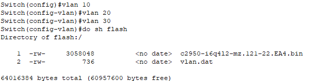
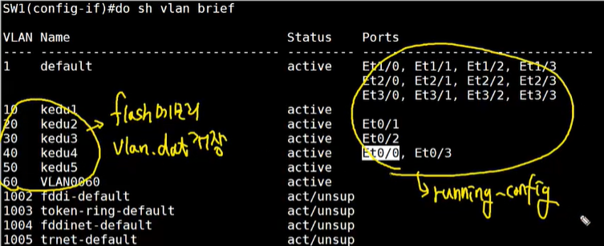
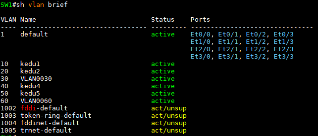
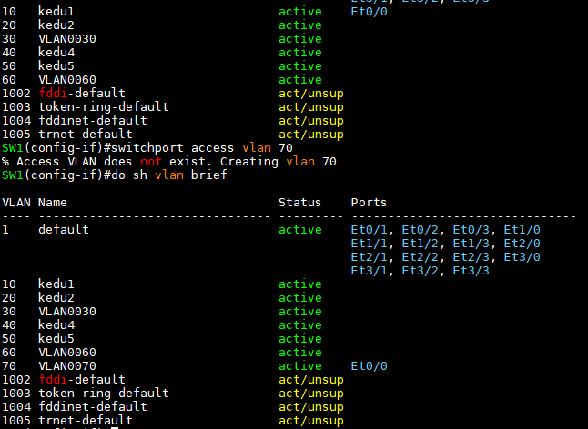
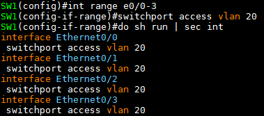
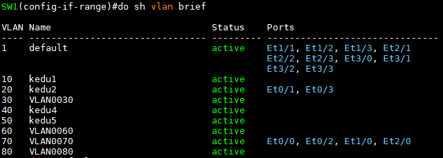
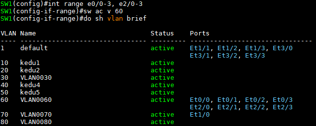
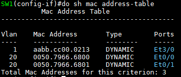
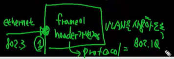

Routed port & Switch port
---

### Routed port   
: Destination MAC 주소를 확인 후 자신의 주소 프레임만 시스템 내부로 가져와 처리하는 port   
L2 header를 decapsulation ---> L3 header 확인 ---> **Routed port는 IP주소를 입력할 수 있는 port**

- L3주소(IP)를 확인하여 자신의 주소이면 decapsulation, 아니면 **Drop** 또는 decapsulation을 진행하지 않고 Routing table lookup 후 **출구 및 next-hop IP로 전달**

- IP protocol enable port

```
(config)# ip        ### IP protocol을 제어하는 명령어(L3)
```


### Switch port   
: Destination MAC 주소를 확인 후 자신의 주소가 아니더라도 시스템 내부로 가져와 처리하는 port    
L2 header를 decapsulation 하지 않음 ---> L2 frame에 VLAN 번호를 사용할 수 있도록 변경 ---> L3 주소 확인 불가 ---> **Switch port는 IP 주소를 입력할 수 없음**

- IP protocol이 작동하지 않는 port

```
(config)# switchport          ### L2 switch protocol을 제어하는 명령어
```


VLAN
===

### 1. VLAN이란?

- 스위치 가상화 (시스템이 가진 한정된 자원을 격리)
- 그럼 스위치 가상화는 왜 해야 할까?
  - 하나의 네트워크를 여러 네트워크로 서브넷팅 후 사용하는 경우 서브넷팅된 네트워크르르 하나의 스위치로 묶어서 사용할 때   
  ---> 특정 네트워크의 Broadcast가 다른 네트워크로 전파되어서 트래픽이 증가되고 해당 스위치에 연결된 모든 시스템에 부하 증가되는 단점 발생   
  ---> Broadcast 범위를 각 네트워크마다 격리하여 사용할 필요가 있음 ===> **VLAN**

- VLAN 장점
  - 네트워크 리소스 보안을 높일 수 있음
  - 비용절감
  - 불필요한 트래픽 감소
  - 관리자의 네트워크 설정 작업 용이


### 2. VLAN 종류
- **Port 기반** : Static VLAN.   
  Port에 VLAN Access 정보를 주고 해당 port에 연결된 모든 시스템은 port에 부여된 VLAN 번호를 사용
- **MAC 주소 기반** : Dynamic VLAN.   
  MAC 주소를 기반으로 VLAN을 할당


#### 즉, VLAN은
- L2 Switch에서 제공되는 가상의 LAN
- 논리적인 네트워크를 L2에서 분리
- 분리를 하기 위한 식별자(identification)는 번호를 이용
- 식별자가 같은 Switch의 port끼리만 통신이 가능
- 식별자는 12bit (0 ~ 4095). 실제 VLAN은 ID 1 ~ 4094 사용 가능


### 3. VLAN 명령어


#### VLAN 생성/삭제/수정/확인

- **CatOS** 방식 (Cisco에선 권장하지 않음)
  ```
  # vlan database
  ```

  a. 생성   
  ```
  (vlan)# vlan [VLAN ID] name [VLAN 이름]       ### VLAN 이름은 생략 가능
                                                ### default name으로 자동 설정 (VLAN0000)
  ```

  b. 삭제   
  ```
  (vlan)# no vlan [VLAN ID]
  ```

  c. 수정 (name 수정)   
  ```
  (vlan)# vlan [VLAN ID] name [VLAN 이름]
  ```

  d. 적용   
  ```
  (vlan)# exit
  ```


- **IOS** 방식의 VLAN 생성/삭제/수정

  a. 생성   
  ```
  (config)# vlan [VLAN ID]
  (config-vlan)# name [VLAN 이름]
  ```

  b. 삭제   
  ```
  (config)# no vlan [VLAN ID]
  ```

  c. 수정 (name 수정)   
  ```
  (config)# vlan [VLAN ID]
  (config-vlan)# name [VLAN 이름]
  ```

  d. 입력한 값 바로 저장

- VLAN 확인
  ```
  # show vlan (brief)
  ```

#### VLAN은 flash 메모리에서 vlan.dat 파일로 자동 저장   
   
- vlan 1, 1002, 1003, 1004, 1005 : default VLAN (사용하지 않음)
- vlan 1은 모든 스위치의 default VLAN


Port 기반 VLAN
---

**Interface**에 적용 ---> running-config에 저장

```
(config-if)# switchport access vlan [VLAN ID]
```

- VLAN access는 덮어쓰기 ---> VLAN Access는 하나의 VLAN ID만 가진다.   
  

- startup-config에 저장하지 않으면 running-config의 정보는 스위치 재부팅 시 삭제   
  


- VLAN ID가 없는 vlan을 적용시키면 해당 VLAN을 생성하면서 해당 port에 생성된 VLAN ID를 access   
  

- **하나의 Port(Interface)에는 하나의 VLAN만 Access 할 수 있음**

- 여러 Interface에 동일한 설정을 하려면 ---> 스위치에서 범위 지정이 가능한 옵션 제공   
  ```
  (config)# interface range ...
  ```

  **ex1)** e0/0 ~ e0/3까지 동일한 VLAN access 설정   
  ```
  (config)# interface range e0/0-3
  (config-if-range)# switchport access vlan 20
  ```   

  

  
  **ex2)** e0/0, e0/2, e1/0, e2/0에 동일한 VLAN access 설정   
  ```
  (config)# interface range e0/0,e0/2,e1/0,e2/0
  ```   

  


  **ex3)** e0/0부터 e0/3, 그리고 e2/0부터 e2/3까지 동일한 VLAN access 설정   
  ```
  (config)# interface range e0/0-3,e2/0-3
  ```   

  


- Switch port 확인 명령어   
  ```
  # show int e1/0 switchport
  ```

- port(Interface) 설정 시 해당 port값을 초기화 (설정한 VLAN ID 취소)   
  ```
  (config)# default interface [Interface ID]
  (config)# default interface range [Interface 범위]
  ```

- VLAN을 사용할 수 있는 Switch는 **MAC address table**을 참조할 때 같은 VLAN만 참조   
     

  

  - VLAN ID가 추가된 IP
  - Switch port에 default VLAN 1로 설정되어 있는데 frame이 들어오면 header가 변경   
    이떄 사용하는 protocol이 바로 **IEEE 802.1Q**