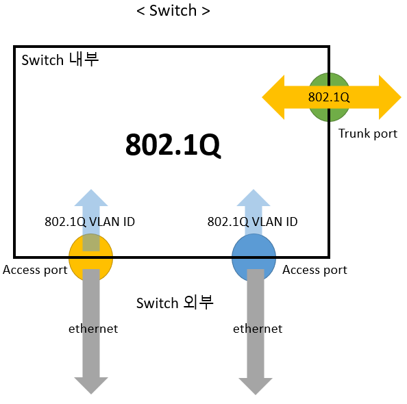
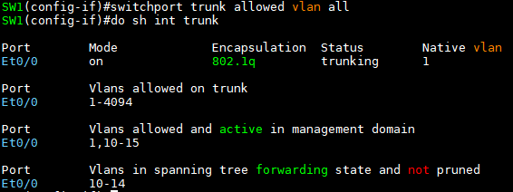

Switchport_종류
===

### 1. Dynamic Port

: Access port와 Trunk port를 자동으로 변환하는 port (default port mode)

- **DTP** : Dynamic port가 서로 협상하기 위해 전달하는 protocol **(Cisco전용)**


### 2. Access Port   
: ethernet <-> switchport VLAN ID를 담은 protocol로 변환하는 port

- **IEEE 802.1Q** : 국제 표준. 모든 제조사(vendor)에서 사용 가능. ethernet frame에 VLAN ID를 중간에 삽입(tagging)

  

- **ISL** : Cisco 독자 규격. Cisco 스위치에서 L3 이상 스위치에서만 사용 가능. ethernet frame을 re-capsulation

  


### 3. Trunk Port   
: 스위치와 스위치 사이 VLAN 통신을 하나의 회선으로 유지하는 port

- 여러 VLAN 정보를 하나의 포트로 주고 받을 수 있음
- Switchport VLAN ID를 담은 port로 그대로 전송 가능

- 아래 그림처럼 (VLAN ID가 2개 존재할 때) Trunk port로 적용하지 않으면 VLAN ID 별로 스위치 간 회선을 계속 생성해야 한다.
  
  




- 위 그림을 보면 802.1Q에서 Access port를 통해 Switch port 외부로 나갈 때 VLAN ID를 제거(**Untagging**)한 후 **ethernet frame**으로 바꾼다.

- 반대의 경우 ethernet frame에 VLAN ID를 추가(**tagging**)하여 **802.1Q frame**으로 변경됨.
- 특히 Trunk port에서 **Native VLAN** (Tag를 사용하지 않는 원래 프레임을 전달하는 VLAN, VLAN 1) 선언이 된 VLAN ID는 Access port처럼 작동한다.


#### Trunk port로 설정하는 명령어   

- Switchport mode 변경
  ```
  (config-if)# switchport mode access
  (config-if)# switchport mode trunk
  ```

##### * Host 장비는 기본적으로 VLAN ID가 있는 frame이 인식되지 않기 때문에 Access port로 설정해주는 것이 좋다.

(예시)   
   

```
SW2(config-if)# int e0/3
SW2(config-if)# switchport trunk encapsulation dot1q      ### dot1q = 802.1Q
SW2(config-if)# switchport mode trunk
```

```
SW2# show int trunk       ### trunk port 확인 
```   


-----------------------------------------------------------------------------------------
### * L3 Switch의 경우 Trunk mode로 변경 시 주의 사항 

- L3 스위치에서 Trunk 설정하는 명령어만 입력하면 아래와 같은 error message가 뜬다   
```
Command rejected: An interface whose trunk encapsulation is "Auto" can not be configured to "trunk" mode.
```

- L3 스위치는 **trunk encapsulation**으로 ISL과 802.1Q 2가지 모두 사용할 수 있기 때문에 encapsulation을 자동으로 협상하도록 설정되어 있다.   
  ---> 따라서, trunk 선언만 하면 어떤 encapsulation 방식을 사용할 지 모르기 때문에 rejected

- L3 스위치에서 trunk mode로 변경하려면
  ```
  (config-if)# switchport trunk encapsulation dot1q
  (config-if)# switchport mode trunk
  ```

- trunk 회선의 특징
  - trunk는 모든 VLAN 통신을 전달하는 것이 아닌 스위치에 있는 **Active VLAN**만 trunk port를 통해서 전달한다. 
  - VLAN 네트워크를 생성하면 모든 스위치에 해당 네트워크가 가진 모든 VLAN 정보가 입력되어야 한다.
  - 스위치가 많아지면 각각의 스위치에 해당하는 VLAN 관리가 어렵기 때문에 Server-Client 기반으로 VLAN 정보를 **자동으로 동기화(Update)** 하도록 만든 프로토콜 사용   
  ---> **VTP** (다음 장에 VTP 내용 정리했음)

    
    > 해당 스위치가 가진 VLAN만 trunk port 통과 가능(**Active**)

---------------------------------------------------------------------------------------


### 4. DTP (Dynamic Trunking Protocol) - Cisco 전용   
Cisco에서 개발한 port의 mode를 자동으로 Access or Trunk port로 변경하는 Protocol

- DTP는 Trunk 신호가 들어오면 해당 신호를 받아 Trunk로 작동하고 아니면 Access port로 작동한다.

- Cisco Switch port의 Default 동작 모드는 **dynamic auto**로 설정
- dynamic (DTP를 사용하는 명령어) **auto**, **desirable**   
  초기 상태는 Access port로 작동하다가 Trunk 신호를 받으면 Trunk port로 변경
  - **auto** : Trunk 신호를 수동적으로 받음
  - **desirable** : Trunk 신호를 능동적으로 보냄 (주기적으로)

- 관리자가 설정할 수 있는 Switch port mode (Administrative mode)
  ```
  (config-if)# switchport mode access               ### 802.1Q <-> ethernet

  (config-if)# switchport mode trunk                ### 802.1Q를 그대로 전달 (이 중 native vlan만 ethernet으로 변경)

  (config-if)# switchport mode dynamic desirable    ### Trunk 신호를 주기적으로 보냄

  (config-if)# switchport mode dynamic auto         ### Cisco 스위치의 default port 상태. trunk 신호가 발생하지 않음
  ```

- 여기서 **dynamic** 상태의 port를 DTP라고 함
  - 실제 작동하는 스위치의 port mode (Operation mode)는 **Access port**(Static access)와 **Trunk port**


### 5. Trunk port 상세 설정

- L3 스위치에서 Trunk port의 Protocol 선택 (**Cisco ISL, IEEE 802.1Q**)
  ```
  (config-if)# switchport trunk encapsulation negotiate     ### Cisco Switch의 default
  (config-if)# switchport trunk encapsulation isl
  (config-if)# switchport trunk encapsulation dot1q
  ```
  - **negotiate**는 상대 스위치의 Trunk protocol을 확인 후 자동으로 protocol 변경
    
    - 위 설정에서 **Administrative Trunking Encapsulation** : negotiate, dot1q, isl   --->  Port에서 Trunk protocol 설정
    - **Operational Trunking Encapsulation** : isl, dot1q   --->  현재 trunk encapsulation 작동
    - **Negotiation of Trunking** : On    --->  Trunk 회선 연결됨

여기서 Trunk protocol을 바꾼다면   
   
> e0/3 인터페이스만 ISL로 설정


- **n-802.1q** : negotiate에서 802.1q protocol로 encapsulation (SW2에서 설정한 Trunk protocol)


### 6. Native VLAN
- 802.1Q는 Native VLAN으로 선언된 VLAN 정보에 대해 Access port처럼 작동하도록 설계됨(default)   
  (ISL은 Native VLAN이 없어 isl trunk port로 ethernet이 오면 drop)

- Native VLAN은 예전 Trunk와 Trunk 사이의 VLAN을 설정하지 못하는 스위치나 Hub를 연결시켜 특정 VLAN과 통신하기 위해 만들어 둔 설정값이다.
- 현재는 VLAN Hopping Attack 공격 기법에 활용되고 있어서 Access vlan으로 적용시키지 않은 임의의 VLAN으로 설정하도록 권장


### 7. Trunk의 VLAN traffic 제어


(1) 특정 VLAN만 허용 (덮어쓰기)   
```
(config-if)# switchport trunk allowed vlan [VLAN ID 혹은 VLAN 범위]
```

  

  

  

(2) 기존 VLAN 범위에서 특정 VLAN ID를 제거 (VLAN 통신 차단)   
```
(config-if)# switchport trunk allowed vlan remove [VLAN ID 혹은 VLAN 범위]
```

  

