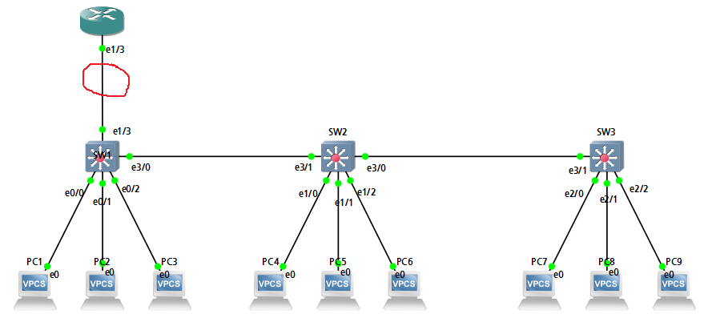

VTP, Inter-VLAN, 네트워크 장비의 가상 인터페이스
===

VTP 
---
> Vlan Trunking Porotocol
>
> Cisco 전용

- Management domail(관리영역) 내에 존재하는 Switch의 VLAN 정보는 Access하는 호스트 장비가 없더라도 같은 VLAN 정보를 가지고 있어야 Trunk 포트를 통해 전달이 가능하다.

- 해당 Switch에 VLAN 정보가 있어야 Management vlan에 추가되어서 전달 가능 (Trunk는 allowed vlan 특징 중 하나)
- VLAN 관리를 Server-Client 개념을 도입하여 Server에 설정하면 **모든 스위치와 VLAN 정보가 동기화** 될 수 있도록 하는 Protocol
- VLAN 정보는 flash 메모리에 vlan.dat 파일로 저장되어 있는데 이를 Trunk 포트를 통해 전달


### 1. VTP 구성 시 주의사항

- VLAN 동기화는 Trunk port(회선)으로만 정보 전달

- 관리영역 내에 Server mode와 Client mode로 작동하는 모든 스위치와 동기화
- VTP 설정 시 도메인 이름이 동일
- VTP 설정 시 password 동일
- **VTP의 Client mode에선 VLAN 생성을 할 수 없음**


### 2. VTP mode
- **Server mode** : 스위치의 VTP default mode, VLAN 관리 가능, VLAN 정보 전달
- **Client mode** : VLAN 설정(생성, 삭제 등)을 할 수 없고 Server mode의 vlan.dat 파일을 받아서 VLAN 정보를 적용
- **Transparent mode** : vlan.dat 파일(VLAN 정보)을 전달하지만 자신에게 적용하진 않음. 독립적인 VLAN 관리가 필요할 때 사용하는 mode


### 3. VTP version
- version 1 : token ring을 지원하지 않음
- version 2 : vtp version 1과 거의 비슷하지만 token ring을 지원. extended vlan을 지원하지 않음   
  (extended vlan 1006 ~ 4094)
- version 3 : extended vlan 사용 가능. Server mode ---> Master 여기에서 VLAN 관리. 암호 설정 시 비밀번호를 평문으로 설정하여 저장 가능 (암호화 저장 가능)


### 4. VTP 설정

```
(config)# vtp mode [server / client / transparent]      ### default는 server
(config)# vtp version [1 / 2 / 3]
(config)# vtp domain [Domain 이름]
(config)# vtp password [암호]      ### default는 null
(config)# vtp pruning             ### Access VLAN 정보가 있는 VLAN만 전달 혹은 받는 것이 가능(Server mode에서만 설정)
```

- vtp domain
  - Server mode에서 도메인 이름을 설정하면 자동으로 다른 스위치에 도메인 이름을 광고
  - 이때, 다른 스위치의 도메인 이름이 null 값이면 자동으로 광고된 도메인 이름을 등록   
  단, CDP로 학습된 인접 스위치에 전달

- vtp version
  - 장비마다 version이 다를 수 있음
  - Server mode에서 설정되면 다른 스위치로 전달되어서 변경됨


#### * 권장 설정


```
### VTP 확인 명령어

# show vtp status
```

위 VTP 정보에서 각 의미를 정리하면
> **VTP Version capable**     : 1 to 3 (VTP 가능한 version)
> 
> **VTP version running**     : 1 (현재 VTP)
> 
> **VTP Domain Name**         :   (Domain 이름, null)
> 
> **Maximum VLANs supported locally**   : 1005 (VTP version 1, 2는 VLAN 1005까지 인식)
> 
> **Number of existing VLANs**    : 5 (default VLAN은 1, 1002, 1003, 1004, 1005)
> 
> **Configuration Revision**  : 0 (VLAN 관련 변경을 할 때 1씩 증가, 높은 값일수록 최신 정보)
> 
> **MD5 digest**    : 0x57 0xCD 0x40 0x65 0x63 0x59 0x47 0xBD ... (Password)


#### * 주의 사항
- configuration revision이 높을 수록 가장 최근에 설정한 값으로 인식하여 VLAN을 Update를 하기 때문에 VTP를 구성한 영역에 새로운 Switch를 연결하기 전에는 반드시 **configuration revision 값을 초기화** 후 연결하는 것이 좋다. (기존 VLAN 정보는 지워질 수 있음)

- 이때 초기화는 vtp transparent mode로 바꾸기
  ```
  (config)# vtp mode transparent      ### revision 0으로 초기화
  ```

- VTP는 VLAN 정보만 동기화 한다 (flash에 저장된 vlan.dat 파일만 전송)   
  VLAN의 Access 정보(Interface 설정 --> running config or startup config)는 동기화하지 않는다.

- 이러한 revision 초기화 문제를 해결하기 위해 **VTP version 3**가 나옴
  - version 3는 Server mode이라도 **primary server** 지정이 필요하다. VLAN을 생성/수정/삭제 등을 할 수 있으며 **revision 번호로 인한 update 방지**
  - primary server 지정
    ```
    # vtp primary vlan
    ```


Inter-VLAN
---

스위치가 Broadcast Domain을 나누면 해당 Broadcast Domain끼리 통신을 함 ---> 이는 Router를 통해 서로 다른 Broadcast Domain을 연결   

그러나 Router의 Interface는 routed port로 switchport 명령어가 입력되지 않는다.

- Router와 Switch 사이에 VLAN만큼 회선을 여러 개 연결하면 회선 가용량과 Port 가용량에 문제가 발생할 수 있음
  - 따라서 Router와 연결되어 있는 Switch에 Trunk port(회선)을 생성해야 함
  - 하지만 Router의 routed port는 Trunk 신호를 처리하지 못하는 ethernet 전용
  - 이를 해결하기 위해 Router의 **Virtual Interface (Sub Interface)**를 생성해서 해당 Interface로 들어오는 Trunk 신호를 처리할 수 있는 설정을 한다. 이를 **inter-vlan**이라고 한다.
  - 이 중 Router에 Virtual Interface를 만드는 방식 ---> **router on a stick**

### Router 설정 (Inter-VLAN 또는 router on  a stick)
```
(config)# int [Interface ID]
(config-if)# no shutdown
!
(config)# int [Interface ID].[Virtual Interface number]
(config-subif)# encapsulation dot1q [해당 Virtual Interface가 Access 하려는 VLAN ID]
(config-subif)# ip address [해당 네트워크의 Gateway IP] [Subnet mask]

### IP주소부터 입력하면 error가 발생할 수 있음
```




네트워크 장비의 Virtual Interface (가상 인터페이스)
---

### (1) Loopback 주소

```
(config)# interface lo [Interface ID]
(config-if)# ip address [IP주소] [Subnet mask]
```

- Test 목적의 네트워크를 생성해 실제 Routing 여부를 확인할 때 주로 사용
- 가상의 Interface는 관리자가 shutdown 혹은 장비가 off 상태이지 않는 한 Active 상태를 유지하는 Interface로 Router의 ID를 생성할 때 사용
- 관리 목적(원격접속)의 IP를 부여하여 원격접속용 IP로 사용할 수도 있다.


### (2) Router Sub Interface

```
(config)# interface [Interface ID].[Sub Interface number]
(config-subif)# encapsulation dot1q [Sub Interface가 Access하려는 VLAN ID]
(config-subif)# ip addres [VLAN에 할당된 네트워크 대역의 IP] [Subnet mask]
```


### (3) VLAN Interface

```
(config)# interface vlan [VLAN ID]
(config-if)# ip address [IP주소] [Subnet mask]
(config-if)# no shutdown
```

- L2/L3 Switch에서 관리목적(원격접속)용 IP를 입력하기 위해 사용
- L3 Switch에서 inter-vlan을 위해 사용
- 주의사항
  - 해당 Switch에 VLAN이 없는 VLAN Interface를 생성하면 작동하지 않음 ---> VLAN이 반드시 있어야 함

- Switch의 management IP는 주로 할당되지 않는 VLAN 중에 선택하고 해당 VLAN을 생성

ex) VLAN 999 를 생성할려면   
```
(config)# vlan 999
(config-vlan)# name mgmt
!
(config)# int vlan 999
(config-if)# ip address [IP] [Subnet mask]
(config-if)# no shutdown
!
(config)# ip default-gateway [Gateway IP]
!
(config)# line vty 0 4      ### 원격접속 설정
...
!
```
- 위와 같이 설정을 하면 VLAN 999를 **Management VLAN** 이라고 부른다.