L3 Switch
===

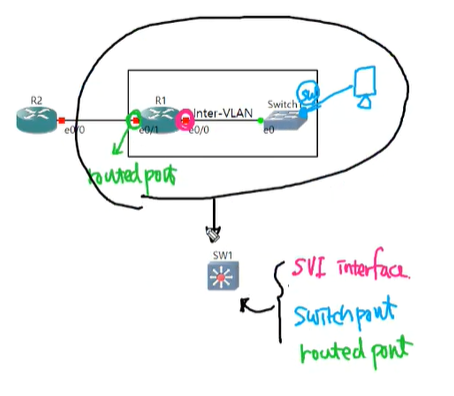


L3 Switch란?
---

- Router와 L2 Switch를 활용한 Inter-VLAN (router on a stick)은 Router와 L2 Switch 사이의 Trunk port에 많은 부하가 발생함   
---> 이런 부하를 감당할 수 있는 Interface의 대역폭 증가는 한계가 있고 비용 소모가 심함

- Trunk 회선을 메인보드 기판에 연결하고 병렬처리를 하면 회선의 부하 발생 문제가 해결되고   
  이로 인해 Router와 L2 Switch 사이의 Trunk 회선에서 발생하는 병목현상 문제를 해결할 수 있음

- L3 Switch = Router + L2 Switch


L3 Switch의 Port
---


### (1) Switchport   
- default port   
- L2 Switch의 switchport와 동일하게 작동

### (2) routed port   
- Router의 Interface와 동일하게 작동
- 다른 Router와 Routing 작업을 하기 위한 port
  ```
  (config-if)# no switchport      ### switchport에서 routed port로 변경
  ```

### (3) SVI (Switch Virtual Interface)   

- Inter-VLAN 적용 시 Router와 Switch 사이를 연결하는 경우 Router에 Sub-Interface를 지정한 port 역할을 하는 가상의 Interface로 VLAN Interface를 **SVI**라고 함
  
  ```
  (config)# int e0/1.10
  (config-subif)# encapsulation dot1q 10
  ```

  위 두 명령어가 아래처럼 하나의 명령어로 합쳐짐 (**SVI**)
  ```
  (config)# int vlan 10
  ```

  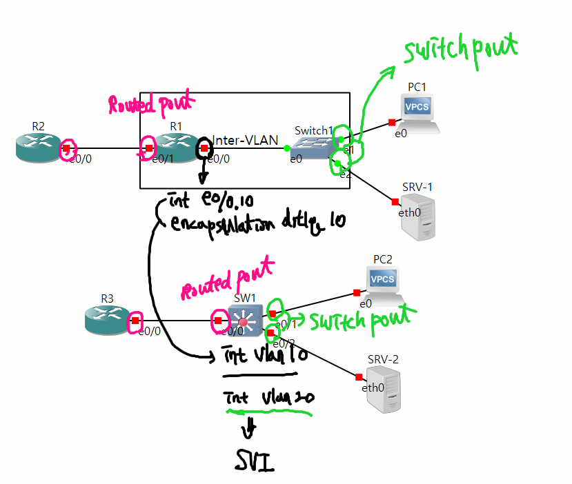

- SVI는 해당 Switch에 VLAN 정보와 해당 VLAN의 Access port가 있어야만 **up** 상태로 바뀜.   
  (Trunk는 해당 **allowed VLAN**을 Access 하는 것으로 인식)

  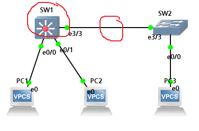

  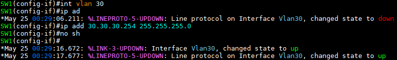

  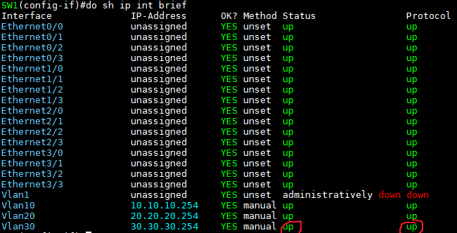


L3 Switch에서 Routing이 필요한 경우
---

- L3 Switch의 Routing protocol 활성화

  ```
  (config)# ip routing
  ```

- default : L3 Switch는 L2 Switch와 동일하게 작동


extended ping
---

source IP 지정 또는 ping 관련 옵션을 수정

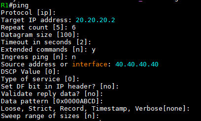

> **Repeat count** : ping을 보내는 횟수
> 
> **Datagram size** : 패킷의 크기 byte
> 
> **Timeout in seconds** : echo reply를 기다리는 시간. 설정한 시간까지 echo reply가 오지 않으면 request time out
> 
> **Extended commands** : 확장 ping 명령. y를 입력해야 적용
> 
> **Ingress ping** [n] : 지정된 Ingress 인터페이스에서 수신된 패킷을 대상으로 시뮬레이션 (지원 없는 소프트웨어도 있음)
> 
> **DSCP Value** : ToS 설정이 됐을 경우 ToS 정상 작동하는지 확인
> 
> **Set DF bit in IP header** : IP header의 Don't fragment. MTU size가 넘어가는 packet에 대한 설정으로 yes -> MTU size가 초과하는 경우 전달되지 않음. 중간에 MTU 크기가 다른 장비가 있는지 확인하는 용도
> 
> **Validate reply data** : 회신 데이터 검증여부
> 
> **Data pattern** : ping이 패킷을 만들 때 데이터 패턴을 저장
> 
> **Loose, Strick ...** : IP header 옵션. 요즘 사용하진 않음 -> none
> 
> **Sweep range of sizes** : echo 패킷의 크기를 다르게 보낼 때 사용

```
# ping [DST IP] source [SRC IP or Interface]
```


traceroute
---

ping과 TTL을 활용하여 destination address까지 어떤 경로를 통해 가는지 확인하는 명령어   

Routing 되는 next-hop IP를 확인할 수 있음

```
# traceroute [DST IP] source [SRC IP]

tracert     ### Windows 명령어
```


### TTL   
패킷의 생존 시간

- IP 패킷 내에 있는 값으로, 그 패킷이 네트워크 내에 너무 오래 있어서 버려져야 하는지의 여부를 Router에게 알려주는 역할을 한다.
- 일정 시간이 지나면 그 패킷을 버릴건지 혹은 재전송할 것인지를 결정하도록 발신인에게 알릴 수 있는 방법으로 TTL을 사용한다.
- TTL 초기 값은 OS에 의해 대게 8bit 길이의 패킷 헤더에 설정된다.
  - TTl이 가질 수 있는 가장 큰 값은 255 (application마다 default 값이 다르다)
  - Unix 기반은 TTL 값이 64

- **각 Router는 TTL packet이 날아올 때 TTL Value를 1씩 감소시킨다**
  - 즉, **TTl 필드는 IP packet이 한 hop(Router)을 지날 때마다 1씩 감소**
  - TTL 값이 0이 되었을 때는 Router는 그것을 감지하여 해당 packet을 버리고 **ICMP message**를 발신지 host에게 보내게 된다.
  
  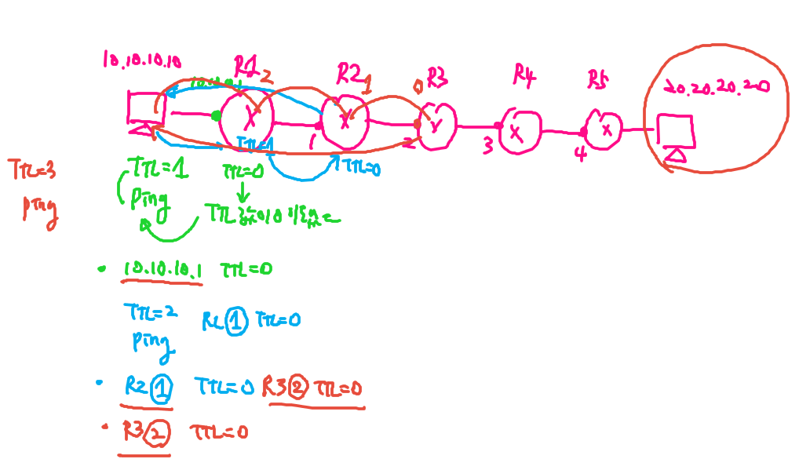


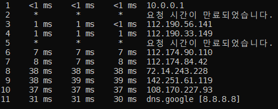

> next-hop IP를 표시
>
> \* 표시 : 응답을 받기 전 Timeout in seconds   --->  request time out. 회신 응답이 없는 경우 표시   
> ICMP packet에 반응하지 않도록 장비들은 * 표시


실습
---
**[Topology]**    
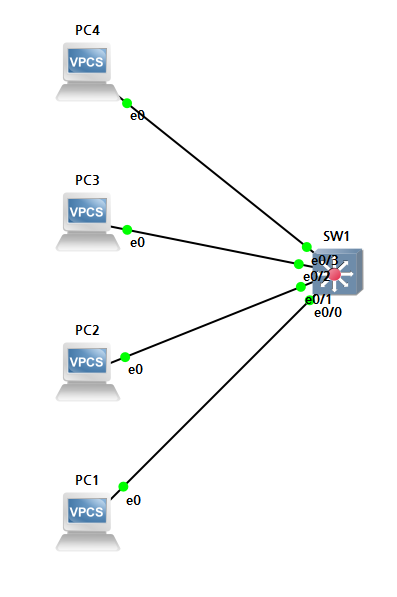

**[L3 Switch VLAN 설정]**    
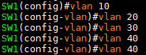

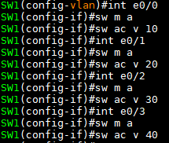

**[VLAN 및 Access port 확인]**    
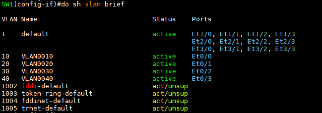


**[L3 Switch Routing 설정]**    
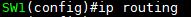


**[SVI]**     
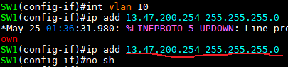

```
SW1(config)# int vlan 10
SW1(config-if)# ip add 13.47.200.254 255.255.255.0
SW1(config-if)# no shutdown
SW1(config-if)# exit
!
SW1(config)# int vlan 20
SW1(config-if)# ip add 13.47.201.254 255.255.255.0
SW1(config-if)# no shutdown
SW1(config-if)# exit
!
SW1(config)# int vlan 30
SW1(config-if)# ip add 13.47.202.254 255.255.255.0
SW1(config-if)# no shutdown
SW1(config-if)# exit
!
SW1(config)# int vlan 40
SW1(config-if)# ip add 13.47.203.254 255.255.255.0
SW1(config-if)# no shutdown
SW1(config-if)# exit


### IP는 각 Host PC의 Gateway IP로 설정
```


**[Routing table 확인]**    
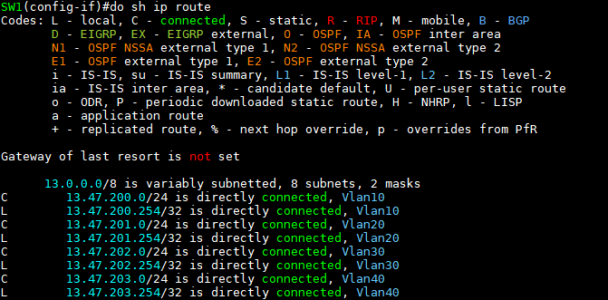

