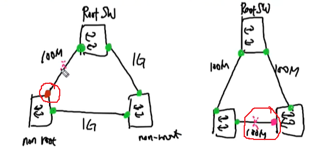
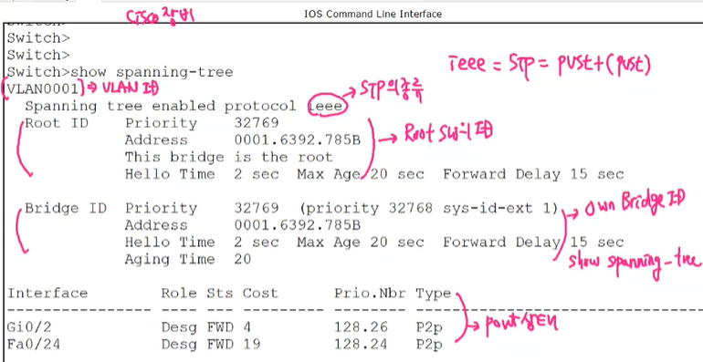
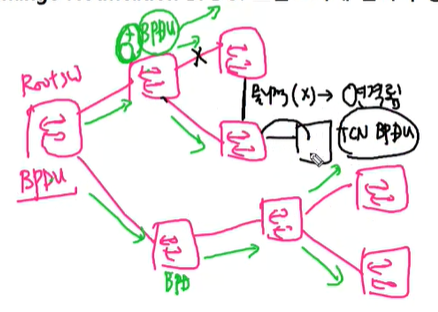
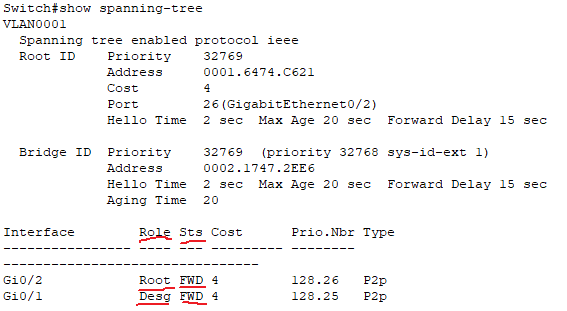
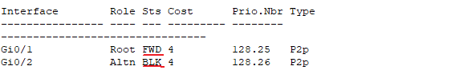
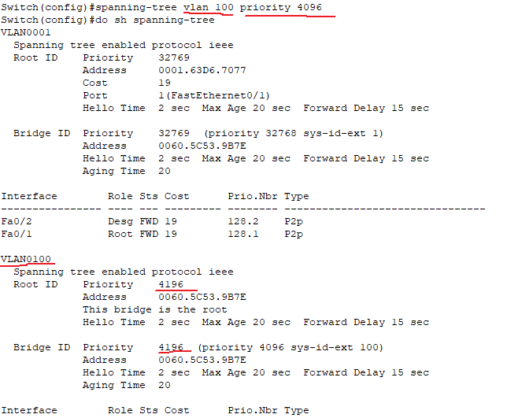
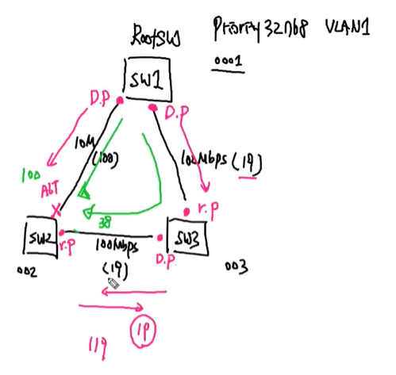
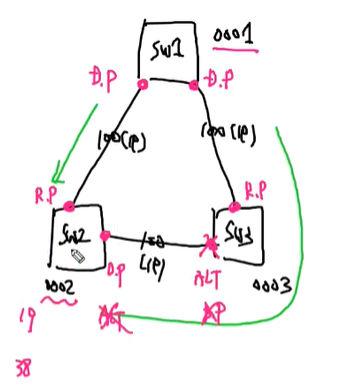

STP, BPDU
===

STP란?
---

(Spanning Tree Protocol, L2 네트워크의 가용성 증가 및 Loop 방지)

Switch는 **Flooding(BUM Traffic)** 때문에 이중화 구성을 하는 경우 Switch에 L2 frame이 들어오면 입력 port(ingress port)를 제외한 연결되어 있는 나머지 모든 port(egress port)로 전달하는 특성이 있음 ---> **Loop 발생**

위와 같은 Loop 발생을 방지하기 위해 Switch끼리 Switch의 정보를 가지고 Loop 발생 지점 중 한 곳에 L2 frame이 전달되지 못하도록 **차단(Block)하여 Tree 구조를 생성하는 Protocol**이다.

- Spanning (스위치가 확장되는) Tree (트리 구조) Protocol

- STP가 설정되어 있는 Switch는 자동 협상을 진행하여 Tree 구조를 만들고   
  주 경로에 문제가 발생하면 보조 경로의 BLK 상태인 port를 Forwarding 상태로 바꿔서 통신이 가능 

- STP는 물리적으로 Graph 구조의 Topology를 논리적인 Tree 구조의 Topology로 바꿔주는 Protocol   
  ---> 가용성 확보 및 Loop 방지


STP 종류
---

### (1) STP (IEEE 802.1D)

---> Cisco PVST(Per Vlan Spanning Tree) --->  PVST+ (Cisco에서 STP를 VLAN 별로 독립적 작동)

- VLAN 별로 STP를 독립적으로 작동시켜 부하 분산이 가능하다는 장점이 있다.

- Down --> Block --> Forward  으로 변하는 시간 = **Convergence Time(수렴시간)**


### (2) RSTP (Rapid STP)   
---> Cisco Rapid-PVST+ (IEEE 802.1W)

- 작동원리는 STP와 같이잠 수렴시간이 STP에 비해 **매우 짧음**


### (3) MSTP (Multiple STP)   
IEEE 802.1S

- VLAN 별로 독립적으로 STP가 동작하다 보면 VLAN이 너무 많은 네트워크에서는 STP를 협상하는 BPDU traffic이 과도하게 만들어 진다.

- 이를 해결하기 위해 여러 VLAN을 하나의 BPDU로 전송하도록 묶는다.


```
(config)# spanning-tree mode pvst                   ### STP
(config)# spanning-tree mode rapid-pvst             ### RSTP
(config)# spanning-tree mode mst                    ### MSTP
```


STP Algorithm
---

> STP의 핵심 원리


1. Root Switch 결정   
   ---> **BID가 제일 작은 값**으로 Root Switch를 결정

2. non-Root Switch는 Root Switch에 가장 빨리 도착할 수 있는 경로를 찾아 해당 Port의 상태를 결정하여 Tree 구조를 생성   
   
   

- 속도가 동일한 경우 Root Switch의 회선은 모두 forwarding 가능 상태이어야 한다.   
  즉, Root Switch는 BLK port가 없다

- 속도가 다른 경우 Root Switch로 빠르게 도착할 수 있는 경로가 forwarding 상태가 되기 때문에 Root Switch 회선 중 차단이 되는 회선이 존재할 수 있음


STP Algorithm을 위한 정보 교환 프레임
---

### BPDU (Bridge Protocol Data Unit)   
: STP에 의해 Switch끼리 서로 주고 받는 정보로 BPDU를 이용하여 Root Switch와 Port의 상태를 결정하는 제어 프레임


#### (1) Configuration BPDU

- **Root Switch만 생성해서 보낼 수 있음**

- **non-Root Switch는 Root Switch가 보내준 BPDU에 자신의 경로 값만 추가하여 전달**
- STP 종류, Root Bridge ID (Root Switch의 ID), Own Bridge ID, STP의 Port 상태 등을 전달

#### (2) TCN BPDU (Topology Change Notification BPDU)   
: Topology에 변화 발생 시 보내는 BPDU






STP의 Port 종류
---

### (1) Designated Port   
: 사용자 data frame forwarding이 가능한 상태

- **BPDU를 전송하는 port (수신X)**

- Designated Port가 BPDU를 수신하게 되면 Topology 변화가 발생한 것으로 인식하고 **Bridge ID**를 비교한 후 Root Switch를 변경하거나 BPDU를 보낸 Switch의 Port를 변경함.
- Root Switch에는 Designated Port만 존재한다.


### (2) Root Port   
: 사용자 data frame forwarding이 가능한 상태

- BPDU를 수신하는 port (전송X)
- **non-Root Switch에만 존재한다.**   --->  **Root port가 Root Switch로 가는 가장 빠른 port**
- non-Root Switch는 반드시 1개 이상의 Root port가 있어야 한다.

- Root Switch에는 절대 생성되지 않는다.

### (3) Alternative Port (Non-Designated Port)   
: Block 되어서 사용자 data frame을 송수신하지 못하는 상태

- BPDU는 수신하고 있음    --->   만약 Root port에 문제가 발생하면 Alternative port가 Root port로 변경된다.

- non-Root Switch에 있거나 없을 수 있다.
- Root Switch에는 절대 생성되지 않는다.

   


- GNS는 인터페이스 가상화가 되어 있어서 전원을 켜면 L1 계층이 없어도 가상화되어 연결되어 있는 것처럼 인식함 --> 회선을 제거하여도 인터페이스는 활성화 상태를 유지.


BPDU (Bridge Protocol Data Unit)
---

### (1) Bridge ID   
> Configuration BPDU의 핵심, 8 byte   

: BID를 이용해 Root Switch를 결정하고 port 상태를 정함 **(제일 작은 값이 Root Switch)**

- BID = Bridge Priority + MAC주소   
  16bit(2 byte) + 48bit (6 byte) = 64bit (8 byte)

  - Bridge Priority = Priority + VLAN ID
    4bit + 12bit (Priority 값을 관리자가 변경할 수 있음)

- Bridge Priority의 Default 값 : 1000 **0000 0000 0001** (VLAN ID 1)
  
  - 뒤 12자리(12bit)가 VLAN ID
  - Bridge Priority가 VLAN 10인 경우


  ```
  1000 0000 0000 1010    (VLAN ID 10)
  
  = 1000 0000 0000 0000 + VLAN ID 값 = 해당 VLAN의 Default Bridge ID
     -------------------
     32768 (default)
  ```

  ```
  0000 0000 0000 0000 + VLAN ID = 0 + VLAN ID
  0001 0000 0000 0000 + VLAN ID = 4096 + VLAN ID
  0010 0000 0000 0000 + VLAN ID = 8192 + VLAN ID
  
  ### 즉, 관리자가 변경하는 Priority 값은 4096씩 증가
  ```



- BID 조정을 하여 관리자가 원하는 Topology를 생성하는 것이 목적 (BID가 VLAN 별로 값이 다른 이유이다.)


### (2) IEEE Cost

: 회선의 속도가 다른 경우 Root Switch로 가는 속도차가 발생하는데 가장 빠르게 갈 수 있는 경로 지정   
**Cost가 작을수록 빠르다**

   
> Cost 값이 작을수록 회선 속도가 빠름

   
> SW2와 SW3 사이에는 BID를 비교하여 Designated port, Alternative port(BLK) 결정


STP 동작 과정
---

1. Broadcast Domain 내 (같은 네트워크, VLAN ID가 같은 네트워크)에서 Root Bridge(Switch)를 결정 (BID가 가장 작은 값을 Root Bridge로 결정)

2. Root Bridge(Switch)의 자신의 port를 Designated port로 변경 (Designated port는 BPDU를 전송)
3. Root Bridge(Switch)가 아닌 non-Root Bridge(Switch)는 다음 조건에 따라 port 상태를 정하고 Root port (BPDU를 수신하는 port, Root Bridge로 가는 가장 빠른 경로)를 선출
   - path cost가 가장 낮은 port (가장 빠른 경로)
   - path cost가 동일한 경우 이웃한 장비의 BID(Bridge ID)가 낮은 port
   - BID가 동일한 경우 Port ID가 가장 낮은 port

4. 각 세그먼트(각 Switch끼리 연결한 L1 회선)마다 다음 조건에 따라 Designated port를 결정   (Designated port는 일정시간 동안 BPDU를 수신하지 않으면 Designated port가 됨)
   - Switch 자체의 path cost가 낮은 Switch의 port
   - 자신의 BID가 가장 낮은 Switch의 port
   - 자신의 Port ID가 가장 낮은 Switch의 port

5. 역할을 부여 받지 못한 Port는 Blocking 상태를 유지하여 Loop 방지   
   (Blocking은 사용자의 frame을 전달하지 않는 상태로 BPDU를 수신함)


STP 설정 시 주의사항
---

1. 