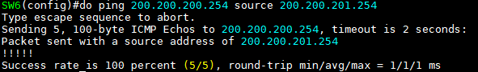

STP, BPDU
===

STP란?
---

(Spanning Tree Protocol, L2 네트워크의 가용성 증가 및 Loop 방지)

Switch는 **Flooding(BUM Traffic)** 때문에 이중화 구성을 하는 경우 Switch에 L2 frame이 들어오면 입력 port(ingress port)를 제외한 연결되어 있는 나머지 모든 port(egress port)로 전달하는 특성이 있음 ---> **Loop 발생**

위와 같은 Loop 발생을 방지하기 위해 Switch끼리 Switch의 정보를 가지고 Loop 발생 지점 중 한 곳에 L2 frame이 전달되지 못하도록 **차단(Block)하여 Tree 구조를 생성하는 Protocol**이다.

- Spanning (스위치가 확장되는) Tree (트리 구조) Protocol

- STP가 설정되어 있는 Switch는 자동 협상을 진행하여 Tree 구조를 만들고   
  주 경로에 문제가 발생하면 보조 경로의 BLK 상태인 port를 Forwarding 상태로 바꿔서 통신이 가능 

- STP는 물리적으로 Graph 구조의 Topology를 논리적인 Tree 구조의 Topology로 바꿔주는 Protocol   
  ---> 가용성 확보 및 Loop 방지


STP 종류
---

### (1) STP (IEEE 802.1D)

---> Cisco PVST(Per Vlan Spanning Tree) --->  PVST+ (Cisco에서 STP를 VLAN 별로 독립적 작동)

- VLAN 별로 STP를 독립적으로 작동시켜 부하 분산이 가능하다는 장점이 있다.

- Down --> Block --> Forward  으로 변하는 시간 = **Convergence Time(수렴시간)**


### (2) RSTP (Rapid STP)   
---> Cisco Rapid-PVST+ (IEEE 802.1W)

- 작동원리는 STP와 같이잠 수렴시간이 STP에 비해 **매우 짧음**


### (3) MSTP (Multiple STP)   
IEEE 802.1S

- VLAN 별로 독립적으로 STP가 동작하다 보면 VLAN이 너무 많은 네트워크에서는 STP를 협상하는 BPDU traffic이 과도하게 만들어 진다.

- 이를 해결하기 위해 여러 VLAN을 하나의 BPDU로 전송하도록 묶는다.


```
(config)# spanning-tree mode pvst                   ### STP
(config)# spanning-tree mode rapid-pvst             ### RSTP
(config)# spanning-tree mode mst                    ### MSTP
```


STP Algorithm
---

> STP의 핵심 원리


1. Root Switch 결정   
   ---> **BID가 제일 작은 값**으로 Root Switch를 결정

2. non-Root Switch는 Root Switch에 가장 빨리 도착할 수 있는 경로를 찾아 해당 Port의 상태를 결정하여 Tree 구조를 생성   
   
   

- 속도가 동일한 경우 Root Switch의 회선은 모두 forwarding 가능 상태이어야 한다.   
  즉, Root Switch는 BLK port가 없다

- 속도가 다른 경우 Root Switch로 빠르게 도착할 수 있는 경로가 forwarding 상태가 되기 때문에 Root Switch 회선 중 차단이 되는 회선이 존재할 수 있음


STP Algorithm을 위한 정보 교환 프레임
---

### BPDU (Bridge Protocol Data Unit)   
: STP에 의해 Switch끼리 서로 주고 받는 정보로 BPDU를 이용하여 Root Switch와 Port의 상태를 결정하는 제어 프레임


#### (1) Configuration BPDU

- **Root Switch만 생성해서 보낼 수 있음**
- 각 Switch의 Bridge ID, 선출된 Root Bridge ID, Root Path Cost, STP timer 값 등이 수록
- Config BPDU를 주고 받음으로써 Bridge들은 서로 Bridge ID, Port ID, Cost 등을 비교해 Root Bridge를 선정하고 자신의 Root Path Cost와 Designated port, Root port를 결정할 수 있음

- **non-Root Switch는 Root Switch가 보내준 BPDU에 자신의 경로 값만 추가하여 전달**
- STP 종류, Root Bridge ID (Root Switch의 ID), Own Bridge ID, STP의 Port 상태 등을 전달

#### (2) TCN BPDU (Topology Change Notification BPDU)   
: Topology에 변화 발생 시 보내는 BPDU

- Root Bridge가 아닌 Bridge에서 Topology에 변화가 발생한 경우에 상위 Root Bridge를 향해 전송됨

- Topology의 변화란 Forwarding state가 아닌 Port가 Forwarding state로 전환된 경우를 가리킴

  - **TCN BPDU의 필요성**
    - MAC Address Aging Time(Cisco Default 300초)로 인해 Topology에 변화가 생겼을 경우 MAC Forwarding port가 변경이 필요한 Aging time이 지나야 새로운 Forwarding port 학습
    - 최대 Aging time 5분 + STP Forwarding Delay와 Blocking 시간 50초일 경우 약 6분간 통신 X
    - 이와 같은 문제점을 방지하기 위해 TCN BPDU가 발생하는 경우 TCN BPDU를 받은 Switch는 Aging Time을 15초로 변경 (RSTP의 경우 바로 지움)   

      


STP의 Port 종류
---

### (1) Designated Port   
: 사용자 data frame forwarding이 가능한 상태

- **BPDU를 전송하는 port (수신X)**

- Designated Port가 BPDU를 수신하게 되면 Topology 변화가 발생한 것으로 인식하고 **Bridge ID**를 비교한 후 Root Switch를 변경하거나 BPDU를 보낸 Switch의 Port를 변경함.
- Root Switch에는 Designated Port만 존재한다.


### (2) Root Port   
: 사용자 data frame forwarding이 가능한 상태

- BPDU를 수신하는 port (전송X)
- **non-Root Switch에만 존재한다.**   --->  **Root port가 Root Switch로 가는 가장 빠른 port**
- non-Root Switch는 반드시 1개 이상의 Root port가 있어야 한다.

- Root Switch에는 절대 생성되지 않는다.

### (3) Alternative Port (Non-Designated Port)   
: Block 되어서 사용자 data frame을 송수신하지 못하는 상태

- BPDU는 수신하고 있음    --->   만약 Root port에 문제가 발생하면 Alternative port가 Root port로 변경된다.

- non-Root Switch에 있거나 없을 수 있다.
- Root Switch에는 절대 생성되지 않는다.

   


- GNS는 인터페이스 가상화가 되어 있어서 전원을 켜면 L1 계층이 없어도 가상화되어 연결되어 있는 것처럼 인식함 --> 회선을 제거하여도 인터페이스는 활성화 상태를 유지.


BPDU (Bridge Protocol Data Unit)
---

### (1) Bridge ID   
> Configuration BPDU의 핵심, 8 byte   

: BID를 이용해 Root Switch를 결정하고 port 상태를 정함 **(제일 작은 값이 Root Switch)**

- BID = Bridge Priority + MAC주소   
  16bit(2 byte) + 48bit (6 byte) = 64bit (8 byte)

  - Bridge Priority = Priority + VLAN ID
    4bit + 12bit (Priority 값을 관리자가 변경할 수 있음)

- Bridge Priority의 Default 값 : 1000 **0000 0000 0001** (VLAN ID 1)
  
  - 뒤 12자리(12bit)가 VLAN ID
  - Bridge Priority가 VLAN 10인 경우


  ```
  1000 0000 0000 1010    (VLAN ID 10)
  
  = 1000 0000 0000 0000 + VLAN ID 값 = 해당 VLAN의 Default Bridge ID
     -------------------
     32768 (default)
  ```

  ```
  0000 0000 0000 0000 + VLAN ID = 0 + VLAN ID
  0001 0000 0000 0000 + VLAN ID = 4096 + VLAN ID
  0010 0000 0000 0000 + VLAN ID = 8192 + VLAN ID
  
  ### 즉, 관리자가 변경하는 Priority 값은 4096씩 증가
  ```


- BID 조정을 하여 관리자가 원하는 Topology를 생성하는 것이 목적 (BID가 VLAN 별로 값이 다른 이유이다.)


### (2) IEEE Cost

: 회선의 속도가 다른 경우 Root Switch로 가는 속도차가 발생하는데 가장 빠르게 갈 수 있는 경로 지정   
**Cost가 작을수록 빠르다**

   
> Cost 값이 작을수록 회선 속도가 빠름

   
> SW2와 SW3 사이에는 BID를 비교하여 Designated port, Alternative port(BLK) 결정


STP 동작 과정
---

1. Broadcast Domain 내 (같은 네트워크, VLAN ID가 같은 네트워크)에서 Root Bridge(Switch)를 결정 (BID가 가장 작은 값을 Root Bridge로 결정)

2. Root Bridge(Switch)의 자신의 port를 Designated port로 변경 (Designated port는 BPDU를 전송)
3. Root Bridge(Switch)가 아닌 non-Root Bridge(Switch)는 다음 조건에 따라 port 상태를 정하고 Root port (BPDU를 수신하는 port, Root Bridge로 가는 가장 빠른 경로)를 선출
   - path cost가 가장 낮은 port (가장 빠른 경로)
   - path cost가 동일한 경우 이웃한 장비의 BID(Bridge ID)가 낮은 port
   - BID가 동일한 경우 Port ID가 가장 낮은 port

4. 각 세그먼트(각 Switch끼리 연결한 L1 회선)마다 다음 조건에 따라 Designated port를 결정   (Designated port는 일정시간 동안 BPDU를 수신하지 않으면 Designated port가 됨)
   - Switch 자체의 path cost가 낮은 Switch의 port
   - 자신의 BID가 가장 낮은 Switch의 port
   - 자신의 Port ID가 가장 낮은 Switch의 port

5. 역할을 부여 받지 못한 Port는 Blocking 상태를 유지하여 Loop 방지   
   (Blocking은 사용자의 frame을 전달하지 않는 상태로 BPDU를 수신함)


STP 설정 시 주의사항
---

1. SVI, Spanning-tree는 Active Interface가 존재해야 작동   
   즉, VLAN만 생성했지만 Interface에 VLAN Access를 하지 않은 상태에서는 작동하지 않음

2. Root Bridge(Switch)만 Configuration BPDU를 생성
3. VLAN 별로 Root Switch가 다를 수 있다 (STP가 VLAN 별로 동작하기 때문이다 ---> PVST ---> PVST +)
4. BPDU를 전송하는 port는 Designated port
5. BPDU를 수신하는 port는 Root port (Switch에 각 VLAN마다 하나만 존재), Alternative port(Non-Designated port)
6. Root port 혹은 Alternative port가 일정시간 동안 BPDU를 수신하지 못하면 Designated port로 변경
7. Designated port가 BPDU를 수신하는 경우, Root Bridge ID를 비교한 후 자신의 BID가 더 높으면 Root port로 변경, 아닌 경우 무시


STP의 Configuration BPDU
---

1. Priority
   - 총 16bit 중 앞 4bit를 사용
   - Default 1000 0000 0000 0000 : 32768
   - 4096씩 값 증가
   - 관리자가 변경 가능

2. VLAN ID
   - 총 16bit 중 뒤 12bit 사용
   - 관리자가 변경 불가능

3. 장비의 MAC 주소 (48bit)
   - 관리자가 변경 불가능


- **BID = 1 + 2 + 3**

4. Cost
   - IEEE에서 지정한 Default 값을 사용하거나 관리자가 임의로 변경 가능

5. Port ID
   - Default : 128.port번호
   - 관리자가 변경 가능


#### Step 1
- 서로 자기가 Root라고 생각하고 BPDU를 각자 생상
- Root BID와 OWN BID는 같은 값으로 설정
- 그리고, Root까지 거리도 당연히 '0'이 되고 그 값을 서로 교환   
  
   

#### Step 2
- 상대방으로부터 받은 BPDU와 자신의 BPDU를 비교 ---> 이때 처음 비교하는 것이 Root BID 부분이다.
- SW1 입장에서는 SW2로부터 받은 Root BID가 자신보다 값이 높음
- SW2와 연결된 port를 Designated port로 만듬 (Listening, Learning의 Forwarding delay 시간이 완료된 후)
- SW2 입장에서는 해당 port를 Root port로 만든 후 SW2에선 BPDU를 만들지않고 Root port에서 유입되는 BPDU를 기다림
- 그리고, SW1이 Designated port를 이용해서 자신의 BPDU를 전달하면 SW2는 Root port로 정보를 받아서 자신의 BPDU로 재생산
- IEEE의 Cost 값을 기준으로 유입된 BPDU의 port의 Bandwidth에 맞는 Cost 값을 추가
- SW1과 SW2 사이에 Bandwidth가 100Mbps라면 19

   


#### Step 3
- SW2는 Step2에서 만들어진 BPDU를 Designated port를 통해 다른 Switch에게 전달
- 그 다음 Switch도 SW2의 BPDU를 Root port로 전달받아 자신의 BPDU로 만들고 다른 Switch에 전달

#### Configuration BPDU IEEE Cost 값   


STP vs RSTP
---


- RSTP의 경우 Disabled / Discarding / Learning / Forwarding  4단계로 보는 경우도 있음
- Disabled 일 때는 관리자가 port를 shutdown하거나 err-disabled 상태일 경우 나타남
- Blocking 20초는 BPDU Max Age Default 시간인 20초를 대기하는 것

   #### * Port 상태 설명은 다음 장에서 다룸

BPDU 상세
---

- Protocol ID
  - 모두 '0'으로 설정된 값만 사용

- Version
  - -0X00 = STP
  - -0X02 = RSTP
  - -0X03 = MSTP

- Message type
  - -0X00 = Configuration BPDU
  - -0X80 = TCN BPDU

- Flags
  - Topology가 변할 때, 상태 정보를 전달하기 위한 값들을 표시

- Root Bridge ID
  - Root의 Bridge ID 정보를 담아서 보냄

- Root Path Cost
  - Root까지의 거리 값

- Sender Bridge ID
  - Local Bridge ID

- Port ID
  - Root ID, Root Path Cost 값이 같을 경우 Port ID로 Forwarding 결정

- Message Age
  - Root가 해당 BPDU를 만든지 얼마나 지났는지 표시
  - 이 시간이 Max age와 동일해지면 이 BPDU는 사라짐

- MAX age (TTL)
  - BPDU의 생명시간 (Default 20초)

- Hello Time
  - BPDU를 보내는 시간 간격을 Root가 결졍해서 보내줌 (Default 2초)

- Forwarding Delay
  - STP는 Block 상태에서 Forwarding이 되는데 Listening, Learning 단계를 거침
  - 그때, Listening, Learning 단계를 얼마동안 수행하고 다음 단계로 전달될 것인지를 결정하는 시간

   

실습 1
---


1. PC에 IP, Gateway 등록   
      
   ...   
   


2. L3 Switch 설정 (Routing)
   
   

      
   > SVI (VLAN 1)의 IP는 PC의 Gateway IP로 지정   
   > Interface e0/2는 routed port로 사용

   

   > SW5와 SW6 사이는 사설 네트워크 192.168.56.0/24 사용


3. Static Routing
   
      
   > SW5의 Routing table

      
   > SW6의 Routing table


4. ICMP ping 확인
   
   
   > SW5와 SW6의 VLAN 1 통신 확인

      
   > PC1 --> PC8 통신 확인


5. Root Switch 확인
   
      
      
   > 200.200.200.0/24 네트워크의 Root Switch는 SW5가 아닌 SW1이다

   


6. SW5를 Root Switch로 바꾸기   
   > Priority 변경

      
      
   > Priority 값이 더 낮은 SW5가 Root Switch가 되었음

   

      
   > SW6   
   >
   > 이렇게도 Root Switch로 설정이 가능


7. RSTP 설정   
   
      
   > 모든 Switch에 설정 (수렴시간이 짧아짐)


실습 2
---

   
   
   


1. VLAN 생성 (Switch 4개 전부)   
   

2. SW1과 SW2에 Access mode 설정
   
      
   

   > SW2에는 VLAN 201로 설정

3. Trunk 설정
   > Switch끼리 연결된 모든 회선에 Trunk 설정  

      
      
      

   > SW2도 똑같이 적용

4. Inter-VLAN
   
      
   > L3 Switch Routing 설정

      
   > SW3에 int vlan 200만 설정   

      
   > SW4에 int vlan 201만 설정   


5. spanning-tree (VLAN 별로)
   
      
   > VLAN 200 네트워크의 Root Switch ---> SW3
   >
   > SW3이 꺼졌을 경우 SW1가 아닌 SW4가 다음 Root Switch가 될 수 있게 하기 위한 설정 (secondary)

      
   > VLAN 201 네트워크의 Root Switch ---> SW4
   >
   > SW4가 down되었을 경우 SW2가 아닌 SW3이 다음 Root Switch가 될 수 있게 하기 위한 설정 (secondary)


6. spanning-tree 확인
   
      
   
   > SW3만 확인해봄

7. Routing
   
> Switch Interface에 gateway 주소가 없기 때문에 ip route가 아닌 connected 방법

   ```
   (config)# ip routing
   ```
      
   > 200.200.201.0 네트워크로 가는 Route 경로가 없다

      
   > SW3에 VLAN 201 SVI 설정 (IP입력)

      
   > Trunk 회선으로 인해 VLAN 201을 따라서 SW4로 넘어갈 수 있음 (Gateway 사용)

      
   > SW4도 똑같이 설정

8. 모든 Switch에 RSTP 설정   
   
   


실습 3
---


> VLAN 별로 STP 설정

1. 각 Switch에 VLAN 생성
   
      
   > SW2, SW3에도 동일하게 입력

2. VLAN access mode 설정   
   
      
   > 1.1.1.0/24는 VLAN 10
   >
   > 2.2.2.0/24는 VLAN 20
   >
   > 3.3.3.0/24는 VLAN 30

      
   > SW1 확인


3. Trunk 설정
      
   > Switch 간 회선에 Trunk 설정
   >
   > SW2와 SW3 사이에도 Trunk 설정을 해야 함

   


4. spanning-tree 설정
   > VLAN 별로 Spanning-tree 설정, 각 Switch 당 하나의 VLAN을 Root Switch로 지정 ---> 부하분산

      

      
   


5. Inter-VLAN 설정   
   > 각 Switch에 Gateway IP 지정

      
      
      


6. Routing을 위한 추가 Inter-VLAN 설정
   
   > connected 방법으로 VLAN을 이용하여 IP routing.
   >
   > 각 Switch에서 나머지 두 VLAN에 해당 네트워크 범위 내에 아무 IP를 부여

      
   

   > SW2, SW3에도 동일하게 적용

7. 모든 Switch에 RSTP 설정
   
   

   