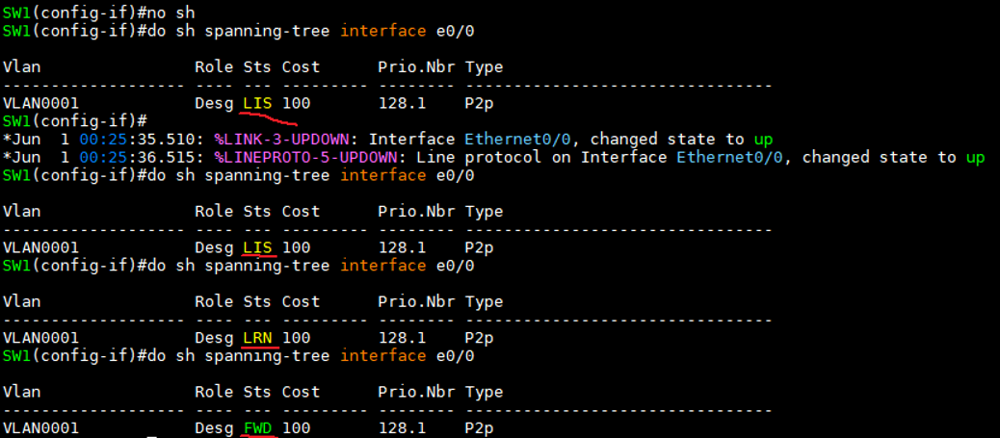

STP Timer
---

- **Hello**
  - Configuration BPDU를 전송하는 시간 (default 2초)

- **Max Age**
  - Root Switch가 생성한 BPDU의 최대 생존 시간 (default 20초)
  - BPDU로 인한 Loop 방지를 위한 시간
  - Blocking ---> Listening 으로 변경되는 시간에도 사용

- **Forwarding Delay**
  - Listening ---> Learning ---> Forwarding 에서 Listening과 Learning이 대기하는 시간 (default 15초)
  - STP가 작동할 때 Root Switch가 생성한 BPDU가 전체 네트워크로 전달되는 시간을 기다림


|Blocking|-->|Listening|-->|Learning|-->|Forwarding|
|:---:|:---:|:---:|:---:|:---:|:---:|:---:|
|BPDU 수신 가능||BPDU 전송||BPDU 전송|||
|20초 대기||15초 대기||15초 대기|||

- **Discard** (Blocking, Listening) : agreement와 proposal을 이용하여 수초 이내 협상 (더 빠르게)

- Timer 확인
  ```
  # show spanning-tree
  ```

  


Port 상태
---

### (1) Disable
- shutdown 상태
- err-disable 상태
  - err-disable은 Switch에서 제공하는 상태 체크 확인
  - 자체 내장된 감지 기능으로 Switch의 오작동으로 인한 문제 발생 시 해당 Interface를 자동으로 disable 상태로 바꿔 오작동으로 인한 문제를 방지해주는 기능

### (2) Blocking
- Disable된 port가 enable 상태가 되었을 때 최초 포트의 상태
- BPDU 송수신 가능
- 데이터 전송은 불가능
- Max Age 20초

### (3) Listening
- Blocking 상태에 있던 Switch의 port가 Root port나 Designated port로 선정되면 port는 바로 Listening 상태로 넘어간다.
- Listening 상태에 있던 port도 상황에 따라 다시 Non-Designated port로 변할 수 있고 그러면 다시 Blocking 상태로 돌아간다 
- BPDU 송수신

### (4) Learning
- Listening 상태에 있던 port가 Forwarding Delay 15초 동안 상태를 유지한 후 변경된 port 상태
- 이때 MAC address 학습 시작 ---> MAC address table을 만듦

### (5) Forwarding
- Learning 상태에 있던 port가 Forwarding Delay 15초 동안 상태를 유지하면 이때부터 사용자 Frame을 전송하고 MAC address 학습이 원할
- 데이터 전송

#### * RSTP는 Proposal BPDU와 Agreement BPDU를 이용해 Delay 시간을 최소한으로 줄여 Discard (Blocking+Listening)로 지정.
#### * Discard --> Learning --> Forwarding 3단계 과정으로 축소
- 15초 동안 상태를 유지하지 않고 짧은 시간 만에 상태를 변경

