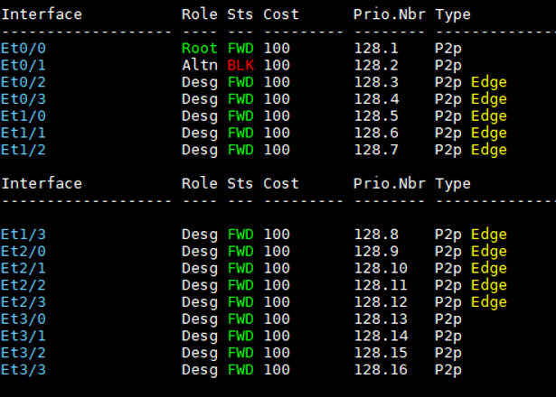
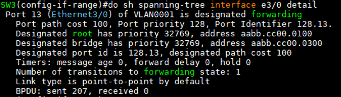
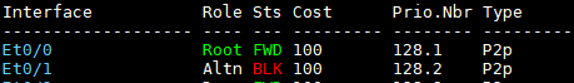
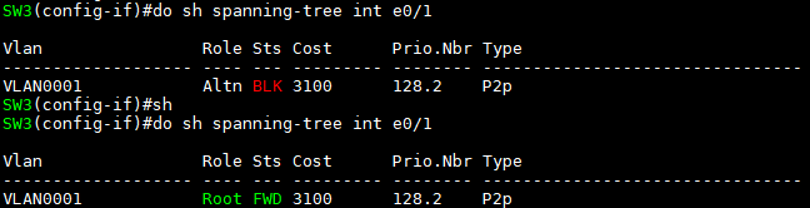
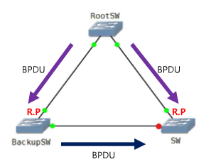
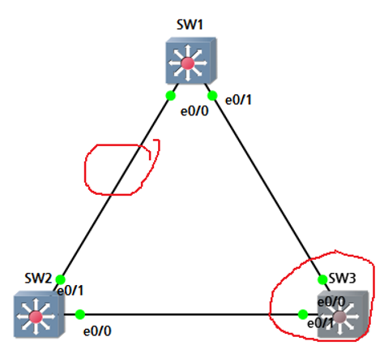
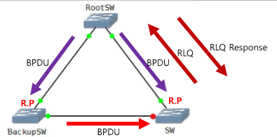

STP 수렴시간 관리
===

- RSTP를 사용하고 Access port에 **portfast**를 설정하는 것을 권장
  - 수렴시간 관리에 backbone fast, uplink fast, Max age, Forwarding Delay 값을 관리자가 수정할 수 있지만 Loop가 발생할 수 있어 RSTP 사용을 권장

- Global configuration : 모든 Switch port에 적용
- Interface configuration : 해당 Interface만 적용


Portfast
---

- 포트는 STP 포트 상태 변화로 인해 최대 50초의 **Forwarding Delay** 발생
- Access mode인 Interface에 적용하는 것을 권장
- BPDU는 전송하나 STP 협상에는 참여하지 않음 ---> 즉, Designated port로만 작동
- Forwarding delay 과정을 건너 뜀
- Loop의 위험이 있어 End-device와 연결된 port에 설정하는 권장
- 즉, **상대방이 보내는 BPDU는 무시하고 Portfast를 설정한 인터페이스는 BPDU를 계속 전달** (2초마다 전달)

```md
(config)# spanning-tree portfast [edge] default     ### global 설정

(config-if)# spanning-tree portfast         ### Interface에 설정
```

- Global configuration으로 설정했을 경우 특정 Interface에 portfast 비활성화 명령어
  ```
  (config-if)# spanning-tree portfast disable
  ```

- 확인 명령어
  ```
  # show spanning-tree
  ```   
     
  > Type에 Edge ---> portfast 기능 활성화 상태

|Interface|Role|Sts|Cost|Prio.Nbr|Type
|:---:|:---:|:---:|:---:|:---:|:---:|
|Port ID|port역할|port상태|Cost|Port ID|p2p(full duplex) edge(portfast 활성화)|

```
# show spanning-tree interface [Interface ID] detail
```   


- Cisco 장비에서 portfast 기능을 활성화했어도 해당 Interface로 BPDU가 수신되는 경우 portfast 기능을 비활성화 후 STP 협상 참여


Uplink fast
---

- 정상적인 Link가 down 상태가 된 경우 대체 포트를 전송상태로 변경하기 위해서 30초의 convergence time 필요
- **Uplink fast**는 직접 연결된 Link가 down되었을 때 Forward Delay(30초)를 기다리지 않고 대체 포트를 차단 상태에서 즉시 전송 상태로 변경

- uplinkfast 명령어
  ```
  (config)# spanning-tree backbonefast
  ```

> RSTP에 기본으로 설정



> SW3의 port 정보


SW3의 e0/0를 shutdown   
   
> 바로 BLK에서 FWD 상태로 변경

- 해당 Switch의 root port가 만약 문제가 발생(BPDU 수신 X)하면 Block 상태에 있던 Alternative port가 바로 Root port로 변경 (2번의 forwarding delay 15초 = 30초를 건너뜀)


#### 예시



- SW의 Blocking 상태 port는 STP를 계속 수신하고 있음
- SW의 Root port에 장애가 발생하면 Backup SW로부터 BPDU를 수신하였으므로 Root port가 존재하는 Switch가 있다는 것을 알고 있음   
  따라서, Blocking 20초를 기다리지 않고 Listening (15초) --> Learning(15초) = 30초 만에 STP 계산
- Uplink Fast는 30초를 기다리지 않고 수신된 BPDU를 이용해 우선 순위가 좋은 port를 미리 선정해두고 바로 Root port로 변경시키는 기술


Backbone fast
---

- 간접적으로 연결된 Link가 down되었을 때 Max-age(20초)를 생략하고 차단 상태의 대체 포트를 즉시 Listening 상태로 변경
- STP가 동작하고 있는 Switch 망에서 간접 링크가 down되면 대체 포트를 가진 Switch는 후순위 BPDU를 통해 Link의 down을 감지
- 내 장비가 아닌 다른 장비의 root port가 down되면 (간접링크) 대체 포트(block)를 가진 Switch가 Designated port로 빠르게 변경하도록 만든 설정
- backbonefast 명령어
  ```
  (config)# spanning-tree backbonefast
  ```

> RSTP에 기본으로 설정
   
- SW3에서 간접링크 : SW1과 SW2 연결링크

#### 예시


- Back SW의 R.P에 장애가 발생한 경우 BPDU를 수신하지 못함
- 이때 Back SW에는 Root SW가 보낸 BPDU의 aging time(Max Age 20sec)동안 SW에게 계속 BPDU를 전달함 (Hello 2sec)
- Aging time이 지난 후 Root SW로 BPDU를 받지 못하고 SW로부터도 BPDU를 받지 못하였으므로 Backup SW는 자신이 Root SW가 되어 SW에 BPDU를 새로 보냄
- SW는 원래 Root SW로 받은 BPDU가 더 낮은 root BID 값이므로 Backup SW의 Root port가 없어진 것을 알게 됨   
  Block port를 STP 계산 30초 후 Designated port로 변경 후 BPDU를 전달
  - Root SW 자체 장애일 수도 있기 때문에 Block port의 상태 변경 전 RLQ를 보내고 Response 시 상태 변경

- Backup 장비는 Max 50초를 기다려야 함.   
  따라서, Root port에 장애가 발생하면 Max age를 기다리지 않고 바로 BPDU를 만들어 전달해 Max age 20초를 기다리지 않는 기술


