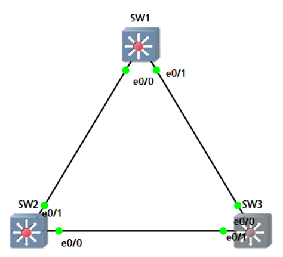

STP 수렴시간 관리
===

- RSTP를 사용하고 Access port에 **portfast**를 설정하는 것을 권장
  - 수렴시간 관리에 backbone fast, uplink fast, Max age, Forwarding Delay 값을 관리자가 수정할 수 있지만 Loop가 발생할 수 있어 RSTP 사용을 권장

- Global configuration : 모든 Switch port에 적용
- Interface configuration : 해당 Interface만 적용


Portfast
---

- Access mode인 Interface에 적용하는 것을 권장
- BPDU는 전송하나 STP 협상에는 참여하지 않음 ---> 즉, Designated port로만 작동
- Forwarding delay 과정을 건너 뜀
- Loop의 위험이 있어 End-device와 연결된 port에 설정하는 권장

```
(config)# spanning-tree portfast [edge] default     ### global 설정

(config-if)# spanning-tree portfast         ### Interface에 설정
```

- Global configuration으로 설정했을 경우 특정 Interface에 portfast 비활성화 명령어
  ```
  (config-if)# spanning-tree portfast disable
  ```

```
# show spanning-tree
```   
   
> Type에 Edge ---> portfast 기능 활성화 상태

|Interface|Role|Sts|Cost|Prio.Nbr|Type
|:---:|:---:|:---:|:---:|:---:|:---:|
|Port ID|port역할|port상태|Cost|Port ID|p2p(full duplex) edge(portfast 활성화)|

```
# show spanning-tree interface [Interface ID] detail
```   


- Cisco 장비에서 portfast 기능을 활성화했어도 해당 Interface로 BPDU가 수신되는 경우 portfast 기능을 비활성화 후 STP 협상 참여


Uplink fast
---

> RSTP에 기본으로 설정




> SW3의 port 정보


SW3의 e0/0를 shutdown   
   
> 바로 BLK에서 FWD 상태로 변경

- 해당 Switch의 root port가 만약 문제가 발생(BPDU 수신 X)하면 Block 상태에 있던 Alternative port가 바로 Root port로 변경 (2번의 forwarding delay 15초 = 30초를 건너뜀)


Backbone fast
---

> RSTP에 기본으로 설정

- 내 장비가 아닌 다른 장비의 root port가 down되면 (간접링크) 대체 포트(block)를 가진 Switch가 Designated port로 빠르게 변경하도록 만든 설정
- Blocking 하지 않고 Listening부터 시작하도록 설정 (Max age 20초를 건너뜀)

```
(config)# spanning-tree backbonefast
```

   
> SW3에서 간접링크 (SW1과 SW2 연결링크)

