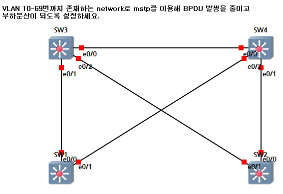
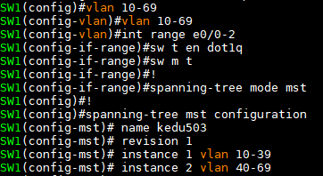
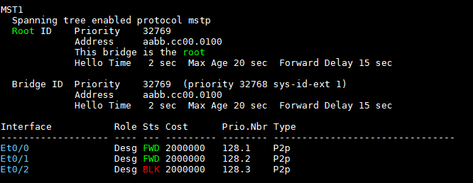
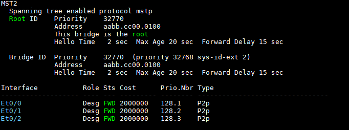
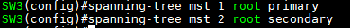
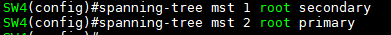
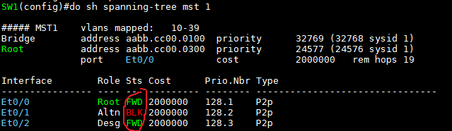
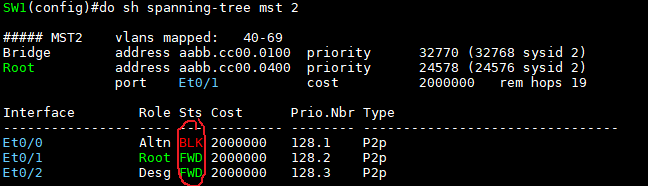
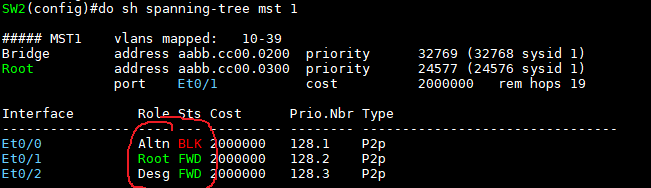
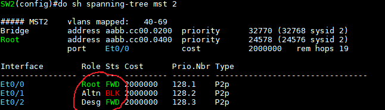

MSTP 설정
---
> 부하분산, 이중화

실습

1. 모든 Switch에 아래처럼 입력 (VLAN, trunk, instance 설정)
  

2. spanning-tree 확인
     
  

3. 부하분산 (mst 1은 SW3으로, mst 2는 SW4를 Root Switch로 설정)
     
  

4. SW1의 port 상태 확인
     
     

5. SW2의 port 상태 확인
     
  

