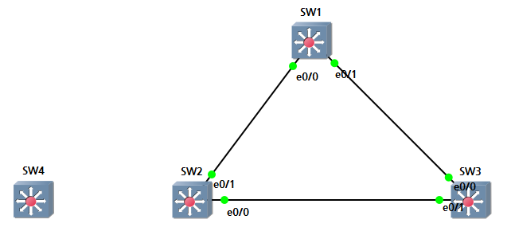
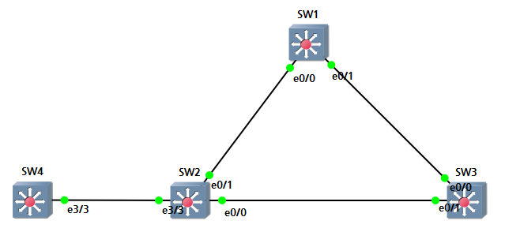
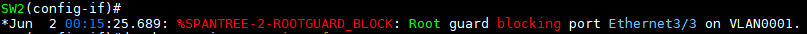
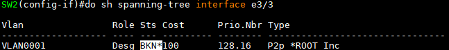

STP Root Switch 보호
---

### 1. Root Guard

현재 구성되어 있는 topology에서 더 낮은 BPDU 값을 가진 Switch가 추가로 연결되면 포트를 Blocking 상태로 변경시켜서 해당 포트는 사용 불가능

- 전역환경설정에서는 아직 지원하지 않음

- 개별 Interface에서 설정
- 주로 End device가 연결되는 Access port에 설정을 주로 함

```
(config-if) spanning-tree guard root
```


#### 실습



> 현재 SW1이 Root Switch
> SW4의 BPDU 값이 SW1보다 낮다고 가정하자

1. SW2에 Root guard 설정   
  ```
  SW2(config)# int e3/3
  SW2(config-if)# spanning-tree guard root
  ```

2. SW4를 SW2 e3/3 Interface에 추가적으로 연결   

   

1. 확인

   
> Root guard로 인해 e3/3 Interface가 blocking 상태로 되었다는 메시지 확인   

     
  * SW2의 e3/3 Interface에서 BPDU를 수신하지 않음 (Block)
  * 만약 SW4의 Priority가 SW1보다 값이 낮지 않으면 Root Guard는 작동하지 않음


### 2. BPDU Guard

BPDU가 해당 포트로 수신되면 해당 포트를 err-disabled (shutdown)으로 변경해서 사용불가 포트로 변경시킨다. (차단)

- 주로 End-Device와 연결되는 Access port에 설정을 주로 함
- 전역 환경설정과 개별 Interface 설정 둘 다 가능

#### 전역환경설정
```
(config)# spanning-tree portfast bpduguard default

(config-if)# spanning-tree portfast
```
- 전역 환경설정에서 BPDU Guard를 설정하는 경우 Switch와 Swich 사이의 BPDU를 전송하지 못하기 때문에 **Interface에 portfast 기능이 설정된 Interface에서만 작동**


#### 개별 Interface 설정
```
(config-if)# spanning-tree bpduguard enable
```

- err-disabled로 인해 shutdown이 된 Interface는 관리자가 **shutdown** 명령어를 입력하면 해당 Interface의 상태를 초기화 (err-disabled 풀림) ---> no shutdown ---> Active


BPDU Filter
---

- Switch는 Listening port부터 BPDU를 전송하기 시작함
- BPDU는 Hello interval time으로 설정된 2초마다 전달됨
- End Device(routed port)가 붙어 있는 Access mode로 되어 있는 Switch 포트에 BPDU를 2초마다 보내는 것은 불필요한 Processing을 가용하고 그만큼의 대역폭을 소모

#### 따라서, BPDU를 보내지 않아도 되는 Access port에 **BPDU filter**를 설정해서 BPDU가 필요 없는 장치에 BPDU를 보내지 않도록 하는 기능

- 전역환경설정
  ```
  (config)# spanning-tree portfast bpdufilter default
  ```
  - portfast 기능이 있는 Interface에만 적용
    ```
    (config-if)# spanning-tree portfast
    ```

- Interface 환경설정
  ```
  (config-if)# spanning-tree bpdufilter enable
  ```


Loop Guard, UDLD
---

STP가 완벽하게 Loop를 차단하지는 못함

### (1) Loop Guard   
- VLAN 단위(PVST)로 STP가 적용되기 때문에 Trunk port에선 Loop가 발생할 가능성이 있다

- 차단 상태에 있는 포트가 상대 포트에서 BPDU를 받지 못했을 때 전송 상태로 변경되는 것을 방지하는 기능
- 이 경우 차단 상태의 포트는 inconsistent 상태로 바뀐다. (일종의 차단 상태)
- 다시 BPDU를 수신하기 시작하면 자동으로 정상적인 차단상태로 변경된다.

- Switch topology STP 전 구간에 차단 포트가 없는 경우가 발생할 수도 있기 때문에 Loop Guard 설정을 해준다

- Trunk port의 Designated port를 제외한 port에 설정을 권장

- 전역환경설정
  ```
  (config)# spanning-tree loopguard default
  ```

- Interface 환경설정
  ```
  (config-if)# spanning-tree guard loop
  ```

- 확인 명령어
  ```
  # show spanning-tree summary
  ```


### (2) UDLD

Uni Direction Link Detection, 단방향 링크 감지

- Cisco 전용 L2 Protocol
- 케이블의 물리적 구성을 모니터링하고 단방향 링크를 감지
- 광케이블이 연결되는 Interface에 주로 설정

- UDLD가 활성화된 경우, 한 장비에서 다른 장비로 패킷을 전송하면 해당 패킷은 반대 방향으로 다시 전송됩니다. 
- 만약 패킷이 반대 방향으로 전송되지 않으면, 해당 링크는 양방향 링크가 아닌 것으로 간주됩니다

##### UDLD는 링크 장애를 조기에 감지하여 네트워크 장애를 방지하는 데 도움이 됩니다.

- Rx, Tx 회선이 구분되어 있을 때 Rx-Tx 회선 중 하나의 회선에 장애가 발생하면 Loop가 발생할 수 있음

```
(config)# udld enable
(config-if)# udld port
```

- UDLD가 감지되면 err-disabled로 상태 변경


Access port 권장 설정
---

```
(config-if)# switchport mode access
(config-if)# switchport access vlan [VLAN ID]
(config-if)# spanning-tree portfast
(config-if)# spanning-tree bpdufilter enable
```

### Root Switch 보호
```
(config-if)# spanning-tree guard root