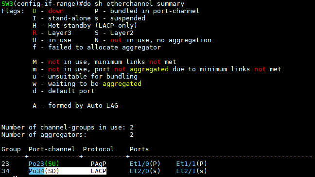

Switch의 링크 통합
===

- 물리 인터페이스를 **port-channel**이라는 가상의 인터페이스를 생성해서 통합
- port-channel = ether-channel = port aggregation = link aggregation

### 1. 링크통합 이란?

: STP는 2개 이상의 Switch에서 발생하는 Loop를 방지하는데 만약 Switch와 Switch 사이를 다중회선으로 연결할 경우 STP에 의해서 하나의 링크만 FWD되고 나머지는 BLK되는 단점이 있다.

- STP는 FWD 링크만 사용하게 되고 BLK 회선은 백업 용도로만 사용되어 백업 용도의 링크도 같이 사용할 수 있는, 즉 포트의 가용성을 극대화시킨 기술
  
- 링크 통합은 가상의 논리적인 포트로 연결된 것처럼 만들고 가상의 포트가 프레임을 전송할 때 통합된 Link 1개씩 사용하면서 전달하는 형태의 알고리즘
- Switch, Router, Server에서도 링크 통합을 이용하여 연결 가능


### 2. 링크 통합 시 주의 사항

**(1) 통합할 port의 특성은 상대방 장비와 동일 ( access-access, trunk-trunk )**   
- 상대방 장비와 동일한 포트 설정이 아니면 Loop가 발생할 수 있어 err-disabled detect 기능으로 인해 err-disabled (shutdown)이 되는 경우 발생할 수 있고 정상적인 port 통합이 이뤄질 수 없음.


**(2) 링크 통합을 하려는 인터페이스는 특성이 모두 같아야 함.**
- Access port인 경우 : VLAN ID / Duplex / Speed
- Trunk port인 경우 : Duplex / Speed / Native VLAN / Allowed VLAN 

**(3) 포트 통합을 하기 전 인터페이스들을 초기화 후 통합하는 것을 권장**   

```
(config)# default interface range e0/0-3
```

- 포트 통합 이후에는 가상 인터페이스에서 환경 설정 권장   
  (가상인터페이스 설정을 하면 설정한 값이 통합된 물리 인터페이스에 상속 적용)


### 3. 링크 통합 권장 설정 방법   

(1) 통합할 포트들을 default interface를 이용 초기화

(2) 포트 통합할 인터페이스들을 range 명령 이용 shutdown

(3) 포트 통합명령 (config-range-if)# channel-group 을 통해 포트 통합

(4) 통합된 포트들을 no shutdown

(5) channel-group으로 생성한 가상의 인터페이스를 통해 trunk, access, vlan 등과 같은 설정 진행
- 포트 통합 후 통합된 물리 인터페이스를 각각 설정하는 것은 좋지 않음


### 4. 링크 통합 설정

**(1) 정적링크 통합**
- 주로 스위치와 스위치 사이에 설정
- 링크 통합을 위한 어떤 협상 프로토콜도 작동하지 않음

```
(config-if-range)# channel-group [가상인터페이스 ID] mode on
```

**(2) 동적링크 통합**

- 주로 스위치에 설정. 
- 연결된 서버들의 링크 확장을 위해 사용
- 링크통합이 되지 않으면 통합된 인터페이스는 원래의 물리 인터페이스처럼 작동

- **PAgP** (Port Aggregation Protocol)
  - Cisco 전용
  - 최대 8개의 회선만 포트 통합에 참여하고 통합 가능
  ```
  (config-if-range)# channel-group [가상인터페이스 ID] mode desirable
  (config-if-range)# channel-group [가상인터페이스 ID] mode auto
  ```

- **LACP** (Link Aggregation Control Protocol)
  - 국제표준 IEEE 802.3ad
  - 최대 16개의 회선이 포트 통합에 참여할 수 있으나 실제 통신용 포트는 8개, 나머지는 백업회선

  ```
  (config-if-range)# channel-group [가상인터페이스 ID] mode active
  (config-if-range)# channel-group [가상인터페이스 ID] mode passive
  ```


### 5. 링크 통합 확인

```
# show etherchannel summary
# show etherchannel
```


실습
---


#### 정적링크 통합   


--> 가상 인터페이스 확인

#### PAgP


   
--> mode on으로 입력하면 port channel이 활성화되지 않음


#### LACP





#### trunk port 설정


   
--> trunk 설정이 해당 물리 인터페이스로 상속된 것을 확인


#### Access port 설정


