Switch 보안설정
===

Error disable 
---

> 스위치에서 발생할 수 있는 error를 스위치에서 내장된 감지 기능을 이용하여 처리하는 방식으로 스위치 제조사에서 해당 process를 넣어야 작동 가능

- 모든 스위치가 동일한 error를 관리하지 않음
- 저가의 스위치보다 고가의 스위치가 더 많은 error를 관리하고 프로토콜에 대응할 수 있도록 지원한다.


#### (1) 스위치에서 지원하는 error disable process 확인

```
# show errdisable detect
```

  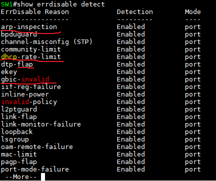

- **flap** : 연결/연결해제 를 일정 시간 동안 반복하는 error
- **arp-inspection** : ARP 취약점을 이용한 MIMA(중간자 공격) 약간 방어하는 기술 ---> CISCO DAI (Dynamic Arp Inspection)
  - 관리자가 trust / untrust 를 설정(정의)
  - untrust로 설정된 인터페이스에서 통신 되는 packet을 확인하여 옳지 않은 MAC-IP packet을 log로 남기고 폐기
  - Trust 된 인터페이스는 packet을 그대로 통과
  
  ```md
  (config)# ip arp inspection vlan [VLAN ID]
	(config)# interface [인터페이스 이름] [ID]

  # 신뢰하지 않는 인터페이스에 초당 ARP packet 수(pps : packet per seconds)를 조절해서 해당 숫자를 넘어가면 차단
  (config-if)# ip arp inspection limit rate [숫자]

  # trunk port, gateway 장비가 연결된 곳, 관리자가 관리를 하는 서버 등에 설정하는 것이 좋음
  (config-if)# ip arp inspection trust 
  ```
  - DAI 설정된 포트 확인
  
  ```
  # show ip arp inspection interfaces
  ```

  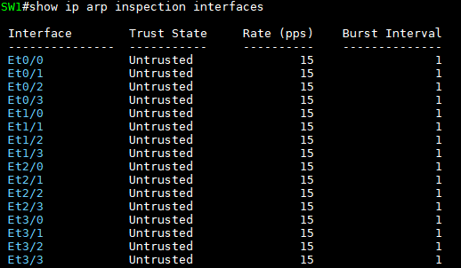

  - DAI 관련 통계 정보
  ```
  # show ip arp inspection statistics
  ```

- **DHCP Snooping**
  - DHCP 서버를 보호하기 위한 기능으로 DHCP Spoofing(속이다)를 방어하기 위해 스위치가 DHCP 메시지를 확인하는 기능
  - dhcp-rate-limit
  - DHCP 응답을 차단시키는 기능을 통해 DHCP 서버 보호
  - DHCP 서버 포트는 Trust, 나머지 포트는 Untrust로 설정 (ip arp inspection 기능과 작동 방식이 비슷)
  
  ```md
  (config)# ip dhcp snooping
  (config)# ip dhcp snooping vlan [VLAN ID]
  (config)# no ip dhcp snooping information option (DHCP option 82 : 가입자인증 관련 옵션)
  (config)# interface [인터페이스 이름] [ID]
  (config-if)# ip dhcp snooping limit rate 15
  (config-if)# ip dhcp snooping trust

  # trunk port, DHCP reply를 하는 포트에 설정하는 것이 좋음
  ```

  확인 명령어   
  ```
  # show ip dhcp snooping
				
  # show ip dhcp snooping statistics
  ```

- **gbic-invalid**
  - CISCO gbic만 사용하도록 하는 기능 (gbic : 광케이블연결 인터페이스 ---> STP)


#### (2) err-disable된 포트를 활성화
- 포트를 먼저 **shutdown** (초기화)
- 그 후 바로 **no shutdown**


#### (3) err-disable 후 자동으로 포트 활성화 시도
- 주의사항 : 해당 error가 해결되지 않으면 포트가 err-disable로 상태가 변경되어 Switch에 부하 가중이 있을 수 있음

```md
(config)# errdisable recovery cause [err-reason 이름, all]

# 자동으로 포트 활성화시키는 간격 (default : 300초)
(config)# errdisable recovery interval [초단위]
```


#### (4) errdisable 확인

```
# show errdisable recovery    --> 자동복구 활성화 확인 (enable --> 자동복구)
# show interface status   --> 인터페이스 상태 정보 확인    
# show interface status errdisable    --> 특정 인터페이스의 err-disable 원인까지 확인
```

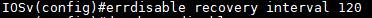

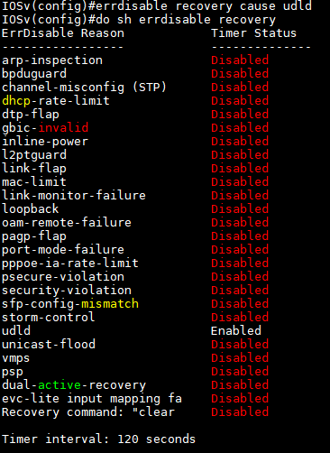


port secuiry
---

> psecure-violation, errdisable 됐을 시 원인


- Switch의 port는 MAC주소 학습에 제한 없음 --> **port의 MAC주소 학습 수 제한을 설정**
- 기본으로 port가 학습할 수 있는 MAC주소는 정해져 있지 않음
- 단, Switch의 MAC-address-table은 학습할 수 있는 양은 한정되어 있기 때문에
  Switch가 학습할 수 있는 MAC주소의 수량은 넘어갈 수 없음
  (Switch에 MAC주소가 들어올 때 source MAC주소를 보고 학습함. Switch 외부로 신호가 나갈 때는 destination MAC주소를 보고 MAC address-table을 lookup)

#### (1) Port Security 설정 조건
- **DTP**가 dynamic으로 되어 있으면 설정 불가능
  - 즉, default port로 되어 있으면 설정 불가능
  - VLAN **access** 혹은 trunk로 설정되어야 한다
- **SPAN port** (확장 포트)
  - 특정 포트의 트래픽을 복사하는 포트로 특정 포트의 트래픽 모니터링 시 사용하는 포트
- **포트통합** : 설정할 수 없음


#### (2) Port Security 권장 설정
- VLAN access port에 권장
- 만약 trunk port에 설정하는 경우라면 정책 위반 시 err-disable로 인한 shutdown 기능을 쓰지 않도록 권장

#### (3) Port Security의 MAC address 학습 제한을 위반 시 정책
- **protect** : 위반 장비의 통신을 차단, 나머지 장비는 허용 (먼저 선점한 장비만 통신)
- **restrict** : protect + log 남김 
- **shutdown** (default) : 위반 시 err-disable 포트를 shutdown


#### (4) Port Security 설정

```md
# dynamic auto default로 port-security를 사용하기 위해 port mode 변경
(config-if)# switchport mode [access / trunk]

# port security enable
(config-if)# switchport port-security

# 정책이 설정되지 않으면 모두 허용
(config)if)# switchport port-security [MAC주소 학습관련 정책]

# 위반정책을 설정하지 않으면 default : shutdown 으로 실행
(config-if)# switchport port-security violation [shutdown / protect / restrict]
```


#### (5) MAC주소 학습관련 정책
> **maximum 정책을 최우선으로 설정** 후 static, sticky를 사용

- port-security를 enable한 경우 학습 정책과 정책 default 값이 입력되는 장비도 존재 (default 값)
  ```md
  (config-if)# switchport port-security maximum 1
  (config-if)# switchport port-security violation shutdown
  ```

- 최대 학습할 MAC주소 수량으로 정책 설정
  ```md
  (config-if)# switchport port -security maximum [최대 학습할 MAC주소 수량] 
  ```

  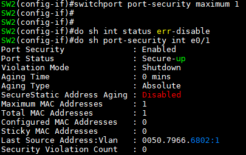

- MAC주소를 수동(static : 관리자가 직접 설정) 입력하고 해당 장비만 통신
  ```
  (config-if)# switchport port-security mac-address [MAC주소]
  ```

- MAC주소 학습 후 자동으로 nvram 저장
  ```md
  # sticky 옵션은 maximum mac address 수량만큼 running-config에 저장
  (config-if)# switchport port-security mac-address sticky
  ```

  **(예시)**

  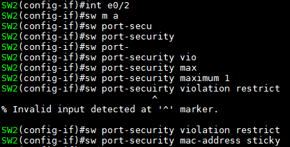

  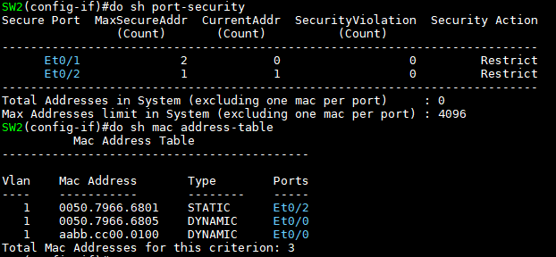   
  --> PC2 : ping 1.1.1.1 로 통신했음 (SW2의 int e0/2)   ---> port security를 설정하여 STATIC type으로 mac address-table에 MAC주소 고정 (aging time의 영향을 받지 않음)

  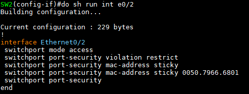   
  --> **sticky** : MAC주소를 자동으로 running-config에 저장


#### (6) Port-security 확인

  ```
  # show port-security
  # show port-security interface [인터페이스 ID]   ---> 상세정보
  ```

  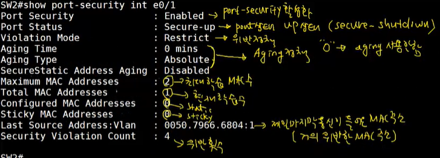

  **(예시)**

  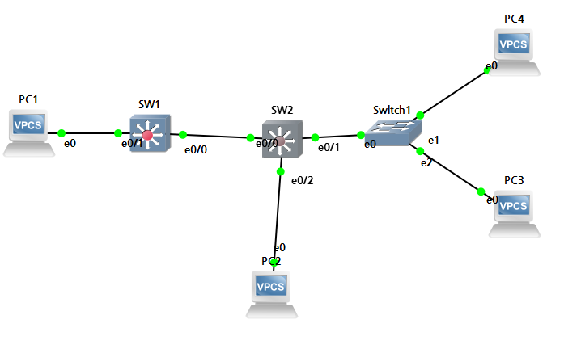

  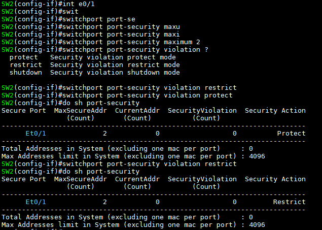

  - 맨 아래 : 4096개의 MAC주소 학습 가능
  - **MaxSecureAddr** (Count) : Max MAC주소 설정 수
  - **CurrentAddr** (Count) : 현재 학습된 수
  - **SecurityViolation** (Count) : 위반 횟수
  - **Security Action** : 위반시 정책

  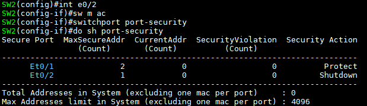

  - int e0/2에 port-security 설정
  - default violation : shutdown

  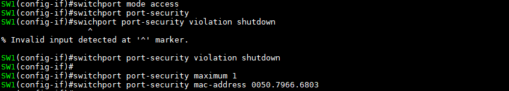

  - 0050.7966.6803 MAC주소가 아닐 시 학습 불가 --> violation 적용


##### * switch mac address aging time 변경
```md
(config)# mac address-table aging-time [10-1000000(초단위]    # 0초는 영구 저장

# aging-time 확인 명령어
(config)# do show mac address-table aging-time
```

##### * mac address-table의 aging time은 아래 table 중 type에서 DYNAMIC만 적용하는 값, STATIC은 적용X

  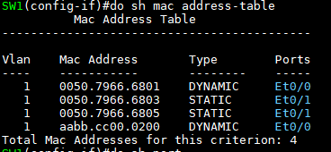


#### (7) Port-Security가 동작하는 port의 aging time 설정
- port-security가 작동하면 port의 mac learning은 자동으로 학습하여도 해당 MAC주소만을 통신해야 하기 때문에 mac address-table의 aging time을 적용시키지 못하도록 static으로 설정됨
- 하지만 port-security로 학습한 mac주소 (Static)에도 aging-time을 적용해야 하는 경우가 발생할 수 있다

```
# show port-security interface [ID]
```

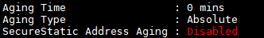

- **Aging type**
  - **absolute** : 설정한 시간이 되면 무조건 MAC주소를 삭제 (default)
    ```
    (config-if)# switchport port-security type absolute
    ```
  - **inactivity** : MAC address-table의 aging time과 같이 통신을 일정시간동안 하지 않으면 MAC주소를 삭제
    ```
    (config-if)# switchport port-security type inactivity
    ```

- **Aging Time** : default 0분 (적용안함)
  ```
  (config-if)# switchport port-security aging time [분단위]
  ```
  - 이때, inactivity는 통신을 계속하면 aging time이 지정한 분단위로 초기화
  - absolute는 시간이 계속 흐르다가 0이 되면 삭제 및 재학습

- **SecureStatic Address Aging** : Disabled
  - static, sticky로 넣어준 MAC address는 적용하지 않음

- Aging만 확인
  ```
  # show port-security address
  ```


#### (8) port-security 위반으로 shutdown(err-disabled)된 인터페이스 자동활성화

```md
(config)# errdisable recovery cause psecure-violation
(config)# errdisable recovery interval [30초 ~]      #default는 300초
```
