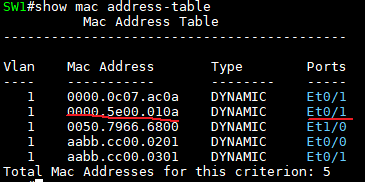
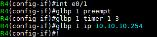

게이트웨이 이중화 프로토콜 FHRP
===

FHRP (First Hop Redundancy Protocol)
---

단일 링크가 아닌 복수 링크 (여러 경로)에 대해

- L3 계층에서는 Routing protocol로 Loop 방지 및 우회경로를 찾는다
- L2 계층에서는 STP를 이용해 Loop 방지 및 우회경로를 찾는다
- 하지만 Host장비 즉, End Device는 Routing protocol, STP가 가동되지 않음.
  - 따라서 End Device는 한번 지정된 경로에 대해 우회 경로를 찾을 수 없는 문제점이 발생하고
  - End Device가 다른 네트워크로 가려면 반드시 Gateway를 거치기 때문에 Gateway IP를 가진 장비의 장애 또는 링크의 문제가 발생하는 경우 해당 End Device는 다른 네트워크로 통신을 하지 못한다.

- End Device (Host 장비) 에 복수 개의 gateway를 추가하여도 Metric에 의해 1개의 gateway로만 통신을 하려는 특성 때문에 게이트웨이에 장애가 발생하면 외부 네트워크와 통신할 수 없음

       
    > 뒤가 Metric

- 이를 방지하기 위해 게이트웨이 역할을 하는 장비의 인터페이스에서 서로 간 Protocol을 이용해 인터페이스의 down 여부를 확인
  - down 상태인 경우 우선 순위 설정에 의해 게이트웨이 역할을 할 수 있도록 만든 프로토콜 ---> **FHRP**
  - FHRP에 의해 End device는 사용자나 관리자의 개입 없이 게이트웨이 역할을 하는 장비에서 자동으로 게이트웨이 주소를 변경시켜서 주어진 게이트웨이를 계속 사용할 수 있다.

FHRP 종류
---

1. HSRP : CISCO 전용
2. VRRP : 국제표준 (모든 vendor 사용가능)
3. GLBP : CISCO 전용   
   \* HSRP와 VRRP는 Load Balancing이 되지 않는 문제를 해결

### 1. HSRP

   
---> 두 라우터에서 가상의 MAC주소 생성 (빨간밑줄)
---> 두 라우터에 가상 게이트웨이 주소 10.10.10.254 생성

   
---> PC1의 게이트웨이를 10.10.10.254 (가상 게이트웨이)로 설정

   
---> 현재 R2 e1/0를 게이트웨이 사용

   
---> R2 e1/0를 shutdown 했을 때 R3 e1/0를 게이트웨이로 사용

   
---> Server 가상 게이트웨이로 설정

   
---> HSRP 해제

### 2. VRRP

   
---> Master인 R3 e1/0로 게이트웨이 설정 (R3 e1/0의 게이트웨이 IP주소가 R2 e1/0보다 크기 때문에 Master로 선정)

### 3. GLBP 

(1) CISCO 전용의 게이트웨이 이중화 프로토콜이면서 MHSRP와 MVRRP의 traffic 균등 분배 문제를 보완한 프로토콜

(2) 동작 구조
- **AVF** (Active Virtual Forward)
  - 총 4개의 게이트웨이 참여 가능

- **AVG** (Acitve Virtual Gateway)
  - AVF 중 가장 높은 Priority를 갖는 라우터가 선정 (Priority 값이 동일한 경우 가장 높은 IP주소로 선정)
  - AVG가 하는 역할은 ARP Request가 왔을 때 ARP Reply에 응답하는 Router로 됨
  - Virtual IP(Gateway IP)에 Virtual MAC address는 AVG가 가지고 있음   
    \# show glbp
    

       
    ---> R4가 AVG (Active)   
    ---> AVF는 4대까지 가능

- - -
간단 예시

   
---> R1 ~ R4까지 같은 설정

   
---> # show glbp   
---> Forwarder는 각각 순서대로 R1,R2,R3,R4

   
   
---> Load balancing (1.1.1.1은 Internet의 loopback 주소)

