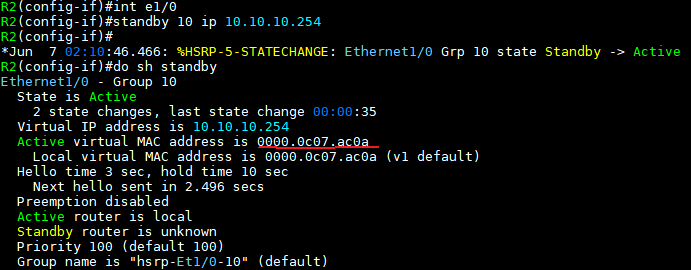

게이트웨이 이중화 프로토콜 FHRP
===

FHRP (First Hop Redundancy Protocol)
---

단일 링크가 아닌 복수 링크 (여러 경로)에 대해

- L3 계층에서는 Routing protocol로 Loop 방지 및 우회경로를 찾는다
- L2 계층에서는 STP를 이용해 Loop 방지 및 우회경로를 찾는다
- 하지만 Host장비 즉, End Device는 Routing protocol, STP가 가동되지 않음.
  - 따라서 End Device는 한번 지정된 경로에 대해 우회 경로를 찾을 수 없는 문제점이 발생하고
  - End Device가 다른 네트워크로 가려면 반드시 Gateway를 거치기 때문에 Gateway IP를 가진 장비의 장애 또는 링크의 문제가 발생하는 경우 해당 End Device는 다른 네트워크로 통신을 하지 못한다.

- End Device (Host 장비) 에 복수 개의 gateway를 추가하여도 Metric에 의해 1개의 gateway로만 통신을 하려는 특성 때문에 게이트웨이에 장애가 발생하면 외부 네트워크와 통신할 수 없음

       
    > 뒤가 Metric

- FHRP는 물리적으로 Gateway Device를 이중화하여 내부에서 외부 네트워크로 전송되는 트래픽에 대한 가용성을 확보하는 것이 목적
  - FHRP가 설정되는 위치는 주로 End Device와 L3 Device(Gateway) 사이
  - 그러나 Gateway로 설정한 장비에 장애가 발생 시 자동으로 경로 우회 불가능
  - 위와 같은 문제 해결을 위해 FHRP Gateway 이중화 프로토콜을 사용
  - L3 Device 사이에서는 Gateway 이중화 프로토콜이 아니라 Routing protocol로 경로 우회가 가능

- FHRP 설정은 실제 IP가 할당된 인터페이스에서 명령어를 입력
  - L3 Switch에서는 Gateway를 Routed port 방식으로 설정했을 경우 해당 Routed port 안에서 명령어를 입력
  - L3 Switch에서 Gateway를 SVI 방식으로 설정했을 경우에는 해당 SVI 안에서 명령어를 입력

- 이를 방지하기 위해 게이트웨이 역할을 하는 장비의 인터페이스에서 서로 간 Protocol을 이용해 인터페이스의 down 여부를 확인
  - down 상태인 경우 우선 순위 설정에 의해 게이트웨이 역할을 할 수 있도록 만든 프로토콜 ---> **FHRP**
  - FHRP에 의해 End device는 사용자나 관리자의 개입 없이 게이트웨이 역할을 하는 장비에서 자동으로 게이트웨이 주소를 변경시켜서 주어진 게이트웨이를 계속 사용할 수 있다.


FHRP 종류
---

1. HSRP : CISCO 전용
2. VRRP : 국제표준 (모든 vendor 사용가능)
3. GLBP : CISCO 전용   
   \* HSRP와 VRRP는 Load Balancing이 되지 않는 문제를 해결


### 1. HSRP

- Cisco 전용 프로토콜
- Gateway 역할을 하는 Router 또는 L3 Switch에서 동작
- HSRP 장비 중 하나가 **Active**, 나머지가 **Standby**가 되어 Active가 실제 Gateway 역할을 수행
  - **Active** : 게이트웨이로 작동
  - **Standby** : 게이트웨이로 작동하는 Interface를 감지하다가 문제 발생 시 Active로 변경
  - VRRP도 같은 원리 (Master, Backup)

#### HSRP Active / Standby Router
- HSRP group에서 1개의 Active, 1개의 Standby가 Priority에 의해 선출, 나머지는 Listening Router

- Active Router 선출 우선순위
  - Priority 값이 높은 Router
  - IP주소 값이 큰 Router   
  (L2와 반대로 값이 높아야 우선순위가 높다)

- Active Router 역할
  - 사용자 PC가 보낸 ARP 요청에 Virtual Router의 가상 MAC 주소를 넣어 응답해준다
  - 패킷을 Routing하여 전달해준다
  - Standby Router에게 주기적으로 Hello packet을 전달하여 자신의 상태를 알려준다

- Standby Router 역할
  - Active Router가 전달하는 Hello packet을 수신하여 Active Router의 상태를 체크한다
  - 평소에는 Router로의 기능보단 Active Router에 문제가 생겼을 때 역할을 넘겨 받는다

#### HSRP 특징
- UDP 1985 port 사용
- Hello packet 전송 주기 3초
- Hold time 10초 (Hello 1초, Dead 3초를 많이 사용)
- Version 1
  - Group 0 - 255, Multicast 224.0.0.2, Virtual Router의 MAC 주소: 0000.0c07.acNN (NN: 그룹번호)
- Version 2 (IPv6에 주로 사용)
  - Group 0 - 4095, Multicast 224.0.0.102, Virtual Router의 MAC 주소 : 0000.0c9F:fNNN (NNN: 그룹번호)

#### HSRP 상태 변화
- initial state
  - HSRP의 시작 상태, 동작 X

- **listen** state
  - Active, Standby Router가 선출되지 않은 상태이다
  - 이 상태에서 다른 Router로부터 Hello packet을 수신한다

- speak state
  - 주기적인 hello packet을 전송하기 시작하며, Active, Standby Router 선출에 참여한다

- **standby** state
  - 이 상태는 Active Router 후보가 될 수 있음을 의미하며, 주기적으로 hello packet을 전송한다
  - 동일한 HSRP 그룹 내에는 1개의 Standby Router만 존재한다

- **active** state
  - 해당 HSRP 그룹의 가상 MAC 주소로 전송된 packet을 수신하여 Routing시키는 역할을 하는 상태이다
  - 주기적으로 hello packe을 전송하며 동일한 HSRP 그룹 내에는 1개의 Active Router만 존재한다


간단 예시   




   
---> 두 라우터에서 가상의 MAC주소 생성 (빨간밑줄)
---> 두 라우터에 가상 게이트웨이 주소 10.10.10.254 생성


   
---> PC1의 게이트웨이를 10.10.10.254 (가상 게이트웨이)로 설정

   
---> 현재 R2 e1/0를 게이트웨이 사용

   
---> R2 e1/0를 shutdown 했을 때 R3 e1/0를 게이트웨이로 사용

   
---> Server 가상 게이트웨이로 설정


   
---> HSRP 해제


### 2. VRRP

- IEEE 표준 프로토콜
- VRRP는 vendor마다 VLAN이 다르므로 주로 물리 인터페이스에 설정하여 사용
- 주 Router를 **master**라 지칭하고, 예비 Router를 **backup** Router라고 명한다
  - 1개의 master router가 선출되고, HSRP와는 다르게 나머지는 Backup router가 됨
- VRRP Advertisement message --> **Master만이 전송**
- 가상 IP가 없이 자신의 IP로 광고 가능
- Preempt 설정이 기본적으로 활성화되어 있으며 **Default Delay 5초**
  - **preempt** : priority가 높으면 언제는 master router가 바뀜
  - HSRP는 non-preempt : priority와 IP에 상관없이 지정된 상태가 이미 결정되면 유지 (Active, Standby)
- HSRP처럼 tracking 기능이 지원되지 않아 object 형식으로 tracking 설정 가능
- VRRP 특징
  - IP protocol 112, Hello 1초, Hold time 3초
  - Multicast 224.0.0.18, Virtual Router의 MAC 주소 : 0000.5e00.01NN (NN: 그룹번호)


   
---> Master인 R3 e1/0로 게이트웨이 설정 (R3 e1/0의 게이트웨이 IP주소가 R2 e1/0보다 크기 때문에 Master로 선정)


### 3. GLBP 

(1) CISCO 전용의 게이트웨이 이중화 프로토콜이면서 MHSRP와 MVRRP의 traffic 균등 분배 문제를 보완한 프로토콜

(2) 동작 구조
- **AVF** (Active Virtual Forward)
  - 총 4개의 게이트웨이 참여 가능

- **AVG** (Acitve Virtual Gateway)
  - AVF 중 가장 높은 Priority를 갖는 라우터가 선정 (Priority 값이 동일한 경우 가장 높은 IP주소로 선정)
  - AVG가 하는 역할은 ARP Request가 왔을 때 ARP Reply에 응답하는 Router로 됨
  - Virtual IP(Gateway IP)에 Virtual MAC address는 AVG가 가지고 있음   
    \# show glbp
    

       
    ---> R4가 AVG (Active)   
    ---> AVF는 4대까지 가능

- - -
간단 예시


   
---> R1 ~ R4까지 같은 설정

   
---> # show glbp   
---> Forwarder는 각각 순서대로 R1,R2,R3,R4

   
   
---> Load balancing (1.1.1.1은 Internet의 loopback 주소)


FHRP의 track 명령
---
> 2가지   
> IP SLA


### 1. IP SLA

### 2. CISCO EEM (Embedded Event Manager : 내장된 이벤트 관리자)
- CISCO에서 제공되는 이벤트 감지 및 복구에 대해 스크립트를 제공하여 자동으로 설정을 수정할 수 있는 기능
- log를 보고 설정하는 경우가 많음 ---> log 관련 설정이 되어 있어야 사용 가능
- 즉 특정 log가 나오면 작성한 스크립트를 따라 명령 실행 (일종의 자동화)

shutdown log   
   
---> 윗줄 : LINK-5-CH~~  이것이 1계층   
---> 아랫줄 : LINEPROTO~~  이것이 2계층

no shutdown log   


- log를 이용해 up/down을 감지하는 경우 1계층(L1)의 up/down보다 2계층(L2) up/down log를 이용하는 것을 권장
  - L1의 경우 administratively down과 link 오류, err-disable로 down이 있어서 log가 나타나는 것이 틀릴 수 있음
  - 그리고 1계층이 up되어도 2계층 프로토콜이 맞지 않으면 2계층에서 down 상태가 나타나기 때문에 L1보단 L2의 log를 보는 것이 좋다


### 3. EEM Script 작성 방법

```md
(config)# event manage applet [eem이름]
(config-applet)# event syslog pattern "log내용"         # 해당 log 내용를 감시
(config-applet)# action [주번호].[보조번호] cli command enable          # >enable
(config-applet)# action [주번호].[보조번호] cli command conf t          # conf t
(config-applet)# action [주번호].[보조번호] cli command "config 내용"       # (config)#
...
(config-applet)# exit
```

**EEM 예제**   

- SW1에서 g0/0 Interface가 down이면 lo 0 Interface 활성화   
- SW1에서 g0/0 Interface가 up되면 lo 0 Interface 비활성화


```md
(config)# event manager applet g0-0-down
(config-applet)# event syslog pattern "Line protocol on Interface GigabitEthernet0/0, changed state to down"              # sh 시 L2 log를 입력
(config-applet)# action 0.0 syslog msg "#### EEM message g0/0 down  ->  lo 0 up ####"               # message를 띄우는 명령어 
(config-applet)# action 1.0 cli command "enable"
(config-applet)# action 2.0 cli command "conf t"
(config-applet)# action 3.0 cli command "int lo 0"
(config-applet)# action 4.0 cli command "no sh"
(config-applet)# action 5.0 syslog msg "#### EEM end ####"
exit
```
> EEM 실행 시 주번호, 보조번호 순서대로 명령 실행   
> 따라서, 주번호는 최초 EEM 작성 시 숫자 증가, 보조번호는 중간에 명령어를 삽입할 때 사용


   
---> int g0/0 shutdown되면 loopback 0 이 up(활성화)

   
---> int g0/0 no shutdown 되면 loopback 0 이 down(비활성화)


- - -

**예제 2**

위 예제에서   
SW1에 아래 명령어 입력   
```
event manager applet g0-0-down
event syslog pattern "Line protocol on Interface GigabitEthernet0/0, changed state to down"
action 0.0 syslog msg "### EEM start ###"
action 1.0 cli command "enable"
action 2.0 cli command "conf t"
action 3.0 cli command "int vlan 10"
action 4.0 cli command "standby 10 priority 90"
action 5.0 syslog msg "### EEM end ###"
exit
!
event manager applet g0-0-up
event syslog pattern "Line protocol on Interface GigabitEthernet0/0, changed state to up"
action 0.0 syslog msg "### EEM start ###"
action 1.0 cli command "enable"
action 2.0 cli command "conf t"
action 3.0 cli command "int vlan 10"
action 4.0 cli command "standby 10 priority 120"
action 5.0 syslog msg "### EEM end ###"
exit
!
```

위 명령어를 입력하면   
   
---> int g0/0  no sh  ---> priority 120으로 변경

   
---> int g0/0 sh ---> priority 90으로 변경

